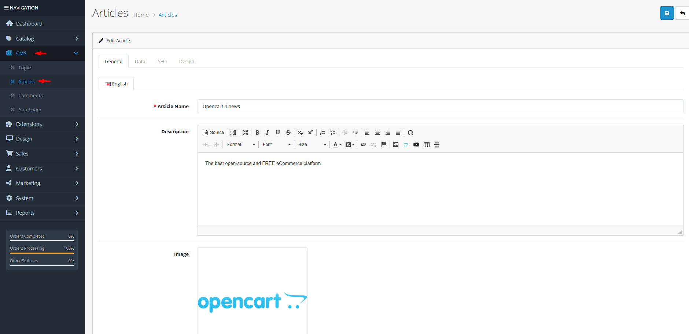

# Articles

## Introduction

**Articles** are the core content pieces in OpenCart's CMS—blog posts, news updates, tutorials, or any published content. Each article supports rich text editing, images, SEO optimization, categorization into topics, and publication to specific stores. Articles can include user comments and ratings, making them interactive content that engages customers and improves SEO through fresh, relevant content.

## Accessing Articles Management



#### Navigate to Articles

Log in to your admin dashboard and go to **CMS → Articles**.



#### Article List

You will see a list of all articles with their names, authors, ratings, and publication dates.



#### Manage Articles

Use the **Add New** button to create a new article or click **Edit** on any existing article to modify its content and settings.



## Article Interface Overview

### Article Configuration Fields

<strong>General Tab – Content &#x26; Localization</strong>

**Multi-Language Content**

* **Article Name**: **(Required)** The title of the article in each language
* **Description**: **(Required)** The main article content with WYSIWYG editor support
* **Image**: Featured image for the article (displayed in listings and article header)
* **Tags**: Keywords associated with the article for internal organization
* **Meta Title**: **(Required)** SEO title for search engines (recommended 50-60 characters)
* **Meta Description**: SEO description for search engines (recommended 150-160 characters)
* **Meta Keywords**: SEO keywords (comma-separated) for search engines

<strong>Data Tab – Publication Settings</strong>

**Article Metadata**

* **Author**: **(Required)** Name of the article author (3-64 characters)
* **Topic**: Categorize the article into a topic for organization (optional)
* **Store Assignment**: Select which stores can display this article (multi‑store setups)
* **Status**: Enable or disable article visibility

<strong>SEO Tab – Search Engine Optimization</strong>

**SEO URLs**

* **Keyword**: **(Required)** SEO-friendly URL keyword (unique per store/language)
* **SEO URL Structure**: `http://yourstore.com/blog/article-keyword`


**SEO Best Practice**: Use descriptive, keyword‑rich URLs without special characters. Keep keywords under 64 characters and ensure they're globally unique per store and language.


<strong>Design Tab – Layout Overrides</strong>

**Custom Layouts**

* **Layout Override**: Assign a custom layout template for this article on a per‑store basis
* **Default Layout**: Uses the standard blog/article layout defined in your theme

## Common Tasks

### Publishing a New Blog Article

To create and publish an article:

1. Navigate to **CMS → Articles** and click **Add New**.
2. In the **General** tab, enter the article title and content in all supported languages.
3. Upload a featured image that represents the article.
4. Add relevant tags for internal organization.
5. In the **Data** tab, specify the author, assign a topic (optional), select stores, and enable the status.
6. In the **SEO** tab, create a unique, descriptive keyword for the article URL.
7. In the **Design** tab, assign a custom layout if needed (otherwise uses default).
8. Click **Save**. The article will be published according to its status and store assignments.

### Organizing Articles with Topics

To improve content discoverability:

1. Create topics in **CMS → Topics** before or while creating articles.
2. Assign each article to a relevant topic in the **Data** tab.
3. Use topics to create category pages, navigation menus, or filtered article lists.
4. Consider creating a hierarchy of broad topics (e.g., "News", "Tutorials", "Product Updates").

### Managing Article Comments & Ratings

Articles support user comments and ratings:

1. Enable comments in **CMS → Comments** settings (if available).
2. Monitor and moderate comments from **CMS → Comments**.
3. Use the **Calculate Ratings** button to update article rating averages.
4. Mark spam comments and add keywords to **CMS → Anti-Spam**.


**Global Comment Settings**: Comment behavior is controlled globally in **System → Settings → Option → CMS & Blog**. Configure:

* **Allow Comments**: Enable/disable comments system-wide
* **Allow Guest Comments**: Let visitors comment without accounts
* **Auto Approve Comments**: Automatically approve comments or require moderation
* **Comments Interval**: Flood protection (minutes between comments)
* **List Description Limit**: Character limit for article descriptions in lists


## Best Practices

<strong>Content Creation Strategy</strong>

**Engaging Blog Content**

* **Consistent Publishing**: Maintain a regular publishing schedule to keep customers engaged.
* **Quality over Quantity**: Focus on valuable, well‑researched content rather than frequent low‑quality posts.
* **Customer‑Centric Topics**: Write about topics that help customers use your products, solve problems, or learn something new.
* **Visual Appeal**: Use high‑quality images, videos, and formatting to make articles visually engaging.
* **Call‑to‑Action**: Include clear calls‑to‑action (e.g., product links, newsletter signups, comment prompts).

<strong>SEO Optimization</strong>

**Search Engine Visibility**

* **Keyword Research**: Identify relevant keywords before writing and incorporate them naturally.
* **Meta Tags**: Craft compelling meta titles and descriptions for each article.
* **Internal Linking**: Link to related articles, products, and categories within your content.
* **External Linking**: Link to authoritative sources when citing information.
* **Mobile‑Friendly**: Ensure articles display well on mobile devices (OpenCart themes are responsive).
* **Loading Speed**: Optimize images and avoid excessive media that slows page load.

<strong>Multi‑Language &#x26; Multi‑Store Considerations</strong>

**Global Content Management**

* **Complete Translations**: Provide full translations for all languages your store supports.
* **Store‑Specific Content**: Use store assignments to publish location‑specific or brand‑specific articles.
* **Consistent Brand Voice**: Maintain consistent tone and style across all languages and stores.
* **Localized Examples**: Use examples, currencies, and references relevant to each store's audience.


**Article Deletion Warning** ⚠️ Deleting an article will permanently remove all its content, comments, ratings, and SEO URLs. Consider disabling the article instead if you may need it later. Export important articles as backups before deletion.


## Troubleshooting

<strong>Article not appearing on frontend blog</strong>

**Visibility Issues**

* **Status Check**: Verify the article is **Enabled**.
* **Store Assignment**: Ensure the article is assigned to the current store (in multi‑store setups).
* **Topic Status**: If assigned to a topic, verify the topic is also enabled.
* **Date Restrictions**: Check if there are any publish date restrictions (if supported by extensions).
* **Cache**: Clear OpenCart cache to refresh content listings.

<strong>SEO URL not working (404 error)</strong>

**URL Configuration Issues**

* **Keyword Uniqueness**: Ensure the SEO keyword is unique per store and language.
* **Character Restrictions**: Keywords can only contain a‑z, 0‑9, hyphen, and underscore.
* **Length Limits**: Keywords must be 1‑64 characters.
* **SEO Extension**: Verify that SEO URLs are enabled in **System → Settings → Server**.
* **Server Rewrites**: Ensure your server supports URL rewrites (mod\_rewrite for Apache, proper Nginx configuration).

<strong>Images not displaying in article content</strong>

**Media Management Issues**

* **Image Paths**: Verify image paths are correct and files exist in the image directory.
* **Permissions**: Check file permissions for the image directory (should be 755 for directories, 644 for files).
* **Editor Issues**: Try re‑uploading the image through the WYSIWYG editor's image manager.
* **Browser Cache**: Clear your browser cache or test in a different browser/incognito mode.

<strong>Cannot delete an article</strong>

**Dependency Issues**

* **Comments**: The article may have associated comments that must be deleted first.
* **Layout Overrides**: Check if the article has layout overrides assigned (remove them first).
* **Database Constraints**: Rare database constraints may prevent deletion—check error logs.
* **Solution**: Disable the article instead, or delete comments and layout assignments before retrying.

> "Every article is an opportunity—to teach, to inspire, to connect, to convert. Great content doesn't just fill pages; it fills needs, answers questions, and builds relationships that transcend the transaction."
