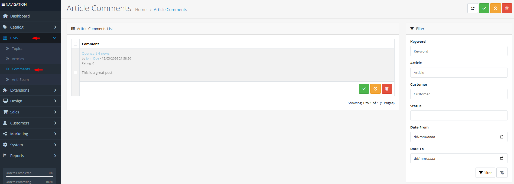
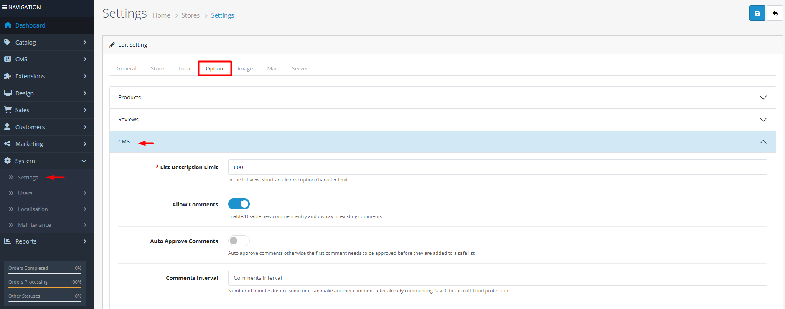

# Comments

## Introduction

**Article Comments** allow customers to engage with your content by sharing feedback, asking questions, and rating articles. The comment management system provides moderation tools to approve, reject, mark as spam, or delete comments. Comments can be filtered by article, customer, status, and date range, making it easy to manage community interaction on your blog.

## Accessing Comments Management



#### Navigate to Comments

Log in to your admin dashboard and go to **CMS → Comments**.



#### Comments List

You will see a list of all comments with their content, associated articles, authors, dates, and ratings.



#### Manage Comments

Use the filter tools to find specific comments, then use action buttons to **Approve**, **Mark as Spam**, or **Delete** comments.



## Comments Interface Overview

### Comment Filtering Options

<strong>Search &#x26; Filter Controls</strong>

**Finding Specific Comments**

* **Keyword**: Search for text within comments
* **Article**: Filter comments by specific article
* **Customer**: Filter comments by customer (registered users only)
* **Status**: Filter by approval status (all, approved, unapproved)
* **Date From / Date To**: Filter comments within a date range

### Comment Management Actions

<strong>Comment Actions</strong>

**Moderation Tools**

* **Approve**: Make a comment visible on the article (requires comment approval settings)
* **Mark as Spam**: Move comment to spam and optionally add keywords to anti‑spam list
* **Delete**: Permanently remove the comment
* **Calculate Ratings**: Recalculate article rating averages based on approved comments

<strong>Comment Information Display</strong>

**Comment Details**

* **Article Link**: Click to edit the associated article
* **Author**: Customer name with link to customer profile (if registered)
* **Date Added**: When the comment was posted
* **Rating**: Star rating given by the customer (1‑5)
* **Comment Text**: Full comment content


**Global Comment Configuration**: The behavior of the comment system is controlled in **System → Settings → Option → CMS & Blog**. Key settings include:

* **Allow Comments**: Enable/disable the entire comment system
* **Allow Guest Comments**: Permit comments from visitors without accounts
* **Auto Approve Comments**: Automatically approve comments or require manual moderation for first-time commenters
* **Comments Interval**: Flood protection (minimum minutes between comments from same user)
* **List Description Limit**: Character limit for article descriptions in list views

Changes here affect all articles and topics globally.



## Common Tasks

### Moderating New Comments

To review and approve comments:

1. Navigate to **CMS → Comments**.
2. Use the **Status** filter to show "Unapproved" comments.
3. Read each comment and decide whether to approve it.
4. Click the green **Approve** button (checkmark) to approve the comment.
5. Approved comments become visible on the article (if comment display is enabled).

### Handling Spam Comments

To protect your blog from spam:

1. Identify spam comments (promotional content, irrelevant links, etc.).
2. Click the yellow **Spam** button (ban icon) to mark as spam.
3. Consider adding spam keywords to **CMS → Anti‑Spam** to prevent similar comments.
4. Spam comments are hidden from public view but remain in the admin for review.

### Calculating Article Ratings

To update article rating averages:

1. Navigate to **CMS → Comments**.
2. Use filters if you want to recalculate ratings for specific articles only.
3. Click the **Calculate Ratings** button in the toolbar.
4. OpenCart will recalculate the average rating for each article based on approved comments.
5. Updated ratings appear in article lists and on article pages.

### Bulk Comment Management

To process multiple comments at once:

1. Use the checkboxes to select multiple comments.
2. Use the bulk action dropdown (if available) to approve, mark as spam, or delete selected comments.
3. Alternatively, use filter to isolate a group of comments (e.g., all comments on a specific article).
4. Perform actions individually using the action buttons in each comment row.

## Best Practices

<strong>Comment Moderation Strategy</strong>

**Healthy Community Engagement**

* **Timely Approval**: Check for new comments regularly to keep discussions fresh.
* **Clear Guidelines**: Publish comment guidelines on your blog (what's allowed, what's not).
* **Constructive Feedback**: Encourage constructive criticism while filtering out purely negative attacks.
* **Spam Prevention**: Use the anti‑spam system proactively by adding common spam keywords.
* **Transparency**: Consider noting when comments are moderated (e.g., "Comment held for moderation").

<strong>Rating System Management</strong>

**Accurate Article Ratings**

* **Regular Calculation**: Recalculate ratings periodically, especially after approving many comments.
* **Rating Incentives**: Encourage customers to rate articles by asking for feedback at the end of posts.
* **Rating Display**: Show article ratings prominently to build social proof.
* **Fraud Detection**: Watch for suspicious rating patterns (e.g., many 5‑star ratings from new accounts).

<strong>Customer Engagement</strong>

**Fostering Discussion**

* **Author Responses**: Consider responding to comments as the article author or store owner.
* **Comment Notifications**: Use email notifications (if supported) to alert authors of new comments.
* **Featured Comments**: Highlight particularly insightful comments (manually or through extensions).
* **Community Building**: Use comments to build a sense of community around your brand and products.


**Comment Deletion Warning** ⚠️ Deleting comments is permanent and will affect article rating averages. Consider marking as spam instead if you want to retain a record. Approved comments contribute to article ratings—deleting them will lower the average unless recalculated.


## Troubleshooting

<strong>Comments not appearing on article page</strong>

**Visibility Issues**

* **Comment Approval**: Check if comments require approval (**System → Settings → Options**).
* **Article Settings**: Verify the article has comments enabled (if per‑article settings exist).
* **Theme Compatibility**: Some themes may hide comments or require specific configuration.
* **Cache**: Clear OpenCart cache to refresh comment displays.
* **User Permissions**: In multi‑store setups, check store assignments for comments.

<strong>Cannot approve or spam a comment</strong>

**Permission Issues**

* **User Permissions**: Verify your admin user has permission to modify comments.
* **Comment Status**: Some comments may already be in the desired state (e.g., trying to approve an already‑approved comment).
* **JavaScript Errors**: Check browser console for JavaScript errors that may prevent button actions.
* **Session Timeout**: Refresh the page and log in again if your session expired.

<strong>Rating calculation not updating article ratings</strong>

**Calculation Issues**

* **Approved Comments Only**: Only **approved** comments contribute to rating calculations.
* **Date Range**: The calculation includes all approved comments, regardless of date.
* **Cache**: Article ratings may be cached—clear cache after calculation.
* **Database Delays**: Large comment databases may take time to process—wait and refresh.

<strong>Filter not returning expected comments</strong>

**Filter Configuration Issues**

* **Date Format**: Use the correct date format (YYYY‑MM‑DD) in date filters.
* **Customer Match**: Customer filter works only for registered customers (guest comments won't match).
* **Keyword Search**: Keyword search looks within comment text only, not article titles or author names.
* **Status Logic**: "Unapproved" shows comments pending approval; "Approved" shows visible comments.
* **Reset Filters**: Clear all filters to see if your filter combination is too restrictive.

> "Comments transform monologue into dialogue—they're the voice of your community, the feedback on your content, and the signal that your words have sparked conversation. Moderate with care, engage with enthusiasm, and watch your blog become a destination."
