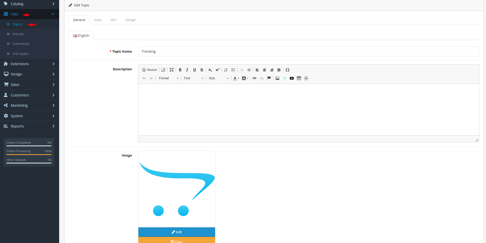

# Topics

## Introduction

**Topics** are categories or sections that organize your articles into logical groups—like "News", "Tutorials", "Product Updates", or "Customer Stories". Topics help visitors find related content, improve site navigation, and create thematic collections. Each topic can have its own description, image, SEO settings, and store assignments, making it a flexible tool for content architecture.

## Accessing Topics Management



#### Navigate to Topics

Log in to your admin dashboard and go to **CMS → Topics**.



#### Topic List

You will see a list of all topics with their names, sort order, and status.



#### Manage Topics

Use the **Add New** button to create a new topic or click **Edit** on any existing topic to modify its settings.



## Topic Interface Overview

### Topic Configuration Fields

<strong>General Tab – Content &#x26; Localization</strong>

**Multi-Language Content**

* **Topic Name**: **(Required)** The title of the topic in each language
* **Description**: The topic description with WYSIWYG editor support (displayed on topic pages)
* **Image**: Featured image for the topic (displayed in topic listings and headers)
* **Meta Title**: **(Required)** SEO title for search engines (recommended 50-60 characters)
* **Meta Description**: SEO description for search engines (recommended 150-160 characters)
* **Meta Keywords**: SEO keywords (comma-separated) for search engines

<strong>Data Tab – Organization &#x26; Visibility</strong>

**Topic Settings**

* **Store Assignment**: Select which stores can display this topic (multi‑store setups)
* **Sort Order**: Numeric order for sorting topics in lists (lower numbers appear first)
* **Status**: Enable or disable topic visibility

<strong>SEO Tab – Search Engine Optimization</strong>

**SEO URLs**

* **Keyword**: **(Required)** SEO-friendly URL keyword (unique per store/language)
* **SEO URL Structure**: `http://yourstore.com/blog/topic-keyword`


**Topic SEO Strategy**: Topic pages can rank for broader keywords than individual articles. Optimize topic descriptions and meta tags for category‑level search terms.


<strong>Design Tab – Layout Overrides</strong>

**Custom Layouts**

* **Layout Override**: Assign a custom layout template for this topic on a per‑store basis
* **Default Layout**: Uses the standard blog/topic layout defined in your theme

## Common Tasks

### Creating a New Topic for Article Organization

To organize articles into categories:

1. Navigate to **CMS → Topics** and click **Add New**.
2. In the **General** tab, enter the topic name and description in all supported languages.
3. Upload a featured image that represents the topic.
4. In the **Data** tab, assign the topic to relevant stores, set a sort order, and enable the status.
5. In the **SEO** tab, create a unique, descriptive keyword for the topic URL.
6. In the **Design** tab, assign a custom layout if needed (otherwise uses default).
7. Click **Save**. The topic will now appear as an option when creating or editing articles.

### Structuring Topics for Optimal Navigation

To create an intuitive content hierarchy:

1. **Broad Categories First**: Start with 3‑5 broad topics that cover your main content areas.
2. **Sub‑Topics**: Consider using the description field to explain subtopics within broader categories (OpenCart doesn't support nested topics by default, but you can simulate with naming conventions).
3. **Sort Order Logic**: Use sort order to control which topics appear first (e.g., "News" before "Archives").
4. **Consistent Naming**: Use consistent naming patterns across languages and stores.

### Assigning Articles to Topics

To categorize existing articles:

1. Edit an article and go to the **Data** tab.
2. Select the appropriate topic from the dropdown.
3. Articles can belong to only one topic (or none).
4. Use the article list filter to view all articles in a specific topic.

## Best Practices

<strong>Topic Architecture Design</strong>

**Effective Content Organization**

* **Customer‑Centric Categories**: Create topics based on customer interests, not internal departments.
* **Balance Breadth and Depth**: Aim for 5‑10 main topics—enough to organize content but not so many that navigation becomes confusing.
* **Future‑Proofing**: Choose topic names that will remain relevant as your content grows.
* **Cross‑Promotion**: Use topic descriptions to link to related topics or popular articles.
* **Visual Identity**: Use distinctive images for each topic to create visual recognition.

<strong>SEO &#x26; Discoverability</strong>

**Maximizing Topic Visibility**

* **Keyword‑Rich Names**: Include relevant keywords in topic names where natural.
* **Comprehensive Descriptions**: Write detailed, helpful descriptions that explain what visitors will find in this topic.
* **Internal Linking**: Link to topic pages from menus, footers, and within articles.
* **Sitemap Inclusion**: Ensure topics are included in your XML sitemap.
* **Social Sharing**: Configure Open Graph and Twitter Card meta tags for topic pages.

<strong>Multi‑Store Topic Management</strong>

**Store‑Specific Content Strategies**

* **Global vs. Local Topics**: Some topics may be relevant to all stores (e.g., "Company News"), while others may be store‑specific (e.g., "Regional Events").
* **Consistent Core Topics**: Maintain a core set of topics across all stores for brand consistency.
* **Localized Content**: Adapt topic descriptions and images to local audiences where appropriate.
* **Translation Strategy**: Ensure topic names and descriptions are fully translated for all store languages.


**Topic Deletion Warning** ⚠️ Deleting a topic will **not** delete its articles, but those articles will no longer be categorized. Consider disabling the topic instead if you may need it later. If you must delete, first reassign articles to a different topic or note that they'll become uncategorized.


## Troubleshooting

<strong>Topic not appearing in article assignment dropdown</strong>

**Availability Issues**

* **Status Check**: Verify the topic is **Enabled**.
* **Store Assignment**: Ensure the topic is assigned to the same store as the article you're editing.
* **Language Consistency**: Topics appear in all languages if they have names in those languages.
* **Cache**: Clear OpenCart cache to refresh topic lists.

<strong>Topic page shows no articles</strong>

**Content Display Issues**

* **Article Status**: Verify articles assigned to the topic are **Enabled**.
* **Article Store Assignment**: Articles must be assigned to the same store as the topic.
* **Topic Status**: The topic itself must be enabled.
* **Pagination**: Check if articles exist beyond the first page of results.
* **Theme Compatibility**: Some themes may have different requirements for displaying topic content.

<strong>SEO URL conflict with article or product URLs</strong>

**URL Uniqueness Issues**

* **Keyword Duplication**: Ensure the topic keyword doesn't duplicate an article, product, category, or other SEO URL.
* **Namespace Conflicts**: OpenCart doesn't have separate URL namespaces for topics vs. articles—they share the same URL space.
* **Solution**: Use prefixes like `blog/` in topic keywords (e.g., `blog/news` instead of `news`) if conflicts occur.
* **Redirects**: If changing a topic keyword, set up 301 redirects from the old URL to maintain SEO value.

<strong>Cannot change topic sort order</strong>

**Sorting Issues**

* **Input Validation**: Sort order must be a number (positive or negative integers allowed).
* **Database Constraints**: Very large numbers may exceed database limits—keep between -2147483648 and 2147483647.
* **Caching**: Sort order changes may not appear immediately due to caching—clear cache after changes.
* **Theme Overrides**: Some themes may implement custom sorting logic that overrides the admin setting.

> "Topics are the chapters of your store's story—they give structure to your content, direction to your visitors, and clarity to your message. A well‑organized blog is a discoverable blog."
