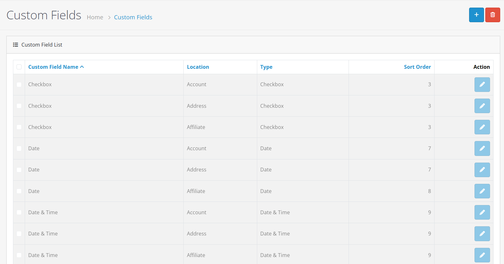
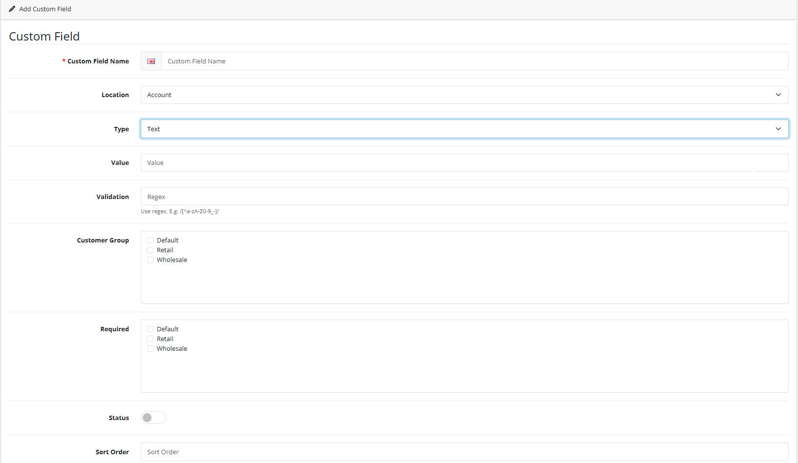
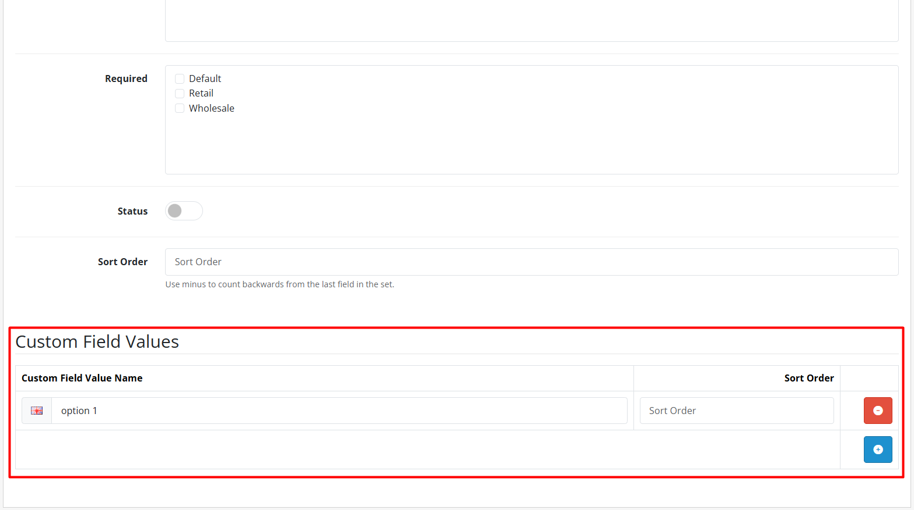
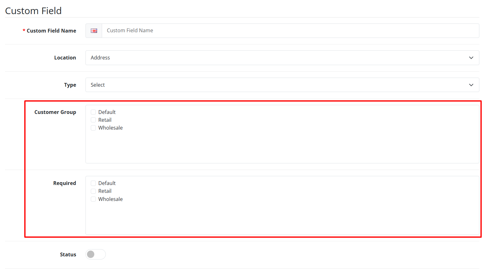

# Custom Fields


**Extended Customer Information** Custom Fields allow you to collect additional information from customers beyond the standard registration form, tailored to your specific business needs.


## Introduction

Custom Fields in OpenCart 4 enable you to extend the customer registration and profile forms with additional fields. This powerful feature allows you to collect specific information relevant to your business, such as company details, preferences, or regulatory requirements.

## Accessing Custom Fields

To access the Custom Fields interface:

1. Log in to your OpenCart admin panel
2. Navigate to **Customers → Custom Fields**
3. You'll see the custom field list with existing fields

## Field Types Available

OpenCart 4 supports several custom field types:

| Field Type   | Description            | Use Case                          |
| ------------ | ---------------------- | --------------------------------- |
| **Text**     | Single-line text input | Short answers, names, identifiers |
| **Textarea** | Multi-line text input  | Descriptions, comments, addresses |
| **Select**   | Dropdown selection     | Choices from predefined options   |
| **Radio**    | Radio button group     | Single choice from options        |
| **Checkbox** | Checkbox group         | Multiple selections from options  |
| **File**     | File upload            | Documents, images, certificates   |
| **Date**     | Date picker            | Birth dates, event dates          |
| **Time**     | Time picker            | Appointment times, preferences    |
| **Datetime** | Date and time picker   | Meeting schedules, deadlines      |

## Creating a New Custom Field



**Step 1: Click Add New**

Click the **Add New** button (+) in the top-right corner of the custom field list.



**Step 2: Configure Field Settings**

Fill in the custom field configuration form:

**Field Information**


**Field Name & Location** 📝

* **Field Name:** Required, descriptive name shown to customers, multilingual support
* **Location:** Determines where the field appears:
  * **Account** - Customer registration and profile forms
  * **Address** - Address entry forms (shipping/billing)
  * **Affiliate** - Affiliate registration and profile


**Field Type & Validation**


**Field Type Selection** ⚠️

* **Type:** Choose from available field types (Text, Select, Radio, Checkbox, File, Date, Time, Datetime)
* **Validation:** Set validation rules based on field type (email, URL, numeric, regex)
* **Required:** Make field mandatory (Yes/No) - use sparingly to reduce form abandonment





**Step 3: Configure Field Values (for Select/Radio/Checkbox)**

For selection-based fields, configure the available options:

1. Click **Add Value**
2. Enter option details:
   * **Value Name** - Display text for the option (multilingual)
   * **Sort Order** - Display order (lower numbers appear first)


**Value Management Tips** 🔢

* Create logical, mutually exclusive options for radio buttons
* Use checkboxes for multiple selections where appropriate
* Keep dropdown lists concise for better user experience





**Step 4: Assign to Customer Groups**

Specify which customer groups see this field:

* **All Customer Groups** - Field appears for all groups (default)
* **Specific Groups** - Select individual groups from the list


**Targeted Field Display** 🎯

Use customer group assignments to show relevant fields to specific customer segments. For example, show business-related fields only to wholesale customers.




**Step 5: Set Display Order**

* **Sort Order** - Controls display order relative to other fields
* **Lower numbers** appear first in forms


**Form Organization** 📋

Group related fields together by using consecutive sort order numbers. Leave gaps between groups (e.g., 10, 20, 30) for easier future insertions.




**Step 6: Save the Field**

Click **Save** to create the custom field. You'll see a success message confirming the field has been created.


**Success!** ✅

Your custom field is now active and will appear in forms according to your configuration settings.




## Field Configuration Details

<strong>Field Name</strong>

* **Required**: Yes
* **Multilingual**: Supports multiple languages for international stores
* **Customer-facing**: Shown as field label in forms

<strong>Location</strong>

Determines where the field appears:

| Location      | Forms Where Field Appears                  |
| ------------- | ------------------------------------------ |
| **Account**   | Registration, login, customer profile edit |
| **Address**   | Address entry forms (shipping/billing)     |
| **Affiliate** | Affiliate registration and profile         |

<strong>Type-Specific Configuration</strong>

<strong>Customer Group Assignment</strong>

Control which customer groups see each field:

* **All Groups** - Field appears for everyone (default)
* **Specific Groups** - Field only appears for selected groups
* **No Groups** - Field hidden (useful for temporary disabling)

## Use Cases for Custom Fields

<strong>1. Business Customer Information 🏢</strong>

Collect company details for B2B customers:

* **Company Name** (Text field)
* **VAT Number** (Text with validation)
* **Company Type** (Select: LLC, Corporation, Partnership, etc.)
* **Business Registration Number** (Text)
* **Industry Sector** (Select or Radio)

<strong>2. Customer Preferences ❤️</strong>

Gather preferences for personalized service:

* **Newsletter Preferences** (Checkbox: Weekly, Monthly, Promotions, New Arrivals)
* **Contact Method** (Radio: Email, Phone, SMS, Mail)
* **Product Interests** (Checkbox: Categories, brands, product types)
* **Communication Frequency** (Select: Daily, Weekly, Monthly)

<strong>3. Regulatory Compliance 📋</strong>

Collect required information for legal compliance:

* **Age Verification** (Date of Birth with minimum age validation)
* **Tax Exemption Status** (Select: Yes/No with certificate upload field)
* **Industry Classification** (Select: Standard industry codes like NAICS, SIC)
* **GDPR Consent** (Checkbox for privacy policy acceptance)

<strong>4. Shipping &#x26; Delivery 📦</strong>

Additional address information for delivery optimization:

* **Delivery Instructions** (Textarea for special instructions)
* **Access Codes** (Text for building/security codes)
* **Preferred Delivery Time** (Select: Morning, Afternoon, Evening, Any)
* **Delivery Location** (Radio: Front Door, Back Door, Reception, Mailroom)

<strong>5. Membership &#x26; Loyalty 🥇</strong>

Information for loyalty programs and membership management:

* **Membership Number** (Text with unique validation)
* **Referral Source** (Select: Friend, Social Media, Search Engine, Advertisement)
* **Anniversary Date** (Date for membership anniversary)
* **Loyalty Tier** (Select: Bronze, Silver, Gold, Platinum)

## Managing Existing Custom Fields

### Editing a Field

1. From the custom field list, click **Edit** (pencil icon)
2. Modify field settings as needed
3. Click **Save** to update


**Field Type Changes** ⚠️

Changing field types after data has been collected may cause data loss or conversion issues. Consider creating a new field instead of changing types.


### Deleting a Field

1. From the custom field list, click **Delete** (trash icon)
2. Confirm deletion in the pop-up dialog


**Data Loss Warning** 🗑️

Deleting a custom field permanently removes all collected data for that field from customer profiles. Export any important data before deletion.


### Reordering Fields

Adjust the **Sort Order** value to control display order. Fields with lower sort order numbers appear first in forms.


**Sort Order Tips** 🔢

* Use increments of 10 (0, 10, 20, etc.) to allow easy insertion of new fields
* Group related fields with consecutive numbers
* Test form appearance after reordering


## Integration with Other Features

<strong>Customer Groups 🎯</strong>

Custom fields can be assigned to specific customer groups, allowing different information collection for different customer segments.

* **Targeted Data Collection**: Show business fields only to wholesale groups
* **Progressive Disclosure**: Reduce form complexity by showing relevant fields
* **Group-Specific Validation**: Different validation rules per customer group

<strong>Customer Approval ✅</strong>

Custom field data appears in the approval review process, providing additional information for decision-making.

* **Enhanced Review**: View custom field data during customer approval
* **Automated Decisions**: Use custom field values for automatic approval rules
* **Documentation**: Attach uploaded files (certificates, documents) to approval requests

<strong>Customer Management 👤</strong>

Custom field values appear in customer profiles and can be edited by administrators.

* **Complete Customer View**: See all custom field data in customer profiles
* **Administrative Editing**: Update custom field values for customers
* **Data Export**: Include custom field data in customer exports

<strong>Registration Forms 📝</strong>

Custom fields integrate seamlessly into registration forms based on their assigned location and customer group.

* **Automatic Placement**: Fields appear in correct form sections automatically
* **Conditional Display**: Show/hide fields based on customer group selection
* **Mobile Responsive**: Custom fields work well on all device types

## Best Practices


**Field Design Best Practices** 🎨

1. **Clear Labels**: Use descriptive, customer-friendly field names with multilingual support
2. **Logical Order**: Group related fields together using sort order (e.g., personal info, business info, preferences)
3. **Minimal Required Fields**: Only require essential information to reduce form abandonment



**Data Management Guidelines** 💾

1. **Regular Review**: Periodically review custom field usage and effectiveness
2. **Data Cleanup**: Remove unused fields to simplify forms and reduce database clutter
3. **Backup Strategy**: Export custom field data before making major changes or deletions



**User Experience Optimization** 📱

1. **Progressive Disclosure**: Use customer group assignments to show relevant fields only
2. **Default Values**: Pre-fill fields where appropriate to reduce customer effort
3. **Mobile Optimization**: Ensure fields work well on mobile devices with touch-friendly interfaces


## Troubleshooting

### Common Issues

<strong>Field not appearing in form 🔍</strong>

**Possible Causes:**

* Field not assigned to customer group
* Incorrect location setting
* Field disabled (sort order set to hidden)

**Solutions:**

1. Check customer group assignment in field settings
2. Verify location matches intended form (Account, Address, Affiliate)
3. Ensure sort order is set (not empty or negative)

<strong>Validation errors ⚠️</strong>

**Possible Causes:**

* Input doesn't match field type (e.g., text in email field)
* Required field left empty
* Custom regex pattern mismatch

**Solutions:**

1. Verify field configuration matches expected input type
2. Check if field is marked as required
3. Test validation rules with sample data

<strong>File uploads failing 📎</strong>

**Possible Causes:**

* File type not allowed
* File size exceeds limit
* Server permissions or storage issues

**Solutions:**

1. Check allowed file types in field settings
2. Verify maximum file size limit
3. Ensure server upload directory has proper permissions

<strong>Data not saving 💾</strong>

**Possible Causes:**

* Required field validation failing
* Database constraints or limits
* Form submission errors

**Solutions:**

1. Check if field is marked as required but left empty
2. Verify database connection and table structure
3. Test with different browsers/devices


**Performance Considerations** ⚡

* Large numbers of custom fields can slow down registration and profile forms
* File upload fields require adequate server storage and bandwidth
* Complex validation rules may impact form submission performance
* Consider pagination or progressive loading for forms with many fields


## Security Considerations

### Data Privacy 🔒

* Only collect necessary information
* Clearly explain how data will be used
* Comply with GDPR and other privacy regulations

### File Upload Security 📎

* Restrict allowed file types to prevent malicious uploads
* Implement virus scanning for uploaded files
* Store uploaded files in secure, non-web-accessible locations

### Input Validation 🛡️

* Validate all user input to prevent injection attacks
* Sanitize data before storage
* Implement server-side validation in addition to client-side


**Documentation Summary** 📋

You've now learned how to:

* Create and manage custom fields in OpenCart 4
* Configure field types, validation, and customer group assignments
* Use custom fields for business, compliance, and customer preference collection
* Integrate custom fields with other store features
* Apply best practices for field design and data management

**Next Steps:**

* [Customer Groups](/broken/pages/LAO0SyfaDGHgMwDovS2i) - Assign custom fields to specific customer groups
* [Customer Approval](/broken/pages/Um8iYGrsf89Q8Rk9hmiF) - Use custom field data in approval decisions
* [Customer Management](/broken/pages/W3iuma9SRc05P2lExajW) - View and edit custom field values in customer profiles
* [GDPR Management](/broken/pages/qOJkXN41JqkLR52tEMIz) - Ensure custom fields comply with data privacy regulations

