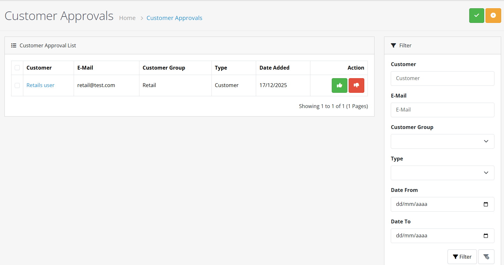
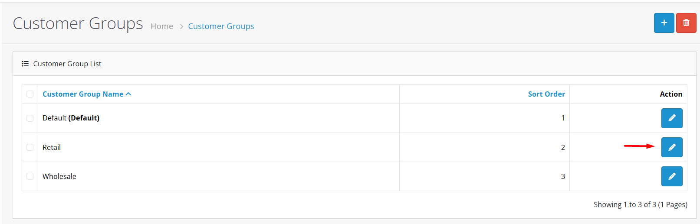
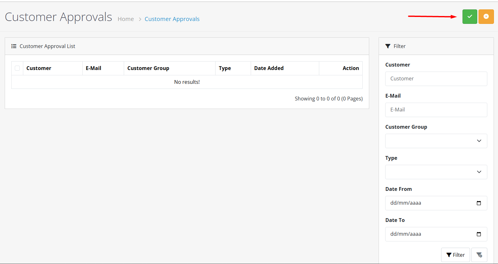

# Customer Approval


**Controlled Customer Registration** 🔒 The Customer Approval system allows you to manually review and approve new customer registrations before they can access your store, perfect for B2B portals, exclusive memberships, and high-security environments.


## Introduction

Customer Approval in OpenCart 4 provides a controlled registration process where new customer accounts require manual approval by an administrator. This feature is essential for stores that need to vet customers before granting access, such as B2B portals, exclusive memberships, or high-security environments.

## How Customer Approval Works

The approval process follows a structured workflow:



**Step 1: Customer Registration**

Customer completes the registration form on your storefront.

**Outcome:** Registration is submitted to the system.



**Step 2: Approval Check**

System checks if the customer's selected group requires approval.

**Possible paths:**

* **No approval required** → Account activated immediately
* **Approval required** → Account placed in pending approval queue



**Step 3: Admin Review (If Required)**

Administrator reviews the pending registration in the admin panel.

**Review includes:**

* Customer information
* Custom field data (if applicable)
* Any additional registration details



**Step 4: Decision & Notification**

Administrator makes a decision:

**Approve:**

* Account activated
* Customer receives approval notification email
* Customer can now log in and shop

**Deny:**

* Registration rejected
* Customer receives rejection notification email
* Registration data removed from system



## Accessing Customer Approval

To access the Customer Approval interface:

1. Log in to your OpenCart admin panel
2. Navigate to **Customers → Customer Approval**
3. You'll see the approval list with pending requests

## Approval Types

OpenCart 4 supports two types of approval:

| Type             | Description                     | Typical Use                            |
| ---------------- | ------------------------------- | -------------------------------------- |
| **Customer** 👤  | Standard customer registrations | Regular store customers, B2B portals   |
| **Affiliate** 🤝 | Affiliate program registrations | Referral partners, affiliate marketers |


**Type Selection Tip** 💡

Choose **Customer** approval for regular store registrations and **Affiliate** approval for partner program applications. Each type has separate approval queues and settings.


## Configuring Approval Requirements

Approval requirements are configured at the **customer group** level:



**Step 1: Access Customer Groups**

Navigate to **Customers → Customer Groups**


**Group Management** 👥

Customer groups control which registrations require approval. Different groups can have different approval settings.




**Step 2: Edit Group Settings**

Click **Edit** on the customer group you want to configure




**Step 3: Set Approval Required**

In the group form, find **Approval Required** and select:

* **Yes** - Manual approval required
* **No** - Automatic approval (default)


**Approval Required Setting** ⚠️

* **Yes**: Each registration requires manual review (B2B portals, exclusive memberships)
* **No**: Automatic approval upon registration (standard retail stores)


.png>)



**Step 4: Save Changes**

Click **Save** to update the group settings


**Settings Applied** ✅

Approval requirements are now configured. New registrations in this group will follow the specified approval workflow.




## Reviewing Pending Approvals

<strong>Customer Approval List 📋</strong>

The approval list displays all pending requests with the following information:

* **Name** - Customer/affiliate name
* **Email** - Contact email
* **Customer Group** - Requested group
* **Type** - Customer or Affiliate
* **Date Added** - Registration date


**List Navigation Tips** 🔍

* Use pagination to navigate through large lists
* Refresh the page to see new pending requests


<strong>Filtering Approval Requests 🔎</strong>

Use the filter options to narrow down the list:

| Filter                 | Description                       |
| ---------------------- | --------------------------------- |
| **Name** 👤            | Search by customer name           |
| **Email** 📧           | Search by email address           |
| **Customer Group** 🏷️ | Filter by requested group         |
| **Type** 📝            | Customer or Affiliate             |
| **Date Added** 📅      | Filter by registration date range |


**Filtering Best Practices** 🎯

* Combine multiple filters for precise searches
* Save frequent filter combinations as bookmarks
* Clear filters regularly to see all pending requests


## Approving or Denying Requests



**Step 1: Make Decision**

Based on your review, choose one of these actions:

**Approve Request** ✅

* Click **Approve** to activate the account
* Customer receives approval notification email
* Account becomes immediately active

**Deny Request** ❌

* Click **Deny** to reject the registration
* Customer receives rejection notification email
* Registration is removed from the system


**Decision Considerations** ⚖️

* **Approve**: When registration meets all requirements and seems legitimate
* **Deny**: When information is incomplete, suspicious, or doesn't meet criteria
* **Follow-up**: Consider requesting additional information if needed




**Step 2: Confirm Action**

Confirm your decision. The system will process the request and send appropriate notifications.


**Action Completed** 🎉

The approval decision has been processed. Check the approval list to verify the request has been removed from pending queue.




## Bulk Approval Operations

<strong>Batch Processing 🔄</strong>

To process multiple requests at once:

1. **Select requests** - Check boxes next to the requests you want to process
2. **Choose action** - From the bulk action dropdown:
   * **Approve Selected** ✅ - Approve all selected requests
   * **Deny Selected** ❌ - Deny all selected requests


**Bulk Operation Warning** ⚠️

Bulk operations apply to **all selected requests**. Double-check your selections before proceeding, as actions cannot be undone.



**Efficiency Tip** ⚡

Use filters to narrow down requests before bulk operations. For example, filter by customer group to approve all wholesale applications at once.


## Email Notifications

OpenCart 4 sends automatic email notifications for approval actions:

<strong>Approval Email (Sent to Customer) ✅</strong>

* **Subject:** "Your account has been approved!"
* **Content:** Welcome message and login instructions
* **Includes:** Store contact information, login URL, support details


**Approval Email Tips** 📧

* Customize email content in **System → Settings → Mail**
* Include store branding for professional appearance
* Test email delivery to ensure customers receive notifications


<strong>Denial Email (Sent to Customer) ❌</strong>

* **Subject:** "Your account registration"
* **Content:** Notification of rejection
* **Optional:** Include reason for denial (configurable)


**Denial Email Considerations** ⚠️

* Be professional and courteous in denial messages
* Consider offering alternative options when appropriate
* Comply with privacy regulations when explaining denials


<strong>Admin Notifications (Optional) 👨‍💼</strong>

Configure email alerts to notify administrators of new pending requests.

* **Setup:** Configure in **System → Settings → Mail**
* **Frequency:** Real-time or daily digest options
* **Recipients:** Multiple admin emails can be specified


**Notification Management** 🔔

Use admin notifications to ensure timely review of pending requests, especially for time-sensitive applications.


## Approval Workflow Best Practices


**Registration & Communication** 📝

1. **Clear Requirements**: Specify approval requirements on registration page
2. **Process Explanation**: Explain the approval process to potential customers
3. **Realistic Expectations**: Set realistic expectations for approval time
4. **Consistent Communication**: Maintain regular communication with applicants



**Efficient Review Process** ⚡

1. **Review Criteria**: Establish criteria for different customer groups
2. **Staff Designation**: Designate specific staff for approval tasks
3. **Response Time SLAs**: Set service level agreements for response time
4. **Daily Monitoring**: Check pending requests daily



**Documentation & Improvement** 📊

1. **Decision Documentation**: Keep notes on approval decisions
2. **Denial Reasons**: Provide clear reasons for denials when appropriate
3. **Follow-up**: Follow up on incomplete applications
4. **Criteria Review**: Regularly review and update approval criteria


## Integration with Customer Groups

<strong>Group-Specific Approval 🏷️</strong>

Different customer groups can have different approval requirements:

| Group Type                 | Approval Setting  | Use Case                           |
| -------------------------- | ----------------- | ---------------------------------- |
| **Retail Customers** 🛍️   | No approval       | Standard public store              |
| **Wholesale Customers** 🏢 | Approval required | B2B customers with special pricing |
| **VIP Members** 🥇         | Approval required | Exclusive membership program       |
| **Affiliates** 🤝          | Approval required | Controlled affiliate network       |


**Group Strategy** 🎯

Configure approval requirements based on customer group risk and value. High-value groups (wholesale, VIP) often require approval, while retail customers can be auto-approved.


<strong>Custom Fields in Approval Process 📝</strong>

Custom fields assigned to customer groups appear in the approval review, providing additional information for decision-making.

* **Business Information**: Company details, VAT numbers, industry classification
* **Compliance Data**: Age verification, tax exemption status
* **Preferences**: Communication preferences, product interests


**Enhanced Decision-Making** 💡

Use custom field data to make informed approval decisions. For example, require business registration documents for wholesale accounts.


## Troubleshooting

### Common Issues

<strong>Approval emails not sending 📧</strong>

**Possible Causes:**

* Email configuration incorrect
* SMTP server issues
* Email templates missing or misconfigured

**Solutions:**

1. Check email configuration in **System → Settings → Mail**
2. Test email functionality with test messages
3. Verify email templates exist and are properly formatted

<strong>Requests not appearing in list 🔍</strong>

**Possible Causes:**

* Customer group not set to require approval
* Registration not completed successfully
* Filter settings hiding requests

**Solutions:**

1. Verify customer group has "Approval Required" set to Yes
2. Check customer registration logs
3. Clear all filters to see all pending requests

<strong>Cannot approve/deny requests ❌</strong>

**Possible Causes:**

* Insufficient admin permissions
* System errors or conflicts
* Request already processed

**Solutions:**

1. Check admin permissions for customer approval module
2. Review system error logs
3. Refresh the approval list page

<strong>Bulk operations failing 🔄</strong>

**Possible Causes:**

* Mixed request types selected
* System timeout or resource limits
* Permission issues

**Solutions:**

1. Ensure all selected requests are of the same type (Customer or Affiliate)
2. Process smaller batches to avoid timeouts
3. Verify bulk operation permissions


**Performance Tips** ⚡

* **Batch Processing**: Process approvals in batches at scheduled times
* **Smart Filtering**: Use filters to focus on specific customer groups
* **Automation**: Consider automated approval for low-risk groups
* **Cleanup**: Regularly clean up old denied requests to maintain performance


## Security Considerations

### Fraud Prevention 🕵️‍♂️

* Review IP addresses and geographic information
* Check for duplicate or suspicious email patterns
* Verify business information for B2B applications

### Data Privacy 🔒

* Handle customer information securely during review
* Comply with GDPR and other privacy regulations
* Securely dispose of denied application data


**Documentation Summary** 📋

You've now learned how to:

* Configure and manage customer approval workflows in OpenCart 4
* Review and process pending approval requests
* Set up email notifications for approval decisions
* Integrate approval with customer groups and custom fields
* Apply best practices for efficient and secure approval processes

**Next Steps:**

* [Customer Groups](/broken/pages/LAO0SyfaDGHgMwDovS2i) - Configure which groups require approval
* [Customer Management](/broken/pages/W3iuma9SRc05P2lExajW) - Manage approved customer accounts
* [Custom Fields](/broken/pages/Ahlg4yE4ksx2AIcMmMVp) - Add custom information to approval reviews
* [GDPR Management](/broken/pages/qOJkXN41JqkLR52tEMIz) - Ensure approval process complies with data privacy regulations

