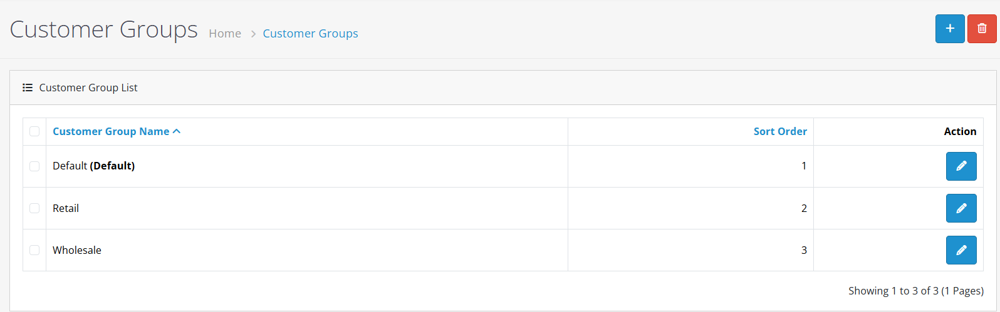
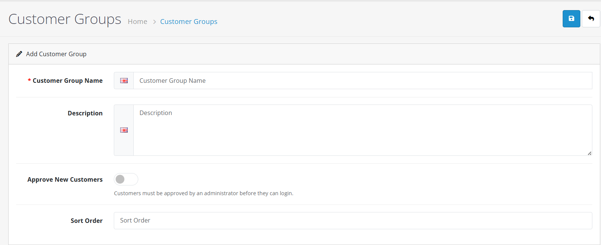
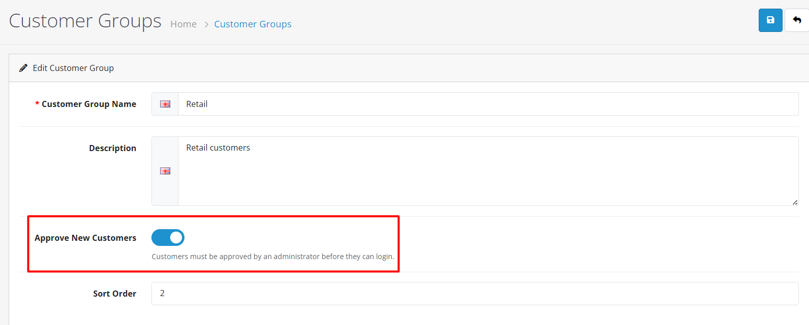

# Customer Groups


**Organizing Your Customers** Customer Groups allow you to categorize customers for targeted marketing, special pricing, and permission management in OpenCart 4.


## Introduction

Customer Groups in OpenCart 4 enable you to organize customers into logical categories. This powerful feature allows you to apply different settings, pricing, and permissions to different groups of customers, making it ideal for businesses that serve multiple customer segments.

## Default Customer Groups

OpenCart 4 comes with three default customer groups:

| Group         | Description                  | Typical Use                        |
| ------------- | ---------------------------- | ---------------------------------- |
| **Default**   | Standard customer group      | Regular retail customers           |
| **Retail**    | Retail customers             | General public shoppers            |
| **Wholesale** | Wholesale/business customers | B2B customers with special pricing |


**Tip:** You can modify the default groups or create entirely new groups to match your business needs. The Default group cannot be deleted but can be modified.


## Accessing Customer Groups

To access the Customer Groups interface:

1. Log in to your OpenCart admin panel
2. Navigate to **Customers → Customer Groups**
3. You'll see the customer group list with existing groups

## Creating a New Customer Group



**Step 1: Click Add New**

Click the **Add New** button (+) in the top-right corner of the customer group list.

_Figura 2: Add New button in customer groups list_



**Step 2: Configure Group Settings**

Fill in the group configuration form:

**General Settings**


**Group Name & Description** 📝

* **Group Name:** Required, 3-32 characters per language, multilingual support
* **Description:** Optional internal notes for admin reference only


**Approval Settings**


**Approval Required** ⚠️

* **Yes:** Admin must manually approve each new registration (high-security stores, B2B portals)
* **No:** Automatic approval upon registration (standard retail stores, public websites)


**Display Settings**


**Sort Order** 🔢

* **Purpose:** Controls display order in dropdown menus and lists
* **Lower numbers** appear first (e.g., 0 before 1)
* **Default:** 0 for default groups





**Step 3: Save the Group**

Click **Save** to create the new customer group. You'll see a success message confirming the group has been created.



## Editing an Existing Customer Group

To edit an existing customer group:

1. From the customer group list, click the **Edit** button (pencil icon) next to the group
2. Make your changes in the group form
3. Click **Save** to update the group settings


**Note:** You cannot delete the Default customer group, but you can edit its settings. Other groups can be deleted if they have no customers assigned to them.


## Group Configuration Details

<strong>Group Name</strong>

* **Required**: Yes
* **Length**: 3-32 characters per language
* **Multilingual**: Supports multiple languages for international stores

<strong>Description</strong>

* **Required**: No
* **Purpose**: Internal notes about the group's purpose
* **Visibility**: Not shown to customers, for admin reference only

<strong>Approval Required</strong>

This setting controls whether new customer registrations in this group require manual approval:

| Setting | Behavior                                          | Use Case                                                 |
| ------- | ------------------------------------------------- | -------------------------------------------------------- |
| **Yes** | Admin must manually approve each new registration | High-security stores, B2B portals, exclusive memberships |
| **No**  | Automatic approval upon registration              | Standard retail stores, public websites                  |

_Figura 4: Approval Required setting in customer group configuration_

<strong>Sort Order</strong>

* **Purpose**: Controls display order in dropdown menus
* **Lower numbers**: Appear first in lists
* **Default**: 0 for default groups

## Use Cases for Customer Groups

<strong>1. Retail vs Wholesale Pricing 🛍️</strong>

Create separate groups for retail and wholesale customers with different pricing rules:

* **Retail Group**: Standard pricing, no approval required
* **Wholesale Group**: Special pricing, approval required for new accounts

<strong>2. Geographic Segmentation 🌍</strong>

Create groups for customers in different regions or countries:

* **Domestic Customers**: Standard shipping rates
* **International Customers**: Higher shipping rates, different tax rules

<strong>3. Customer Tier System 🥇</strong>

Implement loyalty tiers based on purchase history:

* **Bronze**: New customers, basic benefits
* **Silver**: Regular customers, enhanced benefits
* **Gold**: VIP customers, premium benefits

<strong>4. Business Customer Management 🏢</strong>

Special groups for business customers:

* **Corporate Accounts**: Company-specific pricing, approval required
* **Government Accounts**: Special terms, documentation requirements

## Assigning Customers to Groups

<strong>During Registration 📝</strong>

Customers select their group during registration (if multiple groups are available and don't require approval).

<strong>Manual Assignment 👤</strong>

Admins can assign customers to groups:

1. Go to **Customers → Customers**
2. Edit a customer
3. Change the **Customer Group** in the General tab
4. Save the changes

## Integration with Other Features

<strong>Custom Fields 📝</strong>

Customer groups determine which custom fields are shown during registration and in customer profiles:

1. Create custom fields in **Customers → Custom Fields**
2. Assign fields to specific customer groups
3. Fields only appear for customers in those groups

<strong>Pricing Rules 💰</strong>

Use customer groups with special pricing extensions to offer group-specific pricing.

<strong>Marketing Campaigns 📧</strong>

Target email campaigns and promotions to specific customer groups.

<strong>Permission Management 🔒</strong>

Control access to certain store features based on customer group membership.

## Best Practices


**Group Strategy** 🎯

1. **Start Simple**: Begin with basic groups (Retail, Wholesale) and expand as needed
2. **Clear Naming**: Use descriptive names that indicate the group's purpose
3. **Minimal Groups**: Create only as many groups as necessary to avoid complexity



**Approval Workflow** ⚠️

1. **Selective Approval**: Use approval requirements only for high-value or sensitive groups
2. **Clear Communication**: Inform customers about approval requirements during registration
3. **Timely Processing**: Regularly check and process approval requests



**Group Maintenance** 🛠️

1. **Regular Review**: Periodically review group assignments and settings
2. **Clean Up**: Remove unused groups to simplify management
3. **Documentation**: Keep notes on group purposes and rules


## Troubleshooting

### Common Issues

<strong>Group not appearing in registration 🔍</strong>

**Solution:** Check group settings: Approval Required should be "No" for self-selection

<strong>Cannot delete group 🗑️</strong>

**Solution:** Ensure no customers are assigned to the group. Reassign customers first

<strong>Custom fields not showing 📝</strong>

**Solution:** Verify custom fields are assigned to the correct customer groups

<strong>Approval emails not sending 📧</strong>

**Solution:** Check email configuration and notification settings


**Performance Considerations** ⚡

* Large numbers of customer groups can slow down registration and admin interfaces
* Consider using extensions for advanced group management if you need many groups
* Regularly clean up inactive groups and customer assignments



**Documentation Summary** 📋

You've now learned how to:

* Create and manage customer groups in OpenCart 4
* Configure group settings and approval requirements
* Use customer groups for segmentation and targeting
* Integrate groups with other store features
* Apply best practices for group management

**Next Steps:**

* [Customer Management](/broken/pages/W3iuma9SRc05P2lExajW) - Learn how to manage individual customer accounts
* [Customer Approval](/broken/pages/Um8iYGrsf89Q8Rk9hmiF) - Set up and manage registration approval workflows
* [Custom Fields](/broken/pages/Ahlg4yE4ksx2AIcMmMVp) - Create custom form fields for different customer groups
* [GDPR Management](/broken/pages/qOJkXN41JqkLR52tEMIz) - Manage data privacy settings by customer group

