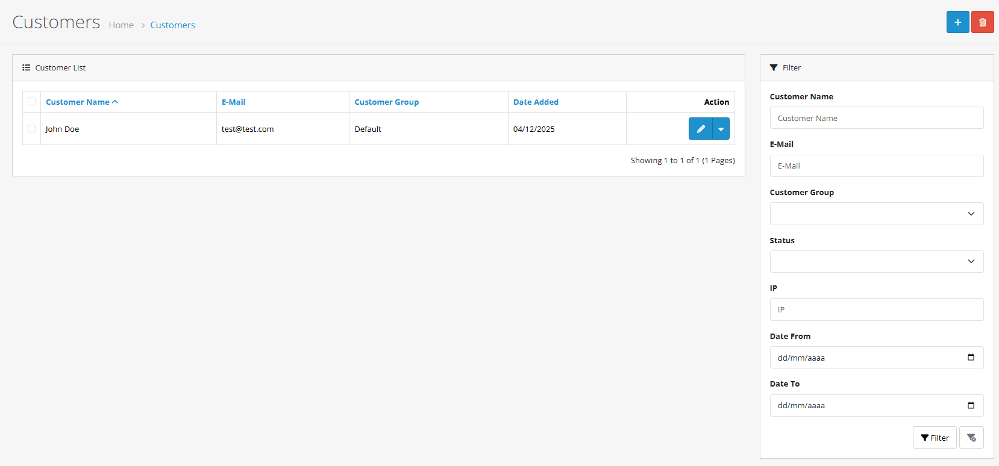
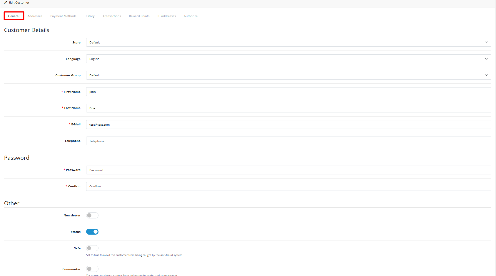
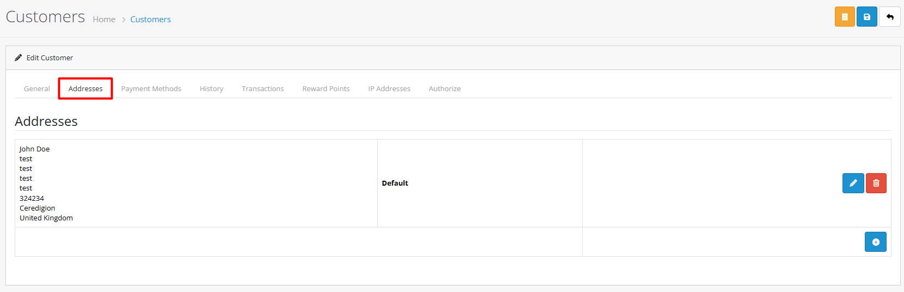
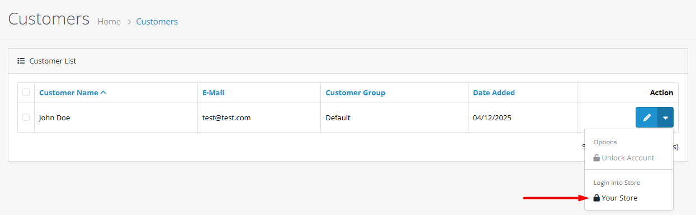
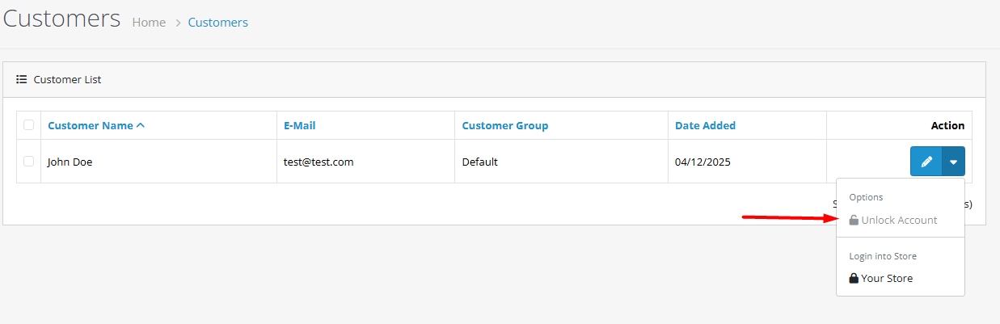

# Customer Management


**Managing Your Customer Base** The Customer Management section allows you to view, add, edit, and manage all individual customer accounts in your OpenCart store.


## Introduction

Customer Management is the core of the Customers section in OpenCart 4. It provides a comprehensive interface for managing all aspects of individual customer accounts, from basic contact information to detailed transaction history and security settings.

## Accessing Customer Management

To access the Customer Management interface:

1. Log in to your OpenCart admin panel
2. Navigate to **Customers → Customers**
3. You'll see the main customer list with search and filter options

### Customer List Interface

## Customer List & Filters

The customer list displays all customers in your store with the following columns:

* **Customer Name** - First and last name
* **Email** - Customer email address
* **Customer Group** - Group membership
* **Status** - Enabled or Disabled
* **IP** - Last known IP address
* **Date Added** - Registration date
* **Action** - Edit, Unlock, or Login as Customer options

### Available Filters

You can filter the customer list using the following criteria:


**Name Filter** 🔍

* **Description:** Search by customer name (supports autocomplete)
* **Example:** "John Smith"
* **Usage:** Type partial names to find matching customers



**Email Filter** 📧

* **Description:** Search by email address (supports autocomplete)
* **Example:** "john@example.com"
* **Usage:** Enter full or partial email addresses



**Customer Group Filter** 👥

* **Description:** Filter by customer group
* **Examples:** "Default", "Retail", "Wholesale"
* **Usage:** Select from dropdown list of available groups



**Status Filter** ✅

* **Description:** Filter by account status
* **Options:** Enabled, Disabled
* **Usage:** Show only active or inactive accounts



**IP Filter** 🌐

* **Description:** Search by IP address
* **Example:** "192.168.1.1"
* **Usage:** Find customers by their IP address



**Date Added Filter** 📅

* **Description:** Filter by registration date range
* **Example:** "2025-01-01" to "2025-12-31"
* **Usage:** Select start and end dates



**Tip:** Use the filter options to quickly find specific customers or groups of customers for targeted actions like email campaigns or account reviews.


## Managing Customer Accounts

### Adding a New Customer



**Step 1: Click Add New**

Click the **Add New** button (+) in the top-right corner of the customer list.



**Step 2: Fill in Basic Information**

Complete the **General** tab with required information:

* **Store** - Select store
* **Language** - Preferred language
* **Customer Group** - Assign group
* **First Name** - (Required, 1-32 characters)
* **Last Name** - (Required, 1-32 characters)
* **Email** - (Required, valid and unique)
* **Telephone** - (Optional, 3-32 characters)




**Step 3: Set Security & Preferences**

Configure security settings:

* **Password** - Set secure password
* **Confirm** - Re-enter password
* **Newsletter** - Subscribe (Yes/No)
* **Status** - Enable/Disable account
* **Safe** - Exclude from anti-fraud
* **Commenter** - Exclude from anti-spam


**Password Requirements:** Follow system password requirements for minimum length, uppercase, lowercase, numbers, and symbols.




**Step 4: Add Custom Fields (If Applicable)**

If custom fields are configured for the customer's group, fill them in here.



**Step 5: Save the Customer**

Click **Save** to create the account. You'll see a success confirmation.



### Editing an Existing Customer

1. From customer list, click **Edit** (pencil icon) next to customer
2. Make changes in customer form
3. Click **Save** to update

**Note:** The editing process uses the same form tabs as adding a new customer.

## Customer Form Tabs


**Tab Navigation:** Click on any tab below to view detailed information about its features and purpose.


The customer form includes 8 tabs for detailed management:

<strong>📋 General Tab</strong>

**Purpose:** Basic customer information and security settings

**Key Features:**

* Store and language selection
* Customer group assignment
* Contact information (name, email, phone)
* Password management
* Account status and preferences
* Custom fields (if configured)

<strong>🏠 Address Tab</strong>

**Purpose:** Manage shipping and billing addresses

**Key Features:**

* Add multiple addresses
* Set default shipping/billing address
* Edit or delete existing addresses
* Address validation

<strong>💳 Payment Method Tab</strong>

**Purpose:** Manage saved payment methods

**Key Features:**

* View saved payment methods
* Manage recurring subscription payments
* Payment method preferences
* Subscription management

<strong>📝 History Tab</strong>

**Purpose:** Record customer interactions and notes

**Key Features:**

* Add detailed history entries
* Document customer support interactions
* Send email notifications to customers
* Track communication history
* Timestamp all entries

<strong>💰 Transaction Tab</strong>

**Purpose:** Manage account balance and financial transactions

**Key Features:**

* Add credits or debits to customer account
* Track transaction history
* Manage account balance
* Add transaction descriptions
* Process refunds and adjustments

<strong>⭐ Reward Tab</strong>

**Purpose:** Manage customer reward points

**Key Features:**

* Add reward points for purchases or promotions
* Track point balance
* Add reward descriptions
* Manage loyalty programs
* Monitor point redemption

<strong>🔒 IP Tab</strong>

**Purpose:** Security monitoring and IP history

**Key Features:**

* View historical IP addresses used
* Monitor for suspicious activity
* Track IP registration dates
* Identify shared accounts
* Optional geolocation data

<strong>🔑 Authorize Tab</strong>

**Purpose:** API authorization management

**Key Features:**

* Manage API tokens for customer accounts
* Control third-party access
* Authorization settings
* API security management
* Token review and revocation

## Account Operations & Security

### Special Features

<strong>👤 Login as Customer</strong>

**Purpose:** Log into storefront as a specific customer for support troubleshooting.

**Process:**

1. From customer list, click action menu (three dots)
2. Select **Login as Customer**
3. You'll be redirected to storefront logged in as customer
4. Activity is logged with secure token

**Security Note:** Use only for legitimate customer support purposes.

<figure><figcaption></figcaption></figure>

<strong>🔓 Unlock Account</strong>

**Purpose:** Unlock accounts locked due to failed login attempts.

**Process:**

1. Identify locked account (special indicator in list)
2. Click action menu (three dots)
3. Select **Unlock**
4. Account unlocks immediately

**Best Practice:** Consider contacting customer to ensure correct password.

### Batch Operations


**🗑️ Delete Multiple Customers**

* Select checkboxes next to customers
* Click Delete button
* Confirm in pop-up dialog

**⚠️ Warning:** Permanent deletion of all customer data including order history, addresses, and transactions. Consider disabling accounts instead.


### Security Settings


**🛡️ Safe Mode**

* Excludes customer from anti-fraud detection systems
* Use for trusted customers with established history
* Enable for customers making frequent large purchases
* Use judiciously for security



**💬 Commenter Mode**

* Excludes customer from anti-spam systems
* For customers providing valuable product reviews
* Use for regular, trusted reviewers
* Enable selectively



**🔐 Password Security** OpenCart 4 has configurable password requirements:

* **Minimum Length:** 4-40 characters (configurable)
* **Uppercase Required:** Yes/No
* **Lowercase Required:** Yes/No
* **Number Required:** Yes/No
* **Symbol Required:** Yes/No


## Best Practices


**📊 Data Management**

* **Regular Reviews:** Periodically check customer accounts for accuracy
* **Duplicate Cleanup:** Remove or merge duplicate customer records
* **Privacy Compliance:** Ensure GDPR, CCPA, and other regulation compliance
* **Data Backup:** Regularly backup customer data



**🔒 Security Practices**

* **IP Monitoring:** Regularly check IP tab for suspicious activity
* **Safe Mode Use:** Only enable for verified, trusted customers
* **Customer Education:** Encourage strong passwords and secure practices
* **2FA Consideration:** Implement two-factor authentication if possible



**💬 Customer Support Excellence**

* **History Documentation:** Record all interactions in History tab
* **Transparency:** Notify customers when adding account notes (when appropriate)
* **Issue Resolution:** Use transaction and reward features to resolve problems
* **Response Time:** Aim for quick responses to customer inquiries



**⚠️ Critical Security Reminders**

* **Never share** customer passwords or sensitive information
* **Always verify** customer identity before making account changes
* **Regularly monitor** for unusual account activity patterns
* **Keep security protocols** updated and reviewed


## Troubleshooting & Performance

### Common Issues

<strong>🔑 Login Issues</strong>

**Problem:** Customer cannot log in.

**Solutions:**

1. **Check Account Status:** Ensure account is Enabled (not Disabled)
2. **Unlock Account:** If locked due to failed login attempts, use Unlock feature
3. **Verify Password:** Ensure password meets system requirements
4. **Confirm Credentials:** Check email/password combination is correct
5. **Password Reset:** Consider resetting customer password if needed

<strong>📧 Duplicate Email Error</strong>

**Problem:** "Email already exists" error when adding/editing customer.

**Solutions:**

1. **Unique Emails:** Email addresses must be unique across all accounts
2. **Check Similar Emails:** Look for typos or different domain variations
3. **Email Aliases:** Consider if using email aliases or plus addressing
4. **Merge Accounts:** If duplicate accounts belong to same customer, merge them
5. **Account Review:** Search for existing account with similar email

<strong>📝 Custom Fields Not Showing</strong>

**Problem:** Custom fields don't appear in customer form.

**Solutions:**

1. **Group Assignment:** Verify custom fields are assigned to customer's group
2. **System Settings:** Check if custom fields are enabled in system settings
3. **Customer Group:** Ensure customer is assigned to correct group
4. **Configuration:** Review custom field setup in **System → Custom Fields**
5. **Field Status:** Confirm custom fields are active and visible

<strong>💰 Transaction Balance Incorrect</strong>

**Problem:** Customer account balance shows incorrect amount.

**Solutions:**

1. **Review History:** Check transaction history for errors or duplicates
2. **Correcting Transactions:** Add adjusting transactions to fix balance
3. **Pending Transactions:** Verify no pending transactions affecting balance
4. **Amount Verification:** Double-check all transaction amounts entered
5. **Audit Trail:** Review complete transaction audit trail

### Performance Tips


**🔍 Efficient Filtering**

* **Targeted Searches:** Use filters to work with smaller customer subsets
* **Combination Filters:** Apply multiple filters for precise results
* **Saved Filters:** Save frequently used filter combinations
* **Quick Access:** Use filter presets for common searches



**📊 Data Management**

* **Offline Analysis:** Export data for complex analysis instead of working in admin
* **Inactive Cleanup:** Regularly clean up inactive customer accounts
* **Data Archiving:** Archive old customer data when appropriate
* **Performance Maintenance:** Maintain optimal database performance
* **Regular Backups:** Schedule regular customer data backups



**📋 Documentation Summary** You've now learned how to:

* Navigate and use the customer management interface
* Add, edit, and manage customer accounts
* Use all customer form tabs effectively
* Implement security best practices
* Troubleshoot common customer issues
* Optimize performance for better management

**Ready to explore more?** Check out the related documentation sections above for advanced customer management features.

