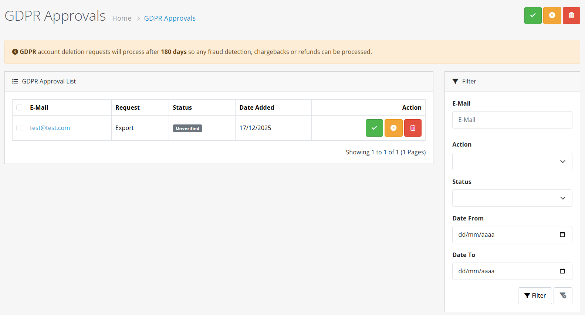
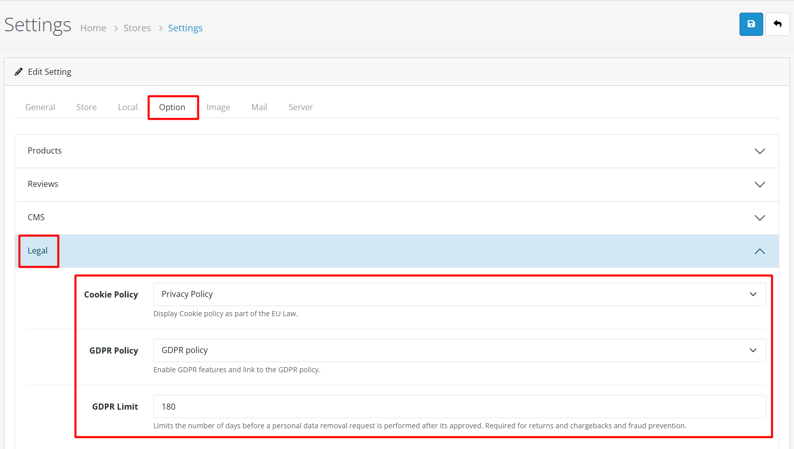
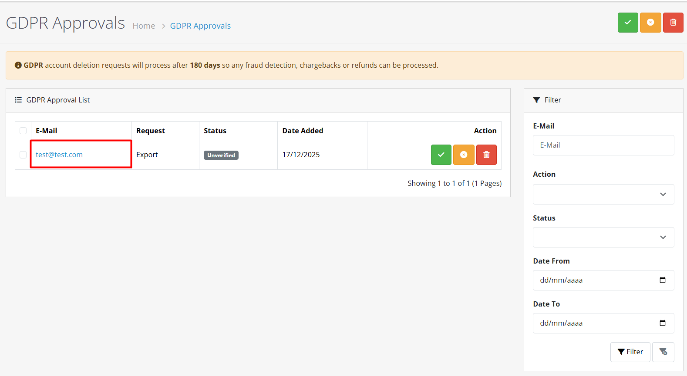
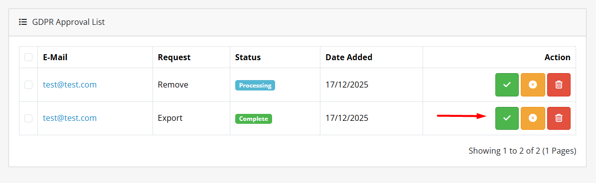

# GDPR Management


**Data Privacy Compliance** OpenCart 4 includes built-in tools to help you comply with the General Data Protection Regulation (GDPR) and other data privacy laws.


## Introduction

The GDPR Management module in OpenCart 4 provides comprehensive tools for handling data privacy requests, managing customer consent, and ensuring compliance with data protection regulations. This feature is essential for stores operating in or serving customers from the European Union and other regions with strict data privacy laws.

## GDPR Key Principles

<strong>GDPR Key Principles 📋</strong>

OpenCart 4's GDPR tools help you implement these key GDPR principles:

| Principle                  | OpenCart 4 Implementation     |
| -------------------------- | ----------------------------- |
| **Right to Access**        | Data export functionality     |
| **Right to Erasure**       | Account deletion tools        |
| **Right to Rectification** | Customer profile editing      |
| **Consent Management**     | Newsletter and policy consent |
| **Data Portability**       | Structured data exports       |
| **Privacy by Design**      | Built-in privacy features     |

## Accessing GDPR Management

To access the GDPR Management interface:

1. Log in to your OpenCart admin panel
2. Navigate to **Customers → GDPR**
3. You'll see the GDPR requests list

## GDPR Request Types

<strong>GDPR Request Types 📝</strong>

OpenCart 4 handles two main types of GDPR requests:

| Request Type             | Description                                       | Legal Basis     |
| ------------------------ | ------------------------------------------------- | --------------- |
| **Data Access Request**  | Customer requests copy of their personal data     | GDPR Article 15 |
| **Data Erasure Request** | Customer requests deletion of their personal data | GDPR Article 17 |

## GDPR Configuration

Before processing requests, configure your GDPR settings:



**Step 1: Access GDPR Settings**

Navigate to **System → Settings → Your Store → Option tab**



**Step 2: Configure GDPR Settings**

Find and configure these GDPR-related settings:


**General GDPR Settings** ⚙️

* **GDPR Status:** Enable/disable GDPR features
* **GDPR Limit:** Days to keep GDPR requests before automatic processing (default: 30)



**Cookie Policy Settings** 🍪

* **Cookie Policy:** Link to your privacy policy page





**Step 3: Save Configuration**

Click **Save** to apply your GDPR settings



## Processing GDPR Requests

### Viewing Pending Requests

The GDPR list shows all pending requests with:

* **Customer Name** - Requesting customer
* **Email** - Customer email
* **Request Type** - Access or Erasure
* **Date Added** - Request submission date
* **Status** - Pending, Processing, or Complete

### Data Access Request Processing



**Step 1: Review Request**

Click **View** to see request details and verify customer identity.




**Step 2: Export Customer Data**

Click **Approve** to send an email with the data export package containing:


**Data Export Contents** 📦

* **Customer profile information:** Name, email, contact details
* **Order history:** Complete purchase records
* **Addresses:** Shipping and billing addresses
* **Transaction history:** Financial transactions
* **Reward points:** Loyalty program balance
* **IP history:** Historical IP addresses used
* **Activity logs:** Customer activity and interactions



**Security:** Ensure secure delivery of personal data. Use encrypted email or secure portals.





### Data Erasure Request Processing



**Step 1: Review Request**

Click **View** to see request details. Verify:


**Request Verification Checklist** ✅

* **Customer identity:** Confirm the requester's identity matches account
* **Legal obligations:** Ensure no legal requirements prevent deletion (e.g., tax records)
* **Active orders/subscriptions:** Check for pending orders or active subscriptions




**Step 2: Anonymize or Delete**

Choose the appropriate action based on your data retention policies:


**Anonymize Data** 🕵️

* **Personal identifiers:** Replaced with anonymous values
* **Order history:** Preserved for business records
* **Statistical data:** Maintained for analytics



**Complete Deletion** ⚠️

* **Customer data:** Removed permanently
* **Order history:** Deleted along with related records
* **Irreversible action:** Cannot be undone




**Step 3: Confirm Action**

Review the data to be affected and confirm the action. The system will process the request and notify the customer.



**Step 4: Mark as Complete**

After processing, click **Complete** to close the request.



## Automatic Request Processing

OpenCart 4 can automatically process GDPR requests after a configurable period:

### Configuration

Set **GDPR Limit** in settings (default: 30 days)

### Automatic Actions

* **Pending requests** older than limit are automatically processed
* **Access requests** - Data exported and archived
* **Erasure requests** - Data anonymized based on settings
* **Notifications** - Customers notified of automatic processing

## Consent Management

### Registration Consent

Configure consent requirements during customer registration:

1. **Privacy Policy Agreement** - Require acceptance of privacy policy
2. **Newsletter Consent** - Separate consent for marketing communications
3. **Third-Party Sharing** - Consent for data sharing with partners

### Consent Records

OpenCart 4 maintains records of:

* When consent was given
* What was consented to
* Consent version (policy version)
* IP address at time of consent

### Consent Withdrawal

Customers can withdraw consent through:

* Account settings page
* Contact forms
* Direct requests to administrators

## Data Retention Policies

<strong>Data Retention Policies ⏰</strong>

#### Configurable Retention Periods

Set retention periods for different data types:

| Data Type             | Default Retention           | Configuration   |
| --------------------- | --------------------------- | --------------- |
| **Login Attempts**    | 30 days                     | System Settings |
| **Customer Activity** | 30 days                     | System Settings |
| **GDPR Requests**     | 30 days                     | GDPR Settings   |
| **Order History**     | Based on legal requirements | Order Settings  |

#### Automated Cleanup

OpenCart 4 automatically removes expired data based on retention settings.

## Legal Basis for Processing

<strong>Legal Basis for Processing ⚖️</strong>

Document your legal basis for processing customer data:

| Processing Activity  | Legal Basis          | Documentation   |
| -------------------- | -------------------- | --------------- |
| **Order Processing** | Contract fulfillment | Order records   |
| **Customer Support** | Legitimate interest  | Support tickets |
| **Marketing**        | Consent              | Consent records |
| **Analytics**        | Legitimate interest  | Privacy policy  |

## Best Practices for GDPR Compliance


**1. Privacy by Design** 🏗️

* **Early Setup:** Enable GDPR features during store setup
* **Policy Configuration:** Configure data retention policies early
* **Consent Management:** Implement consent management from start



**2. Transparent Communication** 💬

* **Accessible Policy:** Clear privacy policy accessible from all pages
* **Simple Language:** Explain data usage in simple language
* **Easy Controls:** Provide easy access to privacy controls



**3. Efficient Request Handling** ⏱️

* **Workflow Establishment:** Establish request processing workflow
* **Response Time:** Set response time expectations (GDPR requires 30 days)
* **Staff Training:** Train staff on GDPR requirements



**4. Data Security** 🛡️

* **Access Controls:** Implement access controls for customer data
* **Encryption:** Use encryption for sensitive data
* **Security Audits:** Regular security audits



**5. Documentation & Records** 📁

* **Processing Records:** Maintain records of processing activities
* **Legal Basis Documentation:** Document legal bases for data processing
* **Consent Records:** Keep consent records for required period


## Troubleshooting

### Common Issues

<strong>GDPR features not showing 🔍</strong>

**Solution:** Enable GDPR in System Settings

<strong>Export files too large 📦</strong>

**Solution:** Split exports or provide secure download

<strong>Cannot delete customer with orders 🗑️</strong>

**Solution:** Anonymize instead of delete, check legal requirements

<strong>Consent records missing 📝</strong>

**Solution:** Check consent configuration and logging

### Legal Considerations

<strong>Legal Considerations ⚖️</strong>

* **Legal Counsel:** Consult legal counsel for specific compliance requirements
* **Local Laws:** Consider local data protection laws beyond GDPR
* **Exceptions Documentation:** Document exceptions to erasure requests (legal obligations)

## International Considerations

<strong>International Considerations 🌍</strong>

#### Beyond GDPR

While GDPR is a European regulation, similar laws exist worldwide:

* **CCPA** - California Consumer Privacy Act (USA)
* **PIPEDA** - Personal Information Protection and Electronic Documents Act (Canada)
* **LGPD** - Lei Geral de Proteção de Dados (Brazil)
* **PDPA** - Personal Data Protection Act (Singapore)

#### Cross-Border Data Transfers

* Implement appropriate safeguards for international data transfers
* Consider data localization requirements
* Update privacy policies for international operations


**Documentation Summary** 📋

You've now learned how to:

* Configure GDPR settings and enable privacy features
* Process data access and erasure requests
* Manage customer consent and data retention policies
* Implement best practices for GDPR compliance
* Troubleshoot common GDPR issues

**Next Steps:**

* [Customer Management](/broken/pages/W3iuma9SRc05P2lExajW) - Handle customer data and privacy requests
* [Customer Approval](/broken/pages/Um8iYGrsf89Q8Rk9hmiF) - Consider privacy in registration approval
* [Custom Fields](/broken/pages/Ahlg4yE4ksx2AIcMmMVp) - Manage custom data collection and privacy
* [System Settings](/broken/pages/xCvZYwheznxxvkDkGycZ) - Configure GDPR and privacy settings

