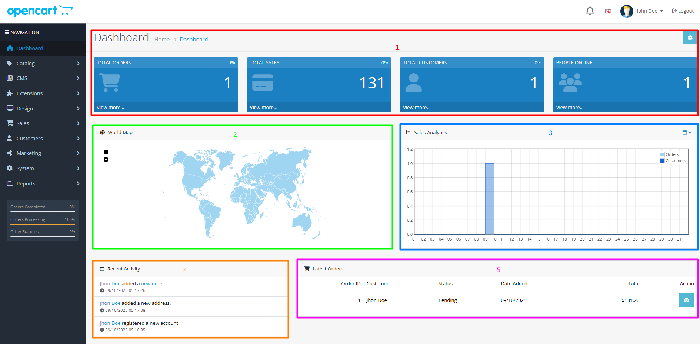
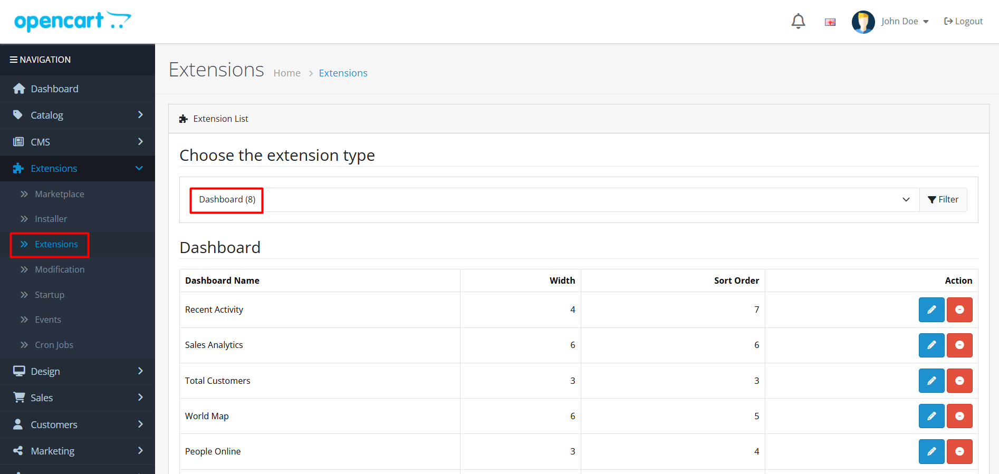

# Dashboard

## Introduction


The dashboard is your command center - the first page you see after logging into your OpenCart admin panel. It provides a comprehensive overview of your store's performance and quick access to important management functions.



**Key Benefit**: The main purpose of the dashboard is to give store owners real-time insights into how their shop is performing through statistical data analysis and visualizations.


<figure><figcaption>
Admin dashboard - your central hub for store performance monitoring and management
</figcaption></figure>

## Dashboard Sections

### 1. Overview


The Overview section displays your store's most important Key Performance Indicators (KPIs) at a glance. Monitor these metrics daily to track your business health.


**Key Performance Indicators:**

* **Total Orders**: Number of orders placed during the selected period
* **Total Sales**: Total revenue generated over the selected period
* **Total Customers**: Number of registered customers
* **People Online**: Current visitors browsing your store

### 2. World Map


The World Map visualization shows where your orders are coming from geographically. Use this to understand your customer distribution and identify key markets for expansion.


### 3. Sales Analytics


This graphical representation tracks your store's chronological progress. Compare performance across different time periods to identify trends and patterns.


**Chart Configuration:**

* **X-axis**: Time (hours, days, or months depending on the selected range)
* **Y-axis**: Number of total orders (yellow line) and total customers (blue line)
* **Features**: Allows comparison of performance across different time periods

### 4. Recent Activity


**Important**: Monitor this section regularly to stay informed about customer interactions and system events in real-time.


Displays recent customer activities from your store:

* Customer logins
* New account registrations
* Order placements
* System notifications
* Recent reviews and ratings

### 5. Latest Orders


This section provides a detailed view of your most recent orders. Use the quick action links to manage orders efficiently without navigating away from the dashboard.


A detailed list showing the most recent orders with the following information:

* **Order ID**: Unique identifier for each order
* **Customer**: Customer name and details
* **Status**: Current order status
* **Date Added**: When the order was placed
* **Total**: Order total amount
* **Action**: Quick links to view or edit orders

## Customizing the Dashboard


Personalize your dashboard to show the information most relevant to your business needs. Remove widgets you don't use and prioritize the ones that matter most.


### Widget Management

**Dashboard Customization Steps:**

1. Navigate to **Extensions > Extensions > Dashboard**
2. **Add/Remove Widgets**: Customize which dashboard components to display
3. **Rearrange Layout**: Change the sort order to preferred positions
4. **Widget Settings**: Configure individual widget display options

<figure><figcaption>
Dashboard customization - manage widgets and layout to match your workflow
</figcaption></figure>

## Tips for Effective Dashboard Use


Best Practices: Make your dashboard work for you by following these proven strategies for effective store management.


**Dashboard Optimization Checklist:**

* **Monitor Key Metrics**: Regularly check Total Orders, Sales, and Customer counts
* **Set Up Alerts**: Configure notifications for important events
* **Customize Widgets**: Tailor dashboard components to your business needs
* **Analyze Geographic Data**: Use the World Map to understand customer distribution
* **Track Activity Patterns**: Monitor Recent Activity for customer behavior insights
