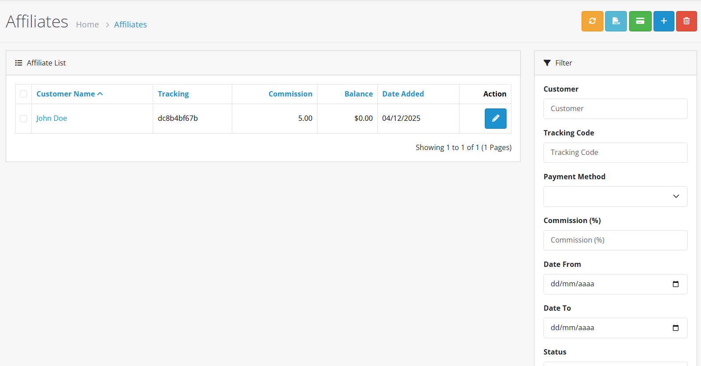
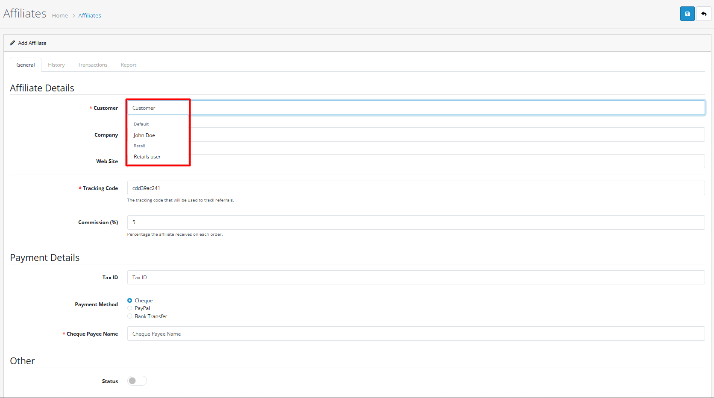
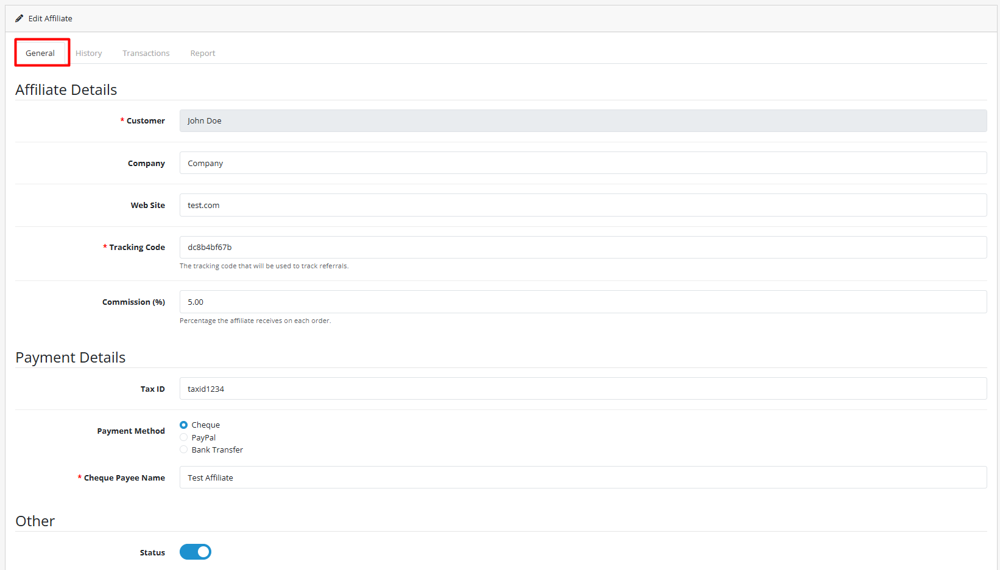
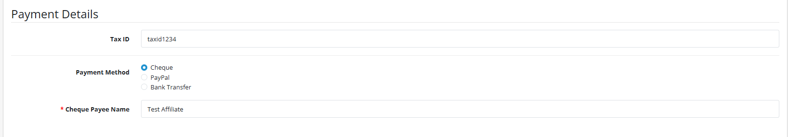

# Affiliates


**Grow Your Business with Referrals** The Affiliate system allows you to create a referral program where customers can earn commissions by promoting your products. Manage affiliates, track referrals, and process payments directly from your OpenCart 4 admin panel.


## Introduction

The Affiliate system in OpenCart 4 enables you to build a powerful referral marketing program. Customers can become affiliates and earn commissions by referring new customers to your store. The system provides comprehensive tracking, commission management, and payment processing tools to help you grow your business through word-of-mouth marketing.

## System Configuration

Before using the Affiliate system, configure the basic settings in **System → Settings → Option tab**:

| Setting                  | Description                                             | Default Value |
| ------------------------ | ------------------------------------------------------- | ------------- |
| **Affiliate Status**     | Enable or disable the entire affiliate system           | Disabled (0)  |
| **Affiliate Approval**   | Whether affiliate registrations require manual approval | Yes (1)       |
| **Affiliate Auto**       | Auto-add customers to affiliate group after approval    | No (0)        |
| **Affiliate Group**      | Customer group for approved affiliates                  | Default (1)   |
| **Affiliate Commission** | Default commission percentage for new affiliates        | 0.00%         |
| **Affiliate Expire**     | Days before affiliate tracking cookies expire           | 30            |
| **Affiliate Terms**      | Page containing affiliate terms and conditions          | None          |


**Important:** Enable "Affiliate Status" first before affiliates can register or be created. The system must be active for any affiliate functionality to work.


## Accessing the Affiliate Interface

To access the Affiliate management interface:

1. Log in to your OpenCart admin panel
2. Navigate to **Marketing → Affiliates**
3. You'll see the affiliate list with existing affiliates and filtering options

## Creating a New Affiliate



**Step 1: Convert an Existing Customer**

Click the **Add New** button (+) in the top-right corner of the affiliate list.

Since affiliates must be existing customers, you'll need to select a customer from your database:

* Use the customer autocomplete field to search for customers
* Only customers not already affiliated will appear
* The system automatically fills in customer details




**Step 2: Configure Affiliate Details**

Fill in the **Affiliate Details** tab:

**Tracking Code** (Required)

* Unique 10-character code for tracking referrals
* Can be auto-generated or manually entered
* Must be unique across all affiliates

**Website**

* Optional website URL for the affiliate
* Used for reference purposes only

**Commission** (Required)

* Percentage commission on referred sales
* Can override the default system commission
* Enter as a percentage (e.g., 5.00 for 5%)

**Tax ID**

* Optional tax identification number
* For business affiliate record-keeping




**Step 3: Configure Payment Method**

Select a payment method in the **Payment Details** tab:

| Method            | Required Fields                                                    | Notes                      |
| ----------------- | ------------------------------------------------------------------ | -------------------------- |
| **Cheque**        | Cheque Payee Name                                                  | Physical cheque payments   |
| **PayPal**        | Valid PayPal Email                                                 | Electronic PayPal payments |
| **Bank Transfer** | Bank Name, Branch Number, SWIFT Code, Account Name, Account Number | Direct bank transfers      |

Each method has specific validation rules and required fields. Choose the method that matches how you'll pay commissions.




**Step 4: Save and Activate**

Click **Save** to create the affiliate. Depending on your system configuration:

* **If auto-approval is enabled**: The affiliate is immediately active
* **If manual approval required**: The affiliate status is "Pending" until approved
* **Affiliate receives email notification** about their status change

You can edit the affiliate later to change status, commission, or payment details.



## Affiliate Status Management

<strong>Pending Approval ⏳</strong>

* **Requires**: Manual admin approval (when `config_affiliate_approval = 1`)
* **Behavior**: Affiliate cannot track referrals or earn commissions
* **Action**: Admin must manually approve from affiliate edit page
* **Notification**: Affiliate receives approval/denial email

<strong>Active ✅</strong>

* **Requirements**: Approved by admin or auto-approved
* **Behavior**: Can track referrals and earn commissions
* **Tracking**: Unique tracking code is active
* **Commissions**: Accumulates from referred sales

<strong>Disabled ❌</strong>

* **Set by**: Admin manually disabling affiliate
* **Behavior**: Cannot track referrals or earn new commissions
* **Balance**: Existing balance remains but no new commissions
* **Use case**: Temporary suspension or termination

## Commission Structure

<strong>Default Commission</strong>

* **Configuration**: Set in System → Settings → Option tab
* **Application**: Used for new affiliates unless overridden
* **Format**: Percentage (e.g., 5.00 = 5%)
* **Range**: Typically 1-100%, but can be any value

<strong>Individual Commission</strong>

* **Override**: Set per affiliate during creation/editing
* **Priority**: Overrides default commission for that affiliate
* **Use cases**: VIP affiliates, performance-based tiers, special agreements
* **Adjustment**: Can be changed at any time

<strong>Commission Calculation</strong>

* **Basis**: Percentage of total order amount (before tax)
* **Exclusions**: Shipping costs typically excluded
* **Timing**: Calculated when order reaches complete status
* **Balance**: Added to affiliate's balance automatically

## Payment Methods

<strong>Cheque Payments</strong>

* **Required**: Cheque Payee Name (exact name on cheque)
* **Process**: Manual cheque creation and mailing
* **Tracking**: Mark as paid in transaction history
* **Best for**: Traditional businesses, local affiliates

<strong>PayPal Payments</strong>

* **Required**: Valid PayPal email address
* **Validation**: System validates email format
* **Process**: Send payment via PayPal manually
* **Best for**: International affiliates, digital businesses

<strong>Bank Transfer Payments</strong>

* **Required Fields**:
  * Bank Name
  * ABA/BSB Branch Number
  * SWIFT Code (for international)
  * Account Name
  * Account Number
* **Process**: Initiate transfer through your bank
* **Best for**: Business affiliates, regular commission payments

## Tracking System

<strong>Tracking Code</strong>

* **Format**: 10-character unique code (letters and numbers)
* **Generation**: Auto-generated or manually entered
* **Uniqueness**: System validates no duplicates exist
* **Usage**: Added to referral links (e.g., `?tracking=CODE`)

<strong>Referral Links</strong>

* **Format**: `yourstore.com?tracking=UNIQUE_CODE`
* **Automatic**: Links automatically include tracking for logged-in affiliates
* **Cookie**: Tracking code stored in cookie for 30 days (configurable)
* **Attribution**: Sale attributed to affiliate if cookie present at checkout

<strong>Tracking Reports</strong>

* **Access**: Click "Reports" button on affiliate list
* **Data**: IP address, country, store, date of referral
* **Filtering**: By date range and affiliate
* **Purpose**: Monitor affiliate marketing effectiveness

## Balance and Transactions

<strong>Affiliate Balance</strong>

* **Display**: Shown in affiliate list and edit page
* **Calculation**: Sum of all commissions minus payments
* **Real-time**: Updates automatically with new orders
* **Viewing**: Click balance amount to see transaction history

<strong>Transaction History</strong>

* **Types**: Commission additions, payment subtractions
* **Access**: "History" tab in affiliate edit page
* **Details**: Date, description, amount, order reference
* **Manual entries**: Add transactions for adjustments or manual payments

<strong>Processing Payments</strong>

1. **Check balance**: Verify affiliate has payable balance
2. **Process payment**: Send payment via chosen method
3. **Add transaction**: Record payment in affiliate history
4. **Update balance**: Balance reduces by payment amount
5. **Notify affiliate**: Optional email notification

## Customer Registration as Affiliate

<strong>Registration Process</strong>

1. **Customer logs in** to their account
2. **Navigates to Affiliate section** in their account
3. **Completes affiliate application** with payment details
4. **Accepts terms and conditions** (if configured)
5. **Submits for approval** (if manual approval required)
6. **Receives status notification** via email

<strong>Required Information</strong>

* **Payment method** and details
* **Tax ID** (optional)
* **Website** (optional)
* **Terms acceptance** (if enabled)
* **Tracking code** (auto-generated)

<strong>Customer Affiliate Panel</strong>

* **Access**: Through customer account dashboard
* **Features**:
  * View commission balance
  * See tracking code
  * Check payment information
  * View referral history
  * Update payment details
* **Restrictions**: Cannot change commission rate or status

## Advanced Features

<strong>Custom Fields for Affiliates</strong>

* **Location**: Use "affiliate" location for custom fields
* **Access**: Customers → Custom Fields
* **Purpose**: Collect additional information during affiliate registration
* **Examples**: Business registration number, marketing channels, promotional methods

<strong>Affiliate Group Assignment</strong>

* **Auto-assignment**: `config_affiliate_auto` setting
* **Group**: `config_affiliate_group_id` setting
* **Purpose**: Automatically add approved affiliates to specific customer group
* **Use cases**: Special pricing, permissions, or marketing for affiliates

<strong>Cookie Expiration Control</strong>

* **Setting**: `config_affiliate_expire` (days)
* **Default**: 30 days
* **Purpose**: How long tracking cookie remains active
* **Considerations**: Balance between attribution accuracy and privacy

## Bulk Operations

<strong>Export CSV</strong>

* **Purpose**: Export affiliate data for payment processing
* **Data**: Name, email, balance, payment details
* **Format**: CSV for import into accounting software
* **Access**: Export button in affiliate list

<strong>Recalculate Balances</strong>

* **Purpose**: Fix any balance calculation issues
* **Process**: Recalculates all affiliate balances from transaction history
* **Use case**: After system migration or data correction
* **Caution**: Can be resource-intensive for large databases

## Email Notifications

<strong>Approval Notification</strong>

* **Trigger**: Admin approves pending affiliate
* **Template**: `admin/view/template/mail/affiliate_approve.twig`
* **Content**: Welcome message, tracking code, commission details
* **Customization**: Edit template for your business

<strong>Denial Notification</strong>

* **Trigger**: Admin denies affiliate application
* **Template**: `admin/view/template/mail/affiliate_deny.twig`
* **Content**: Notification of denial, possible reasons
* **Consideration**: May want to provide alternative contact

<strong>Transaction Notifications</strong>

* **Trigger**: Manual transaction added by admin
* **Template**: `admin/view/template/mail/transaction.twig`
* **Content**: Transaction details, updated balance
* **Optional**: Can be disabled per transaction

## Best Practices


**Program Management** 🤝

1. **Clear Terms**: Create comprehensive affiliate terms and conditions
2. **Fair Commission**: Set competitive but sustainable commission rates
3. **Regular Payments**: Establish consistent payment schedule
4. **Communication**: Keep affiliates informed about program changes
5. **Performance Tracking**: Monitor top performers and provide support



**Compliance & Legal** ⚖️

1. **Tax Reporting**: Collect necessary tax information for business affiliates
2. **Terms Enforcement**: Ensure affiliates follow your marketing guidelines
3. **Payment Compliance**: Follow payment processing regulations in your region
4. **Data Privacy**: Handle affiliate data according to privacy laws
5. **Contractual Agreements**: Consider formal agreements for high-volume affiliates



**Performance Optimization** 📈

1. **Segment Affiliates**: Group by performance, niche, or region
2. **Tiered Commissions**: Reward top performers with higher rates
3. **Marketing Materials**: Provide banners, links, and content for affiliates
4. **Regular Reviews**: Periodically review and prune inactive affiliates
5. **A/B Testing**: Test different commission structures and promotions


## Troubleshooting

### Common Issues

<strong>Tracking not working 🔍</strong>

**Solution:** Check the following:

1. **Affiliate status**: Must be "Active"
2. **Tracking code**: Must be valid and unique
3. **Cookie settings**: Browser must accept cookies
4. **Link format**: Must include `?tracking=CODE` parameter
5. **Expiration**: Cookie may have expired (default 30 days)

<strong>Commissions not calculating 💰</strong>

**Solution:** Verify order and affiliate status:

1. **Order status**: Must reach "Complete" status
2. **Affiliate status**: Must be "Active" at time of order
3. **Tracking cookie**: Must be present at checkout
4. **Commission rate**: Check affiliate's commission percentage
5. **Order total**: Minimum order amount may apply

<strong>Payment method errors 💳</strong>

**Solution:** Validate payment details:

1. **PayPal**: Email must be valid and confirmed
2. **Bank details**: All required fields must be complete
3. **Cheque name**: Payee name cannot be empty
4. **Format validation**: System validates specific formats for each method

<strong>Customer cannot register as affiliate 📝</strong>

**Solution:** Check system configuration:

1. **Affiliate status**: System must be enabled
2. **Customer status**: Must be approved customer (not guest)
3. **Already affiliated**: Customer cannot be affiliate twice
4. **Terms page**: Must be selected if terms required
5. **Custom fields**: All required custom fields must be configured

<strong>Balance discrepancies ⚖️</strong>

**Solution:** Recalculate and audit:

1. **Use recalculate function**: In affiliate list tools
2. **Check transaction history**: Verify all entries are correct
3. **Audit orders**: Confirm commission calculations per order
4. **Check payment records**: Ensure all payments recorded


**System Limitations** ⚡

* **One affiliate per customer**: A customer cannot have multiple affiliate accounts
* **Cookie-based tracking**: Requires cookies to be enabled in browsers
* **Manual payment processing**: No automatic payment integration
* **Commission on complete orders only**: Pending/cancelled orders don't earn commission
* **No multi-tier commissions**: Single-level affiliate program only



**Documentation Summary** 📋

You've now learned how to:

* Configure and enable the affiliate system in OpenCart 4
* Create and manage affiliate accounts
* Set up commission structures and payment methods
* Track referrals and monitor affiliate performance
* Process commission payments and manage balances
* Handle affiliate registrations from customers
* Apply best practices for successful affiliate programs

**Next Steps:**

* [Mail](/broken/pages/vJIjWZ7oLoUJogBSJYlm) - Send mass emails to affiliates and customers
* [Coupons](/broken/pages/xbRg0v2R988utvAoov0A) - Create discount coupons for affiliate promotions
* [Customer Groups](/broken/pages/LAO0SyfaDGHgMwDovS2i) - Organize affiliates into groups
* [System Settings](/broken/pages/xCvZYwheznxxvkDkGycZ) - Configure affiliate system options
* [Custom Fields](/broken/pages/Ahlg4yE4ksx2AIcMmMVp) - Add custom fields for affiliate applications

