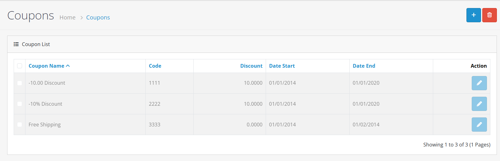
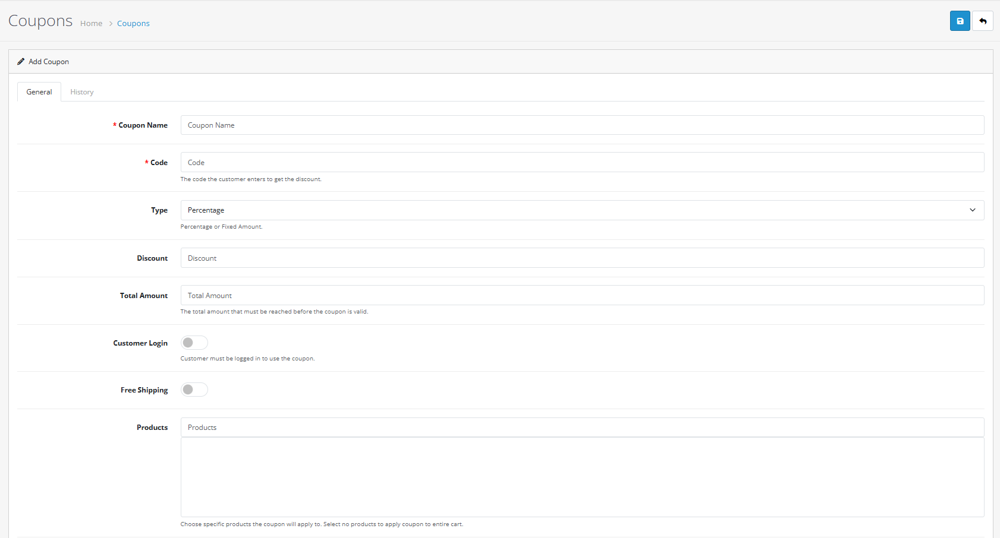
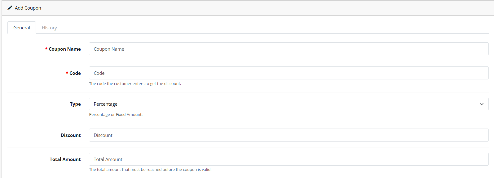
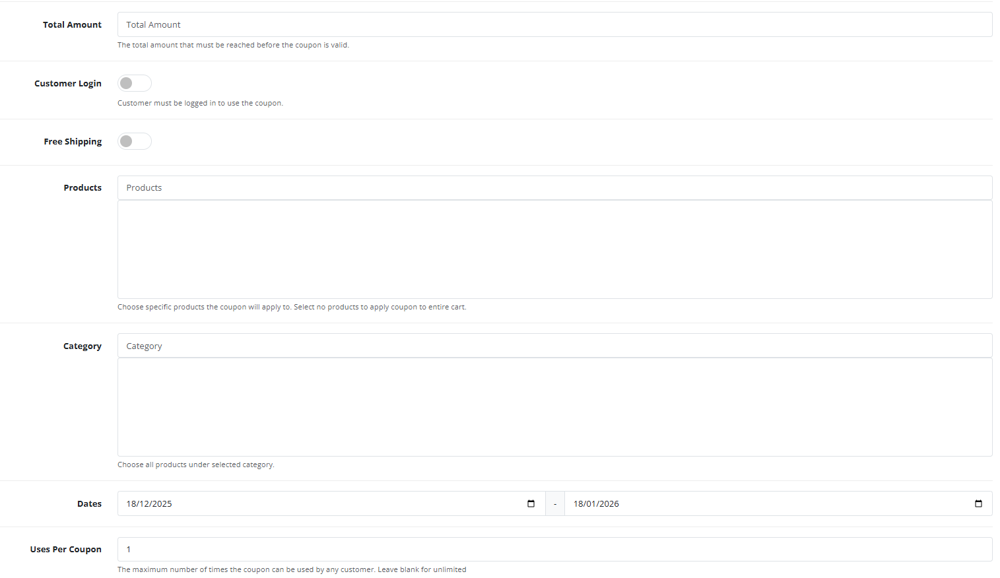

# Coupons


**Drive Sales with Discounts** The Coupon system allows you to create flexible discount codes for promotions, special offers, and customer incentives. Manage expiration dates, usage limits, and product-specific discounts directly from your OpenCart 4 admin panel.


## Introduction

The Coupon system in OpenCart 4 provides powerful tools for creating and managing discount promotions. Whether you're running seasonal sales, rewarding loyal customers, or promoting specific products, coupons help drive sales and customer engagement. The system supports multiple discount types, usage restrictions, and detailed tracking to ensure your promotions are effective and controlled.

## Accessing the Coupon Interface

To access the Coupon management interface:

1. Log in to your OpenCart admin panel
2. Navigate to **Marketing → Coupons**
3. You'll see the coupon list with existing coupons and filtering options

## Creating a New Coupon



**Step 1: Start Creating a Coupon**

Click the **Add New** button (+) in the top-right corner of the coupon list.

You'll be taken to the coupon creation form with two main tabs: **General** and **History**. The General tab contains all configuration options.




**Step 2: Configure Basic Coupon Settings**

Fill in the **General** tab with basic coupon information:

**Coupon Name** (Required)

* 3-128 characters, descriptive name for admin reference
* Not shown to customers, for internal tracking only

**Code** (Required)

* 3-20 character unique code customers enter at checkout
* Alphanumeric, case-sensitive
* Must be unique across all coupons

**Type** (Required)

* **Percentage**: Discount as percentage of order total
* **Fixed Amount**: Fixed monetary discount

**Discount Amount** (Required)

* For Percentage: Enter percentage (e.g., 10.00 for 10%)
* For Fixed Amount: Enter monetary amount (e.g., 25.00 for $25)




**Step 3: Set Usage Restrictions**

Configure restrictions to control how and when the coupon can be used:

**Customer Login Required**

* Yes: Only logged-in customers can use the coupon
* No: Anyone can use the coupon (including guests)

**Free Shipping**

* Yes: Applies free shipping in addition to discount
* No: Normal shipping rules apply

**Total Amount Minimum**

* Minimum cart total required to use coupon
* Leave blank for no minimum
* Example: 100.00 means cart must be $100+ before tax

**Usage Limits**

* **Uses Per Coupon**: Total uses allowed across all customers
* **Uses Per Customer**: Maximum uses per individual customer
* Leave blank for unlimited uses

**Validity Dates**

* **Date Start**: When coupon becomes active
* **Date End**: When coupon expires
* Leave blank for no date restrictions




**Step 4: Set Product/Category Restrictions (Optional)**

Control which products the coupon applies to:

**Products**

* Select specific products the coupon applies to
* Leave empty to apply to all products in cart
* Use autocomplete to search and add products

**Categories**

* Select categories – coupon applies to all products in those categories
* Leave empty for no category restriction
* Use dropdown to select categories

**Note**: If both products and categories are selected, coupon applies to union of both sets (products in list OR in selected categories).



**Step 5: Save and Activate**

Click **Save** to create the coupon. The coupon will be:

* **Active immediately** if within date range and status is Enabled
* **Available for use** according to configured restrictions
* **Trackable** in the History tab as it gets used

You can edit the coupon anytime to change settings or disable it.



## Coupon Types

<strong>Percentage Discount (%)</strong>

* **Calculation**: Percentage of cart total (before tax)
* **Example**: 15% discount on $100 order = $15 off
* **Maximum**: Can be any percentage (even over 100% for special cases)
* **Use cases**: Store-wide sales, seasonal promotions, percentage-based offers
* **Limitation**: Cannot result in negative order total

<strong>Fixed Amount Discount ($)</strong>

* **Calculation**: Fixed monetary amount subtracted from total
* **Example**: $25 discount on any order over $50
* **Currency**: In store's base currency
* **Use cases**: Dollar-off promotions, clearance sales, specific discount amounts
* **Note**: If discount exceeds order total, order becomes free (minimum $0)

## Usage Restrictions

<strong>Customer Login Requirement</strong>

* **Enabled**: Only registered, logged-in customers can use
* **Disabled**: Anyone can use (including guest checkout)
* **Use cases**: Loyalty rewards, member-only discounts, VIP promotions
* **Validation**: System checks customer login status at checkout

<strong>Free Shipping</strong>

* **Combination**: Can be combined with monetary discount
* **Calculation**: Removes shipping cost from order total
* **Restrictions**: Still respects product/category restrictions
* **Use cases**: Free shipping promotions, high-value order incentives
* **Note**: Only applies if shipping is required for the order

<strong>Minimum Order Amount</strong>

* **Purpose**: Ensure coupon drives meaningful sales volume
* **Calculation**: Cart subtotal before tax and shipping
* **Validation**: Checked at time of coupon application
* **Use cases**: Encourage larger orders, meet revenue targets
* **Example**: $50 minimum for $10 off coupon

<strong>Usage Limits</strong>

* **Per Coupon**: Total uses across all customers
* **Per Customer**: Maximum uses per individual customer
* **Tracking**: System counts each successful use
* **Reset**: Counts don't reset – once limit reached, coupon inactive
* **Unlimited**: Leave blank for no limits

<strong>Date Restrictions</strong>

* **Start Date**: Coupon inactive before this date
* **End Date**: Coupon expires after this date
* **Time**: Includes time (typically 00:00:00)
* **Validation**: System checks current date/time
* **Use cases**: Flash sales, holiday promotions, limited-time offers

## Product and Category Restrictions

<strong>Product-Specific Coupons</strong>

* **Selection**: Choose specific products from your catalog
* **Application**: Discount applies only to selected products in cart
* **Partial carts**: If cart contains both eligible and ineligible products, discount applies only to eligible items
* **Use cases**: New product launches, slow-moving inventory, product bundles

<strong>Category-Based Coupons</strong>

* **Selection**: Choose entire categories
* **Application**: Discount applies to all products in selected categories
* **Hierarchy**: Includes all subcategories automatically
* **Use cases**: Department-wide sales, seasonal category promotions
* **Example**: 20% off all "Electronics" category products

<strong>Combination Rules</strong>

* **No selections**: Coupon applies to entire cart
* **Products only**: Only selected products
* **Categories only**: Only products in selected categories
* **Both selected**: Products in either list (union)
* **Priority**: No priority – all eligible items discounted equally
* **Calculation**: Discount distributed proportionally across eligible items

## Coupon Status Management

<strong>Enabled ✅</strong>

* **Requirements**: Within date range (if specified), under usage limits
* **Behavior**: Can be applied at checkout by eligible customers
* **Validation**: All restrictions checked at time of use
* **Appearance**: Shows in active coupon list

<strong>Disabled ❌</strong>

* **Set by**: Admin manually disabling coupon
* **Behavior**: Cannot be applied at checkout
* **Existing uses**: Previously applied coupons remain in order history
* **Re-enable**: Can be re-enabled if still within date/usage limits
* **Use case**: End promotion early, pause promotion temporarily

## History and Tracking

<strong>Usage History</strong>

* **Access**: Click "History" button in coupon list or History tab in edit
* **Data**: Order ID, customer, discount amount, date used
* **Filtering**: Can filter by date range
* **Export**: Not built-in but data accessible for reporting
* **Purpose**: Track promotion effectiveness, audit coupon usage

<strong>Real-time Validation</strong>

* **At checkout**: System validates all restrictions when coupon entered
* **Error messages**: Specific messages for each failed validation
* **Dynamic**: Re-validates if cart changes after coupon applied
* **Multiple coupons**: Only one coupon can be applied per order
* **Removal**: Customers can remove applied coupon

<strong>Report Generation</strong>

* **Extension**: "Coupons Report" in Reports section
* **Data**: Sales attributed to each coupon
* **Analysis**: Revenue generated, average discount, usage patterns
* **Access**: Reports → Sales → Coupons
* **Use**: Measure ROI of promotions

## Customer Experience

<strong>Applying Coupons at Checkout</strong>

1. **Customer proceeds to checkout**
2. **Enters coupon code** in "Use Coupon Code" field
3. **Clicks "Apply Coupon"** button
4. **System validates** all restrictions in real-time
5. **If valid**: Discount applied, order total updated
6. **If invalid**: Error message shows specific reason
7. **Can remove**: "Remove" button appears next to applied coupon

<strong>Error Messages Customers See</strong>

* **Invalid coupon**: Code doesn't exist or is disabled
* **Not logged in**: "You must be logged in to use this coupon"
* **Minimum not met**: "Minimum order amount is $X"
* **Usage limit reached**: "This coupon has reached its usage limit"
* **Expired**: "This coupon has expired"
* **Product restriction**: "This coupon does not apply to products in your cart"
* **Already used**: "You have already used this coupon the maximum times"

<strong>Multiple Coupon Handling</strong>

* **One per order**: Only one coupon can be applied per order
* **Priority**: Last valid coupon applied (replaces previous)
* **No stacking**: Cannot combine multiple coupons
* **With other discounts**: Can combine with special prices, discounts, etc.
* **Best practice**: Design promotions to work independently

## Advanced Coupon Strategies

<strong>1. Tiered Discounts 🎯</strong>

Create multiple coupons with different discount levels:

* **COUPON10**: 10% off for all customers
* **VIP20**: 20% off for logged-in members
* **BIGSPENDER30**: 30% off for orders over $500
* **Strategy**: Use different codes for different segments

<strong>2. Sequential Campaigns 📅</strong>

Schedule coupons to activate in sequence:

* **WEEK1**: 15% off, valid first week of month
* **WEEK2**: $20 off $100+, valid second week
* **WEEK3**: Free shipping, valid third week
* **WEEK4**: 25% off clearance, valid last week
* **Strategy**: Maintain continuous promotional activity

<strong>3. Product Launch Promotions 🚀</strong>

Target new products with specific coupons:

* **NEWPRODUCT25**: 25% off specific new product
* **BUNDLE50**: $50 off when buying product bundle
* **ACCESSORY10**: 10% off accessories with main product
* **Strategy**: Drive attention to specific items

<strong>4. Cart Abandonment Recovery 🛒</strong>

Create time-sensitive coupons for recovery:

* **Short validity**: 24-48 hour expiration
* **Higher discount**: Compelling offer to complete purchase
* **Automated**: Send via email automation (requires extension)
* **Strategy**: Convert abandoned carts to sales

<strong>5. Loyalty Program Integration 👑</strong>

Combine with customer groups and affiliate system:

* **Group-specific**: Different coupons for different customer groups
* **Affiliate rewards**: Special coupons for top affiliates
* **Point redemption**: Coupons as reward for loyalty points (requires extension)
* **Strategy**: Strengthen customer relationships

## System Integration

<strong>Coupon Extension</strong>

* **Location**: Extensions → Extensions → Total
* **Extension**: "Coupon" must be enabled
* **Order**: Controls where coupon discount appears in order totals
* **Status**: Disabling extension disables all coupon functionality
* **Sort Order**: Position in checkout total calculation sequence

<strong>Coupon Reports Extension</strong>

* **Location**: Extensions → Extensions → Reports
* **Extension**: "Coupons Report" provides sales analytics
* **Data**: Tracks revenue, usage, and effectiveness by coupon
* **Access**: Reports → Sales → Coupons
* **Requirement**: Must be enabled for coupon reporting

<strong>Tax Calculation</strong>

* **Timing**: Discount applied before tax calculation
* **Effect**: Reduces taxable amount
* **Example**: $100 order with 10% discount = $90 taxable
* **Configuration**: Consistent with store tax settings
* **International**: Works with all tax systems

## Bulk Operations and Management

<strong>Duplicate Coupon</strong>

* **Method**: Edit existing coupon, change code, save as new
* **Use case**: Create similar coupons with different codes
* **Caution**: Must ensure new code is unique
* **Time-saving**: Preserves complex restriction setups

<strong>Batch Expiration</strong>

* **Method**: Edit multiple coupons, set same end date
* **Use case**: End seasonal promotion across multiple coupons
* **Manual**: No bulk edit feature – must edit individually
* **Planning**: Set expiration dates during creation

<strong>Coupon Code Patterns</strong>

* **Strategy**: Use consistent naming conventions
* **Examples**:
  * `SAVE10-2025`, `SAVE20-2025` (amount-year)
  * `SUMMER25`, `WINTER25` (season-year)
  * `VIP-MEMBER`, `VIP-GOLD` (tier-purpose)
* **Benefit**: Easier management and recognition

## Best Practices


**Coupon Strategy** 🎫

1. **Clear Objectives**: Define purpose before creating (clearance, loyalty, acquisition)
2. **Segment Offers**: Different coupons for different customer segments
3. **Value Proposition**: Discount should be compelling but sustainable
4. **Measurement**: Track redemption rates and revenue impact
5. **Expiration**: Always set expiration dates to create urgency



**Risk Management** ⚠️

1. **Usage Limits**: Always set maximum uses to control budget
2. **Minimum Amounts**: Protect against coupon abuse on small orders
3. **Testing**: Test coupons thoroughly before wide distribution
4. **Monitoring**: Regularly check usage patterns for anomalies
5. **Backup Plan**: Have process to disable coupons quickly if needed



**Technical Considerations** ⚡

1. **Code Complexity**: Use mixed case, numbers for security
2. **Validation Timing**: Restrictions checked at checkout, not entry
3. **Caching**: Coupon changes may take effect immediately
4. **Performance**: Large product/category lists may slow validation
5. **Backups**: Export coupon list periodically for disaster recovery


## Troubleshooting

### Common Issues

<strong>Coupon not applying at checkout 🔍</strong>

**Solution:** Check coupon status and restrictions:

1. **Status**: Must be "Enabled"
2. **Dates**: Current date must be within start/end range
3. **Login**: Customer must be logged in if required
4. **Minimum**: Cart must meet minimum amount requirement
5. **Usage limits**: Neither total nor per-customer limit reached

<strong>Wrong discount amount calculated 🧮</strong>

**Solution:** Verify coupon type and product restrictions:

1. **Type**: Percentage vs Fixed Amount setting
2. **Products**: Check product/category restrictions
3. **Cart contents**: Ensure eligible products in cart
4. **Shipping**: Free shipping setting affecting total
5. **Tax**: Discount applied before tax calculation

<strong>Coupon code already exists 🔄</strong>

**Solution:** Code must be unique across all coupons:

1. **Check existing**: Search coupon list for duplicate
2. **Case sensitivity**: "SAVE10" different from "save10"
3. **Special characters**: Avoid similar-looking codes
4. **Pattern**: Use systematic naming to avoid conflicts

<strong>Customer cannot use coupon multiple times 🔢</strong>

**Solution:** Check per-customer usage limit:

1. **Limit setting**: "Uses Per Customer" field
2. **Tracking**: System counts each successful use
3. **Customer account**: Same customer across sessions
4. **Reset**: Limits don't reset – consider creating new coupon

<strong>Free shipping not applying 🚚</strong>

**Solution:** Verify shipping and coupon settings:

1. **Free shipping**: Must be enabled in coupon settings
2. **Shipping required**: Order must require shipping
3. **Product restrictions**: Eligible products must be in cart
4. **Shipping methods**: Some methods may not support free shipping
5. **Zone restrictions**: Shipping zones may affect availability


**System Limitations** ⚡

* **One coupon per order**: Customers cannot stack multiple coupons
* **No automatic distribution**: Must share codes manually or via email
* **No BOGO (Buy One Get One)**: Requires custom extension
* **No coupon categories**: Cannot group coupons for management
* **No scheduled activation**: Must manually enable/disable by date



**Documentation Summary** 📋

You've now learned how to:

* Create and manage discount coupons in OpenCart 4
* Configure different discount types and restrictions
* Set up product-specific and category-based promotions
* Track coupon usage and effectiveness
* Apply best practices for successful coupon campaigns
* Troubleshoot common coupon issues

**Next Steps:**

* [Mail](/broken/pages/vJIjWZ7oLoUJogBSJYlm) - Send coupon codes to customers via email campaigns
* [Affiliates](/broken/pages/Te57sd1Oj7BDxJFbBVdo) - Provide special coupons for affiliate promotions
* [Customer Groups](/broken/pages/LAO0SyfaDGHgMwDovS2i) - Create group-specific coupon offers
* [Reports](https://github.com/wilsonatb/docs-oc-new/blob/main/admin-interface/system/reports.md) - Analyze coupon performance and sales impact
* [Extensions](https://github.com/wilsonatb/docs-oc-new/blob/main/admin-interface/extensions/README.md) - Explore advanced coupon and promotion extensions

