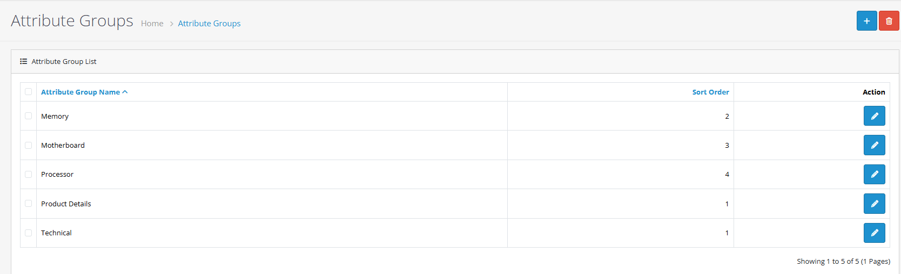
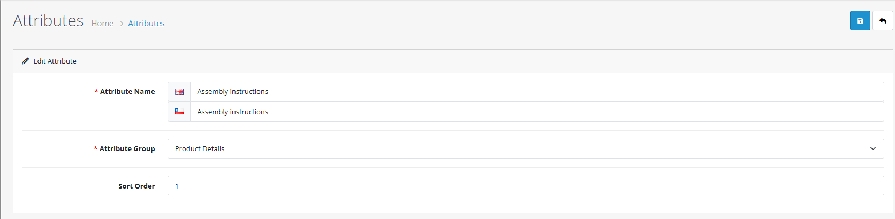
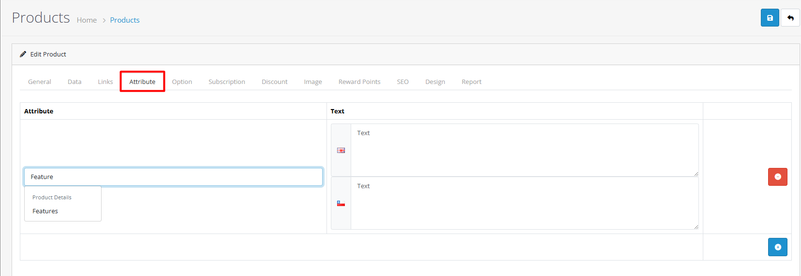

# Attributes

## Introduction

Product attributes in OpenCart 4 allow you to add detailed specifications and technical information to your products. Attributes help customers make informed purchasing decisions by providing comprehensive product details, specifications, and features.

## Video Tutorial



_Video: Attribute Management in OpenCart_

## Attribute System Overview

### Attribute Groups

Organize attributes into logical groups for better management:

**Common Attribute Groups:**

* **Technical Specifications**: Dimensions, weight, materials
* **Features & Benefits**: Key features, performance data
* **Compatibility**: System requirements, compatible products
* **Care & Maintenance**: Cleaning instructions, warranty information
* **Environmental**: Eco-friendly features, certifications

### Individual Attributes

Create specific attributes within groups:

**Attribute Configuration:**

* **Attribute Name**: Descriptive name (e.g., "Material", "Dimensions")
* **Attribute Group**: Assign to appropriate group
* **Sort Order**: Control display sequence
* **Multi-language Support**: Translate attribute names and values

## Creating Attributes



#### Step 1: Create Attribute Groups

1. **Navigate to Catalog → Attribute Groups**
2. **Click "Add New"**
3. **Configure group details**
4. **Set sort order for organization**

**Group Configuration**

| Field                    | Description              | Required | Example                                |
| ------------------------ | ------------------------ | -------- | -------------------------------------- |
| **Attribute Group Name** | Descriptive group name   | Yes      | "Technical Specifications", "Features" |
| **Sort Order**           | Display sequence control | No       | 1, 2, 3                                |

**Group Best Practices:**

* Use descriptive group names
* Organize by product type or category
* Maintain consistent naming conventions
* Consider customer information needs


**Group Strategy:** Create logical attribute groups that match how customers search for product information.




#### Step 2: Create Individual Attributes

1. **Navigate to Catalog → Attributes**
2. **Click "Add New"**
3. **Configure attribute details**
4. **Assign to appropriate group**

**Attribute Configuration**

| Field               | Description              | Required | Example                              |
| ------------------- | ------------------------ | -------- | ------------------------------------ |
| **Attribute Name**  | Clear, descriptive name  | Yes      | "Material", "Dimensions", "Warranty" |
| **Attribute Group** | Select appropriate group | Yes      | "Technical Specifications"           |
| **Sort Order**      | Control display sequence | No       | 1, 2, 3                              |

**Multi-language Support:**

* Translate attribute names for each language
* Provide localized attribute values
* Maintain consistency across languages


**Reusable Attributes:** Create attributes that can be used across multiple products for consistency.




#### Step 3: Assign to Products

1. **Edit product** in Catalog → Products
2. **Navigate to Attribute tab**
3. **Add attributes and values**

**Product Attribute Configuration**

| Setting       | Description               | Required |
| ------------- | ------------------------- | -------- |
| **Attribute** | Choose specific attribute | Yes      |
| **Text**      | Enter attribute value     | Yes      |

**Assignment Best Practices:**

* Assign relevant attributes to each product
* Use consistent values across similar products
* Include technical specifications and key features
* Consider customer decision-making factors


**Important:** Attributes must be assigned to products to appear on storefront. Creating attributes alone doesn't make them visible to customers.




## Common Attribute Types

<strong>Technical Specifications</strong>

#### Product Dimensions & Measurements

**Physical Specifications:**

* **Dimensions**: Length, width, height
* **Weight**: Product weight and capacity
* **Material**: Composition and materials used
* **Manufacturing**: Production details and origin

**Performance Data:**

* **Power Requirements**: Voltage, wattage, energy consumption
* **Speed & Capacity**: Performance metrics and limits
* **Compatibility**: System requirements and compatible products
* **Certifications**: Technical standards and certifications

**Technical Attribute Examples**

**Electronics:**

* Screen Size: 15.6 inches
* Resolution: 1920x1080 Full HD
* Processor: Intel Core i7-1165G7
* Memory: 16GB DDR4
* Storage: 512GB NVMe SSD

**Furniture:**

* Dimensions: 120x80x75 cm
* Weight: 25 kg
* Material: Solid Oak Wood
* Assembly: Required


**Technical Accuracy:** Ensure all technical specifications are accurate and up-to-date to build customer trust.


<strong>Product Features</strong>

#### Key Features & Benefits

**Unique Selling Points:**

* **Innovation Features**: New technologies and capabilities
* **Performance Benefits**: Speed, efficiency, quality improvements
* **Quality Indicators**: Durability, reliability, craftsmanship
* **Design Elements**: Aesthetic and functional design features

**Usage Information:**

* **Intended Use**: Primary applications and scenarios
* **Target Audience**: Recommended user demographics
* **Environmental Conditions**: Operating temperature, humidity
* **Safety Considerations**: Important safety information

**Feature Attribute Examples**

**Smartphone Features:**

* Camera: 48MP Triple Camera System
* Display: 6.7" Super Retina XDR
* Battery: All-day battery life
* Security: Face ID recognition

**Home Appliance Features:**

* Energy Efficiency: A++ rating
* Smart Features: Wi-Fi connectivity
* Capacity: 8 kg washing capacity
* Programs: 15 automatic programs


**Feature Highlighting:** Use attributes to showcase the most compelling features that influence purchase decisions.


<strong>Care &#x26; Maintenance</strong>

#### Product Care Instructions

**Maintenance Guidelines:**

* **Cleaning Methods**: Recommended cleaning procedures
* **Storage Requirements**: Proper storage conditions
* **Maintenance Schedules**: Regular maintenance intervals
* **Repair Information**: Service and repair procedures

**Warranty & Support:**

* **Warranty Period**: Duration of warranty coverage
* **Coverage Terms**: What is included/excluded
* **Service Locations**: Authorized service centers
* **Claim Procedures**: How to make warranty claims

**Care Attribute Examples**

**Clothing Care:**

* Washing: Machine wash cold
* Drying: Tumble dry low
* Ironing: Medium heat
* Special Care: Do not bleach

**Electronics Care:**

* Cleaning: Use soft, dry cloth
* Storage: Keep in dry environment
* Service: Authorized service only
* Warranty: 2 years limited warranty


**Care Instructions:** Clear care and maintenance information helps customers use products properly and extends product lifespan.


## Best Practices


**Attribute Strategy**

* Plan attribute structure before implementation
* Use consistent terminology across products
* Consider customer information needs
* Document attribute standards



**Data Quality**

* Ensure attribute values are accurate
* Maintain consistent formatting
* Regular data validation
* Update attributes when products change



**Customer Experience**

* Use clear, customer-friendly language
* Include relevant technical details
* Provide helpful specifications
* Highlight key features prominently


## Real-world Examples

### Electronics Product Example



#### Step 1: Technical Specifications Setup

**Create Technical Specifications Group:**

1. **Navigate to Catalog → Attribute Groups**
2. **Create group**: "Technical Specifications"
3. **Set sort order**: 1

**Add Technical Attributes:**

* **Screen Size**: 15.6 inches
* **Resolution**: 1920x1080 Full HD
* **Processor**: Intel Core i7-1165G7
* **Memory**: 16GB DDR4
* **Storage**: 512GB NVMe SSD
* **Battery Life**: Up to 10 hours


**Technical Details:** Include all relevant specifications that help customers compare products and make informed decisions.




#### Step 2: Features Group Setup

**Create Features Group:**

1. **Navigate to Catalog → Attribute Groups**
2. **Create group**: "Features & Benefits"
3. **Set sort order**: 2

**Add Feature Attributes:**

* **Backlit Keyboard**: Yes
* **Fingerprint Reader**: Yes
* **Webcam**: 720p HD
* **Ports**: USB-C, HDMI, USB 3.0
* **Wireless**: Wi-Fi 6, Bluetooth 5.0


**Feature Highlighting:** Use features to showcase unique selling points and competitive advantages.




#### Step 3: Product Assignment

**Assign to Laptop Product:**

1. **Edit laptop product** in Catalog → Products
2. **Navigate to Attribute tab**
3. **Select "Technical Specifications" group**
4. **Add all technical attributes with values**
5. **Select "Features & Benefits" group**
6. **Add all feature attributes with values**

**Result:**

* Customers see comprehensive specifications
* Easy comparison with other products
* Enhanced product credibility
* Better purchase decisions


**Consistency:** Use the same attribute structure across similar products for easy customer comparison.




### Furniture Product Example



#### Step 1: Physical Specifications

**Create Dimensions Group:**

* **Group**: "Physical Specifications"
* **Attributes**:
  * Dimensions: 120x80x75 cm
  * Weight: 25 kg
  * Material: Solid Oak Wood
  * Assembly: Required


**Measurement Standards:** Use consistent measurement units across all furniture products.




#### Step 2: Care Instructions

**Create Care Group:**

* **Group**: "Care & Maintenance"
* **Attributes**:
  * Cleaning: Use soft, damp cloth
  * Protection: Use coasters for hot items
  * Maintenance: Apply wood polish annually
  * Warranty: 5 years limited warranty


**Customer Support:** Clear care instructions reduce customer support requests and improve satisfaction.




#### Step 3: Environmental Information

**Create Environmental Group:**

* **Group**: "Environmental & Sustainability"
* **Attributes**:
  * Material Source: Sustainably harvested
  * Finish: Water-based, non-toxic
  * Packaging: Recyclable materials
  * Certifications: FSC certified


**Environmental Claims:** Only include environmental attributes that are verifiable and accurate.




## Advanced Attribute Features

### Multi-language Support

Configure attributes for multiple languages:

* Translate attribute names
* Provide localized values
* Maintain consistency across languages
* Consider cultural differences

### Attribute Inheritance

For variant products:

* Master product defines common attributes
* Variants inherit attribute structure
* Customize specific attributes per variant
* Maintain consistency across variants

### Attribute Filtering

Use attributes for enhanced search:

* Enable attribute-based filtering
* Improve product discoverability
* Create advanced search options
* Enhance customer shopping experience

## Troubleshooting

<strong>Attributes Not Displaying</strong>

#### Problem: Attributes don't appear on product pages

**Diagnostic Steps:**

1. **Check Attribute Assignment**
   * Verify attributes are assigned to product in Attribute tab
   * Confirm attribute groups are properly configured
   * Check product status is "Enabled"
2. **Review Attribute Configuration**
   * Verify attributes exist in Catalog → Attributes
   * Check attribute groups are created and active
   * Confirm attribute values are entered
3. **System & Template Issues**
   * Clear system cache
   * Check theme compatibility
   * Verify template files are updated
   * Test with default OpenCart theme

**Quick Fixes:**

* Reassign attributes to product
* Clear browser and system cache
* Check attribute status in Catalog → Attributes


**Quick Check:** Go to Catalog → Attributes and verify the attributes exist. Then check the product's Attribute tab to confirm assignment.


<strong>Inconsistent Attribute Values</strong>

#### Problem: Attribute values vary across similar products

**Diagnostic Steps:**

1. **Attribute Standardization**
   * Review attribute naming conventions
   * Check for duplicate attribute definitions
   * Verify attribute group assignments
2. **Data Quality Issues**
   * Check for inconsistent value formats
   * Review measurement unit consistency
   * Verify attribute value accuracy
3. **Process Improvement**
   * Create attribute templates for product types
   * Implement attribute validation rules
   * Establish attribute management procedures

**Standardization Solutions:**

* Create attribute naming conventions
* Use consistent measurement units
* Implement attribute value templates
* Regular attribute data audits


**Data Consistency:** Inconsistent attributes confuse customers and reduce product comparability.


<strong>Performance Issues</strong>

#### Problem: Slow product pages with many attributes

**Performance Optimization:**

1. **Attribute Structure Optimization**
   * Limit attributes per product (recommended: 10-15 max)
   * Use efficient attribute grouping
   * Avoid unnecessary attribute duplication
2. **Database Optimization**
   * Monitor database query performance
   * Consider database indexing for attribute tables
   * Use caching for frequently accessed attributes
3. **Template & Theme Optimization**
   * Optimize attribute display in templates
   * Consider lazy loading for attribute sections
   * Review theme performance with many attributes

**Performance Guidelines:**

* **Small stores**: Up to 15 attributes per product
* **Medium stores**: Up to 10 attributes per product
* **Large stores**: Consider attribute prioritization


**Performance Tip:** Group related attributes together and use efficient attribute display methods to improve page load times.


<strong>Multi-language Attribute Issues</strong>

#### Problem: Attributes not displaying correctly in different languages

**Diagnostic Steps:**

1. **Language Configuration**
   * Verify multi-language support is enabled
   * Check attribute translations exist
   * Confirm language-specific attribute values
2. **Attribute Translation Issues**
   * Verify attribute names are translated
   * Check attribute value translations
   * Confirm translation completeness
3. **Display Configuration**
   * Check language-specific attribute display
   * Verify template language switching
   * Test attribute display in all languages

**Quick Solutions:**

* Add missing attribute translations
* Clear language cache
* Test with different language settings


**Translation Quality:** Ensure attribute translations are accurate and culturally appropriate for each language.


## Next Steps

* [Learn about product options](/broken/pages/PSxHqzfAVUmCvJg8B3RC)
* [Explore product filters](/broken/pages/gfV1Vkce00HDQiBVGzot)
* [Understand product form tabs](/broken/pages/ppVKh3ctAf55cprlOM6c#attribute-tab)
* [Master product management](/broken/pages/EsE5SjFTCoY94AE9VHIB)
