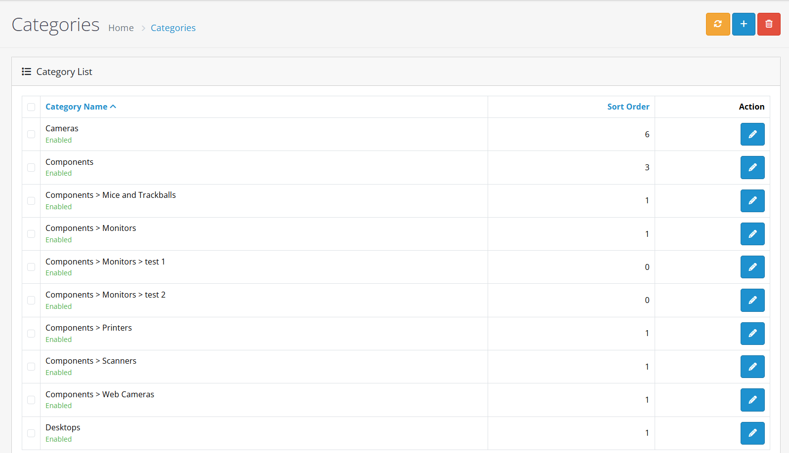
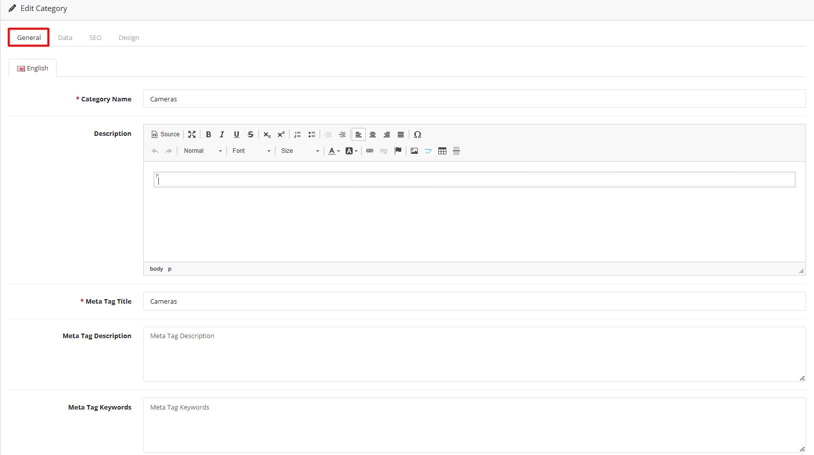
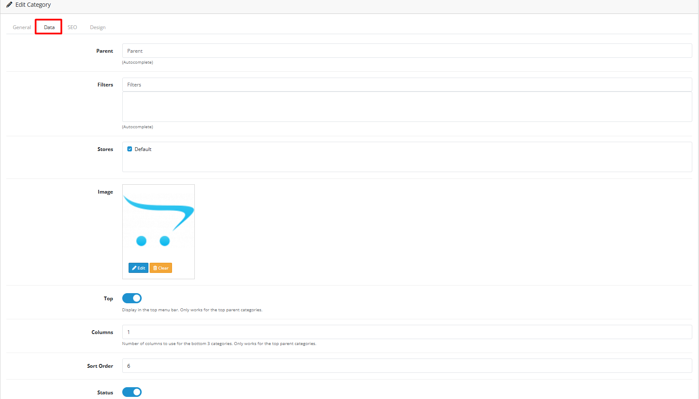
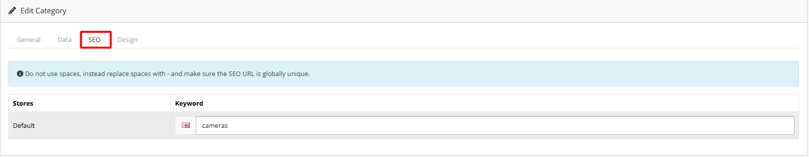
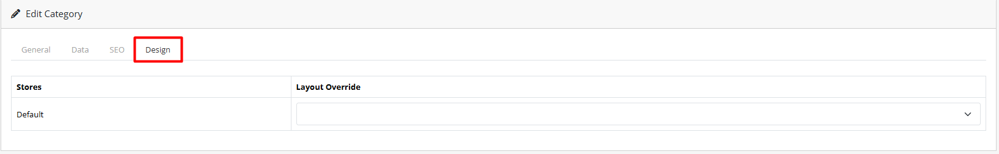

# Categories

## Video Tutorial



_Video: Category Management in OpenCart_

## Introduction

Categories are the primary way to organize products in your store. They help customers navigate your store and find products easily. Categories can be arranged in a hierarchical structure with parent and child categories.

## Category List



The category list displays all categories in your store. From here you can:

* **Add New Category**: Create a new category
* **Edit**: Modify existing categories
* **Delete**: Remove categories (products in deleted categories will become uncategorized)
* **Filter**: Search for specific categories


**Pro Tip**: Use the filter feature to quickly find specific categories when managing large catalogs with many categories.


## Creating/Editing Categories

When creating or editing a category, you'll work with four main tabs:





#### Category Name

* Enter the category name as it should appear to customers
* Required field
* Use clear, customer-friendly names

#### Description

* Detailed information about the category
* Rich text editor with formatting options
* Helps customers understand what products are in this category
* Include key benefits and product types

#### Meta Tag Title

* SEO-friendly title for search engines
* Appears in browser tabs and search results
* Should be descriptive and include relevant keywords
* Recommended length: 50-60 characters

#### Meta Tag Description

* Brief summary of the category for search engines
* Should be compelling and include primary keywords
* Limited to 150-160 characters for optimal display
* Include call-to-action when appropriate

#### Meta Tag Keywords

* Additional search terms for better findability
* Comma-separated list of relevant keywords
* Optional but recommended for SEO
* Focus on customer search terms


**SEO Tip**: Use descriptive meta tags that accurately represent your category content to improve search engine rankings.



**Content Quality**: Write compelling category descriptions that help customers understand what products are available and why they should browse this category.






#### Parent Category

* Select a parent category to create hierarchical structure
* Leave empty for top-level categories
* Categories can have unlimited child levels
* Use for logical product organization

#### Filters

* Apply filters to automatically categorize products
* Useful for dynamic category organization
* Helps organize products based on attributes

#### Stores

* Select which stores this category appears in
* For multi-store setups only
* Choose "All Stores" for universal availability

#### Category Image

* Main category image
* Upload or select from existing images
* Recommended size: 800x800px for optimal display
* Use high-quality, relevant images

#### Top Menu Display

* Display this category in the top menu
* Useful for important or frequently accessed categories
* Limit to key categories to avoid menu clutter

#### Column Layout

* Number of columns to display subcategories
* Default is 1, can be increased for better layout
* Consider screen size and mobile responsiveness

#### Sort Order

* Control the display order in category lists
* Lower numbers appear first
* Useful for organizing categories in menus
* Use consistent numbering across categories

#### Category Status

* Enable or disable the category
* Disabled categories won't appear in the store frontend
* Use for seasonal or temporary categories


**Best Practice**: Use parent categories to create logical hierarchies that help customers navigate your store more effectively.



**Menu Management**: Be selective about which categories appear in the top menu to maintain clean navigation and good user experience.






#### SEO Keyword Configuration

**SEO Keyword Purpose:**

* Create clean, search-engine-friendly URLs for your categories
* Improve search engine visibility and ranking
* Provide better user experience with readable URLs

**SEO Keyword Guidelines:**

| Setting         | Description                          | Best Practices                            |
| --------------- | ------------------------------------ | ----------------------------------------- |
| **SEO Keyword** | URL-friendly category identifier     | Use lowercase, hyphen-separated words     |
| **Uniqueness**  | Must be unique across all categories | Check for existing keywords before saving |
| **Format**      | Clean, readable format               | Avoid special characters and spaces       |

**SEO Keyword Examples:**


```
electronics
home-appliances
mens-clothing
womens-shoes
sports-equipment
```



```
Electronics (uppercase)
Home Appliances (spaces)
home_appliances (underscores)
category-1 (non-descriptive)
```


**Multi-language SEO:**

* Create language-specific SEO keywords
* Maintain consistent URL structure across languages
* Consider cultural differences in keyword usage


**SEO Best Practice:** Use descriptive, keyword-rich SEO keywords that accurately represent your category content to improve search engine rankings and user experience.



**Critical Warning:** SEO keywords must be unique across all categories. Duplicate keywords will cause URL conflicts and prevent proper category access.






#### Layout Override Configuration

**Layout Override Purpose:**

* Customize the appearance of individual category pages
* Create unique layouts for different types of categories
* Match category design to your store's branding

**Layout Override Options:**

| Setting            | Description                   | Use Cases                               |
| ------------------ | ----------------------------- | --------------------------------------- |
| **Default Layout** | Standard category page layout | Most categories, consistent design      |
| **Custom Layout**  | Pre-defined custom layout     | Featured categories, special promotions |
| **No Override**    | Use system default layout     | Standard category display               |

**Common Layout Override Scenarios:**

**Featured Categories:**

* Use special layouts for highlighted categories
* Create visually distinct category pages
* Showcase premium or seasonal categories

**Category-specific Designs:**

* Different layouts for different product types
* Custom designs for specific category groups
* Enhanced layouts for high-traffic categories

**Multi-store Layouts:**

* Different layouts for different store locations
* Store-specific category designs
* Regional layout variations


**Design Strategy:** Use layout overrides strategically to create visually appealing category pages that enhance user experience and drive conversions.



**Customization Tip**: Use layout overrides to create unique category pages that match your store's branding and design requirements. Test different layouts to find what works best for your categories.




## Best Practices

<details>

<summary><strong>Category Structure &#x26; Organization</strong></summary>

#### Category Hierarchy Best Practices

**Structure Guidelines:**

* **Limit Depth**: Maximum 2-3 category levels for optimal navigation
* **Logical Grouping**: Group related products together naturally
* **Clear Naming**: Use descriptive, customer-friendly category names
* **Avoid Duplication**: Ensure categories don't overlap unnecessarily

**Navigation Optimization:**

* **Top Menu Categories**: Select key categories for main navigation
* **Sort Order Strategy**: Use consistent numbering for menu organization
* **Mobile Considerations**: Ensure category structure works on mobile devices
* **Search Integration**: Categories should align with customer search patterns


**Structure Strategy:** A well-organized category structure helps customers find products quickly and improves overall shopping experience.


</details>

<details>

<summary><strong>SEO &#x26; Search Optimization</strong></summary>

#### SEO Best Practices

**Meta Information:**

* **Unique Meta Titles**: Each category should have distinct meta titles
* **Keyword-rich Descriptions**: Include relevant keywords naturally in descriptions
* **SEO-friendly URLs**: Use hyphens and avoid special characters in SEO keywords
* **Image Optimization**: Use descriptive alt text for category images

**Content Quality:**

* **Comprehensive Descriptions**: Provide detailed category information
* **Keyword Integration**: Naturally include primary and secondary keywords
* **Internal Linking**: Link to related categories and products
* **Fresh Content**: Regularly update category descriptions and images


**SEO Strategy:** Optimize each category for search engines while maintaining readability and user experience.


</details>

<details>

<summary><strong>User Experience &#x26; Design</strong></summary>

#### Customer Experience Best Practices

**Navigation & Display:**

* **Top Menu Selection**: Carefully choose which categories appear in top menu
* **Consistent Naming**: Maintain consistent naming conventions across categories
* **Clear Descriptions**: Help customers understand category contents and benefits
* **Visual Appeal**: Use high-quality, relevant category images

**Mobile Optimization:**

* **Responsive Design**: Ensure categories display well on mobile devices
* **Touch-friendly**: Make category navigation easy on touch screens
* **Fast Loading**: Optimize category pages for quick loading
* **Clear Hierarchy**: Maintain clear visual hierarchy on smaller screens


**UX Strategy:** Focus on creating intuitive category navigation that helps customers find what they need quickly and easily.


</details>

## Common Tasks



#### Creating a New Category

1. Navigate to **Catalog > Categories**
2. Click **Add New**
3. Fill in General tab information
4. Configure Data tab settings
5. Set up SEO keywords
6. Choose layout if needed
7. Click **Save**


**Quick Tip**: Save your work frequently to avoid losing changes.




#### Organizing Categories

1. Use parent categories for hierarchical organization
2. Set appropriate sort orders for menu display
3. Enable top menu display for important categories
4. Use filters for automatic product categorization


**Pro Tip**: Use sort orders to control the display sequence of categories in menus and listings.




#### Bulk Operations

* **Multiple deletion**: Select categories and click delete


**Caution**: Products in deleted categories will become uncategorized. Make sure to reassign them before deleting categories.




## Warnings and Limitations


#### Critical Warnings

* **Deleting categories**: Products in deleted categories become uncategorized
* **SEO keyword conflicts**: Ensure SEO keywords are unique
* **Performance**: Very deep category hierarchies may impact performance
* **Menu limitations**: Too many top menu categories can clutter navigation


## Troubleshooting

<details>

<summary><strong>Category Not Appearing</strong></summary>

#### Problem: Category doesn't show up in storefront

**Diagnostic Steps:**

1. **Category Status Check**
   * Verify category status is set to "Enabled"
   * Check if category is temporarily disabled
   * Confirm category hasn't been accidentally deleted
2. **Store Assignment Issues**
   * Verify category is assigned to correct stores in multi-store setups
   * Check "All Stores" option if category should be universal
   * Confirm store-specific assignments are correct
3. **Parent Category Issues**
   * Ensure parent category is enabled and active
   * Check parent category store assignments
   * Verify parent category hierarchy is correct

**Quick Solutions:**

* Re-save category with correct status and assignments
* Clear system and browser cache
* Test with default OpenCart theme


**Quick Check:** Go to Catalog → Categories and verify the category exists, is enabled, and has proper store assignments.


</details>

<details>

<summary><strong>SEO &#x26; URL Issues</strong></summary>

#### Problem: SEO problems or URL conflicts

**Diagnostic Steps:**

1. **SEO Keyword Conflicts**
   * Verify SEO keywords are unique across all categories
   * Check for duplicate SEO keywords
   * Ensure no special characters in SEO keywords
2. **URL Format Issues**
   * Check for spaces or invalid characters in URLs
   * Verify URL structure follows best practices
   * Test URL accessibility
3. **Meta Tag Problems**
   * Verify meta titles and descriptions are properly formatted
   * Check for duplicate meta information
   * Ensure meta tags follow SEO guidelines

**Quick Solutions:**

* Update SEO keywords to be unique and properly formatted
* Clear SEO cache and regenerate URLs
* Test URLs in different browsers


**SEO Validation:** Always test category URLs after making SEO changes to ensure they work correctly.


</details>

<details>

<summary><strong>Display &#x26; Layout Problems</strong></summary>

#### Problem: Category display issues or layout problems

**Diagnostic Steps:**

1. **Subcategory Display Issues**
   * Check column settings for subcategory display
   * Verify subcategory status and assignments
   * Test different column configurations
2. **Image Problems**
   * Verify category image sizes and formats
   * Check image upload permissions
   * Test image display on different devices
3. **Layout Override Issues**
   * Test layout overrides for compatibility
   * Verify custom layout assignments
   * Check theme compatibility with layout changes

**Quick Solutions:**

* Re-upload category images with proper sizing
* Reset layout overrides to default settings
* Test with default theme to isolate issues


**Display Testing:** Always test category display on multiple devices and browsers to ensure consistent appearance.


</details>

> "Well-organized categories are the foundation of a successful e-commerce store. Take the time to structure your categories logically and your customers will thank you with better navigation and higher conversion rates." — _OpenCart Documentation Team_
