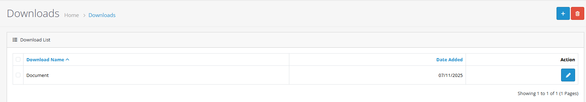
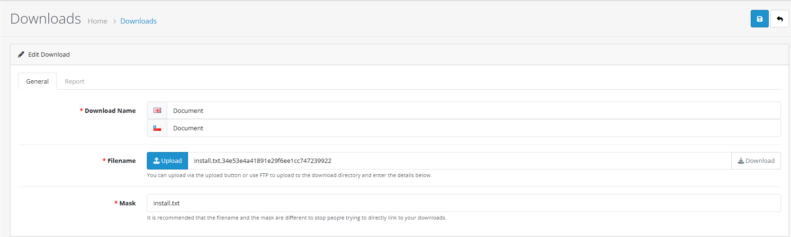
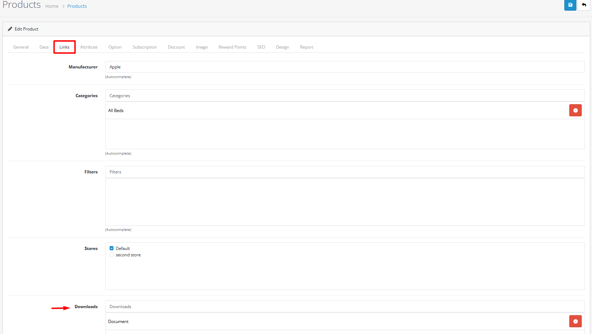
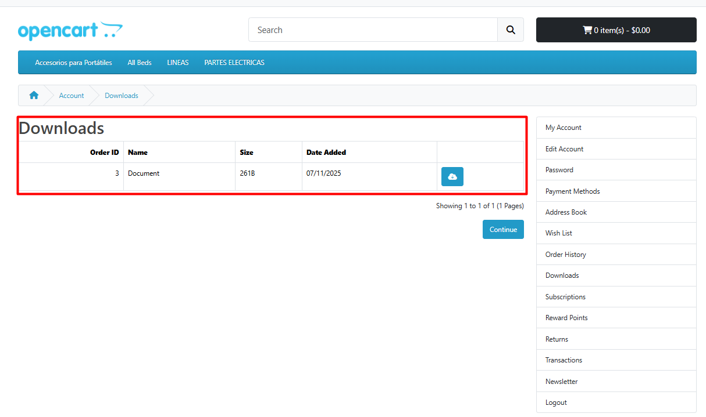

# Downloads

## Introduction

Downloads in OpenCart allow you to sell digital products like software, e-books, music, videos, and other digital files. This feature provides secure file delivery.

## Video Tutorial



_Video: Download Management in OpenCart_


**Digital Product Benefits**

* Sell software, e-books, music, videos, and digital content
* Automatic file delivery after purchase
* Secure file access with customer authentication
* No shipping costs for digital products


## Accessing Downloads

To access the downloads section:



#### Step 1: Navigate to Admin Panel

Log in to your OpenCart admin dashboard and go to **Catalog** → **Downloads**



#### Step 2: View Download List

You'll see a list of existing downloads with options to add new ones



## Complete Download Management Workflow

#### Step 1: Access Download Section

1. Go to **Catalog → Downloads**
2. Click the **"Add New"** button


**Quick Access:** You can also create downloads directly from the product edit form under the **Download** tab.


#### Step 2: Fill Download Details

Complete the download information form:

| Field             | Description                                       | Required |
| ----------------- | ------------------------------------------------- | -------- |
| **Download Name** | Name that identifies the download to customers    | Yes      |
| **Filename**      | The actual file name (auto-generated from upload) | Auto     |
| **Mask**          | Display name for the download file                | Yes      |


**Form Completion Tips:**

* Use clear, descriptive download names
* Choose meaningful mask names for customer display
* Consider multi-language translations if needed
* Use consistent naming conventions across downloads


#### Step 3: Upload Download File

Add the digital file:

* Click the **Upload** button
* Select the file from your computer
* Supported file types: PDF, ZIP, EXE, MP3, MP4, etc.
* Maximum file size: Configured in server settings


**File Upload Best Practices:**

* Compress large files using ZIP format
* Optimize images and videos for web delivery
* Use descriptive file names without spaces
* Test downloads before making them available
* Monitor file storage usage regularly


### Step 4: Save Download

Click **Save** to create the download


**Success Checklist:**

* Verify download appears in downloads list
* Check file upload completed successfully
* Test download functionality before product assignment


## Managing Existing Downloads

### Editing Downloads

1. From the downloads list, click the **Edit** button for any download
2. Update file or other settings
3. Click **Save** to apply changes


**Edit Best Practices:**

* Update download files when new versions are available
* Monitor download usage statistics
* Keep download descriptions current and accurate


### Deleting Downloads


**Important**: Deleting a download will remove it from all associated products. Customers who purchased products with this download will lose access.


1. From the downloads list, click the **Delete** button
2. Confirm the deletion in the popup dialog
3. The download file and all associations will be permanently removed

## Download File Management

### Supported File Types

OpenCart supports various digital file formats:

| File Type   | Common Uses                       | Size Considerations               |
| ----------- | --------------------------------- | --------------------------------- |
| **PDF**     | E-books, manuals, documentation   | Optimize for web delivery         |
| **ZIP**     | Software packages, multiple files | Compress large files              |
| **EXE**     | Windows software applications     | Include installation instructions |
| **MP3**     | Audio files, music, podcasts      | Consider streaming alternatives   |
| **MP4**     | Video files, tutorials, courses   | Optimize for web streaming        |
| **DOC/PPT** | Documents, presentations          | Consider PDF conversion           |
| **JPG/PNG** | Images, graphics, artwork         | Optimize for web viewing          |
| **TXT/CSV** | Data files, text documents        | Consider file encoding            |

### File Upload Best Practices


**File Management Tips**

* Compress large files using ZIP format
* Optimize images and videos for web delivery
* Use descriptive file names without spaces
* Test downloads before making them available
* Monitor file storage usage regularly
* Implement version control for updated files
* Use consistent naming conventions
* Backup download files regularly


## Product Association

### Linking Downloads to Products

To make downloads available for purchase:



#### Step 1: Edit Product

Navigate to **Catalog** → **Products** and edit the target product




#### Step 2: Go to Links Tab

In the product edit form, click the **Links** tab



#### Step 3: Add Download

Click **Add Download** and select from available downloads







## Customer Experience

### Download Access Workflow

Customer Download Process

**After Purchase**

1. Customer completes purchase of product with download
2. Order status must be "Complete" for download access
3. Customer receives email with download instructions

**Accessing Downloads**

1. Customer logs into their account
2. Navigates to **Order History** or **Downloads** section
3. Clicks download link for the purchased file
4. File downloads to their device

### Email Notifications

OpenCart automatically sends download instructions:

* Order confirmation email includes download links
* Customers receive clear download instructions


**Customer Communication Tips:**

* Provide clear download instructions in confirmation emails
* Include technical requirements for software downloads
* Offer customer support contact for download issues
* Provide alternative download methods if needed


## Troubleshooting

Common Download Issues

#### File Upload Problems

* Check file size limits in server configuration
* Verify file permissions for upload directory
* Ensure file type is supported
* Test with different browsers
* Check server upload configuration
* Verify PHP upload settings

#### Download Access Issues

* Verify order status is "Complete"
* Verify customer is logged in
* Verify download file exists

#### Performance Issues

* Optimize large files for faster downloads
* Implement CDN for large download files
* Monitor server bandwidth usage
* Consider file compression options
* Check server resource limits
* Optimize download delivery method

#### Security Concerns

* Monitor for unauthorized download attempts
* Regularly update download file security
* Backup download files regularly
* Check download link security
* Monitor download logs for suspicious activity


**Troubleshooting Tips:**

* Test downloads from customer perspective
* Check server error logs for download issues
* Verify file permissions and ownership
* Test download functionality after updates
* Monitor download success rates
* Keep download files updated and secure


## Best Practices


**Digital Product Management Tips**

* Test all downloads before making them available
* Provide clear download instructions to customers
* Monitor download statistics and patterns
* Keep download files updated and secure
* Offer customer support for download issues
* Implement download version control
* Use descriptive file names and descriptions
* Monitor download performance metrics


### Customer Support

* Provide clear download instructions
* Offer technical support for download issues
* Monitor customer download success rates
* Collect feedback on download experience
* Create download troubleshooting guides
* Offer alternative download methods
* Provide download status updates

## Practical Example: E-book Download Setup

Let's walk through a complete example of setting up an e-book download for a digital store:



#### Step 1: Create Download

1. Go to **Catalog → Downloads**
2. Click **Add New**
3. Set **Download Name**: "Complete Guide to Digital Marketing"
4. Set **Mask**: "digital-marketing-guide.pdf"
5. Set **Description**: "Comprehensive guide covering SEO, social media, and content marketing strategies"



#### Step 2: Upload E-book File

1. Click the **Upload** button
2. Select the PDF file "digital-marketing-guide.pdf"
3. Verify file upload completes successfully
4. Check file size and format compatibility



#### Step 3: Assign to Product

1. Go to **Catalog → Products**
2. Edit "Digital Marketing Guide" product
3. Go to **Download** tab
4. Add the "Complete Guide to Digital Marketing" download



#### Step 4: Test Download Process

1. Purchase the product as a test customer
2. Verify download appears in order confirmation
3. Test download functionality
4. Monitor download performance



## Related Documentation


**Continue Learning:**

* [Learn about product management](https://github.com/wilsonatb/docs-oc-new/blob/main/admin-interface/products/README.md) - Master product creation and download associations
* [Explore order processing](https://github.com/wilsonatb/docs-oc-new/blob/main/sales/orders/README.md) - Understand order status and download availability

