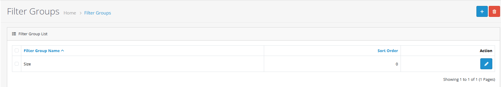
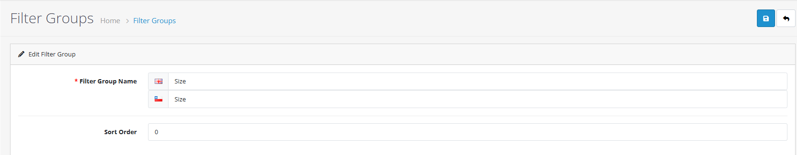
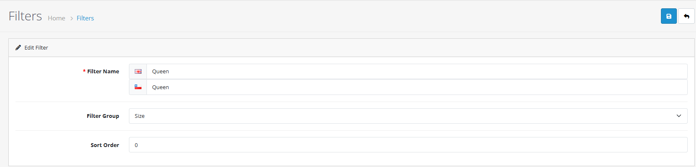
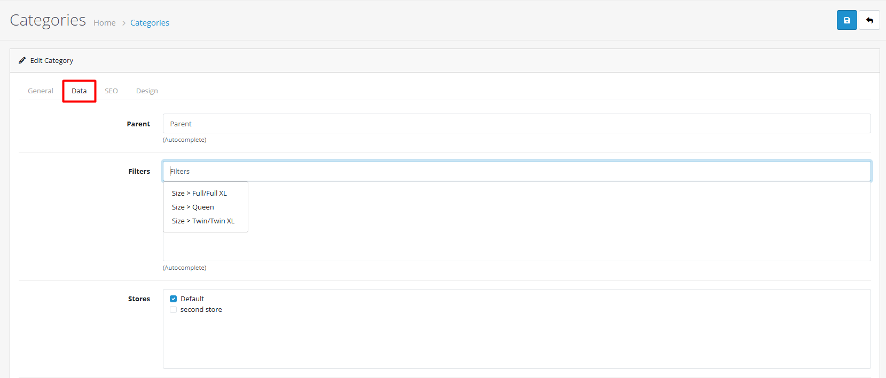
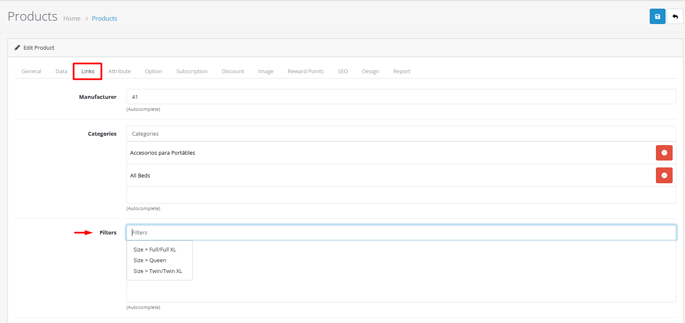
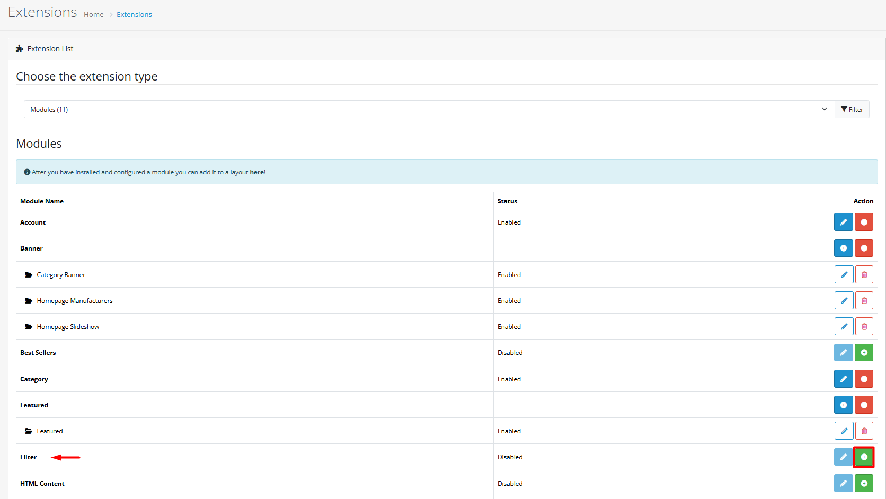

# Filters

## Introduction

Product filters in OpenCart 4 enhance the shopping experience by allowing customers to narrow down product selections based on specific criteria. Filters help customers find exactly what they're looking for quickly and efficiently.

## Video Tutorial



_Video: Filter Management in OpenCart_

## Complete Filter Workflow



#### Step 1: Create Filter Groups

1. Go to **Catalog → Filter Groups**
2. Click the **"Add New"** button

**Configure Filter Group**

| Field                 | Description                                                  | Required |
| --------------------- | ------------------------------------------------------------ | -------- |
| **Filter Group Name** | Name of the filter group (e.g., "Colors", "Sizes", "Brands") | Yes      |
| **Sort Order**        | Controls the display order of filter groups on storefront    | No       |


**Best Practices for Filter Groups:**

* Use clear, descriptive group names
* Organize by customer search patterns
* Maintain consistent naming conventions
* Consider mobile display limitations


**Common Filter Groups:**

* **Size Filters**: Clothing sizes, dimensions
* **Color Filters**: Product colors, finishes
* **Brand Filters**: Manufacturer or brand
* **Feature Filters**: Specific product features
* **Price Range**: Budget-based filtering



#### Step 2: Create Individual Filters

1. Go to **Catalog → Filters**
2. Click the **"Add New"** button

**Configure Filter Values**

| Field            | Description                                             | Required |
| ---------------- | ------------------------------------------------------- | -------- |
| **Filter Name**  | Name of the filter value (e.g., "Red", "Large", "Nike") | Yes      |
| **Filter Group** | Select the appropriate filter group                     | Yes      |
| **Sort Order**   | Controls the display order within the filter group      | No       |


**Filter Configuration Tips:**

* Use clear, descriptive filter names
* Assign to appropriate filter groups
* Set logical sort orders for better user experience
* Add multi-language translations if needed


**Example Filter Values:**

* **Colors**: Red, Blue, Green, Black, White
* **Sizes**: XS, S, M, L, XL, XXL
* **Brands**: Nike, Adidas, Apple, Samsung



#### Step 3: Assign to Categories

1. Go to **Catalog → Categories**
2. Edit the category where filters should appear
3. Navigate to the **Data** tab
4. Find the **Filters** field

**Add Filters to Category**

1. Click in the **Filters** field
2. Select the filters you want to appear for this category
3. Click **Save** to apply changes


**Category Filter Strategy:**

* Assign relevant filters to each category
* Consider category-specific filter needs
* Avoid overwhelming customers with too many filters
* Test filter combinations for effectiveness


**Example:** For a "Desktop Computers" category, you might assign:

* **Brand**: Dell, HP, Apple
* **Processor**: Intel i5, Intel i7, AMD Ryzen
* **RAM**: 8GB, 16GB, 32GB



#### Step 4: Assign to Products

1. Go to **Catalog → Products**
2. Edit the product you want to assign filters to
3. Navigate to the **Links** tab
4. Find the **Filters** field

**Add Filters to Product**

1. Click in the **Filters** field
2. Select the appropriate filters for this product
3. Click **Save** to apply changes


**Product Filter Assignment:**

* Assign all relevant filters to each product
* Ensure filter assignments match product attributes
* Use consistent filter assignments across similar products
* Verify filter combinations work correctly


**Example:** For a "Red Nike Running Shoes":

* **Color**: Red
* **Brand**: Nike
* **Type**: Running Shoes



#### Step 5: Enable Module

1. Go to **Extensions → Modules**
2. Find **Filters** in the module list
3. Click the **Install** button if not already installed
4. Click the **Edit** button to configure
5. **Status**: Set to **Enabled**


**Module Configuration Tips:**

* Enable the module for filters to appear on storefront
* Choose appropriate layout positions
* Test different positions for optimal user experience
* Consider mobile responsiveness




## Practical Example: Color Filters

Let's walk through a complete example of setting up color filters for a clothing store:



#### Step 1: Create Filter Group

1. Go to **Catalog → Filter Groups**
2. Click **Add New**
3. Set **Filter Group Name**: "Colors"
4. Set **Sort Order**: 1
5. Click **Save**



#### Step 2: Create Filter Values

1. Go to **Catalog → Filters**
2. Click **Add New**
3. Set **Filter Name**: "Red"
4. Select **Filter Group**: "Colors"
5. Set **Sort Order**: 1
6. Click **Save**

Repeat for other colors: Blue (Sort Order: 2), Green (Sort Order: 3), Black (Sort Order: 4), White (Sort Order: 5)



#### Step 3: Assign to Category

1. Go to **Catalog → Categories**
2. Edit "Clothing" category
3. Go to **Data** tab
4. In **Filters** field, select: Red, Blue, Green, Black, White
5. Click **Save**



#### Step 4: Assign to Products

1. Go to **Catalog → Products**
2. Edit a red t-shirt product
3. Go to **Links** tab
4. In **Filters** field, select: "Red"
5. Click **Save**



#### Step 5: Enable Module

Refer to **Step 5: Enable Module** in the [Complete Filter Workflow](filters.md#complete-filter-workflow) section above for detailed instructions on enabling the Filters module.


**Quick Steps:**

1. Go to **Extensions → Modules**
2. Find and enable the **Filters** module
3. Configure layout and position settings
4. Click **Save**




***

## Best Practices & Tips

<strong>Strategy &#x26; Planning</strong>

#### Filter Strategy


**Effective Filter Planning:**

* Analyze customer search behavior and common queries
* Use filters that match actual product attributes
* Limit number of filters to avoid overwhelming customers
* Test different filter combinations for effectiveness
* Consider seasonal or trending filter needs


**Recommended Filter Count:**

* **Small stores**: 3-5 filter groups
* **Medium stores**: 5-8 filter groups
* **Large stores**: 8-12 filter groups

**Filter Group Organization:**

* Group related filters together
* Use logical naming conventions
* Consider mobile-first design
* Test on different screen sizes

<strong>Performance Optimization</strong>

#### Performance Optimization


**Performance Considerations:**

* Monitor filter performance with large product catalogs
* Use efficient filter combinations to reduce database queries
* Consider database indexing for filter-related tables
* Implement filter caching for frequently used combinations
* Test filter response times under load


**Performance Tips:**

* Avoid using too many filters on the same page
* Use category-specific filters to reduce options
* Consider pagination for filter results
* Monitor server resources during peak usage

<strong>User Experience</strong>

#### Customer Experience


**User Experience Best Practices:**

* Use clear, intuitive filter names that customers understand
* Group related filters together for logical navigation
* Provide visual indicators for active filters
* Include easy filter reset options
* Show result counts for each filter option


**UX Enhancements:**

* Use expandable filter sections for mobile
* Provide filter search functionality
* Show applied filters prominently
* Allow multiple filter selection
* Include filter breadcrumbs

<strong>Advanced Features</strong>

#### Advanced Configuration

**Multi-language Support**

Configure filters for multiple languages:

* Translate filter names for each language
* Provide localized filter values
* Maintain consistency across language versions
* Consider cultural filter preferences

**Category-specific Filters**

Assign filters to specific categories:

* Create category-appropriate filters
* Tailor filters to product types
* Enhance category navigation experience
* Improve search relevance

**Filter Display Options**

* Control filter display order with sort orders
* Use different filter layouts for different categories
* Implement conditional filter display
* Customize filter styling

***

## Troubleshooting Common Issues

<strong>Filters Not Working</strong>

#### Problem: Filters don't return expected results

**Solutions:**

1. **Verify filter assignments to products**
   * Check that products have correct filters assigned in Links tab
   * Ensure filter assignments match product attributes
2. **Check filter group configurations**
   * Verify filter groups are properly created
   * Confirm filters are assigned to correct groups
3. **Review product category assignments**
   * Ensure products are in categories with assigned filters
   * Check category filter assignments in Data tab
4. **Test filter combinations**
   * Try different filter combinations
   * Check for conflicting filter assignments


**Quick Check:** Go to a category page and verify that the filters module appears and shows the expected filter options.


<strong>Performance Issues</strong>

#### Problem: Filtering causes slow page loads

**Solutions:**

1. **Optimize filter combinations**
   * Reduce number of active filters
   * Use category-specific filters
2. **Review database indexing**
   * Check filter-related table indexes
   * Optimize database queries
3. **Consider filter caching**
   * Implement filter result caching
   * Use page caching for filter pages
4. **Monitor server performance**
   * Check server resources during filtering
   * Optimize hosting environment


**Performance Tip:** For stores with thousands of products, consider using fewer filters or implementing server-side optimizations.


<strong>Missing Filters</strong>

#### Problem: Expected filters don't appear

**Solutions:**

1. **Check filter group assignments**
   * Verify filters are assigned to groups
   * Confirm groups have active filters
2. **Verify product filter assignments**
   * Check that products have filters assigned
   * Ensure assignments are saved correctly
3. **Review category filter settings**
   * Confirm categories have filters assigned
   * Check category-specific filter settings
4. **Test filter display conditions**
   * Verify filters module is enabled
   * Check module layout and position settings


**Module Check:** Ensure the Filters module is installed, enabled, and assigned to the correct layout positions.


<strong>Module Issues</strong>

#### Problem: Filters module not appearing

**Solutions:**

1. **Module Installation**
   * Go to Extensions → Modules
   * Verify Filters module is installed
   * Install if missing
2. **Module Configuration**
   * Check module status is "Enabled"
   * Verify layout assignments
   * Confirm position settings
3. **Layout Settings**
   * Check layout assignments in Design → Layouts
   * Verify module is assigned to correct pages
   * Test different layout positions
4. **Permissions & Cache**
   * Clear system cache
   * Check user permissions
   * Verify file permissions

***

## Next Steps


**Continue Learning:**

* [Learn about product attributes](/broken/pages/VaRbGTCgrKznpxkew1Yd) - Understand how attributes differ from filters
* [Explore product options](/broken/pages/PSxHqzfAVUmCvJg8B3RC) - Configure product variants and choices
* [Understand product form tabs](/broken/pages/ppVKh3ctAf55cprlOM6c#links-tab) - Master the Links tab for filter assignments
* [Master product management](/broken/pages/EsE5SjFTCoY94AE9VHIB) - Complete guide to product administration

