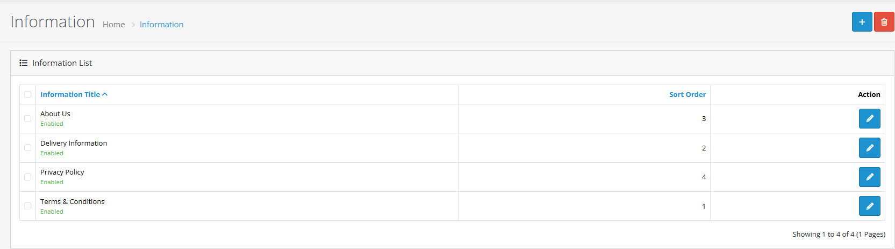
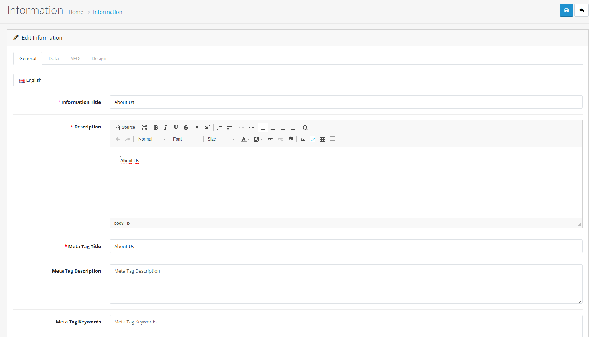
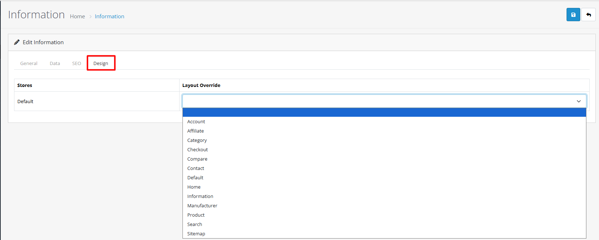
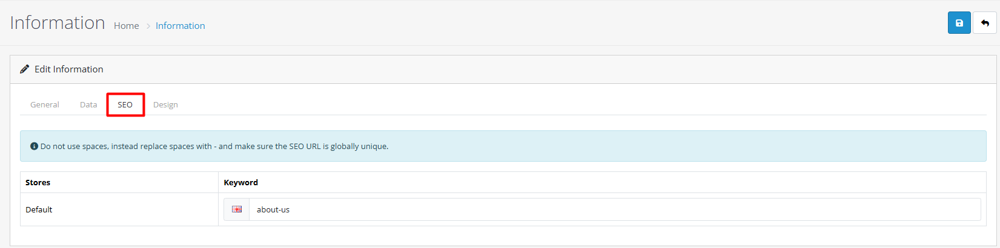

# Information

## Introduction

Information pages in OpenCart allow you to create and manage static content like About Us, Contact Information, Terms & Conditions, Privacy Policy, and other essential website pages. These pages are crucial for building trust and providing important information to your customers.

## Video Tutorial



_Video: Information Page Management in OpenCart_


**Information Page Benefits**

* Create essential legal and business pages
* Build customer trust with transparent information
* Improve SEO with optimized content pages
* Provide comprehensive store information
* Support multi-language content for global stores


## Accessing Information Pages

To access the information section:



#### Step 1: Navigate to Admin Panel

Log in to your OpenCart admin dashboard and go to **Catalog** → **Information**



#### Step 2: View Information List

You'll see a list of existing information pages with management options



## Complete Information Page Workflow



#### Step 1: Access Information Section

1. Go to **Catalog → Information**
2. Click the **"Add New"** button


**Quick Access:** Information pages can also be managed through the footer module settings in **Extensions → Modules**.




#### Step 2: Fill Page Details

Complete the information page form:

| Field                    | Description                                   | Required |
| ------------------------ | --------------------------------------------- | -------- |
| **Page Title**           | The main title of your information page       | Yes      |
| **Description**          | The main content of your page (supports HTML) | Yes      |
| **Meta Tag Title**       | SEO title for the page                        | Yes      |
| **Meta Tag Description** | SEO description for search engines            | No       |
| **Meta Tag Keywords**    | SEO keywords for better search visibility     | No       |


**Form Completion Tips:**

* Use clear, descriptive page titles
* Write comprehensive content with proper HTML formatting
* Include relevant keywords in meta tags
* Consider multi-language translations if needed




#### Step 3: Configure Data Settings

In the **Data** tab:

* Select which stores should display this information page
* Enable/disable page visibility
* Set sort order for page display in menus


**Multi-Store Strategy:**

* Assign information pages to specific stores for targeted content
* Create store-specific legal pages for regional compliance
* Differentiate brand messaging between stores
* Maintain consistent essential pages across all stores




#### Step 4: Set Display Options

In the **Design** tab:

* Choose page layout template


**Design Best Practices:**

* Use consistent layouts across information pages
* Consider mobile-responsive design
* Maintain brand consistency in styling
* Test different layout options




#### Step 5: Configure SEO URL

In the **SEO** tab:

* Set friendly URL for the page (e.g., /about-us)
* Ensure URL is unique and descriptive
* Follow SEO best practices for URL structure


**SEO URL Tips:**

* Use lowercase letters and hyphens
* Keep URLs short and descriptive
* Include primary keywords
* Avoid special characters and spaces
* Test URL accessibility




#### Step 6: Save Information Page

Click **Save** to create the information page


**Success Checklist:**

* Verify page appears in information list
* Check page loads correctly on storefront
* Confirm SEO meta tags are working
* Test page accessibility and mobile responsiveness




## Managing Existing Information Pages

### Editing Information Pages

1. From the information list, click the **Edit** button for any page
2. Update content, settings, or SEO information
3. Click **Save** to apply changes

### Deleting Information Pages


**Important**: Deleting an information page will remove it from all menus and store front. Customers will see 404 errors if they try to access deleted pages.


1. From the information list, click the **Delete** button
2. Confirm the deletion in the popup dialog
3. The information page will be permanently removed

## Essential Information Pages

### Must-Have Pages for Every Store

Essential Business Pages

**About Us**

* Company history and mission
* Team information and photos
* Business values and philosophy
* Contact information

**Contact Us**

* Physical address (if applicable)
* Phone numbers and email
* Contact form integration
* Business hours
* Map and directions

**Terms & Conditions**

* Purchase terms and conditions
* Return and refund policies
* Shipping information
* Legal disclaimers
* User agreement

**Privacy Policy**

* Data collection practices
* Cookie usage information
* Customer data protection
* Third-party sharing policies
* GDPR/CCPA compliance

**Shipping Information**

* Shipping methods and carriers
* Delivery timeframes
* Shipping costs and calculations
* International shipping options
* Tracking information

**Returns & Refunds**

* Return policy details
* Refund process and timelines
* Condition requirements for returns
* Return shipping instructions
* Exchange options

## SEO Optimization for Information Pages

Information pages are excellent for SEO. Follow these best practices:


**SEO Best Practices**

* Use descriptive, keyword-rich page titles
* Write comprehensive content (300-1000 words)
* Optimize meta tags with relevant keywords
* Use proper heading structure (H1, H2, H3)
* Include internal links to related products/pages
* Ensure fast loading times


### Meta Tag Optimization

| Meta Tag        | Best Practice                   | Example                                                                                    |
| --------------- | ------------------------------- | ------------------------------------------------------------------------------------------ |
| **Title**       | Include primary keyword + brand | "About Our Company - \[Store Name]"                                                        |
| **Description** | 150-160 character summary       | "Learn about \[Store Name]'s mission, team, and commitment to quality products since 2010" |
| **Keywords**    | 3-5 relevant keywords           | "about us, company history, our team, mission"                                             |

## Multi-Language Support

### Creating Multi-Language Content

OpenCart supports information pages in multiple languages:



#### Step 1: Enable Languages

Go to **System** → **Localisation** → **Languages** and enable required languages



#### Step 2: Create Language Versions

When editing an information page, switch between language tabs



#### Step 3: Translate Content

Add translated titles, descriptions, and meta tags for each language



#### Step 4: Configure SEO URLs

Set language-specific SEO URLs for each version



### Language-Specific Best Practices

* Maintain consistent messaging across languages
* Consider cultural differences in content
* Use native speakers for translation when possible
* Test all language versions thoroughly

## Store Front Integration

### Footer Menu Configuration

Information pages typically appear in the store footer:

Footer Menu Management

**Default Footer Links**

* About Us
* Delivery Information
* Privacy Policy
* Terms & Conditions
* Contact Us

**Customizing Footer**

* Edit footer module settings
* Reorder information page links
* Add custom information pages
* Configure which pages appear in footer

**Menu Display Options**

* Horizontal or vertical layout
* Link grouping and organization
* Mobile-responsive footer design
* Accessibility considerations

### Custom Menu Integration

Information pages can also be added to:

* Main navigation menus
* Sidebar widgets
* Header links
* Quick access menus
* Mobile navigation

## Content Management Best Practices

### Writing Effective Information Pages


**Content Quality Guidelines**

* Write in clear, customer-friendly language
* Use proper formatting with headings and paragraphs
* Include relevant images and media when appropriate
* Keep content updated and accurate
* Proofread for spelling and grammar


### Legal Compliance

Legal Page Requirements

**Privacy Policy**

* Clearly state data collection practices
* Explain cookie usage and tracking
* Describe data protection measures
* Provide opt-out instructions
* Include contact for data requests

**Terms & Conditions**

* Define purchase and return policies
* Specify shipping and delivery terms
* Outline user responsibilities
* Include liability limitations
* State governing law and jurisdiction

**Regulatory Compliance**

* GDPR requirements for EU customers
* CCPA for California residents
* Industry-specific regulations
* Age restrictions if applicable
* Accessibility compliance

## Multi-Store Configuration

Information pages can be configured for specific stores in multi-store setups:

* Assign pages to specific stores only
* Create store-specific content and policies
* Differentiate brand messaging between stores
* Manage regional legal requirements

## Troubleshooting

Common Information Page Issues

#### Page Not Displaying

* Check if page is enabled in store settings
* Verify store assignment in multi-store setups
* Ensure page is included in footer or menu
* Check page status is "Enabled"

#### SEO URL Problems

* Verify SEO URL is unique and not conflicting
* Check URL contains only allowed characters
* Ensure URL follows proper structure
* Test URL accessibility

#### Content Display Issues

* Check HTML formatting in description field
* Verify images are properly linked
* Test responsive design on mobile devices
* Clear cache after content changes

#### Multi-Language Problems

* Verify all required languages are enabled
* Check language-specific content is complete
* Test language switching functionality
* Ensure SEO URLs work for all languages

## Performance Optimization

### Page Load Optimization

* Optimize images used in information pages
* Minimize HTML and CSS in content
* Use caching for static information pages
* Monitor page load times regularly

### Content Strategy

* Create compelling, engaging content
* Use storytelling in About Us pages
* Include customer testimonials when relevant
* Update content regularly to keep it fresh
* Use analytics to track page performance

## Best Practices


**Information Management Excellence**

* Keep all legal pages current and compliant
* Write engaging About Us content that builds trust
* Ensure contact information is always accurate
* Test all information pages on mobile devices
* Monitor page analytics for user engagement


### Regular Maintenance

* Review and update legal pages annually
* Check all links in information pages regularly
* Update team information when changes occur
* Monitor customer feedback on information pages
* Keep SEO content optimized and current

## Practical Example: About Us Page Creation

Let's walk through a complete example of creating an engaging About Us page for an electronics store:



#### Step 1: Create About Us Page

1. Go to **Catalog → Information**
2. Click **Add New**
3. Set **Page Title**: "About Our Company"
4. Set **Description**: Add compelling content about your company history, mission, team, and values using HTML formatting
5. Set **Meta Tag Title**: "About Our Electronics Store - Quality Products Since 2010"
6. Set **Meta Tag Description**: "Learn about our commitment to quality electronics, customer service excellence, and innovative technology solutions since 2010."
7. Set **Meta Tag Keywords**: "about us, company history, our team, electronics store"



#### Step 2: Configure Store Settings

1. Go to **Store** tab
2. Select all stores that should display this page
3. Set **Sort Order**: 1 (to appear first in footer menus)
4. Ensure page is **Enabled**



#### Step 3: Set SEO URL

1. Go to **SEO** tab
2. Set **SEO URL**: "about-us"
3. Verify URL is unique and descriptive
4. Test URL accessibility



#### Step 4: Add to Footer Menu

1. Go to **Extensions → Modules**
2. Find and edit **Footer** module
3. Ensure "About Our Company" is selected in information pages
4. Configure display order and styling
5. Click **Save**



#### Step 5: Verify Setup

1. Check page appears in storefront footer
2. Visit About Us page: `/about-us`
3. Verify content displays correctly
4. Test SEO meta tags in page source
5. Check mobile responsiveness


**Quick Verification:** Go to your storefront and check the footer menu. You should see "About Our Company" with proper formatting and content.




***

## Best Practices & Tips

<strong>Strategy &#x26; Planning</strong>

#### Information Page Strategy


**Effective Information Planning:**

* Research essential legal requirements for your industry
* Consider customer information needs and common questions
* Plan for seasonal or promotional information pages
* Balance between essential and optional information
* Monitor page performance and user engagement


**Recommended Information Pages:**

* **Essential**: About Us, Contact, Privacy Policy, Terms & Conditions
* **Recommended**: Shipping, Returns, FAQ, Size Guide
* **Optional**: Blog, Testimonials, Careers, Press

**Page Organization:**

* Use consistent naming conventions
* Group related pages in footer menus
* Consider user journey and navigation flow
* Use sort orders for priority pages

<strong>Performance Optimization</strong>

#### Performance Optimization


**Performance Considerations:**

* Optimize images used in information pages
* Consider lazy loading for image-heavy pages


<strong>User Experience</strong>

#### Customer Experience


**User Experience Best Practices:**

* Write clear, customer-friendly content
* Use proper formatting with headings and paragraphs
* Ensure pages are mobile-responsive
* Provide easy navigation between information pages
* Include contact information and support options


**UX Enhancements:**

* Create engaging About Us content with storytelling
* Include team photos and bios when relevant
* Add FAQ sections for common questions
* Provide clear contact forms and information

<strong>Advanced Features</strong>

#### Advanced Configuration

**Multi-language Support**

Configure information pages for multiple languages:

* Translate page titles, descriptions, and meta tags
* Provide localized content for different regions
* Maintain consistent messaging across languages
* Consider cultural differences in content

**Category-specific Information**

Organize information pages by customer needs:

* Create category-appropriate information pages
* Tailor content to specific product types
* Enhance customer navigation experience
* Improve search relevance

**Information Display Options**

* Control page display order with sort orders
* Use different layouts for different information types
* Implement conditional page display
* Customize page styling and branding

***

## Troubleshooting Common Issues

<strong>Page Not Displaying</strong>

#### Problem: Information page doesn't appear on storefront

**Solutions:**

1. **Check page status**
   * Verify page is enabled in admin panel
   * Check store assignments in multi-store setups
   * Ensure page is included in footer or menu modules
2. **Review module settings**
   * Confirm footer module includes the page
   * Check module status and layout assignments
   * Verify module store assignments
3. **Test page accessibility**
   * Visit page directly via SEO URL
   * Check for error messages or redirects
   * Verify page ID and URL are correct


**Quick Check:** Go to the information list in admin panel and verify the page exists and is enabled.


<strong>SEO URL Problems</strong>

#### Problem: SEO URLs not working or conflicting

**Solutions:**

1. **Verify URL uniqueness**
   * Check URL is not used by other pages or products
   * Ensure URL follows proper structure
   * Test URL accessibility
2. **Review URL settings**
   * Confirm SEO URL is properly configured
   * Check for special characters or spaces
   * Ensure URL is lowercase with hyphens
3. **Test URL functionality**
   * Clear cache and test URL
   * Check server rewrite rules
   * Verify .htaccess configuration


**URL Tip:** Use descriptive, keyword-rich URLs that are easy to remember and share.


<strong>Content Display Issues</strong>

#### Problem: Page content not displaying correctly

**Solutions:**

1. **Check HTML formatting**
   * Verify HTML is properly formatted in description field
   * Test different browsers and devices
   * Check for broken HTML tags
2. **Review image links**
   * Confirm images are properly linked
   * Check image file permissions
   * Ensure image URLs are correct
3. **Test responsive design**
   * Check mobile responsiveness
   * Test different screen sizes
   * Verify CSS compatibility

<strong>Multi-Language Problems</strong>

#### Problem: Language versions not working correctly

**Solutions:**

1. **Verify language setup**
   * Check all required languages are enabled
   * Confirm language-specific content is complete
   * Test language switching functionality
2. **Review SEO URLs**
   * Ensure SEO URLs work for all languages
   * Check for URL conflicts between languages
   * Test language-specific URL accessibility
3. **Test content consistency**
   * Verify messaging is consistent across languages
   * Check for translation errors
   * Ensure all language versions are accessible

***

## Next Steps


**Continue Learning:**

* [Learn about layout management](https://github.com/wilsonatb/docs-oc-new/blob/main/design/layouts/README.md) - Customize information page layouts
* [Explore multi-language setup](https://github.com/wilsonatb/docs-oc-new/blob/main/system/localisation/README.md) - Manage multiple language versions
* [Understand module configuration](https://github.com/wilsonatb/docs-oc-new/blob/main/extensions/modules/README.md) - Configure footer and menu displays

