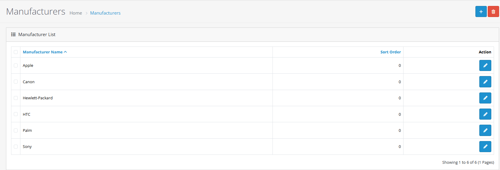
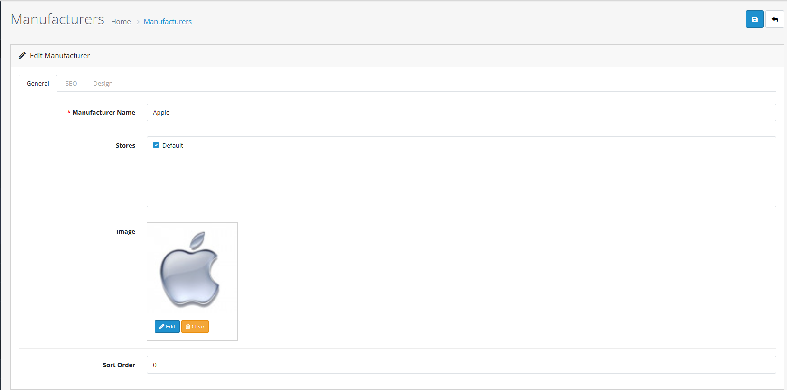
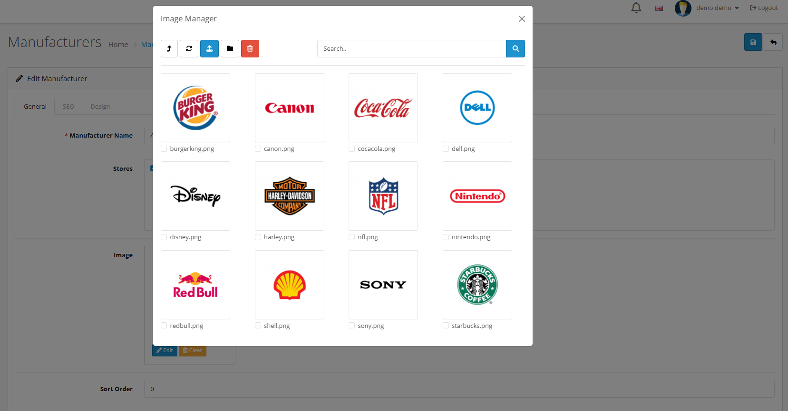

# Manufacturers

## Introduction

Manufacturers in OpenCart allow you to organize products by brand and enhance your store's navigation. This feature helps customers find products from their favorite brands and improves SEO through manufacturer-specific pages.

## Video Tutorial



_Video: Manufacturer Management in OpenCart_


**Manufacturer Benefits**

* Organize products by brand for better customer navigation
* Create manufacturer-specific landing pages with SEO optimization
* Support multi-store configurations for different brand strategies
* Enhance product discoverability through brand categorization


## Accessing Manufacturers

To access the manufacturers section:



#### Step 1: Navigate to Admin Panel

Log in to your OpenCart admin dashboard and go to **Catalog** → **Manufacturers**



#### Step 2: View Manufacturer List

You'll see a list of existing manufacturers with options to add new ones



## Complete Manufacturer Workflow



#### Step 1: Access Manufacturer Section

1. Go to **Catalog → Manufacturers**
2. Click the **"Add New"** button




#### Step 2: Fill Manufacturer Details

Complete the manufacturer information form:

| Field                    | Description                                     | Required |
| ------------------------ | ----------------------------------------------- | -------- |
| **Manufacturer Name**    | The brand name as it should appear to customers | Yes      |
| **Description**          | Detailed information about the manufacturer     | No       |
| **Meta Tag Title**       | SEO title for manufacturer page                 | Yes      |
| **Meta Tag Description** | SEO description for search engines              | No       |
| **Meta Tag Keywords**    | SEO keywords for better search visibility       | No       |


**Form Completion Tips:**

* Use consistent naming conventions across manufacturers
* Write comprehensive descriptions for SEO benefits
* Include relevant keywords in meta tags
* Consider multi-language translations if needed




#### Step 3: Upload Manufacturer Image

Add a manufacturer logo or brand image:

* Click the **Image** tab
* Use the image manager to upload or select a manufacturer logo
* Recommended size: 200x200 pixels for optimal display


**Image Best Practices:**

* Use high-quality, professional logos
* Maintain consistent image dimensions
* Optimize file size for faster loading
* Use PNG format for transparent backgrounds




#### Step 4: Configure Store Settings

In the **Store** tab:

* Select which stores should display this manufacturer
* Enable/disable manufacturer visibility


**Multi-Store Strategy:**

* Assign manufacturers to specific stores for targeted branding
* Create exclusive manufacturer partnerships per store
* Differentiate product offerings between stores
* Maintain consistent brand positioning




#### Step 5: Save Manufacturer

Click **Save** to create the manufacturer


**Success Checklist:**

* Verify manufacturer appears in the manufacturers list
* Check manufacturer page loads correctly on storefront
* Confirm SEO meta tags are working
* Test manufacturer links in product pages




## Managing Existing Manufacturers

### Editing Manufacturers

1. From the manufacturers list, click the **Edit** button for any manufacturer
2. Update any information in the form
3. Click **Save** to apply changes

### Deleting Manufacturers


**Important**: Deleting a manufacturer will remove it from all associated products. Products will still exist but will no longer be linked to this manufacturer.


1. From the manufacturers list, click the **Delete** button
2. Confirm the deletion in the popup dialog
3. The manufacturer will be permanently removed

## SEO Optimization for Manufacturers

Manufacturer pages are excellent for SEO. Follow these best practices:


**SEO Best Practices**

* Use descriptive manufacturer names that include relevant keywords
* Write comprehensive manufacturer descriptions (150-300 words)
* Optimize meta tags with manufacturer-specific keywords
* Include manufacturer logos for visual branding
* Ensure manufacturer pages load quickly


### Meta Tag Optimization

| Meta Tag        | Best Practice                        | Example                                                                     |
| --------------- | ------------------------------------ | --------------------------------------------------------------------------- |
| **Title**       | Include manufacturer name + category | "Apple Electronics - Official Store"                                        |
| **Description** | 150-160 character summary            | "Shop official Apple products including iPhones, MacBooks, and accessories" |
| **Keywords**    | 3-5 relevant keywords                | "apple, iphone, macbook, electronics, official"                             |

## Multi-Store Configuration

Manufacturers can be configured for specific stores in multi-store setups:

Multi-Store Manufacturer Management

#### Store-Specific Manufacturers

* Assign manufacturers to specific stores only
* Create exclusive brand partnerships per store
* Differentiate product offerings between stores

#### Configuration Steps

1. In manufacturer edit form, go to **Store** tab
2. Select which stores should display this manufacturer
3. Save changes for each store configuration

#### Benefits

* Targeted brand marketing per store
* Regional manufacturer partnerships
* Store-specific brand positioning

## Store Front Integration

### Manufacturer Pages on Store Front

Manufacturers automatically create dedicated pages on your store front:

* **URL Structure**: `/index.php?route=product/manufacturer&manufacturer_id=X`
* **Page Content**: Manufacturer description, logo, and associated products
* **Navigation**: Typically accessible via manufacturer links in product pages

### Customizing Manufacturer Display

Advanced Display Options

**Manufacturer Module**

* Add manufacturer logos to sidebar or footer
* Create manufacturer-specific banners
* Display manufacturer lists in custom positions

**Theme Customization**

* Modify manufacturer page templates
* Add custom CSS for brand styling
* Create manufacturer-specific layouts

**SEO URL Enhancement**

* Enable SEO URLs for manufacturer pages
* Customize manufacturer URL structure
* Add breadcrumb navigation

## Troubleshooting

Common Manufacturer Issues

#### Manufacturer Not Displaying

* Check if manufacturer is enabled in store settings
* Verify store assignment in multi-store setups
* Ensure manufacturer has at least one active product

#### Image Not Showing

* Verify image file exists and is accessible
* Check file permissions for uploaded images
* Ensure image format is supported (JPG, PNG, GIF)

#### SEO Issues

* Confirm meta tags are properly configured
* Check for duplicate manufacturer names
* Verify manufacturer pages are indexed in search engines

#### Product Association Problems

* Products must be manually assigned to manufacturers
* Check product edit forms for manufacturer selection
* Verify manufacturer exists before product assignment

## Best Practices


**Manufacturer Management Tips**

* Keep manufacturer names consistent and professional
* Use high-quality manufacturer logos for brand credibility
* Write detailed manufacturer descriptions for SEO benefits
* Regularly update manufacturer information as brands evolve
* Monitor manufacturer page performance in analytics


### Performance Optimization

* Compress manufacturer images for faster loading
* Use caching for manufacturer pages
* Optimize manufacturer database queries
* Monitor manufacturer page load times

### Content Strategy

* Create compelling manufacturer stories
* Highlight manufacturer certifications and awards
* Include manufacturer contact information when relevant
* Update manufacturer content regularly

## Practical Example: Apple Manufacturer Setup

Let's walk through a complete example of setting up Apple as a manufacturer for an electronics store:



#### Step 1: Create Manufacturer

1. Go to **Catalog → Manufacturers**
2. Click **Add New**
3. Set **Manufacturer Name**: "Apple"
4. Set **Description**: "Official Apple products including iPhones, MacBooks, iPads, and accessories. Premium quality and innovative technology."
5. Set **Meta Tag Title**: "Apple Electronics - Official Store"
6. Set **Meta Tag Description**: "Shop official Apple products including iPhones, MacBooks, iPads, and accessories with warranty and support."
7. Set **Meta Tag Keywords**: "apple, iphone, macbook, ipad, official, electronics"



#### Step 2: Upload Apple Logo

1. Click the **Image** tab
2. Upload the Apple logo image
3. Ensure logo is 200x200 pixels for optimal display
4. Use PNG format for transparent background



#### Step 3: Configure Store Settings

1. Go to **Store** tab
2. Select all stores that should carry Apple products
3. Set **Sort Order**: 1 (to appear first in manufacturer lists)
4. Ensure manufacturer is **Enabled**



#### Step 4: Assign to Products

1. Go to **Catalog → Products**
2. Edit Apple products (iPhone, MacBook, etc.)
3. In **Data** tab, select "Apple" from manufacturer dropdown
4. Click **Save** for each product



#### Step 5: Verify Setup

1. Check manufacturer appears in storefront manufacturer list
2. Visit Apple manufacturer page
3. Verify all Apple products appear on manufacturer page
4. Test SEO meta tags in page source


**Quick Verification:** Go to your storefront and navigate to the manufacturers section. You should see Apple with its logo and all associated products.




***

## Best Practices & Tips

<strong>Strategy &#x26; Planning</strong>

#### Manufacturer Strategy


**Effective Manufacturer Planning:**

* Research popular brands in your product categories
* Consider manufacturer reputation and customer preferences
* Plan for seasonal or trending manufacturers
* Balance between popular and niche brands
* Monitor manufacturer performance metrics


**Recommended Manufacturer Count:**

* **Small stores**: 5-10 manufacturers
* **Medium stores**: 10-25 manufacturers
* **Large stores**: 25-50+ manufacturers

**Manufacturer Organization:**

* Use consistent naming conventions
* Group related manufacturers by category
* Consider alphabetical sorting for large lists
* Use sort orders for priority manufacturers

<strong>Performance Optimization</strong>

#### Performance Optimization


**Performance Considerations:**

* Monitor manufacturer page load times with large product catalogs
* Optimize manufacturer image file sizes
* Use caching for manufacturer pages
* Consider database indexing for manufacturer-related queries
* Test manufacturer page performance under load


**Performance Tips:**

* Compress manufacturer logos for faster loading
* Use lazy loading for manufacturer images
* Implement manufacturer page caching
* Monitor server resources during peak usage
* Optimize manufacturer database queries

<strong>User Experience</strong>

#### Customer Experience


**User Experience Best Practices:**

* Use high-quality manufacturer logos for brand credibility
* Write compelling manufacturer descriptions
* Ensure manufacturer pages are mobile-responsive
* Provide clear navigation between manufacturers
* Include manufacturer contact information when relevant


**UX Enhancements:**

* Add manufacturer testimonials or certifications
* Include manufacturer social media links
* Provide manufacturer warranty information
* Show manufacturer product counts

<strong>Advanced Features</strong>

#### Advanced Configuration

**Multi-language Support**

Configure manufacturers for multiple languages:

* Translate manufacturer names and descriptions
* Provide localized manufacturer information
* Maintain consistent branding across languages
* Consider cultural manufacturer preferences

**Category-specific Manufacturers**

Organize manufacturers by product categories:

* Create category-appropriate manufacturer lists
* Tailor manufacturer selection to product types
* Enhance category navigation experience
* Improve search relevance

**Manufacturer Display Options**

* Control manufacturer display order with sort orders
* Use different manufacturer layouts for different categories
* Implement conditional manufacturer display
* Customize manufacturer page styling

***

## Troubleshooting Common Issues

<strong>Manufacturer Not Displaying</strong>

#### Problem: Manufacturer doesn't appear on storefront

**Solutions:**

1. **Check manufacturer status**
   * Verify manufacturer is enabled in admin panel
   * Check store assignments in multi-store setups
   * Ensure manufacturer has active products assigned
2. **Review product assignments**
   * Confirm products are assigned to this manufacturer
   * Check product status (enabled/disabled)
   * Verify product store assignments
3. **Test manufacturer page**
   * Visit manufacturer page directly via URL
   * Check for error messages or redirects
   * Verify manufacturer ID is correct


**Quick Check:** Go to the manufacturers list in admin panel and verify the manufacturer exists and is enabled.


<strong>Image Issues</strong>

#### Problem: Manufacturer logo not showing

**Solutions:**

1. **Verify image file**
   * Check image file exists and is accessible
   * Confirm file permissions are correct
   * Ensure image format is supported (JPG, PNG, GIF)
2. **Check image settings**
   * Verify image is assigned to manufacturer
   * Check image manager for file availability
   * Test different image sizes
3. **Review theme compatibility**
   * Check theme supports manufacturer images
   * Verify image display settings in theme
   * Test with default theme


**Image Tip:** Use PNG format for logos with transparent backgrounds and optimize file size for faster loading.


<strong>SEO Issues</strong>

#### Problem: Manufacturer pages not ranking in search engines

**Solutions:**

1. **Check meta tag configuration**
   * Verify meta tags are properly configured
   * Ensure unique meta titles and descriptions
   * Check for duplicate manufacturer names
2. **Review content quality**
   * Add comprehensive manufacturer descriptions
   * Include relevant keywords naturally
   * Ensure content is original and valuable
3. **Monitor indexing**
   * Check if manufacturer pages are indexed
   * Submit sitemap to search engines
   * Monitor search console for errors


**SEO Tip:** Manufacturer pages are excellent for long-tail keywords and brand-specific searches.


<strong>Product Association Problems</strong>

#### Problem: Products not linking to manufacturers correctly

**Solutions:**

1. **Verify product assignments**
   * Check manufacturer selection in product forms
   * Ensure product manufacturer assignments are saved
   * Verify product status (enabled/disabled)
2. **Review manufacturer settings**
   * Confirm manufacturer exists and is enabled
   * Check manufacturer store assignments
   * Verify manufacturer sort orders
3. **Test product pages**
   * Check manufacturer links on product pages
   * Verify manufacturer page loads correctly
   * Test manufacturer navigation

***

## Next Steps


**Continue Learning:**

* [Learn about product management](https://github.com/wilsonatb/docs-oc-new/blob/main/admin-interface/products/README.md) - Master product creation and assignment
* [Explore categories](https://github.com/wilsonatb/docs-oc-new/blob/main/admin-interface/categories/README.md) - Organize products within manufacturer categories
* [Understand multi-store setup](https://github.com/wilsonatb/docs-oc-new/blob/main/system/stores/README.md) - Manage manufacturers across multiple stores

