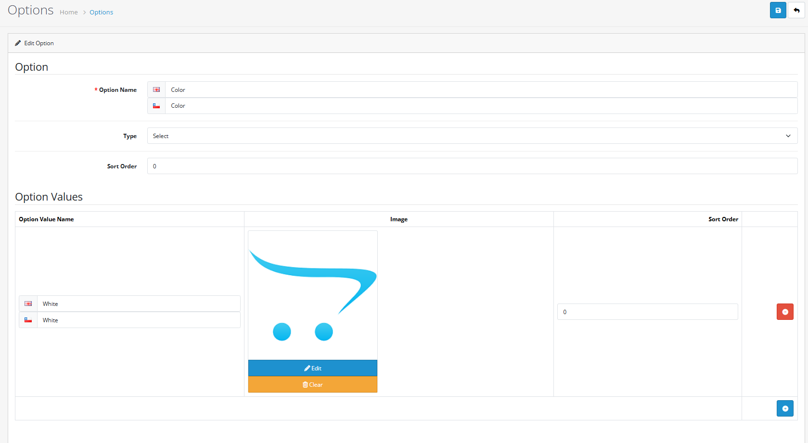
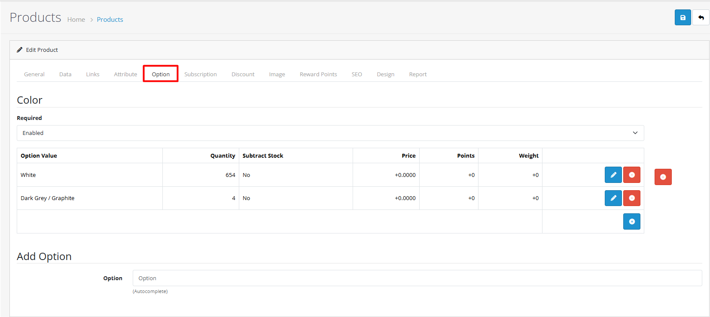

# Options

## Introduction

Product options in OpenCart 4 allow you to create customizable products with different choices for customers. Options enable you to offer variations like sizes, colors, materials, and customizations without creating separate product entries.

## Video Tutorial



_Video: Option Management in OpenCart_

## Option Types

OpenCart 4 supports multiple option types to accommodate different product scenarios:

| Option Type     | Description                   | Best For                               | Required | Multiple Selections |
| --------------- | ----------------------------- | -------------------------------------- | -------- | ------------------- |
| **Select**      | Dropdown menu with choices    | Sizes, colors, simple choices          | Yes/No   | No                  |
| **Radio**       | Single selection from options | Exclusive choices, required options    | Yes/No   | No                  |
| **Checkbox**    | Multiple selections allowed   | Add-ons, optional features             | No       | Yes                 |
| **Text**        | Single line text input        | Custom text, personalization           | Yes/No   | No                  |
| **Textarea**    | Multi-line text input         | Custom messages, detailed instructions | Yes/No   | No                  |
| **File**        | File upload                   | Custom designs, documents              | Yes/No   | No                  |
| **Date**        | Date selection                | Event dates, delivery dates            | Yes/No   | No                  |
| **Time**        | Time selection                | Appointment times, delivery windows    | Yes/No   | No                  |
| **Date & Time** | Combined date/time selection  | Event scheduling, appointments         | Yes/No   | No                  |

## Creating Options



#### Step 1: Access Option Management

1. **Navigate to Catalog → Options**
2. **Click "Add New"**
3. **Configure option details**


**Quick Access:** Options can also be created directly from the product form Option tab, but using the dedicated Options section provides better organization and reusability.




#### Step 2: Configure Option Details

**Basic Information**

| Field           | Description                     | Required | Example                       |
| --------------- | ------------------------------- | -------- | ----------------------------- |
| **Option Name** | Descriptive name for the option | Yes      | "Size", "Color", "Material"   |
| **Type**        | Select appropriate option type  | Yes      | Select, Radio, Checkbox, etc. |
| **Sort Order**  | Control display order in lists  | No       | 1, 2, 3                       |


**Configuration Tip:** Create reusable options that can be assigned to multiple products for consistent customer experience.




#### Step 3: Assign to Products

1. **Edit product** in Catalog → Products
2. **Navigate to Option tab**
3. **Add option** and configure product-specific settings
4. **Set required/optional status**

**Option Values Configuration**

| Value Field           | Description                    | Required | Example                   |
| --------------------- | ------------------------------ | -------- | ------------------------- |
| **Option Value**      | Specific choice name           | Yes      | "Small", "Red", "Premium" |
| **Price Adjustment**  | Additional cost for this value | No       | +$5.00, +10%, -$2.00      |
| **Weight Adjustment** | Shipping weight change         | No       | +0.2kg, -0.1kg            |
| **Reward Points**     | Loyalty points awarded         | No       | +100, -50                 |


**Important:** Options must be assigned to products to appear on storefront. Creating options alone doesn't make them visible to customers.




## Advanced Option Features

<strong>Price Adjustments</strong>

#### Price Adjustment Types

Configure different pricing for option values to reflect additional costs or discounts:

| Adjustment Type  | Description               | Use Case                   | Example                          |
| ---------------- | ------------------------- | -------------------------- | -------------------------------- |
| **Fixed Amount** | Add/subtract fixed amount | Standard price differences | Large (+$2.00), Premium (+$5.00) |
| **No Change**    | Keep base product price   | No additional cost         | Standard color, Basic model      |

**Price Adjustment Examples**

**Clothing Store:**

* Size: Small (-$2.00)
* Material: Premium Cotton (+$10)
* Color: No price adjustment

**Electronics Store:**

* Storage: 256GB (+$200)
* Color: Midnight (no change)
* Warranty: Extended (+$15)

<strong>Weight Adjustments</strong>

#### Shipping Weight Configuration

Set different weights for accurate shipping calculations:

| Adjustment Type     | Description              | Use Case                        | Example        |
| ------------------- | ------------------------ | ------------------------------- | -------------- |
| **Add Weight**      | Increase shipping weight | Heavier materials, larger sizes | +0.5kg, +1.2lb |
| **Subtract Weight** | Decrease shipping weight | Lighter alternatives            | -0.2kg, -0.5lb |
| **No Change**       | Keep base product weight | Standard options                | No adjustment  |

**Weight Adjustment Examples**

**Furniture Store:**

* Material: Solid Wood (+15kg)
* Finish: Standard (no change)
* Assembly: Pre-assembled (+5kg)

**Food Store:**

* Package Size: Family (+2kg)
* Container: Glass (+0.5kg)
* Gift Wrap: Premium (+0.1kg)


**Shipping Accuracy:** Accurate weight adjustments ensure correct shipping costs and prevent losses from undercharging.


<strong>Reward Points</strong>

#### Loyalty Program Configuration

Configure different reward points to incentivize specific options:

| Adjustment Type     | Description             | Use Case                    | Example       |
| ------------------- | ----------------------- | --------------------------- | ------------- |
| **Add Points**      | Award extra points      | Premium options, promotions | +100, +250    |
| **Subtract Points** | Reduce points awarded   | Economy options             | -50, -100     |
| **No Change**       | Use base product points | Standard options            | No adjustment |

**Reward Points Examples**

**Premium Products:**

* Material: Premium Leather (+200 points)
* Service: Priority Shipping (+50 points)
* Color: Standard (no change)

**Promotional Items:**

* Size: Large (+100 points)
* Style: Limited Edition (+150 points)
* Accessory: Included (+75 points)


**Customer Engagement:** Use reward points strategically to encourage upgrades and premium choices.


## Best Practices


**Option Organization**

* Use clear, descriptive option names
* Group related options together
* Maintain consistent naming conventions
* Document option configurations



**Performance Considerations**

* Limit the number of options per product
* Monitor database performance
* Consider product limits for optimal performance



**Customer Experience**

* Make required options clear to customers
* Use descriptive option value names
* Provide helpful option descriptions


## Real-world Examples

### Clothing Store Example



#### Step 1: Size Option Setup

**Configuration:**

* **Type**: Select (dropdown)
* **Required**: Yes
* **Values**: XS, S, M, L, XL
* **Price Adjustment**: None

**Implementation:**

1. Create option named "Size"
2. Set type to "Select"
3. Mark as required
4. Add values: XS, S, M, L, XL
5. No price adjustments for sizes


**Size Strategy:** Use consistent sizing across all clothing products for better customer experience.




#### Step 2: Color Option Setup

**Configuration:**

* **Type**: Select (dropdown)
* **Required**: Yes
* **Values**: Red, Blue, Green, Black, White
* **Price Adjustment**: None

**Implementation:**

1. Create option named "Color"
2. Set type to "Select"
3. Mark as required
4. Add color values
5. No price adjustments for colors


**Color Management:** Use descriptive color names that customers understand easily.




#### Step 3: Material Option Setup

**Configuration:**

* **Type**: Radio
* **Required**: No
* **Values**:
  * Standard Cotton (no price adjustment)
  * Premium Cotton (+$5.00)
  * Organic Cotton (+$8.00)

**Implementation:**

1. Create option named "Material"
2. Set type to "Radio"
3. Mark as optional
4. Add material values with price adjustments


**Price Transparency:** Clearly communicate material cost differences to customers.




#### Step 4: Product Assignment

**Assignment Process:**

1. Edit each clothing product
2. Navigate to Option tab
3. Add Size, Color, and Material options
4. Configure display order
5. Save product

**Resulting Variants:**

* Small, Red, Standard Cotton
* Medium, Blue, Premium Cotton
* Large, Green, Organic Cotton
* etc.



#### Step 5: Testing & Validation

**Quality Assurance:**

* Verify price calculations
* Check mobile display
* Validate required option enforcement

**Customer Experience:**

* Clear option descriptions
* Intuitive selection process
* Accurate pricing display
* Mobile-friendly interface



## Troubleshooting

<strong>Options Not Displaying</strong>

#### Problem: Options don't appear on product pages

**Diagnostic Steps:**

1. **Check Option Assignment**
   * Verify option is assigned to product in Option tab
   * Confirm option is not disabled
   * Check product status is "Enabled"
2. **Review Option Configuration**
   * Verify option has valid values
   * Check option type is properly set
   * Confirm required fields are completed
3. **System Configuration**
   * Check store cache is cleared
   * Verify template files are updated
   * Test on different browsers/devices

**Quick Fixes:**

* Reassign option to product
* Clear system cache
* Check option status in Catalog → Options


**Quick Check:** Go to Catalog → Options and verify the option exists and is enabled. Then check the product's Option tab to confirm assignment.


<strong>Price Calculations Incorrect</strong>

#### Problem: Option prices don't calculate correctly

**Diagnostic Steps:**

1. **Check Price Adjustments**
   * Verify price adjustment type
   * Check calculation method is correct
   * Review base product pricing
2. **Option Value Configuration**
   * Confirm option values have correct price settings
   * Check for conflicting price adjustments
   * Verify price prefix (+/-) is correct
3. **Tax & Currency Settings**
   * Check tax class assignments
   * Verify currency conversion settings
   * Review customer group pricing

**Common Issues:**

* Percentage calculations applied incorrectly
* Fixed amounts not adding to base price
* Tax calculations affecting option prices


**Price Testing:** Always test option combinations to verify total price calculations match expectations.


<strong>Performance Issues</strong>

#### Problem: Slow product pages with many options

**Performance Optimization:**

1. **Option Structure Optimization**
   * Limit options per product (recommended: 3-5 max)
   * Use efficient option types (Select vs Radio)
   * Avoid complex option combinations
2. **Database Optimization**
   * Monitor database query performance
   * Consider database indexing
   * Use caching for frequently accessed options
3. **Alternative Solutions**
   * Use product variants for complex combinations
   * Implement lazy loading for option values
   * Consider pagination for large option sets

**Performance Guidelines:**

* **Small stores**: Up to 5 options per product
* **Medium stores**: Up to 3 options per product
* **Large stores**: Consider variants for complex products


**Performance Tip:** For products with many variations, use the product variants feature instead of multiple options.


<strong>Option Validation Issues</strong>

#### Problem: Required options not enforcing selection

**Diagnostic Steps:**

1. **Option Configuration**
   * Verify "Required" setting is enabled
   * Check option is properly assigned to product
   * Confirm option values exist
2. **Template & Theme Issues**
   * Check theme compatibility with required options
   * Verify template files are updated
   * Test with default theme
3. **JavaScript & Validation**
   * Check browser console for JavaScript errors
   * Verify form validation is working
   * Test on different browsers

**Quick Solutions:**

* Re-save option with required setting
* Clear browser cache
* Test with default OpenCart theme


**Theme Compatibility:** Some custom themes may not properly handle required option validation. Test with the default theme first.


## Next Steps

* [Learn about product variants](/broken/pages/cFve5DSbS2azs3ngfQrF)
* [Explore product attributes](/broken/pages/VaRbGTCgrKznpxkew1Yd)
* [Understand product form tabs](/broken/pages/ppVKh3ctAf55cprlOM6c#option-tab)
* [Master product management](/broken/pages/EsE5SjFTCoY94AE9VHIB)
