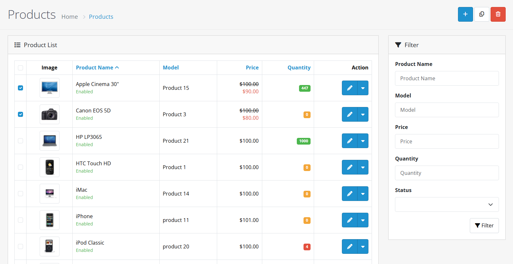

# Products

## Video Tutorial



_Video: Product Management in OpenCart_

## Introduction

Products are the foundation of your e-commerce store in OpenCart 4. This guide helps you understand the different types of products available and how to choose the right one for your business needs.

## Choosing the Right Product Type



#### Step 1: Analyze Your Product

Consider what type of product you're selling:

* **Physical goods** with no variations → Standard Product
* **Configurable items** with options → Variant Product
* **Recurring services** → Subscription Product


**Quick Decision Guide:**

* Single item, fixed price? → Standard Product
* Multiple sizes/colors? → Variant Product
* Monthly billing? → Subscription Product




#### Step 2: Understand Product Requirements

Evaluate what features you need:

* **Standard Products**: Basic pricing, single inventory
* **Variant Products**: Multiple options, separate pricing and inventory
* **Subscription Products**: Recurring billing, trial periods


**Important Considerations:**

* Variant products require option setup first
* Subscription products need payment gateway support
* Standard products are simplest to manage




#### Step 3: Plan Your Product Structure

Prepare your product information:

* **Standard Products**: Single product details
* **Variant Products**: Master product + variant combinations
* **Subscription Products**: Billing cycles and trial options


**Pro Tip:** Start with standard products if you're new to OpenCart, then explore variants and subscriptions as your business grows.




## Product Types

OpenCart 4 offers several product types to match different business models:

| Product Type              | Description                                               | Best For                                     | Key Features                                          |
| ------------------------- | --------------------------------------------------------- | -------------------------------------------- | ----------------------------------------------------- |
| **Standard Products**     | Individual items with fixed pricing and inventory         | Physical goods, simple products              | Fixed pricing, single inventory, basic options        |
| **Variant Products**      | Items with multiple options like sizes, colors, or styles | Clothing, electronics, configurable products | Multiple options, variant pricing, separate inventory |
| **Subscription Products** | Recurring billing services                                | SaaS, memberships, regular deliveries        | Recurring billing, trial periods, customer groups     |

### Standard Products

View Standard Product Details

Use standard products for individual items with fixed pricing and inventory. This is ideal for:

* **Physical goods** like clothing, electronics, or books
* **Single items** without variations
* **Products** with simple pricing structures

**Key Characteristics:**

* Single pricing structure
* Unified inventory management
* Basic product options
* Simple setup and maintenance

**Best Use Cases:**

* Individual retail items
* Digital downloads
* Simple physical goods
* Products with no variations

**Limitations:**

* No option-based pricing
* Single inventory level
* Limited variation support

### Variant Products

View Variant Product Details

Choose variant products when you have items that come in different options like sizes, colors, or styles. This works well for:

* **Clothing** with multiple sizes and colors
* **Electronics** with different storage capacities
* **Products** with multiple configuration options

**Key Characteristics:**

* Multiple option combinations
* Variant-specific pricing
* Separate inventory per variant
* Master product with common attributes

**Best Use Cases:**

* Configurable products
* Products with size/color options
* Items with different specifications
* Products requiring option-based pricing

**Setup Requirements:**

* Option configuration first
* Variant combination planning
* Inventory management per variant

### Subscription Products

View Subscription Product Details

Use subscription products for recurring billing services. Perfect for:

* **Monthly membership services**
* **Software as a Service (SaaS) products**
* **Regular delivery services** (coffee, meal kits)
* **Content subscriptions**

**Key Characteristics:**

* Recurring billing cycles
* Trial period support
* Customer group pricing
* Subscription management

**Best Use Cases:**

* Membership sites
* Software subscriptions
* Regular delivery services
* Content access subscriptions

**Technical Requirements:**

* Payment gateway support
* Subscription plan configuration
* Customer group setup
* Billing cycle management

## Key Features

### Product Variants

View Product Variants Details

Create products with multiple options like sizes, colors, or configurations:

* **Master Product**: Create a master product with common details
* **Variant Creation**: Add specific variations with their own pricing and inventory
* **Customer Selection**: Customers can select their preferred options
* **Inventory Management**: Manage stock levels for each variant separately

**Variant Benefits:**

* Flexible product configurations
* Option-based pricing
* Separate inventory tracking
* Enhanced customer experience

**Common Variant Types:**

* Size variations (S, M, L, XL)
* Color options (Red, Blue, Green)
* Material choices (Cotton, Polyester, Silk)
* Configuration options (Storage, RAM, Features)

### Product Identifiers

View Product Identifiers Details

Use different identification systems for your products:

| Identifier | Description                         | Best For                                        | Format               |
| ---------- | ----------------------------------- | ----------------------------------------------- | -------------------- |
| **SKU**    | Your internal product codes         | Inventory management, order processing          | Alphanumeric         |
| **UPC**    | Standard barcode numbers for retail | Physical retail stores, barcode scanning        | 12-digit numeric     |
| **EAN**    | European article numbers            | European markets, international sales           | 13-digit numeric     |
| **ISBN**   | Book identification numbers         | Books, publications, educational materials      | ISBN-10 or ISBN-13   |
| **MPN**    | Manufacturer part numbers           | Electronics, automotive parts, industrial goods | Manufacturer-defined |

**Identifier Benefits:**

* Improved inventory tracking
* Better order processing
* Enhanced product organization
* International compatibility

**Setup Requirements:**

* Consistent naming conventions
* Unique identifier assignment
* Proper format validation
* Integration with external systems

### Subscription Products

View Subscription Product Details

Set up recurring billing for subscription services:

* **Billing Cycles**: Create monthly, quarterly, or annual billing cycles
* **Trial Periods**: Offer free or discounted trial periods
* **Customer Groups**: Set different pricing for customer groups
* **Subscription Management**: Manage active subscriptions from the admin panel

**Subscription Features:**

* Automated recurring billing
* Flexible billing cycles
* Trial period support
* Customer group pricing
* Subscription lifecycle management

**Technical Requirements:**

* Payment gateway compatibility
* Subscription plan configuration
* Customer account management
* Billing automation

### Multi-store Support

View Multi-store Support Details

Manage products across multiple online stores:

* **Store Assignment**: Assign products to specific stores
* **Inventory Sharing**: Share inventory across stores
* **Centralized Management**: Manage all stores from single admin panel

**Multi-store Benefits:**

* Centralized product management
* Flexible store assignments
* Shared inventory control
* Store-specific configurations

**Setup Requirements:**

* Multiple store configuration
* Product assignment planning
* Inventory sharing strategy
* Store-specific pricing rules

## Getting Started

### Quick Product Creation

Follow these simple steps to create your first product:

1. Go to **Catalog → Products** in your admin panel
2. Click the **"Add New"** button in the top right corner
3. Fill in the basic product information
4. Set your pricing and inventory levels
5. Click **"Save"** to publish your product

### Essential Information to Include

When creating a product, make sure to include:

* **Product Name**: Clear, descriptive name that customers will see
* **Model/SKU**: Your internal product code for tracking
* **Price**: The selling price for customers
* **Quantity**: How many items you have in stock
* **Status**: Set to "Enabled" to make the product visible

## Best Practices


**Product Organization**

* Use clear, descriptive names that customers will understand
* Create consistent product codes for easy tracking
* Organize products into logical categories
* Use [product filters](/broken/pages/gfV1Vkce00HDQiBVGzot) to help customers find what they need
* Configure [product attributes](/broken/pages/VaRbGTCgrKznpxkew1Yd) for detailed specifications
* Set up [product options](/broken/pages/PSxHqzfAVUmCvJg8B3RC) for customer variations



**Inventory Management**

* Set realistic stock levels based on your actual inventory
* Enable stock tracking to know when items are running low
* Set minimum purchase quantities for bulk items
* Use clear stock status messages for customers



**SEO Optimization**

* Write unique page titles and descriptions for search engines
* Create search-friendly URLs
* Add relevant keywords and tags
* Include descriptive text for product images


## Next Steps

* [Learn about adding products](/broken/pages/Mrp6qVHYuDzEyRJq7MyH)
* [Explore product variants](/broken/pages/cFve5DSbS2azs3ngfQrF)
* [Understand subscription products](/broken/pages/QoZ72xxe7XgreP2PZqAo)
* [Master product management](/broken/pages/EsE5SjFTCoY94AE9VHIB)
* [Detailed product form tabs guide](/broken/pages/ppVKh3ctAf55cprlOM6c)
