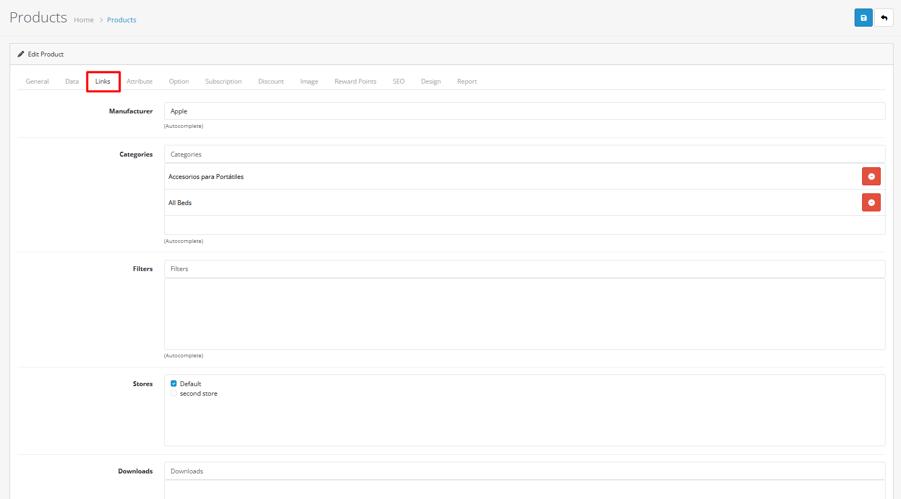
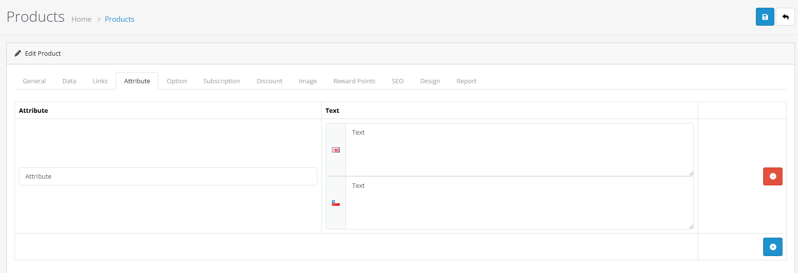
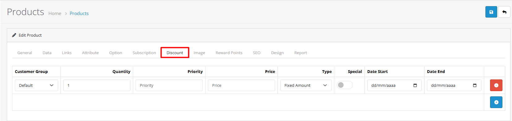
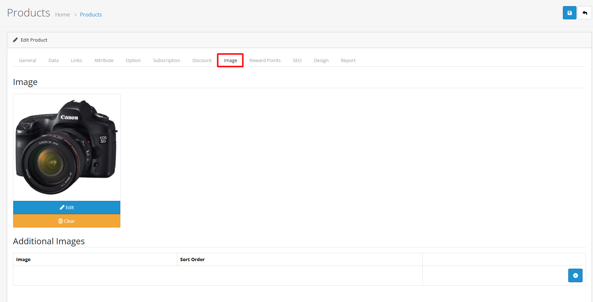
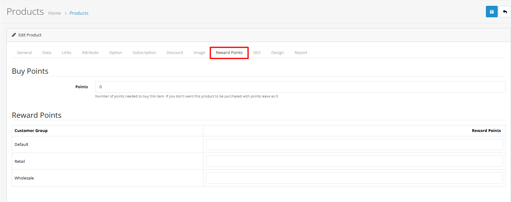
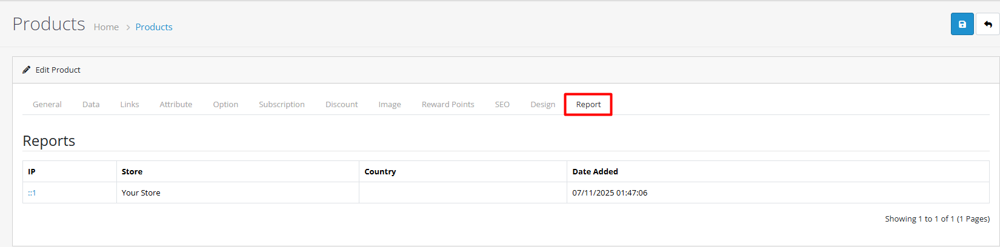

# Product Form Tabs

## Overview

The product form in OpenCart 4 is organized into logical tabs that group related settings. This guide explains what each tab does and how to use them effectively.


**Product Creation Workflow:** Follow the recommended sequence below for efficient product setup and management.




#### Step 1: Essential Information

Start with General and Data tabs to establish basic product details

**What to Complete:**

* **General Tab**: Product name, description, meta information
* **Data Tab**: Pricing, inventory, identifiers, shipping data


**Quick Setup Tip:** Complete General and Data tabs first to create a functional product, then add advanced features in other tabs.




#### Step 2: Organization & Relationships

Configure Links, Attributes, and Options for product structure

**What to Complete:**

* **Links Tab**: Categories, manufacturers, related products
* **Attribute Tab**: Product specifications and features
* **Option Tab**: Product variations and choices


**Organization Strategy:** Set up categories and relationships before creating variants to ensure proper organization.




#### Step 3: Marketing & Optimization

Add Discounts, Images, SEO, and Reward Points for sales optimization

**What to Complete:**

* **Discount Tab**: Volume pricing and promotions
* **Image Tab**: Product photos and visual content
* **SEO Tab**: URL optimization and search engine visibility
* **Reward Points Tab**: Customer loyalty programs


**Marketing Sequence:** Complete visual and promotional elements after the product structure is established.




#### Step 4: Advanced Configuration

Configure Design and Reports for final customization

**What to Complete:**

* **Design Tab**: Custom page layouts and templates
* **Reports Tab**: Performance tracking and analytics


**Final Touches:** Use Design tab for layout customization and Reports for performance tracking.




## General Tab

### Product Information

The General tab contains the basic information about your product that customers will see.

.png>)

**What to fill in:**

* **Product Name**: The name customers will see (required)
* **Description**: Detailed information about your product
* **Meta Title**: The title that appears in search results (required)
* **Meta Description**: A brief description for search engines
* **Tags**: Keywords to help customers find your product

**Multi-language Support**: If you have multiple languages enabled, you can enter product information in each language. Just select the language from the tabs and fill in the details for that language.

| Language Field       | Purpose                      | Required | Character Limit |
| -------------------- | ---------------------------- | -------- | --------------- |
| **Product Name**     | Display name for customers   | Yes      | 255 characters  |
| **Description**      | Detailed product information | No       | Unlimited       |
| **Meta Title**       | Search engine title          | Yes      | 255 characters  |
| **Meta Description** | Search engine snippet        | No       | 255 characters  |
| **Meta Keywords**    | Search keywords              | No       | 255 characters  |
| **Tags**             | Internal search tags         | No       | 255 characters  |

## Data Tab

### Core Product Data

.png>)

**Product Identifiers:** OpenCart 4 supports multiple product identification systems to help you manage your inventory effectively:

| Identifier                                    | Description                                       | Common Use Cases                                |
| --------------------------------------------- | ------------------------------------------------- | ----------------------------------------------- |
| **SKU** (Stock Keeping Unit)                  | Your internal product code for tracking inventory | Internal inventory management, order processing |
| **UPC** (Universal Product Code)              | Standard barcode numbers for retail products      | Retail stores, physical product tracking        |
| **EAN** (European Article Number)             | European standard product identification          | European markets, international retail          |
| **ISBN** (International Standard Book Number) | Book industry identification                      | Books, publications, educational materials      |
| **MPN** (Manufacturer Part Number)            | Manufacturer's product identification             | Electronics, automotive parts, industrial goods |

### Pricing & Inventory

**Pricing & Inventory Fields:**

| Field                | Description                                            | Required | Example              |
| -------------------- | ------------------------------------------------------ | -------- | -------------------- |
| **Model**            | Your internal product model number                     | Yes      | TSHIRT-PREM-001      |
| **Price**            | The selling price customers will pay                   | Yes      | $24.99               |
| **Tax Class**        | How this product should be taxed                       | Yes      | Taxable Goods        |
| **Quantity**         | How many items you have in stock                       | Yes      | 50                   |
| **Minimum Quantity** | Smallest number customers can order                    | No       | 1                    |
| **Stock Status**     | Shows customers if product is in stock or out of stock | Yes      | In Stock             |
| **Location**         | Where the product is stored in your warehouse          | No       | Warehouse A, Shelf 3 |
| **Date Available**   | When the product becomes available for purchase        | No       | 2025-11-06           |
| **Dimensions**       | Length, width, and height for shipping calculations    | No       | 30x20x2 cm           |
| **Weight**           | Product weight for shipping calculations               | No       | 0.2 kg               |

<strong>Advanced Data Tab Settings</strong>

**Shipping Configuration:**

* **Shipping Required**: Whether this product requires shipping
* **Length Class**: Unit of measurement (cm, mm, inch)
* **Weight Class**: Unit of weight (kg, lb, oz)

**Inventory Management:**

* **Subtract Stock**: Whether to reduce inventory when orders are placed
* **Out of Stock Status**: What to show when product is unavailable
* **Backorder Settings**: Allow orders when out of stock

**Advanced Pricing:**

* **Points Required**: Number of reward points needed to purchase
* **Customer Group Pricing**: Different prices for different customer groups
* **Special Pricing**: Temporary promotional pricing

## Links Tab

### Product Relationships

The Links tab helps you organize your products within your store structure and create relationships between products.

**Multi-store Assignment:** If you have multiple stores, you can assign products to specific stores or make them available across all stores.

**Category & Manufacturer Relationships:**

| Relationship Type    | Purpose                 | Required | Best Practices                                                                                   |
| -------------------- | ----------------------- | -------- | ------------------------------------------------------------------------------------------------ |
| **Manufacturer**     | Assign product to brand | No       | Use for brand organization and filtering                                                         |
| **Categories**       | Product categorization  | Yes      | Assign to multiple relevant categories                                                           |
| **Filters**          | Enhanced searchability  | No       | Use for size, color, price filtering (see [Product Filters](/broken/pages/gfV1Vkce00HDQiBVGzot)) |
| **Stores**           | Multi-store assignment  | Yes      | Assign to specific stores or all stores                                                          |
| **Downloads**        | Digital product files   | No       | Link to downloadable content                                                                     |
| **Related Products** | Cross-selling           | No       | Suggest complementary items                                                                      |

**Multi-store Assignment Strategy:**

* **All Stores**: Product appears in all store locations
* **Specific Stores**: Product only appears in selected stores
* **Store Groups**: Assign to groups of stores with similar characteristics

## Attribute Tab

### Product Specifications

The Attribute tab lets you add detailed product specifications and technical information that helps customers make informed purchasing decisions. For comprehensive attribute management, see the [Product Attributes](/broken/pages/VaRbGTCgrKznpxkew1Yd) guide.

**Common Product Attributes:**

* **Material**: What the product is made from (e.g., "100% Cotton", "Stainless Steel")
* **Dimensions**: Product size and measurements
* **Color Options**: Available colors or finishes
* **Care Instructions**: How to maintain the product
* **Warranty Information**: Product guarantee details
* **Technical Specifications**: Performance data and features
* **Compatibility**: What other products this works with

## Option Tab

### Product Variations

.png>)

The Option tab allows you to create product variations with different choices for customers to select. For comprehensive option management, see the [Product Options](/broken/pages/PSxHqzfAVUmCvJg8B3RC) guide.

**Common Product Options:**

* **Size**: Small, Medium, Large, etc.
* **Color**: Red, Blue, Green, etc.
* **Style**: Different product styles or versions
* **Material**: Various material options
* **Configuration**: Different product configurations

**Option Types Available:**

<strong>View All Option Types</strong>

| Option Type     | Description                            | Use Cases                              |
| --------------- | -------------------------------------- | -------------------------------------- |
| **Select**      | Dropdown menu with multiple choices    | Sizes, colors, simple choices          |
| **Radio**       | Single selection from multiple options | Exclusive choices, required options    |
| **Checkbox**    | Multiple selections allowed            | Add-ons, optional features             |
| **Text**        | Customer can enter custom text         | Custom text, personalization           |
| **Textarea**    | Larger text input area                 | Custom messages, detailed instructions |
| **File**        | Allow customers to upload files        | Custom designs, documents              |
| **Date**        | Date selection                         | Event dates, delivery dates            |
| **Time**        | Time selection                         | Appointment times, delivery windows    |
| **Date & Time** | Combined date and time selection       | Event scheduling, appointments         |

**Option Features:**

* Set different prices for each option
* Add or subtract weight for shipping calculations
* Award different reward points for options
* Make options required or optional

<strong>Example: T-Shirt Option Configuration</strong>

**Size Option Setup:**

* **Option Type**: Select (dropdown)
* **Required**: Yes
* **Values**: Small, Medium, Large, XL
* **Price Adjustment**: None (same price for all sizes)

**Color Option Setup:**

* **Option Type**: Select (dropdown)
* **Required**: Yes
* **Values**: Red, Blue, Green, Black
* **Price Adjustment**: None (same price for all colors)

**Material Option Setup:**

* **Option Type**: Radio
* **Required**: No
* **Values**:
  * Standard Cotton (no price adjustment)
  * Premium Cotton (+$5.00)
  * Organic Cotton (+$8.00)

**Resulting Variants:**

* Small, Red, Standard Cotton
* Medium, Blue, Premium Cotton
* Large, Green, Organic Cotton
* etc.

## Discount Tab

### Quantity-based Pricing

The Discount tab allows you to create volume discounts that encourage customers to buy more.

**Discount Features:**

| Feature              | Description                            | Use Case                           |
| -------------------- | -------------------------------------- | ---------------------------------- |
| **Quantity Tiers**   | Different prices based on quantity     | Volume discounts, bulk pricing     |
| **Customer Groups**  | Different discounts per customer group | VIP pricing, member discounts      |
| **Priority Levels**  | Control discount precedence            | Complex discount strategies        |
| **Date Ranges**      | Time-limited discounts                 | Seasonal promotions, flash sales   |
| **Store Assignment** | Store-specific discounts               | Regional pricing, store promotions |

**Discount Configuration Example:**

| Quantity | Price  | Customer Group | Priority |
| -------- | ------ | -------------- | -------- |
| 1-9      | $29.99 | All            | 1        |
| 10-49    | $24.99 | All            | 2        |
| 50+      | $19.99 | VIP Customers  | 3        |
| 100+     | $14.99 | Wholesale      | 4        |

**Example Discount Structure:**

* Buy 10+ items: $24.99 each (regular price $29.99)
* Buy 50+ items: $19.99 each
* Buy 100+ items: $14.99 each

**Discount: Best Practices:**

* Set realistic quantity thresholds
* Consider your profit margins
* Use date ranges for seasonal promotions
* Test different discount levels to find what works best

**Special Toggle: Common Use Cases:**

* **Seasonal Sales**: Holiday promotions, summer sales
* **Clearance Events**: End-of-season clearance pricing
* **Launch Promotions**: Special pricing for new product launches
* **Member-only Sales**: Exclusive offers for registered customers

**Special Offer: Best Practices:**

* Create urgency with clear end dates
* Use compelling promotional messaging
* Test different discount levels
* Monitor promotion performance

## Image Tab

### Visual Content

The Image tab is where you upload and manage all product images to showcase your products effectively.

**Image Types:**

* **Main Image**: The primary product image that appears in search results and category pages
* **Additional Images**: Multiple photos showing different angles, details, or product in use
* **Sort Order**: Control the sequence in which images are displayed

**Image Best Practices:**

| Aspect          | Recommendation            | Technical Details                    |
| --------------- | ------------------------- | ------------------------------------ |
| **Quality**     | High-resolution, well-lit | 72 DPI, proper exposure              |
| **Angles**      | Multiple perspectives     | Front, back, side, detail shots      |
| **Composition** | Consistent framing        | Same background, consistent lighting |
| **File Size**   | Optimized for web         | 100-500KB per image                  |
| **Dimensions**  | Standard sizes            | 800x600px to 1200x900px              |
| **File Format** | Web-friendly formats      | JPEG for photos, PNG for graphics    |
| **Naming**      | Descriptive filenames     | product-name-angle.jpg               |

**Image Sequence Strategy:**

1. **Main Image**: Clear front view on white background
2. **Context Shots**: Product in use/environment
3. **Detail Shots**: Close-ups of features and quality
4. **Variation Shots**: Different colors/styles available
5. **Size Reference**: Product with size comparison

**Recommended Image Setup:**

1. Main product shot (front view)
2. Side or back view
3. Detail shots (close-ups)
4. Product in context/use
5. Different color options (if applicable)

## Reward Points Tab

### Loyalty Program

The Reward Points tab allows you to set up loyalty rewards for customers who purchase your products.

**Reward Points Features:**

* **Points per Purchase**: Set how many reward points customers earn for buying this product
* **Customer Group Targeting**: Offer different point values to different customer groups
* **Flexible Rewards**: Points can be redeemed for discounts on future purchases

**Common Reward Strategies:**

* **Standard Points**: All customers earn the same points
* **VIP Rewards**: Registered customers earn more points
* **Product-specific Rewards**: Higher points for premium products
* **Promotional Points**: Extra points during special events

**Best Practices:**

* Set meaningful point values that encourage repeat purchases
* Consider your profit margins when setting point values
* Communicate the value of points to customers
* Use points to reward loyal customers

## SEO Tab

### URL Optimization

.png>)

The SEO tab helps you optimize your product pages for search engines and create user-friendly URLs.

**SEO Features:**

* **SEO-friendly URLs**: Create clean, readable URLs that include keywords
* **Multi-language Support**: Set different URLs for each language
* **Multi-store Support**: Customize URLs for different stores
* **URL Validation**: Ensure URLs are unique and properly formatted

**SEO Best Practices:**

* Use descriptive, keyword-rich URLs
* Include main product keywords in the URL
* Keep URLs short and easy to remember
* Use hyphens to separate words
* Avoid special characters and spaces
* Ensure URL uniqueness across your store
* Create consistent URL patterns

**Multi-language SEO:**

* Create language-specific URLs that make sense in each language
* Maintain consistent URL structure across languages
* Consider cultural differences in keyword usage

## Design Tab

### Layout Customization

.png>)

The Design tab allows you to control how your product pages are displayed by assigning different layouts.

**Layout Features:**

* **Custom Page Layouts**: Assign different layouts to different products
* **Multi-store Support**: Use different layouts for different stores
* **Template Control**: Customize the appearance of individual product pages

**Common Layout Uses:**

* **Standard Product Layout**: Default layout for most products
* **Featured Product Layout**: Special layout for highlighted products
* **Category-specific Layouts**: Different layouts for different product categories
* **Store-specific Layouts**: Custom layouts for different store locations

**Layout Assignment:**

* Assign layouts to control page structure and element placement
* Use different layouts for different product types
* Create custom layouts for special promotions or featured products

## Reports Tab

### View Statistics

Track product performance and customer interactions. For comprehensive analytics.

**Report Information Available:**

* **Visitor Details**: IP addresses and locations
* **Store Performance**: Which stores show the product
* **Geographic Data**: Where visitors are coming from
* **View History**: When products were viewed

**Report Uses:**

* Track popular products
* Analyze customer interest by location
* Monitor store performance
* Identify trending items

## Best Practices

<strong>Tab Organization Strategy</strong>

#### Efficient Product Setup

**Recommended Tab Sequence:**

1. **General Tab**: Basic product information and descriptions
2. **Data Tab**: Pricing, inventory, and core product data
3. **Links Tab**: Categories, relationships, and organization
4. **Attribute Tab**: Specifications and technical details
5. **Option Tab**: Variations and customer choices
6. **SEO Tab**: URL optimization and search visibility
7. **Image Tab**: Visual content and product photos
8. **Discount Tab**: Pricing promotions and volume discounts
9. **Reward Points Tab**: Loyalty program configuration
10. **Design Tab**: Layout customization
11. **Reports Tab**: Performance tracking


**Workflow Efficiency:** Complete essential information first, then move to advanced features and optimization.


<strong>Validation &#x26; Data Quality</strong>

#### Data Validation Rules

**Required Fields:**

* Product names in all languages
* Model/SKU (must be unique)
* Price (numeric and positive)
* Quantity (numeric)

**Format Requirements:**

* Dates: YYYY-MM-DD format
* Prices: Decimal format (e.g., 29.99)
* URLs: SEO-friendly format
* Images: Supported formats (JPEG, PNG, GIF)

**Data Quality Guidelines:**

* Use consistent naming conventions
* Maintain accurate inventory counts
* Keep pricing information current
* Update product status regularly


**Data Integrity:** Regular data validation ensures accurate product information and prevents customer confusion.


<strong>Multi-language Strategy</strong>

#### International Product Management

**Translation Best Practices:**

* Translate all product information completely
* Use consistent terminology across languages
* Consider cultural differences in descriptions
* Test SEO URLs in all supported languages

**Language-Specific Considerations:**

* **Product Names**: May need localization
* **Descriptions**: Cultural relevance matters
* **Meta Information**: Language-specific SEO
* **Attribute Values**: Local measurements and standards

**Quality Assurance:**

* Review translations for accuracy
* Test product display in all languages
* Verify SEO performance across languages
* Monitor customer feedback by language


**Global Reach:** Proper multi-language support expands your market reach and improves customer experience.


<strong>Performance Optimization</strong>

#### Product Form Performance

**Optimization Tips:**

* **Image Optimization**: Compress images before upload
* **Attribute Management**: Limit attributes per product
* **Option Efficiency**: Use appropriate option types
* **SEO Strategy**: Plan URLs before product creation

**Performance Guidelines:**

* **Image Size**: Keep under 500KB per image
* **Attributes**: 10-15 attributes maximum per product
* **Options**: 3-5 options maximum per product
* **Variants**: Use variants for complex combinations

**System Performance:**

* Monitor database performance
* Use caching for frequently accessed products
* Optimize template rendering
* Regular system maintenance


**Performance Monitoring:** Regularly check product page load times and optimize as needed.


## Product Form Validation Checklist

Use this checklist to ensure all tabs are properly configured:

* [ ] **General Tab**
  * [ ] Product name completed in all languages
  * [ ] Meta title optimized for SEO
  * [ ] Description includes key features and benefits
  * [ ] Tags added for internal search
* [ ] **Data Tab**
  * [ ] Model/SKU is unique and follows naming convention
  * [ ] Price is accurate and competitive
  * [ ] Tax class correctly assigned
  * [ ] Stock quantity reflects actual inventory
  * [ ] Dimensions and weight configured for shipping
* [ ] **Links Tab**
  * [ ] Product assigned to relevant categories
  * [ ] Manufacturer selected if applicable
  * [ ] Filters configured for searchability
  * [ ] Related products added for cross-selling
* [ ] **Option Tab**
  * [ ] Required options marked as mandatory
  * [ ] Price adjustments configured correctly
  * [ ] Option combinations tested
  * [ ] Variants created for all combinations
* [ ] **SEO Tab**
  * [ ] SEO URLs created for all languages
  * [ ] URLs are clean and descriptive
  * [ ] URL uniqueness verified
  * [ ] Multi-store URLs configured if needed
* [ ] **Final Verification**
  * [ ] All tabs reviewed for completeness
  * [ ] Product appears correctly in storefront
  * [ ] Options display properly to customers
  * [ ] SEO elements working as expected
