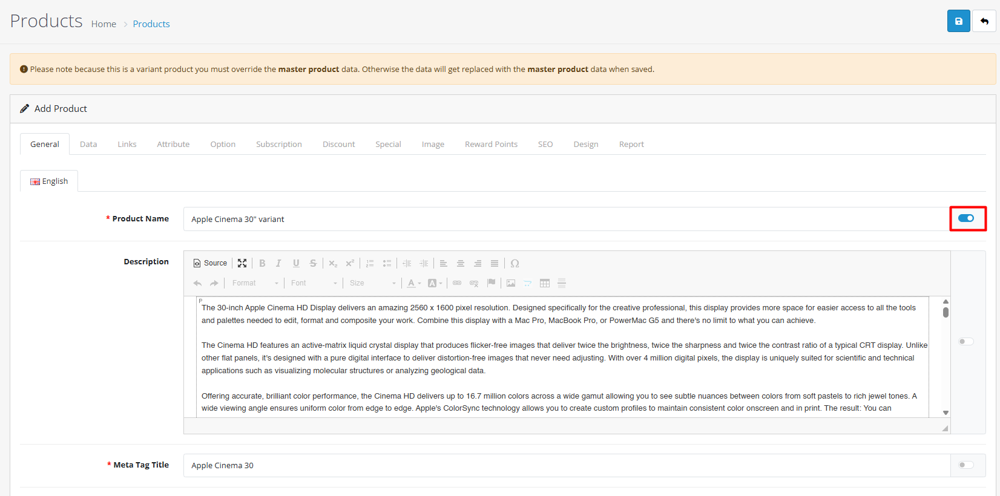

# Product Variants

## Introduction

Product variants in OpenCart 4 allow you to create master products with multiple variations, each with their own pricing, inventory, and attributes. This powerful feature is ideal for products that come in different sizes, colors, or configurations.

## Variant System Overview

### Master vs Variant Products

### Master Products

Master products are the main product entries that define common attributes and options that all variants will share.

**What Master Products Contain:**

* Basic product information (name, description)
* Common attributes shared by all variants
* Option definitions (sizes, colors, etc.)
* General product settings
* SEO information
* Layout assignments

**Master Product Examples:**

* "T-Shirt" (with size and color options)
* "Smartphone" (with storage and color options)
* "Coffee" (with roast level and grind options)

### Variant Products

Variant products are specific combinations of options that inherit most settings from the master product but can have their own unique attributes.

**What Variants Can Customize:**

* Pricing (different prices for different options)
* Inventory levels (separate stock for each variant)
* Model/SKU numbers (unique identifiers)
* Availability dates
* Weight and dimensions
* Status (enable/disable specific variants)

**Variant Examples:**

* "T-Shirt - Small, Red" (with its own price and stock)
* "Smartphone - 128GB, Midnight" (with specific pricing)
* "Coffee - Dark Roast, Whole Bean" (with unique inventory)

## Creating Variants



#### Step 1: Create Master Product

1. **Navigate to Catalog → Products**
2. **Click "Add New"**
3. **Configure basic product information**
4. **Set up product options in the Option tab**
5. **Save as master product**


**Master Product Setup**

* Define all common attributes and options first
* Set up option combinations that will be used for variants
* Configure general product settings that apply to all variants




#### Step 2: Add Variants

1. **From product list, click "Variant" button**
2. **Configure variant-specific attributes**
3. **Set pricing and inventory**
4. **Save variants**


**Variant Creation**

* Select valid option combinations
* Set variant-specific pricing and inventory
* Configure unique identifiers for each variant
* Enable variants that are ready for sale




#### Step 3: Manage Variants

1. **Edit individual variants**
2. **Override specific attributes**
3. **Manage variant inventory**
4. **Set variant-specific SEO**


**Variant Management**

* Monitor inventory levels for each variant
* Update pricing based on demand and costs
* Track variant performance separately




## Variant Configuration

### Option Inheritance

Variants automatically inherit most settings from the master product, which makes managing multiple variations much easier.

| Inherited Attributes           | Description                                          |
| ------------------------------ | ---------------------------------------------------- |
| **Product Name & Description** | Basic product information shared across all variants |
| **Manufacturer Information**   | Brand and manufacturer details                       |
| **Category Assignments**       | Product categorization and organization              |
| **Filter Settings**            | Search and filter configurations                     |
| **Store Assignments**          | Multi-store availability settings                    |
| **Download Links**             | Digital product downloads                            |
| **Product Attributes**         | Technical specifications and features                |
| **Option Definitions**         | Available options and their configurations           |
| **Subscription Plans**         | Recurring billing settings                           |
| **Reward Point Settings**      | Loyalty program configurations                       |
| **SEO URLs**                   | Search engine optimization settings                  |
| **Layout Assignments**         | Page layout and design settings                      |

### Override Capability

While variants inherit most settings, you can customize specific attributes for each variant to meet your business needs.

| Customizable Attributes         | Description                              |
| ------------------------------- | ---------------------------------------- |
| **Model/SKU Numbers**           | Unique identifiers for each variant      |
| **Pricing**                     | Variant-specific pricing strategies      |
| **Inventory Quantities**        | Separate stock levels per variant        |
| **Minimum Purchase Quantities** | Variant-specific purchase rules          |
| **Stock Subtraction Settings**  | How stock is managed for each variant    |
| **Stock Status**                | Availability indicators per variant      |
| **Storage Location**            | Physical location in warehouse           |
| **Availability Dates**          | When variants become available           |
| **Shipping Requirements**       | Variant-specific shipping rules          |
| **Dimensions**                  | Length, width, height for shipping       |
| **Weight**                      | Product weight for shipping calculations |
| **Active/Inactive Status**      | Enable/disable specific variants         |
| **Display Order**               | Sorting priority for variants            |
| **Reward Points**               | Custom loyalty rewards per variant       |
| **Tax Class**                   | Variant-specific tax settings            |

## Real-world Examples

### Clothing Store Example

**Master Product:** Premium Cotton T-Shirt

* **Options Available:**
  * Sizes: XS, S, M, L, XL
  * Colors: Red, Blue, Green, Black, White

**Variant Examples:**

* **Medium Blue T-Shirt**
  * Price: $24.99
  * Stock: 75 units
  * SKU: TSHIRT-M-BLUE
* **Large Red T-Shirt**
  * Price: $24.99
  * Stock: 50 units
  * SKU: TSHIRT-L-RED

### Electronics Store Example

**Master Product:** Flagship Smartphone

* **Options Available:**
  * Storage: 64GB, 128GB, 256GB
  * Colors: Midnight, Starlight, Blue

**Variant Examples:**

* **128GB Midnight**
  * Price: $899.99
  * Stock: 30 units
  * SKU: PHONE-128-MIDNIGHT
* **256GB Starlight**
  * Price: $999.99
  * Stock: 20 units
  * SKU: PHONE-256-STARLIGHT

## Best Practices


**Variant Naming Strategy**

* Use descriptive names that include option values
* Maintain consistent naming conventions
* Include variant-specific information in descriptions
* Use clear, customer-friendly terminology



**Inventory Management**

* Track inventory at variant level, not master level
* Set realistic stock levels for each variant
* Use stock status to indicate availability
* Implement minimum quantity rules appropriately



**Pricing Strategy**

* Set variant-specific pricing based on costs
* Consider option-based price adjustments
* Use discounts and specials strategically
* Monitor price competitiveness across variants



**Performance Considerations**

* Limit the number of variants per master product
* Use efficient option combinations
* Monitor database performance with large variant sets
* Consider product limits for optimal performance


## Troubleshooting

### Common Issues

Variant Not Appearing

**Problem:** Variant doesn't show in storefront

**Solutions:**

* Check variant status (must be enabled)
* Verify option combinations are valid
* Ensure required options have values
* Check store assignment

Inventory Mismatch

**Problem:** Stock levels don't match expectations

**Solutions:**

* Verify variant-specific quantity settings
* Check stock subtraction configuration
* Review order history for that variant
* Validate stock status settings

Pricing Issues

**Problem:** Prices don't display correctly

**Solutions:**

* Check variant-specific price overrides
* Verify option price adjustments
* Review discount and special pricing
* Validate tax class assignments

## Next Steps

* [Learn about product options](/broken/pages/PSxHqzfAVUmCvJg8B3RC)
* [Explore product management](/broken/pages/EsE5SjFTCoY94AE9VHIB)
* [Understand subscription products](/broken/pages/QoZ72xxe7XgreP2PZqAo)
* [Master product identifiers](/broken/pages/RZcvJdsGlV3nQ0ISkoPV)
