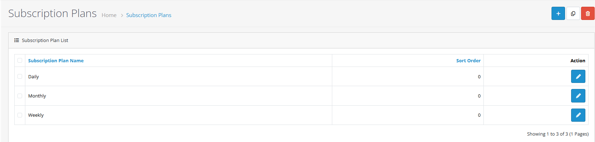
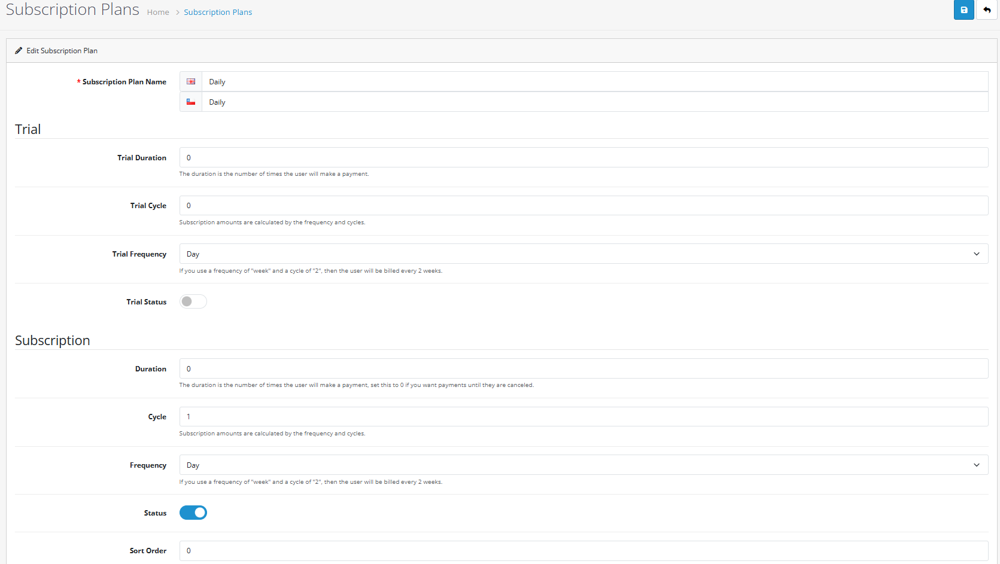
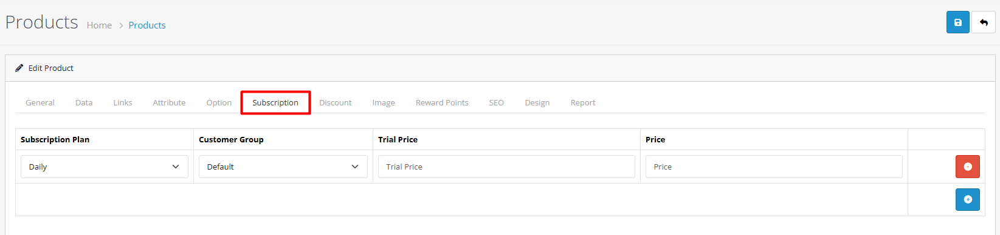

# Subscription Products

## Introduction

Subscription products in OpenCart 4 enable recurring billing for services, memberships, and products with regular delivery. This powerful feature allows you to create sustainable revenue streams and build long-term customer relationships.

## Subscription System Overview

### Key Components

### Subscription Plans

Subscription plans define the billing structure and duration for your recurring products.

**Plan Configuration Options:**

* **Trial Period**: Offer free or discounted trials to attract customers
* **Billing Frequency**: Set daily, weekly, monthly, or yearly billing cycles
* **Duration**: Choose fixed terms or ongoing until cancellation
* **Cycle**: Control how often billing occurs within each frequency

### Product Subscription Assignment

Assign subscription plans to products and set different pricing for customer groups:

**Assignment Features:**

* Link subscription plans to specific products
* Set different prices for different customer groups
* Configure trial pricing for each customer segment
* Manage subscription availability across your store

## Creating Subscription Products



#### Step 1: Set Up Subscription Plans

1. **Navigate to Catalog → Subscription Plans**
2. **Click "Add New"**
3. **Configure plan details**
4. **Set billing frequency and duration**
5. **Save subscription plan**


**Plan Configuration**

* Define clear plan names and descriptions
* Set appropriate billing frequencies
* Configure trial periods if needed
* Test plan settings before assigning to products




#### Step 2: Create Subscription Product

1. **Navigate to Catalog → Products**
2. **Create or edit a product**
3. **In the Subscription tab, add subscription plans**
4. **Configure customer group pricing**
5. **Save product**


**Product Assignment**

* Assign appropriate subscription plans to products
* Set different pricing for customer groups
* Configure trial pricing for each segment
* Test subscription product functionality




#### Step 3: Configure Payment Gateway

1. **Navigate to Extensions → Payments**
2. **Enable subscription-compatible payment methods**
3. **Configure recurring payment settings**
4. **Test subscription functionality**


**Payment Setup**

* Use subscription-compatible payment gateways
* Configure webhook endpoints for notifications
* Test recurring payment functionality
* Verify automatic billing works correctly




## Subscription Configuration

### Billing Frequency Options

OpenCart 4 supports various billing frequencies for your subscription products:

| Frequency        | Description            | Ideal Use Cases                                       | Billing Cycle  |
| ---------------- | ---------------------- | ----------------------------------------------------- | -------------- |
| **Daily**        | Daily billing cycles   | Daily content, news services, short-term trials       | Every day      |
| **Weekly**       | Weekly billing cycles  | Newsletters, meal kits, weekly services               | Every 7 days   |
| **Semi-Monthly** | Twice per month        | Bi-weekly services, payroll services                  | Every 15 days  |
| **Monthly**      | Monthly billing cycles | Software subscriptions, memberships, monthly boxes    | Every 30 days  |
| **Yearly**       | Annual billing cycles  | Software licenses, annual memberships, premium access | Every 365 days |

### Trial Period Configuration

Configure free or discounted trial periods to attract new subscribers:

**Trial Options:**

* **Free Trial**: Offer $0 pricing for a specified period
* **Discounted Trial**: Provide reduced pricing during trial
* **No Trial**: Start with regular pricing immediately

**Trial Management:**

* Set trial duration and frequency
* Configure pricing after trial ends
* Send reminder emails before trial expiration

## Advanced Subscription Features

### Customer Group Pricing

Set different subscription prices for different customer groups:

**Pricing Tiers:**

* **Default Customers**: Standard pricing for regular customers
* **Wholesale Customers**: Discounted rates for bulk buyers
* **VIP Members**: Special pricing for premium customers

**Benefits:**

* Target different customer segments
* Offer volume discounts
* Reward loyal customers
* Increase subscription adoption

### Subscription Management

Manage active subscriptions from the admin panel with comprehensive tools:

**Management Features:**

* **View Active Subscriptions**: See all current subscriptions
* **Subscription Actions**: Cancel, update, or modify subscriptions
* **Revenue Tracking**: Monitor monthly recurring revenue
* **Customer Retention**: Analyze subscription duration and churn rates

**Automated Communications:**

* Renewal reminders before subscription renewal
* Payment failure notifications
* Cancellation confirmations
* Welcome emails for new subscribers

## Real-world Examples

### Software as a Service (SaaS)

**Monthly Software Subscription Example:**

* **Product**: Premium Software Suite
* **Monthly Plan**: $29.99 per month with full access and priority support
* **Annual Plan**: $299.99 per year (equivalent to \~$25/month) with 2 months free
* **Features**: Full software access, priority customer support, regular updates

### Membership Site

**Content Membership Example:**

* **Product**: Premium Content Membership
* **Trial Offer**: $1 for 7 days, then $19.99 per month
* **Individual Plan**: $19.99/month with basic content access
* **Premium Plan**: $39.99/month with all content and download access
* **Features**: Exclusive content, member forums, downloadable resources

### Physical Product Subscription

**Monthly Delivery Service Example:**

* **Product**: Monthly Coffee Subscription
* **Single Bag**: $14.99/month for one bag of coffee
* **Family Pack**: $24.99/month for three bags of coffee
* **Shipping**: Free shipping with delivery in the first week of each month
* **Features**: Fresh coffee delivery, variety selection, flexible cancellation

## Payment Gateway Integration

### Supported Payment Methods

Use subscription-compatible payment gateways for recurring billing:

**Popular Gateways:**

* **Stripe**: Automatic billing, payment retries, webhook support
* **PayPal**: Subscription management, billing agreements
* **Authorize.net**: Recurring billing, customer profiles

**Required Features:**

* Recurring payment capability
* Customer profile storage
* Payment failure handling
* Webhook support for automated notifications

## Best Practices


**Pricing Strategy**

* Offer multiple subscription tiers
* Include annual discounts for commitment
* Consider family or team pricing
* Test different price points



**Trial Management**

* Set clear trial period expectations
* Send reminder emails before trial ends
* Make cancellation process easy
* Monitor trial-to-paid conversion rates



**Customer Communication**

* Send welcome emails for new subscriptions
* Provide renewal reminders
* Notify about payment failures
* Offer easy cancellation options



**Legal Compliance**

* Clearly state billing terms
* Provide cancellation instructions
* Follow local subscription laws
* Maintain transparent pricing


## Troubleshooting

### Common Subscription Issues

Payment Failures

**Problem:** Recurring payments fail

**Solutions:**

* Verify payment gateway configuration
* Check customer payment method validity
* Review payment gateway logs
* Implement payment retry logic

Subscription Not Activating

**Problem:** New subscriptions don't activate

**Solutions:**

* Check subscription plan status
* Verify product subscription assignments
* Review payment gateway webhooks
* Test subscription purchase flow

Cancellation Issues

**Problem:** Customers can't cancel subscriptions

**Solutions:**

* Verify cancellation permissions
* Check customer account access
* Review cancellation workflow
* Test cancellation from customer perspective

## Next Steps

* [Learn about product variants](/broken/pages/cFve5DSbS2azs3ngfQrF)
* [Explore product management](/broken/pages/EsE5SjFTCoY94AE9VHIB)
* [Understand product identifiers](/broken/pages/RZcvJdsGlV3nQ0ISkoPV)
* [Master product form tabs](/broken/pages/ppVKh3ctAf55cprlOM6c)
