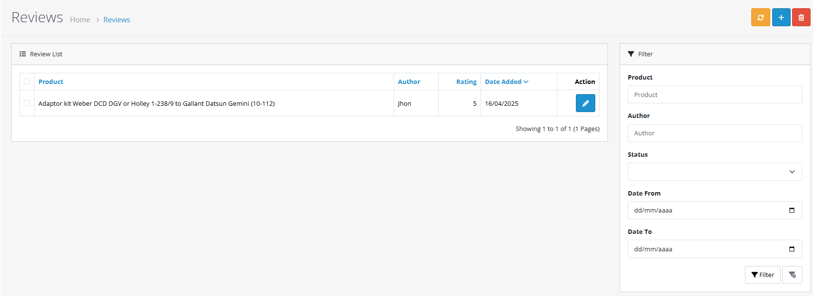
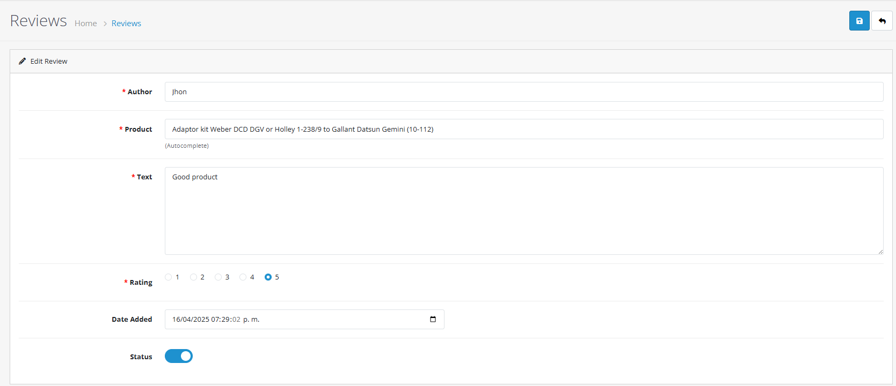
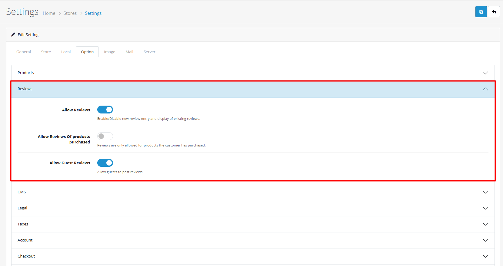

# Reviews

## Introduction

Reviews in OpenCart allow customers to share feedback and ratings for products they've purchased. This feature builds social proof, improves product credibility, and provides valuable customer insights.

## Video Tutorial



_Video: Review Management in OpenCart_


**Review System Benefits**

* Build customer trust through authentic feedback
* Improve product credibility with social proof
* Gather valuable customer insights and feedback
* Enhance SEO with user-generated content
* Increase conversion rates with positive reviews


## Accessing Reviews

To access the reviews section:



#### Step 1: Navigate to Admin Panel

Log in to your OpenCart admin dashboard and go to **Catalog** → **Reviews**



#### Step 2: View Review List

You'll see a list of all customer reviews with status, ratings, and management options



## Complete Review Management Workflow



#### Step 1: Access Review Section

1. Go to **Catalog → Reviews**
2. View the complete list of customer reviews




#### Step 2: Review Customer Submissions

New reviews appear with "Disabled" status


**Review Queue Management:**

* Check for new reviews daily
* Prioritize recent submissions
* Look for spam or inappropriate content
* Verify review authenticity




#### Step 3: Moderate Review Content

Click **Edit** to review and moderate:

| Field       | Description            | Action                 |
| ----------- | ---------------------- | ---------------------- |
| **Product** | Product being reviewed | Verify accuracy        |
| **Author**  | Customer name          | Check authenticity     |
| **Text**    | Review content         | Moderate for quality   |
| **Rating**  | 1-5 star rating        | Verify appropriateness |
| **Status**  | Enable/Disable         | Set approval status    |


**Moderation Guidelines:**

* Approve constructive, genuine feedback
* Edit minor typos or formatting issues
* Reject spam, offensive language, fake reviews
* Monitor reviews mentioning competitors




#### Step 4: Approve or Reject Review

Set appropriate status:

* **Enable**: Approve and publish the review
* **Disable**: Keep pending or reject
* **Delete**: Remove permanently


**Approval Strategy:**

* Enable authentic, helpful reviews
* Disable questionable content for later review
* Delete obvious spam or fake reviews
* Maintain balanced review distribution




#### Step 5: Monitor Published Reviews

After approval:

* Review appears on product pages
* Customer sees their published feedback
* Monitor review performance and engagement


**Success Checklist:**

* Verify review appears on correct product page
* Check star rating displays correctly
* Confirm review formatting is proper
* Test mobile responsiveness
* Monitor customer engagement




## Managing Reviews

### Review List Overview

The reviews list displays key information:

| Column         | Description                              |
| -------------- | ---------------------------------------- |
| **Review ID**  | Unique identifier for the review         |
| **Product**    | Product being reviewed                   |
| **Author**     | Customer who wrote the review            |
| **Rating**     | Star rating (1-5 stars)                  |
| **Status**     | Enabled (approved) or Disabled (pending) |
| **Date Added** | When the review was submitted            |
| **Actions**    | Edit, Enable/Disable, Delete options     |

### Editing Reviews

1. From the reviews list, click the **Edit** button
2. Update review content, rating, or author information
3. Change status to enable or disable the review
4. Click **Save** to apply changes


**Moderation Guidelines**: Only edit reviews to fix typos or formatting. Avoid changing the substance of customer feedback to maintain authenticity.


### Approving Reviews

1. Find reviews with "Disabled" status
2. Click **Edit** for the review
3. Change status to "Enabled"
4. Click **Save** to publish the review

### Deleting Reviews

1. From the reviews list, click the **Delete** button
2. Confirm the deletion in the popup dialog
3. The review will be permanently removed


**Important**: Deleted reviews cannot be recovered. Consider disabling instead of deleting to maintain review history.


## Review Settings and Configuration

### Global Review Settings

Configure review behavior in **System** → **Settings** → **Edit Store** → **Option** tab:

| Setting           | Description                           | Recommended                 |
| ----------------- | ------------------------------------- | --------------------------- |
| **Review Status** | Enable/disable review system globally | Enabled                     |
| **Review Guest**  | Allow guests to write reviews         | Disabled (for authenticity) |

### Rating System

OpenCart uses a 5-star rating system:

* ⭐⭐⭐⭐⭐ (5 stars) - Excellent
* ⭐⭐⭐⭐ (4 stars) - Very Good
* ⭐⭐⭐ (3 stars) - Average
* ⭐⭐ (2 stars) - Poor
* ⭐ (1 star) - Very Poor

## Customer Review Experience

### Writing Reviews

Customer Review Process

**Access to Review**

* Customers can only review products they've purchased
* Review option appears in order history and product pages
* Customers must be logged in to submit reviews

**Review Form**

* **Rating**: 1-5 star selection (required)
* **Your Name**: Display name for the review
* **Your Review**: Detailed feedback (required)
* **Submit**: Sends review for moderation

**After Submission**

* Review appears as "pending approval" to customer
* Customer receives confirmation of submission
* Review becomes visible after admin approval

### Review Display on Store Front

Approved reviews appear on product pages with:

* Star rating visualization
* Customer name and review date
* Full review text

## SEO Benefits of Reviews

### User-Generated Content

Reviews provide valuable SEO content:

* Fresh, regularly updated content
* Natural language and keywords
* Long-tail search opportunities
* Increased page engagement metrics

### Rich Snippets

Configure review rich snippets for search engines:

* Aggregate rating stars in search results
* Review count display in search listings
* Enhanced click-through rates
* Improved search visibility

## Multi-Store Review Management

Reviews can be managed across multiple stores:

* Centralized review moderation for all stores
* Store-specific review settings
* Cross-store review analytics
* Consistent moderation policies

## Troubleshooting

Common Review Issues

#### Reviews Not Appearing

* Check review status is "Enabled"
* Verify review moderation settings
* Ensure customer has purchased the product
* Check product review settings

#### Rating Display Problems

* Verify theme supports star ratings
* Check CSS for rating display issues
* Test with different browsers
* Clear cache and refresh

#### Spam Reviews

* Enable review moderation
* Require customer registration
* Implement CAPTCHA if available
* Monitor for pattern-based spam

## Analytics and Reporting

### Review Metrics to Track

* **Approval Rate**: Percentage of reviews approved
* **Average Rating**: Overall product rating trends
* **Response Rate**: How often you respond to reviews
* **Review Volume**: Number of reviews over time
* **Product Performance**: Which products get most reviews

### Customer Insights

Use reviews to gather:

* Product improvement suggestions
* Customer pain points and needs
* Competitive intelligence
* Service quality feedback

## Best Practices


**Review Management Excellence**

* Use reviews to improve products and services
* Encourage customers to leave reviews
* Maintain authentic review content
* Monitor review trends and patterns


### Legal Compliance

* Follow local review disclosure laws
* Don't incentivize positive reviews
* Maintain authentic customer feedback
* Address fake review concerns promptly

## Practical Example: iPhone Review Moderation

Let's walk through a complete example of moderating a customer review for an iPhone product:



#### Step 1: Identify New Review

1. Go to **Catalog → Reviews**
2. Look for reviews with "Disabled" status
3. Find review for "iPhone 14 Pro" with 4-star rating
4. Review shows: "Great phone but battery life could be better. Love the camera quality!"



#### Step 2: Moderate Content

1. Click **Edit** on the iPhone review
2. Verify review content is constructive and appropriate
3. Check rating matches review sentiment (4 stars = "Very Good")
4. Confirm author appears to be genuine customer
5. No offensive language or spam detected



#### Step 3: Approve Review

1. Change **Status** from "Disabled" to "Enabled"
2. Click **Save** to publish the review
3. Review now appears on iPhone 14 Pro product page
4. Customer sees their feedback is published







***

## Troubleshooting Common Issues

<strong>Reviews Not Appearing</strong>

#### Problem: Reviews don't show on product pages

**Solutions:**

1. **Check review status**
   * Verify reviews are enabled in admin panel
   * Check review moderation settings
   * Ensure customer has purchased the product
   * Verify product review settings
2. **Review system settings**
   * Confirm review system is globally enabled
   * Check guest review permissions
   * Verify review display settings
   * Test with different user roles
3. **Test review functionality**
   * Submit test review and check approval process
   * Verify review appears after approval
   * Check for theme compatibility issues
   * Test with default theme


**Quick Check:** Go to the reviews list in admin panel and verify reviews exist and are enabled.


<strong>Rating Display Problems</strong>

#### Problem: Star ratings not displaying correctly

**Solutions:**

1. **Verify theme compatibility**
   * Check theme supports star rating display
   * Verify rating CSS and styling
   * Test with different browsers
   * Clear cache and refresh
2. **Review rating configuration**
   * Confirm rating system is properly configured
   * Check rating scale settings
   * Verify rating calculation logic
   * Test rating submission process
3. **Check display settings**
   * Verify rating display options
   * Check for JavaScript conflicts
   * Test mobile responsiveness
   * Verify rating image files


**Rating Tip:** Ensure your theme properly supports the 5-star rating system with appropriate CSS styling.


<strong>Spam Reviews</strong>

#### Problem: Receiving fake or spam reviews

**Solutions:**

1. **Enable review moderation**
   * Require admin approval for all reviews
   * Implement purchase verification
   * Use CAPTCHA for review submission
   * Monitor for pattern-based spam
2. **Review security settings**
   * Require customer registration for reviews
   * Implement IP address monitoring
   * Check for bot detection
   * Use review filtering plugins
3. **Monitor review patterns**
   * Look for duplicate content
   * Check for suspicious timing
   * Monitor review frequency
   * Verify customer authenticity

***

## Next Steps


**Continue Learning:**

* [Learn about product management](https://github.com/wilsonatb/docs-oc-new/blob/main/admin-interface/products/README.md) - Configure review settings for individual products
* [Explore customer management](https://github.com/wilsonatb/docs-oc-new/blob/main/customer/customers/README.md) - Manage customer review permissions
* [Understand order processing](https://github.com/wilsonatb/docs-oc-new/blob/main/sales/orders/README.md) - Verify purchase requirements for reviews

