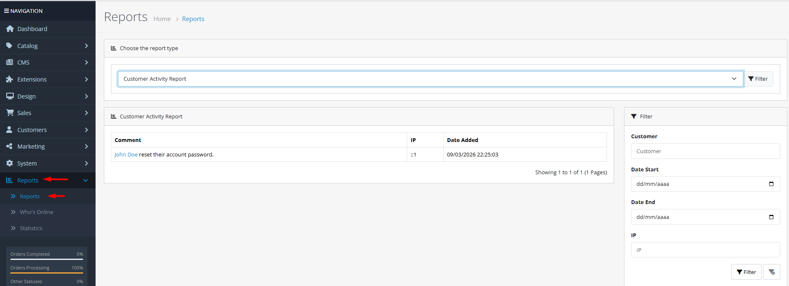

# Reports

## Introduction

The **Reports** section provides comprehensive analytics and insights into every aspect of your OpenCart store. From sales performance and customer behavior to marketing effectiveness and product popularity, these reports help you make data-driven decisions to optimize your business operations. OpenCart 4 includes a robust reporting system with multiple report types, customizable filters, and export capabilities for detailed analysis.

## Accessing Reports



#### Navigate to Reports

Log in to your admin dashboard and go to **Reports → Reports**.



#### Select Report Type

Choose from available report categories: Sales, Customers, Products, Marketing, or Subscriptions.



#### Configure Filters

Use date ranges, status filters, and grouping options to customize the report data.



## Reports Interface Overview

### Report Categories

<strong>Sales Reports</strong>

**Sales Analytics**

* **Sales Report**: Total revenue, number of orders, products sold, tax amounts grouped by time periods (day, week, month, year)
* **Shipping Report**: Shipping costs and methods used across orders with revenue analysis
* **Tax Report**: Tax collected by tax class and jurisdiction
* **Returns Report**: Product returns tracking with return status filtering
* **Coupon Report**: Effectiveness of discount coupons with usage statistics and revenue impact

**Key Metrics**

* **Revenue Tracking**: Monitor daily, weekly, monthly, and yearly sales performance
* **Order Volume**: Track number of orders and average order value
* **Tax Liability**: Calculate tax obligations for different regions
* **Return Rates**: Identify products with high return rates for quality assessment
* **Promotion Effectiveness**: Measure coupon usage and discount impact on sales

<strong>Customer Reports</strong>

**Customer Analytics**

* **Customer Registration Report**: New customer sign-ups tracked over time with grouping options (day, week, month, year)
* **Customers Online Report**: Real-time activity monitoring showing IP, customer name, last page visited, referrer, and last click time
* **Customer Activity Report**: Detailed audit trail of customer actions (logins, registrations, orders, address changes, password resets)
* **Customer Search Report**: Search terms used by customers with product matching results and category information
* **Customer Orders Report**: Individual customer purchase history with order counts, product quantities, and total spending
* **Customer Reward Points Report**: Loyalty program participation tracking with point balances and redemption patterns
* **Customer Transaction Report**: Store credit (balance) management with transaction history and customer balances

**Customer Insights**

* **Acquisition Tracking**: Monitor new customer registration trends and growth patterns
* **Retention Analysis**: Identify repeat customers and lifetime value through purchase history
* **Engagement Metrics**: Track customer login frequency, activity patterns, and real-time online presence
* **Search Behavior**: Understand customer intent through search terms and catalog gaps
* **Reward Utilization**: Optimize loyalty programs based on point accumulation and redemption patterns
* **Financial Relationships**: Monitor store credit balances and customer transaction history

<strong>Product Reports</strong>

**Product Analytics**

* **Products Purchased Report**: Best-selling products by quantity and revenue with date range filtering
* **Products Viewed Report**: Most viewed products with view counts and percentage distribution

**Inventory Insights**

* **Sales Performance**: Identify top-performing products and categories for inventory planning
* **Browse Behavior**: Understand which products attract the most customer attention
* **Conversion Rates**: Calculate view-to-purchase conversion metrics for product optimization
* **Seasonal Trends**: Identify seasonal popularity patterns for proactive stock management

<strong>Marketing Reports</strong>

**Campaign Analytics**

* **Marketing Report**: Campaign performance tracking with clicks, orders, and revenue metrics

**Marketing Insights**

* **Campaign Effectiveness**: Measure ROI on marketing campaigns through conversion analysis
* **Click-Through Rates**: Analyze campaign engagement and audience response
* **Conversion Tracking**: Track how many clicks result in completed orders
* **Code Performance**: Compare different marketing tracking codes and their sales impact

<strong>Subscription Reports</strong>

**Subscription Analytics**

* **Subscriptions Report**: Recurring revenue analysis with subscription counts, product quantities, tax, and total revenue grouped by time periods

**Subscription Insights**

* **Recurring Revenue**: Track subscription-based income and predict future revenue streams
* **Retention Metrics**: Monitor subscription renewal rates and customer loyalty
* **Churn Analysis**: Identify subscription cancellation patterns for retention improvement
* **Product Performance**: See which products perform best as subscription offerings

<strong>Additional Reports</strong>

**System Reports**

* **Statistics Report**: System-wide statistics including order counts, product counts, customer counts, and review counts with manual refresh capabilities

**Operational Insights**

* **System Health**: Monitor key metrics about your store's data integrity and performance
* **Data Maintenance**: Refresh statistical counts manually to ensure accurate reporting
* **Performance Benchmarking**: Establish baseline metrics for store growth tracking


**Data Accuracy**: Reports use actual transaction data from your database. For accurate reporting, ensure order statuses are updated promptly and returns are processed correctly. Historical data may take time to reflect recent changes due to caching.


## Common Tasks

### Generating a Sales Performance Report

To analyze your store's sales performance:

1. Navigate to **Reports → Reports** and select **Sales Report**.
2. Set **Date Start** and **Date End** to define your analysis period.
3. Choose **Group By** option (Day, Week, Month, Year) for data aggregation.
4. Select **Order Status** to include only orders in specific states.
5. Click **Filter** to generate the report.
6. Review the columns: Number of Orders, Number of Products, Tax Amount, and Total Revenue.
7. Export the data if needed for external analysis.

### Analyzing Customer Behavior Patterns

To understand customer purchasing behavior:

1. Go to **Reports → Reports** and select **Customer Order Report**.
2. Set the date range for the period you want to analyze.
3. Filter by customer status to focus on active accounts.
4. Review customer purchase frequency and average order values.
5. Identify your most valuable customers based on total spending.
6. Use this data to tailor marketing campaigns to different customer segments.

### Measuring Marketing Campaign Effectiveness

To evaluate marketing campaign performance:

1. Navigate to **Reports → Reports** and select **Marketing Report**.
2. Set the date range covering your campaign period.
3. Review the columns: Campaign Name, Code, Clicks, Orders, and Total Revenue.
4. Calculate click-through rates and conversion percentages.
5. Compare different campaigns to identify the most effective strategies.
6. Adjust future campaigns based on these insights.

### Monitoring Product Performance

To identify best-selling products:

1. Go to **Reports → Reports** and select **Products Purchased Report**.
2. Set the appropriate date range for your analysis.
3. Filter by order status to include only completed purchases.
4. Review products ranked by quantity sold and total revenue.
5. Compare with **Products Viewed Report** to identify high-interest products with low conversion.
6. Use this data for inventory planning and promotional focus.

## Best Practices

<strong>Report Optimization Strategy</strong>

**Effective Analysis**

* **Regular Review**: Schedule weekly and monthly report reviews to track performance trends.
* **Comparative Analysis**: Compare current period with previous periods to identify growth patterns.
* **Segment Analysis**: Break down reports by product category, customer group, or geographic region.
* **Actionable Insights**: Translate data findings into specific business actions (restock, promote, discontinue).
* **Performance Benchmarks**: Establish KPIs and track progress against business goals.

<strong>Data Management</strong>

**Report Accuracy**

* **Status Consistency**: Ensure orders are updated to correct statuses (Completed, Canceled, Returned) for accurate reporting.
* **Return Processing**: Process returns promptly to maintain accurate inventory and sales data.
* **Customer Data**: Keep customer information current for accurate behavioral analysis.
* **Product Information**: Maintain accurate product categories and attributes for proper segmentation.
* **Clean Data**: Regularly review and correct any data inconsistencies that could affect report accuracy.


**Data Privacy Compliance** ⚠️ When using customer data for analysis, ensure compliance with data protection regulations (GDPR, CCPA, etc.). Anonymize data when sharing reports externally and implement appropriate access controls for report viewing within your organization.


## Troubleshooting

<strong>Reports showing incorrect or missing data</strong>

**Data Accuracy Issues**

* **Order Status Check**: Verify that orders have correct statuses (Completed orders should be marked as such).
* **Date Range Verification**: Ensure the date range filter includes the period you're analyzing.
* **Cache Clearing**: Clear OpenCart cache to refresh report data.
* **Database Indexes**: Check database performance; large datasets may need optimization.
* **Extension Conflicts**: Disable recently installed extensions to check for conflicts with report calculations.

<strong>Cannot access specific report types</strong>

**Permission Issues**

* **User Permissions**: Verify your user group has permission to access the specific report type.
* **Extension Status**: Ensure the report extension is enabled in **Extensions → Extensions → Reports**.
* **User Group Settings**: Check report permissions in **System → Users → User Groups**.
* **Module Status**: Confirm the report module is installed and activated.
* **Administrator Privileges**: Some reports may require administrator-level access.

<strong>Report generation is slow or times out</strong>

**Performance Issues**

* **Date Range Reduction**: Narrow the date range for faster processing.
* **Database Optimization**: Optimize database tables, especially order and customer tables.
* **Server Resources**: Check server memory and CPU usage during report generation.
* **Caching Strategy**: Implement caching for frequently accessed reports.
* **Scheduled Reports**: Generate complex reports during off-peak hours.

<strong>Export functionality not working</strong>

**Export Issues**

* **Browser Compatibility**: Try a different browser for export functionality.
* **Popup Blockers**: Disable popup blockers that may prevent export windows.
* **File Permissions**: Check server file permissions for export directory.
* **Memory Limits**: Increase PHP memory limit for large report exports.
* **Format Support**: Ensure you're using supported export formats (CSV, Excel, PDF).

> "Data is the compass that guides business decisions. In the vast sea of e-commerce, reports are your navigation tools—showing you not just where you are, but where the currents are flowing and where the opportunities lie."
