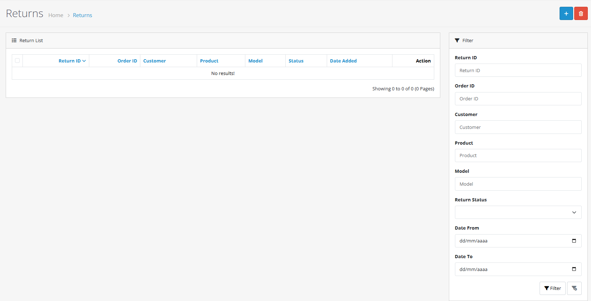
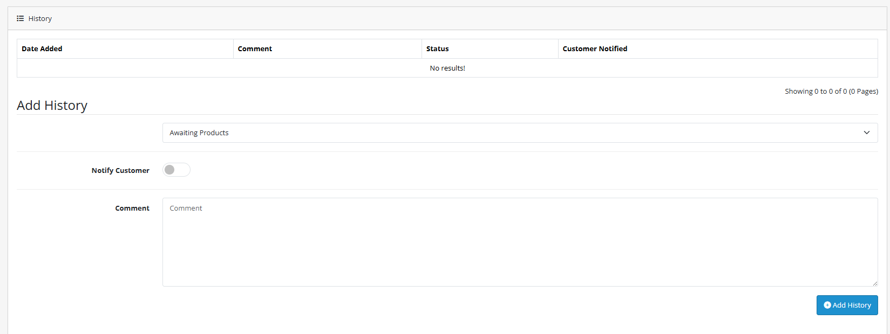
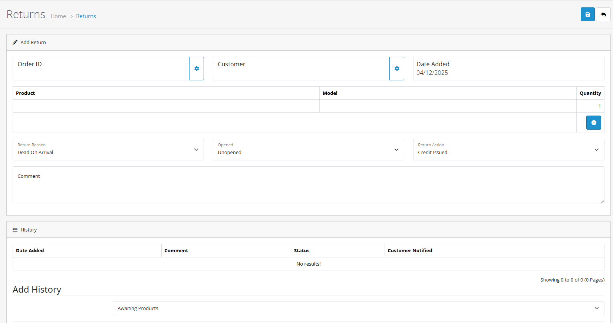

# Returns

## Introduction

The Returns section in OpenCart 4 provides a streamlined system for managing product returns, processing refunds, and handling customer service requests. This comprehensive tool helps you maintain excellent customer relationships while efficiently managing return logistics.


**Returns Workflow** Returns can be initiated by customers through their account or manually created by administrators. The system tracks return status from request to completion, ensuring proper handling of refunds and exchanges.


## Video Tutorial



_Video: Returns Management in OpenCart_

## Accessing Returns

To access the Returns section:

1. **Navigate to Sales** in the main admin menu
2. **Click on Returns** to open the returns management interface
3. **View the return list** displaying all return requests

## Returns List Overview

The main Returns page displays all return requests with the following information:

| Column         | Description                                  |
| -------------- | -------------------------------------------- |
| **Return ID**  | Unique identifier for each return request    |
| **Order ID**   | Original order number associated with return |
| **Customer**   | Customer name requesting the return          |
| **Product**    | Product being returned                       |
| **Model**      | Product model number                         |
| **Quantity**   | Quantity being returned                      |
| **Status**     | Current return status                        |
| **Date Added** | When return was requested                    |
| **Action**     | Available actions (Edit, Delete)             |

## Filtering Returns

Use filtering to quickly find specific return requests:



#### Step 1: Access Filter Options

Click the **Filter** button above the returns list to expand filtering options.



#### Step 2: Apply Search Criteria

Use any combination of the following filters:

* **Return ID**: Search by specific return number
* **Order ID**: Find returns for specific orders
* **Customer**: Search by customer name
* **Product**: Filter by product name or model
* **Return Status**: Filter by current return status
* **Date Ranges**: Filter by date added



#### Step 3: Apply and View Results

Click **Apply Filter** to display matching returns. Use **Clear Filter** to reset all criteria.



## Return Status Workflow

### Available Return Statuses

OpenCart 4 includes several return statuses to track the return process:

| Status         | Description                                  |
| -------------- | -------------------------------------------- |
| **Pending**    | Return request received, awaiting processing |
| **Processing** | Return is being reviewed and processed       |
| **Complete**   | Return processed and completed               |
| **Rejected**   | Return request denied                        |
| **Cancelled**  | Return request cancelled by customer         |

### Return Status Management



#### Step 1: Edit Return

Click **Edit** next to the return request you want to update.



#### Step 2: Navigate to Return History

Scroll to the **Return History** section at the bottom of the return details page.



#### Step 3: Update Status

* Select the new **Return Status** from the dropdown
* Add a **Comment** for internal tracking
* Check **Notify Customer** to send email notification
* Click **Add History** to save the status change



## Manual Return Creation

Create return requests manually for phone returns, in-person returns, or special situations:



#### Step 1: Start New Return

Click the **Add** button at the top of the Returns page.



#### Step 2: Customer and Order Details

* **Select Customer**: Choose existing customer or enter new customer details
* **Order ID**: Enter the original order number
* **Order Date**: Specify when the original order was placed
* **Customer Information**: Verify contact details



#### Step 3: Product Details

* **Choose Product**: Select the product being returned
* **Product Model**: Verify product model number
* **Quantity**: Enter quantity being returned
* **Opened Status**: Indicate if product packaging was opened



#### Step 4: Return Information

* **Return Reason**: Select reason for return (defective, wrong item, etc.)
* **Return Action**: Choose action (refund, exchange, credit)
* **Return Status**: Set initial return status
* **Comments**: Add any special instructions or notes



#### Step 5: Complete Return

* **Review Information**: Verify all return details
* **Save Return**: Click **Save** to create the return request



## Return Reasons and Actions

### Common Return Reasons

OpenCart 4 supports configurable return reasons. Common reasons include:

* **Received Wrong Item** - Customer received incorrect product
* **Order Error** - Wrong item was shipped
* **Product Defective** - Product arrived damaged or not working
* **No Longer Needed** - Customer changed their mind
* **Better Price Available** - Found better price elsewhere
* **Product Didn't Match Description** - Product didn't meet expectations

### Return Actions

Available actions for processing returns:

* **Refund** - Process full or partial refund
* **Credit** - Issue store credit for future purchases
* **Exchange** - Send replacement product
* **Repair** - Arrange for product repair
* **Replacement** - Send new product as replacement

## Processing Returns

### Complete Return Workflow



#### Step 1: Receive Return Request

Customer submits return request through their account or you create it manually.



#### Step 2: Review and Validate

* Verify return eligibility based on store policy
* Check product condition and packaging
* Confirm return reason is valid



#### Step 3: Update Return Status

* Set status to **Processing** while return is being handled
* Add comments for internal tracking
* Notify customer of return approval if applicable



#### Step 4: Process Refund or Exchange

* **Refund**: Process payment refund through payment gateway
* **Exchange**: Create new order for replacement product
* **Credit**: Issue store credit to customer account



#### Step 5: Complete Return

* Update status to **Complete**
* Add final comments and documentation
* Notify customer of completion



## Customer Communication

### Automated Notifications

OpenCart 4 can automatically notify customers of return status changes:

* **Return Approved** - Customer notified when return is approved
* **Status Updates** - Customer receives updates on return progress
* **Completion Notice** - Customer notified when return is complete

### Manual Communication

For complex returns, use manual communication:

* **Email Templates** - Use pre-built email templates
* **Custom Messages** - Send personalized messages to customers
* **Phone Follow-up** - Call customers for complex situations

## Return Policies and Configuration

### Return Reason Configuration

Customize return reasons in the system settings:

1. **Navigate to System > Localisation > Returns**
2. **Add/Edit Return Reasons** as needed for your business
3. **Configure Return Actions** available for processing

## Advanced Features

### Return Analytics

Track return metrics and performance:

* **Return Rates**: Monitor product return rates
* **Reason Analysis**: Analyze common return reasons
* **Customer Behavior**: Identify patterns in return behavior
* **Financial Impact**: Track cost of returns and refunds

## Troubleshooting

Common Return Issues

#### Return Not Linked to Order

* Verify order ID is correct
* Check if order exists in system
* Ensure customer account is properly linked

#### Product Not Found

* Confirm product still exists in catalog
* Check if product model number matches
* Verify product wasn't deleted or discontinued

#### Refund Processing Issues

* Confirm payment gateway supports refunds
* Check available funds for refund
* Verify customer payment method details

#### Customer Notification Problems

* Check email settings and templates
* Verify customer email address is valid
* Ensure notification settings are enabled

## Best Practices


**Returns Management Tips**

* Process returns promptly to maintain customer satisfaction
* Maintain clear communication throughout the return process
* Document all return activities for audit purposes
* Analyze return patterns to identify product quality issues
* Train staff on proper return handling procedures



**Important Considerations**

* Always verify return eligibility before processing
* Document product condition upon receipt
* Follow legal requirements for returns and refunds
* Maintain proper inventory adjustments for returned products


## Next Steps

After mastering returns processing, explore:

* [**Orders Management**](/broken/pages/vX2XfJLpz2JaWq7Q1chJ) - Complete order management system
* [**Subscription Management**](/broken/pages/G5UHirojsEns7SW2aNYG) - Handling recurring orders
* [**Customer Service**](https://github.com/wilsonatb/docs-oc-new/blob/main/admin-interface/customers/README.md) - Comprehensive customer management
