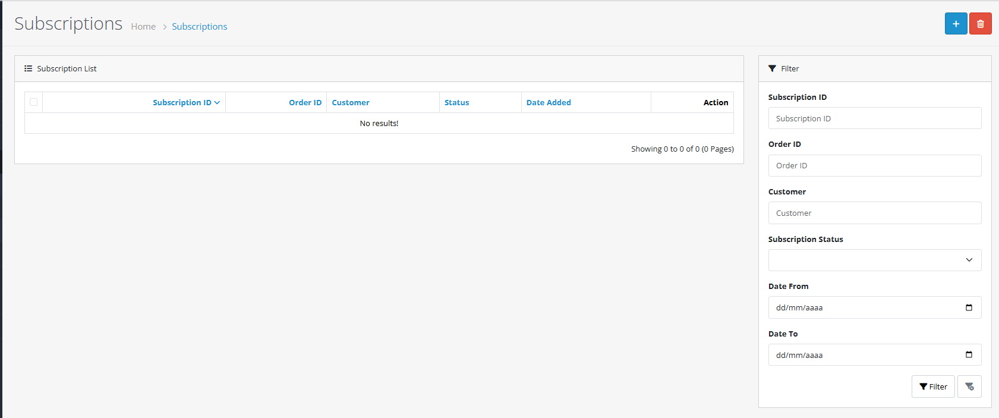
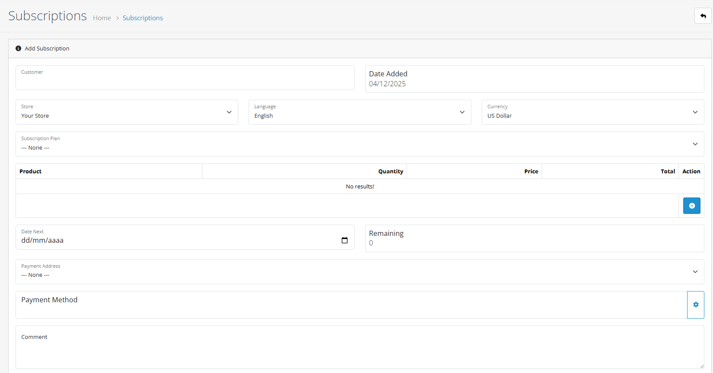

# Subscriptions

## Introduction

The Subscriptions section in OpenCart 4 provides powerful tools for managing recurring billing, subscription plans, and automated payment processing. This advanced feature enables you to offer subscription-based products and services with flexible billing cycles and comprehensive management capabilities.


**Subscription Evolution** OpenCart 4 introduces enhanced subscription management, replacing the previous "Recurring Orders" system with more robust features and better integration with payment gateways.


## Accessing Subscriptions

To access the Subscriptions section:

1. **Navigate to Sales** in the main admin menu
2. **Click on Subscriptions** to open the subscription management interface
3. **View the subscription list** displaying all active and historical subscriptions

## Subscriptions List Overview

The main Subscriptions page displays all subscription records with the following information:

| Column              | Description                                  |
| ------------------- | -------------------------------------------- |
| **Subscription ID** | Unique identifier for each subscription      |
| **Order ID**        | Original order that created the subscription |
| **Customer**        | Customer name associated with subscription   |
| **Status**          | Current subscription status                  |
| **Date Added**      | When subscription was created                |
| **Action**          | Available actions (Edit, View History)       |

## Filtering Subscriptions

Use filtering to quickly find specific subscriptions:



#### Step 1: Access Filter Options

Click the **Filter** button above the subscriptions list to expand filtering options.



#### Step 2: Apply Search Criteria

Use any combination of the following filters:

* **Subscription ID**: Search by specific subscription number
* **Order ID**: Find subscriptions from specific orders
* **Customer**: Search by customer name
* **Product**: Filter by product name or model
* **Subscription Status**: Filter by current subscription status
* **Date Ranges**: Filter by date added or next billing date



#### Step 3: Apply and View Results

Click **Apply Filter** to display matching subscriptions. Use **Clear Filter** to reset all criteria.



## Subscription Status Workflow

### Available Subscription Statuses

OpenCart 4 includes comprehensive subscription status tracking:

| Status        | Description                                   |
| ------------- | --------------------------------------------- |
| **Active**    | Subscription is active and billing normally   |
| **Inactive**  | Subscription is paused or temporarily stopped |
| **Expired**   | Subscription has reached its end date         |
| **Pending**   | Subscription awaiting activation              |
| **Suspended** | Subscription suspended due to payment issues  |
| **Cancelled** | Subscription cancelled by customer or admin   |
| **Failed**    | Subscription failed due to payment problems   |

### Subscription Status Management



#### Step 1: Edit Subscription

Click **Edit** next to the subscription you want to update.



#### Step 2: Navigate to Subscription History

Scroll to the **Subscription History** section at the bottom of the subscription details page.



#### Step 3: Update Status

* Select the new **Subscription Status** from the dropdown
* Add a **Comment** for internal tracking
* Check **Notify Customer** to send email notification
* Click **Add History** to save the status change



## Subscription Plans and Billing

### Subscription Plan Structure

Subscription plans in OpenCart 4 support flexible billing configurations:

* **Trial Periods**: Optional free or discounted trial periods
* **Recurring Billing**: Regular billing cycles (daily, weekly, monthly, yearly)
* **Duration Limits**: Set subscription duration or allow indefinite billing
* **Price Variations**: Different pricing for trial vs. regular billing

### Billing Cycle Options

| Cycle          | Description     | Use Cases                      |
| -------------- | --------------- | ------------------------------ |
| **Day**        | Daily billing   | News services, daily content   |
| **Week**       | Weekly billing  | Weekly newsletters, services   |
| **Semi-Month** | Twice monthly   | Bi-weekly services             |
| **Month**      | Monthly billing | Most subscription services     |
| **Year**       | Annual billing  | Software licenses, memberships |

## Manual Subscription Creation

Create subscriptions manually for special situations or custom arrangements:



#### Step 1: Start New Subscription

Click the **Add** button at the top of the Subscriptions page.



#### Step 2: Customer and Order Details

* **Select Customer**: Choose existing customer
* **Order ID**: Link to existing order (optional)
* **Store**: Select store location
* **Language/Currency**: Set subscription language and currency



#### Step 3: Subscription Plan

* **Subscription Plan**: Choose from available subscription plans
* **Product**: Select product for subscription
* **Options**: Configure product options if applicable
* **Quantity**: Set subscription quantity



#### Step 4: Billing Details

* **Date Next**: Set next billing date
* **Payment Method**: Choose payment method for recurring billing
* **Payment/Shipping Address**: Set addresses for billing and shipping



#### Step 5: Complete Subscription

* **Review Information**: Verify all subscription details
* **Set Status**: Choose initial subscription status
* **Save Subscription**: Click **Save** to create the subscription



## Subscription Processing

### Automatic Billing Workflow



#### Step 1: Billing Cycle Trigger

System automatically processes subscriptions based on their billing cycle and next billing date.



#### Step 2: Payment Processing

* Payment gateway attempts to charge customer
* System creates new order for successful payments
* Failed payments trigger retry logic or status changes



#### Step 3: Order Generation

* New order created with subscription products
* Order status set based on payment success
* Customer notified of successful billing



#### Step 4: Next Billing Date Update

* System calculates and sets next billing date
* Subscription status updated if needed
* Log entry created for billing cycle



### Manual Subscription Management

For subscriptions requiring manual intervention:

* **Process Single Subscription**: Manually trigger billing for specific subscriptions
* **Bulk Processing**: Process multiple subscriptions at once
* **Override Billing Dates**: Adjust next billing dates as needed
* **Payment Retry**: Manually retry failed payments

## Subscription History and Logs

### Comprehensive Tracking

OpenCart 4 maintains detailed subscription records:

* **Billing History**: Complete record of all billing attempts
* **Status Changes**: Timeline of subscription status updates
* **Payment Logs**: Detailed payment gateway responses
* **Customer Actions**: Customer-initiated changes and cancellations

### Accessing Subscription Logs

1. **Edit Subscription** you want to review
2. **Navigate to Logs tab** to view detailed transaction history
3. **Review billing attempts**, payment responses, and system actions

## Troubleshooting

Common Subscription Issues

#### Payment Processing Failures

* Verify payment gateway supports recurring billing
* Check customer payment method is valid
* Ensure sufficient funds are available
* Confirm payment gateway configuration

#### Subscription Not Billing

* Check next billing date is set correctly
* Verify subscription status is Active
* Ensure payment gateway is properly configured
* Check for system cron job issues

#### Customer Access Problems

* Verify customer account is active
* Check subscription status allows access
* Confirm product availability and pricing
* Ensure proper user permissions

#### Billing Date Issues

* Verify timezone settings are correct
* Check subscription plan duration settings
* Ensure billing cycle calculations are accurate
* Confirm manual overrides haven't affected dates

## Best Practices


**Subscription Management Tips**

* Monitor subscription health metrics regularly
* Proactively address payment failures to reduce churn
* Provide clear communication for subscription changes
* Maintain detailed audit trails for billing activities
* Test subscription workflows thoroughly before launch



**Important Considerations**

* Ensure compliance with subscription billing regulations
* Maintain clear cancellation and refund policies
* Monitor payment gateway reliability and uptime
* Keep accurate records for accounting and auditing
* Plan for subscription lifecycle management


## Next Steps

After mastering subscription management, explore:

* [**Orders Management**](/broken/pages/vX2XfJLpz2JaWq7Q1chJ) - Complete order processing system
* [**Returns Processing**](/broken/pages/zolHwG44CZrAZRfYgUfn) - Handling product returns
* [**Payment Gateway Configuration**](https://github.com/wilsonatb/docs-oc-new/blob/main/admin-interface/extensions/payments/README.md) - Setting up recurring billing
* [**Customer Management**](https://github.com/wilsonatb/docs-oc-new/blob/main/admin-interface/customers/README.md) - Comprehensive customer relationship management
