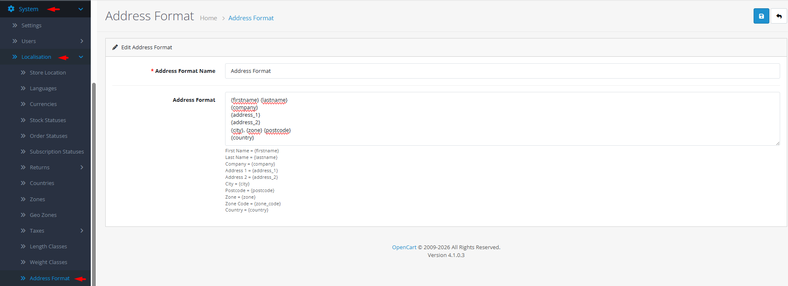

# Address Formats

## Introduction

The **Address Formats** section allows you to create and manage address format templates that control how customer addresses are displayed throughout your store. These templates use placeholders for address components (name, street, city, etc.) and can be assigned to countries to ensure addresses follow local formatting conventions. Consistent address formatting improves readability in orders, invoices, shipping labels, and customer communications.

## Accessing Address Formats Management



#### Navigate to Address Formats

Log in to your admin dashboard and go to **System → Localization → Address Formats**.



#### Address Format List

You will see a list of all defined address format templates with their names, previews, and default status indicators.



#### Manage Address Formats

Use the **Add New** button to create a new address format template or click **Edit** on any existing format to modify its settings.



## Address Format Interface Overview



### Address Format Configuration Fields

<details>

<summary><strong>Basic Format Information</strong></summary>

**Template Identification**

* **Address Format Name**: **(Required)** A descriptive name for the format template (e.g., "US Standard Format", "European Multiline", "UK Compact"). Maximum 128 characters.
* **Address Format Template**: The actual format pattern using placeholders for address components. Line breaks create multi-line addresses in display.

</details>

<details>

<summary><strong>Available Placeholders</strong></summary>

**Address Component Variables**

* **{firstname}**: Customer's first name
* **{lastname}**: Customer's last name
* **{company}**: Company name (optional)
* **{address\_1}**: Primary address line (street and number)
* **{address\_2}**: Secondary address line (apartment, suite, etc.)
* **{city}**: City or locality name
* **{postcode}**: Postal/ZIP code
* **{zone}**: State/region/province name
* **{zone\_code}**: State/region/province code (abbreviation)
* **{country}**: Country name

**Example Format (US Standard):**

```
{firstname} {lastname}
{company}
{address_1}
{address_2}
{city}, {zone} {postcode}
{country}
```

**Example Format (European Single Line):**

```
{firstname} {lastname}, {address_1}, {postcode} {city}, {country}
```

</details>


**Placeholder Usage**: Placeholders must use exact spelling and braces as shown. The system replaces them with actual customer data when displaying addresses. You can include text, punctuation, and line breaks (`\n`) around placeholders for proper formatting.


## Common Tasks

### Creating a New Address Format Template

To define a custom address display format:

1. Navigate to **System → Localization → Address Formats** and click **Add New**.
2. Enter a descriptive **Address Format Name** (e.g., "Japan Vertical Format").
3. In the **Address Format Template** field, create your format using placeholders.
4. Arrange placeholders in the order they should appear, adding line breaks (`\n`) for multi-line addresses.
5. Include any necessary punctuation (commas, spaces, hyphens) between placeholders.
6. Click **Save**. The new format will be available for assignment to countries.

### Assigning Address Formats to Countries

To apply a format template to specific countries:

1. Navigate to **System → Localization → Countries** and edit the target country.
2. In the **Address Format** dropdown, select the appropriate format template.
3. Save the country settings.
4. Repeat for all countries that should use the same address format.
5. Test by creating a customer address with that country to verify the formatting.

### Setting the Default Address Format

To establish a fallback format for countries without specific assignments:

1. Identify which address format should be the default (usually your most common format).
2. Note its **Address Format ID** from the list (the default format is marked with "(Default)").
3. Configure the `config_address_format_id` setting in your store's configuration (may require technical access).
4. The default format will be used for any country without an explicitly assigned format.

## Best Practices

<details>

<summary><strong>Template Design Guidelines</strong></summary>

**Effective Formatting**

* **Research Local Standards**: Study address formats for each country/region you serve.
* **Consistent Line Breaks**: Use consistent line breaks for readability in printed materials.
* **Optional Components**: Consider making {company} and {address\_2} conditional if not always needed.
* **Testing with Real Data**: Test formats with realistic address examples before deployment.
* **Multi-language Considerations**: Ensure formats work with accented characters and right-to-left languages if applicable.

</details>

<details>

<summary><strong>Template Management Strategy</strong></summary>

**Organizational Approach**

* **Reusable Templates**: Create generic templates (e.g., "North American", "European", "Asian") that can be shared across multiple countries.
* **Country-Specific Variations**: Only create unique formats when standard templates don't meet local requirements.
* **Version Control**: Keep track of format changes, especially if they affect printed materials or legal documents.
* **Documentation**: Document which countries use each format for easy reference.

</details>


**Deletion Warning** ⚠️ Never delete an address format that is: 1) set as the default format (`config_address_format_id`), 2) assigned to any countries, or 3) currently in use by customer addresses. Check all error messages and reassign dependencies before deletion.


## Troubleshooting

<details>

<summary><strong>Cannot delete an address format</strong></summary>

**Dependency Issues**

* **Default Format**: The format may be set as the default in system configuration.
* **Country Assignments**: One or more countries may be using this format. Check the error message for country count.
* **Solution**: Reassign countries to another format and change the default format before deletion.

</details>

<details>

<summary><strong>Address placeholders not displaying correctly</strong></summary>

**Template Syntax Issues**

* **Typographical Errors**: Verify placeholder spelling (e.g., `{firstname}` not `{first_name}`).
* **Missing Braces**: Ensure all placeholders have both opening `{` and closing `}`.
* **Line Break Encoding**: Use `\n` for new lines, not actual line breaks in the template field.
* **Special Characters**: Test with addresses containing special characters or accented letters.

</details>

<details>

<summary><strong>Address format not appearing in country dropdown</strong></summary>

**Availability Issues**

* **Status Check**: Verify the address format exists and is saved correctly.
* **Cache Issues**: Clear OpenCart cache to refresh available format lists.
* **Database Consistency**: Ensure the address\_format table has proper records (may require technical verification).

</details>

<details>

<summary><strong>Mixed formatting in multi-country orders</strong></summary>

**Consistency Issues**

* **Country Assignments**: Verify each country has the correct address format assigned.
* **Default Format**: Check that the default format is appropriate for unassigned countries.
* **Testing Strategy**: Test orders with addresses from different countries to identify formatting inconsistencies.
* **Zone Considerations**: Some countries may have regional variations not covered by national formats.

</details>

> "An address is more than coordinates—it's a connection point between you and your customer. A well-formatted address shows respect for local conventions and attention to detail that builds trust across borders."
