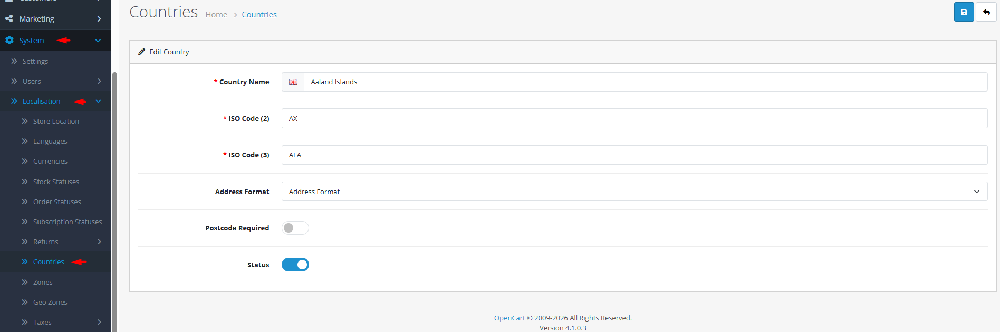

# Countries

## Introduction

The **Countries** section allows you to manage the countries available for customer addresses, shipping, and tax calculations. Each country definition includes ISO codes, address formatting rules, and postal code requirements. Proper country configuration ensures accurate address collection, correct tax applications, and valid shipping options for international customers.

## Accessing Countries Management



#### Navigate to Countries

Log in to your admin dashboard and go to **System → Localization → Countries**.



#### Country List

You will see a list of all defined countries with their names, ISO codes, and status.



#### Manage Countries

Use the **Add New** button to create a new country or click **Edit** on any existing country to modify its settings.



## Country Interface Overview



### Country Configuration Fields

<details>

<summary><strong>Basic Country Information</strong></summary>

**Identification**

* **Country Name**: **(Required)** The full name of the country (e.g., "United States", "United Kingdom", "Germany")
* **ISO Code (2)**: **(Required)** Two-letter ISO country code (e.g., "US", "GB", "DE")
* **ISO Code (3)**: **(Required)** Three-letter ISO country code (e.g., "USA", "GBR", "DEU")
* **Status**: Enable or disable the country for customer selection

</details>

<details>

<summary><strong>Address Configuration</strong></summary>

**Formatting Rules**

* **Address Format**: Custom address display template using placeholders
* **Postcode Required**: Enable to require postal/zip codes for addresses in this country

</details>

<details>

<summary><strong>Address Format Placeholders</strong></summary>

**Template Variables**

* **{firstname}**: Customer's first name
* **{lastname}**: Customer's last name
* **{company}**: Company name
* **{address\_1}**: Primary address line
* **{address\_2}**: Secondary address line
* **{city}**: City name
* **{postcode}**: Postal/ZIP code
* **{zone}**: State/region name
* **{zone\_code}**: State/region code
* **{country}**: Country name

**Example Format:**

```
{firstname} {lastname}
{company}
{address_1}
{address_2}
{city}, {zone} {postcode}
{country}
```

</details>


**ISO Code Standards**: Use official ISO 3166-1 codes for consistency with payment gateways, shipping carriers, and tax services. Incorrect codes can cause integration issues with external systems.


## Common Tasks

### Adding a New Country for Expanded Operations

To start selling to a new country:

1. Navigate to **System → Localization → Countries** and click **Add New**.
2. Enter the **Country Name** in English (consider translations for multi-language stores).
3. Set both **ISO Code (2)** and **ISO Code (3)** using official codes.
4. Configure **Address Format** based on the country's standard address layout.
5. Set **Postcode Required** based on whether the country uses postal codes.
6. Set **Status** to "Enabled" to make it available to customers.
7. Click **Save**. The country will appear in address forms and checkout.

### Configuring Country-Specific Address Formats

To ensure addresses display correctly:

1. Research the standard address format for the country.
2. Edit the country and modify the **Address Format** field.
3. Use placeholders to arrange address components logically.
4. Include line breaks (`\n`) for multi-line formatting.
5. Test by creating a customer address with that country.
6. Verify the formatted address appears correctly in orders and emails.

### Managing Country Availability

To control where you ship or sell:

1. **Disable countries** you don't ship to by setting Status to "Disabled".
2. **Enable countries** as you expand your shipping zones.
3. **Coordinate with shipping extensions** to ensure only enabled countries appear in shipping options.

## Best Practices

<details>

<summary><strong>International Expansion Strategy</strong></summary>

**Global Readiness**

* **Research First**: Before adding a country, research its tax requirements, shipping options, and address standards.
* **Progressive Enablement**: Enable countries gradually as you establish reliable shipping to those regions.
* **Legal Compliance**: Ensure you understand and comply with local consumer protection laws.
* **Currency Alignment**: Add corresponding currencies when enabling new countries.

</details>

<details>

<summary><strong>Data Integrity</strong></summary>

**Accurate Configuration**

* **ISO Code Verification**: Double-check ISO codes against official sources.
* **Address Format Testing**: Test address formatting with real examples.
* **Postal Code Validation**: Implement postal code validation patterns where possible.
* **Regular Updates**: Update country information when political changes occur (new countries, renamed countries).

</details>


**Deletion Warning** ⚠️ Never delete a country that is: 1) set as default store country, 2) assigned to stores, 3) used in customer addresses, 4) has zones defined, or 5) used in geo zones. Check all error messages and reassign dependencies before deletion.


## Troubleshooting

<details>

<summary><strong>Country not appearing in checkout address dropdown</strong></summary>

**Visibility Issues**

* **Status Check**: Verify the country is **Enabled**.
* **Store Assignment**: In multi-store setups, ensure the country is available to the specific store.
* **Shipping Restrictions**: Some shipping extensions filter countries based on shipping zones.
* **Cache**: Clear OpenCart cache to refresh country lists.

</details>

<details>

<summary><strong>Address formatting incorrectly in orders/emails</strong></summary>

**Format Template Issues**

* **Placeholder Spelling**: Verify all placeholders use correct spelling and braces.
* **Line Breaks**: Ensure line breaks (`\n`) are included where needed.
* **Missing Components**: Include all necessary address components in the template.
* **Special Characters**: Test with addresses containing special characters or accented letters.

</details>

<details>

<summary><strong>Cannot delete a country</strong></summary>

**Dependency Issues**

* **Default Country**: The country may be set as default in store settings.
* **Customer Addresses**: The country may be used in customer address books.
* **Zones**: The country may have zones (states/regions) defined.
* **Geo Zones**: The country may be included in geo zones for shipping/tax.
* **Solution**: Reassign all dependencies to another country before deletion.

</details>

<details>

<summary><strong>Postal code validation issues</strong></summary>

**Validation Configuration**

* **Postcode Required Setting**: Verify the "Postcode Required" setting matches actual requirements.
* **Validation Patterns**: Consider extensions that add country-specific postal code validation.
* **Customer Education**: Provide examples of valid postal codes for the country.
* **Testing**: Test with valid and invalid postal codes to ensure proper validation.

</details>

> "Countries are more than geographical boundaries—they're cultural contexts, legal frameworks, and market opportunities. Each country you add represents a new community you're welcoming into your store."
