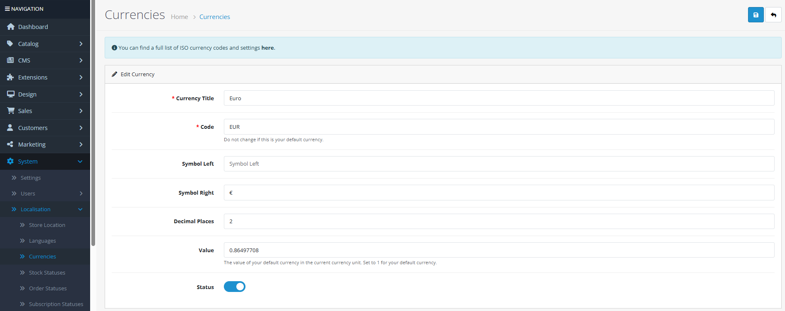

# Currencies

## Introduction

The **Currencies** section allows you to manage the currencies available in your OpenCart store. You can add multiple currencies for international customers, configure exchange rates (manual or automatic), and define display formats including symbol placement and decimal precision. Each currency can be assigned to specific stores in multi-store setups.

## Accessing Currencies Management



#### Navigate to Currencies

Log in to your admin dashboard and go to **System → Localization → Currencies**.



#### Currency List

You will see a list of all configured currencies with their titles, codes, exchange rates, and status.



#### Manage Currencies

Use the **Add New** button to create a new currency or click **Edit** on any existing currency to modify its settings.



## Currency Interface Overview

### Currency Configuration Fields

<strong>Basic Currency Information</strong>

**Core Settings**

* **Currency Title**: **(Required)** The display name of the currency (e.g., "US Dollar", "Euro", "British Pound")
* **Code**: **(Required)** ISO 4217 currency code (3 characters, e.g., "USD", "EUR", "GBP")
* **Value**: **(Required)** Exchange rate relative to your default currency (set to 1.00000 for default currency)
* **Status**: Enable or disable the currency in storefront dropdowns
* **Decimal Places**: Number of decimal digits to display (typically 2, but varies by currency)

<strong>Display Format Configuration</strong>

**Symbol and Formatting**

* **Symbol Left**: Currency symbol displayed before the amount (e.g., "$", "€", "£")
* **Symbol Right**: Currency symbol displayed after the amount (e.g., "Kr", "฿", "¥")
* **Decimal Places**: Controls price precision (e.g., 2 for $10.99, 0 for ¥1000)
* **Auto-Update**: Option to automatically update exchange rates from external services

<strong>Exchange Rate Management</strong>

**Rate Configuration**

* **Default Currency**: The currency with value = 1.00000 serves as your base currency
* **Manual Rates**: Enter exchange rates manually for full control
* **Automatic Updates**: Configure cron jobs or manual refresh to update rates from financial APIs
* **Rate Accuracy**: Update rates regularly for accurate pricing (especially important for volatile currencies)

**ISO Currency Codes**: Use standard ISO 4217 codes for compatibility with payment gateways and financial systems.

## Common Tasks

### Adding a New Currency for International Customers

To accept payments in a different currency:

1. Navigate to **System → Localization → Currencies** and click **Add New**.
2. Enter the **Currency Title** (e.g., "Japanese Yen").
3. Set the **Code** to the ISO code (e.g., "JPY").
4. Configure the **Value** (exchange rate relative to your default currency).
5. Set **Symbol Left** or **Symbol Right** as appropriate (e.g., "¥" as symbol left).
6. Specify **Decimal Places** (0 for JPY, 2 for most other currencies).
7. Set **Status** to "Enabled" to make it available in the storefront.
8. Click **Save**. The new currency will appear in your store's currency switcher.

### Configuring a Multi-Currency Store

For stores operating in multiple countries:

1. Add all required currencies with correct codes and symbols.
2. Set appropriate decimal places for each currency.
3. Configure exchange rates (manual or automatic).
4. Enable the currency switcher in your theme.
5. Test checkout and payment processing in each currency.
6. Consider implementing geo-location to automatically suggest currencies.

## Best Practices

<strong>Currency Management Strategy</strong>

**International Pricing**

* **Base Currency**: Choose a stable base currency (often your home country currency).
* **Rate Updates**: Update exchange rates regularly—daily for volatile currencies, weekly for stable ones.
* **Price Rounding**: Consider implementing price rounding rules for psychological pricing (e.g., $9.99 instead of $9.87).
* **Payment Gateway Support**: Verify that your payment gateways support all enabled currencies.

<strong>Technical Configuration</strong>

**System Integration**

* **Cron Jobs**: Set up automated exchange rate updates via cron for accuracy.
* **Cache Management**: Clear OpenCart cache after currency modifications.
* **Decimal Consistency**: Ensure all currencies use consistent decimal handling in calculations.
* **Tax Calculation**: Verify tax calculations work correctly with currency conversions.


**Deletion Warning** ⚠️ Never delete a currency that is assigned as the default store currency or used in existing orders. Instead, disable it. Deleting a currency in use will cause display issues and financial reporting problems.


## Troubleshooting

<strong>Currency not appearing in storefront dropdown</strong>

**Visibility Issues**

* **Status Check**: Verify the currency is **Enabled** in the currency settings.
* **Store Assignment**: In multi-store setups, ensure the currency is assigned to the specific store.
* **Theme Support**: Check if your theme includes the currency switcher functionality.
* **Cache**: Clear OpenCart cache and browser cache to refresh the display.

<strong>Incorrect exchange rate calculations</strong>

**Rate Configuration Issues**

* **Default Currency**: Ensure one currency has value = 1.00000 as the base reference.
* **Rate Direction**: Verify rates are configured correctly (e.g., 1 USD = 0.85 EUR, not 1 EUR = 1.18 USD).
* **Automatic Updates**: Check if automatic updates are functioning (cron job status, API key validity).
* **Rounding Errors**: Monitor for cumulative rounding errors in cart calculations.

<strong>Cannot delete a currency</strong>

**Dependency Issues**

* **Default Currency**: The currency may be set as the default store currency in **System → Settings → Edit Store → Local** tab.
* **Store Assignment**: The currency may be assigned to one or more stores in a multi-store setup.
* **Order History**: The currency may be used in existing customer orders.
* **Solution**: Reassign affected stores/orders to a different currency before attempting deletion.

<strong>Payment gateway currency mismatch</strong>

**Gateway Compatibility**

* **Supported Currencies**: Verify your payment gateway supports the currency code you're using.
* **Conversion Handling**: Check if the gateway handles currency conversion or if OpenCart should convert.
* **Decimal Places**: Ensure gateway and OpenCart use the same decimal precision.
* **Test Transactions**: Perform test transactions in each currency before going live.

> "Currencies are more than numbers—they're symbols of economic trust. Each currency you support represents a commitment to customers in that economy, while accurate exchange rates demonstrate your attention to fair value."
