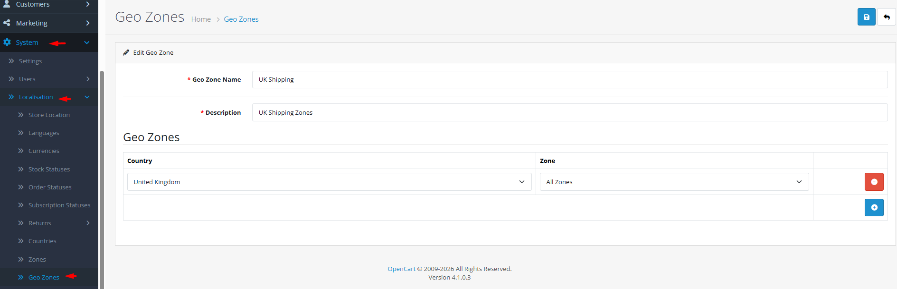

# Geo Zones

## Introduction

**Geo Zones** are custom geographical groupings that combine countries and their zones (states/regions) into logical sets for applying shipping rules, tax rates, or other regional restrictions. Unlike individual countries or zones, geo zones allow you to create cross-border regions like "European Union", "North America", or "Asian Shipping Zone". This flexibility is essential for businesses with complex regional pricing or shipping strategies.

## Accessing Geo Zones Management



#### Navigate to Geo Zones

Log in to your admin dashboard and go to **System → Localization → Geo Zones**.



#### Geo Zone List

You will see a list of all defined geo zones with their names and descriptions.



#### Manage Geo Zones

Use the **Add New** button to create a new geo zone or click **Edit** on any existing geo zone to modify its composition.



## Geo Zone Interface Overview

### Geo Zone Configuration Fields

<strong>Basic Geo Zone Information</strong>

**Identification**

* **Geo Zone Name**: **(Required)** Descriptive name for the geographical grouping (e.g., "European Union", "North America", "Free Shipping Zone")
* **Description**: Optional notes about the geo zone's purpose or coverage

<strong>Geographical Composition</strong>

**Zone Membership**

* **Country**: Select a country to include in the geo zone
* **Zone**: Select specific zones within the country (or "All Zones" for the entire country)
* **Multiple Entries**: Add multiple country/zone combinations to build complex geographical sets

**Composition Examples:**

* **Single Country, All Zones**: Entire country (e.g., all states in USA)
* **Single Country, Specific Zones**: Selected regions only (e.g., California and New York only)
* **Multiple Countries, All Zones**: Cross-border region (e.g., all of EU member countries)
* **Mixed Composition**: Combination of entire countries and specific zones


**Hierarchical Selection**: When you select a country, the zone dropdown updates to show only zones from that country. Select "All Zones" to include the entire country in the geo zone.


## Common Tasks

### Creating a Regional Shipping Zone

To offer flat-rate shipping to a specific region:

1. Navigate to **System → Localization → Geo Zones** and click **Add New**.
2. Enter a **Geo Zone Name** like "European Shipping Zone".
3. Add a **Description** explaining coverage (e.g., "EU member countries for standard shipping").
4. For each country in the region:
   * Select the **Country** from dropdown.
   * Choose **All Zones** or select specific zones.
   * Click the **+** button to add to the list.
5. Repeat for all countries/zones in the region.
6. Click **Save**. The geo zone is now available in shipping method configuration.

### Setting Up a Tax Zone for Multiple States/Provinces

To apply the same tax rate to a group of regions:

1. Create a geo zone containing all zones with the same tax rate.
2. Name it descriptively (e.g., "California Sales Tax Zone").
3. Add only the specific zones that share the tax rate.
4. In **System → Localization → Tax Rates**, create a tax rate assigned to this geo zone.
5. Test checkout with addresses in different zones to verify tax calculation.

## Best Practices

<strong>Geo Zone Design Strategy</strong>

**Logical Groupings**

* **Business-Aligned**: Create geo zones that match your business operations and logistics.
* **Clear Naming**: Use names that clearly indicate the zone's purpose and coverage.
* **Documentation**: Use the description field to explain why the zone exists and how it's used.
* **Minimal Overlap**: Avoid overlapping geo zones when possible to prevent rule conflicts.

<strong>Maintenance and Updates</strong>

**Sustainable Management**

* **Regular Review**: Periodically review geo zones to ensure they still match your operational needs.
* **Political Changes**: Update geo zones when countries change (new countries, border changes).
* **Usage Tracking**: Note which extensions use each geo zone for easier troubleshooting.
* **Backup Configuration**: Export geo zone configurations before major changes.


**Deletion Warning** ⚠️ Never delete a geo zone that is assigned to tax rates, shipping methods, or other extensions. Check the error message for specific assignments and reassign before deletion.


## Troubleshooting

<strong>Geo zone not appearing in shipping/tax configuration</strong>

**Availability Issues**

* **Save Confirmation**: Ensure the geo zone was successfully saved.
* **Extension Compatibility**: Verify the extension supports geo zone selection.
* **Cache**: Clear OpenCart cache to refresh available options.
* **Module Status**: Check that the shipping/tax module is enabled and configured.

<strong>Address not matching geo zone rules</strong>

**Composition Issues**

* **Zone Membership**: Verify the address's specific zone is included in the geo zone.
* **Country Status**: Ensure the country and zone are enabled in their respective configurations.
* **Exact Matching**: Geo zones require exact country and zone matches (case-sensitive codes).
* **Testing**: Test with exact address details to identify mismatches.

<strong>Cannot delete a geo zone</strong>

**Dependency Issues**

* **Tax Rate Assignment**: The geo zone may be assigned to one or more tax rates.
* **Shipping Method Assignment**: The geo zone may be used in shipping method configurations.
* **Other Extensions**: Check if any other extensions use the geo zone.
* **Solution**: Reassign all dependencies to another geo zone before deletion.

<strong>Complex geo zone not working as expected</strong>

**Configuration Issues**

* **Overlapping Rules**: Multiple geo zones might create conflicting rules.
* **Order of Evaluation**: Some extensions evaluate geo zones in specific orders.
* **"All Zones" vs Specific Zones**: Using "All Zones" includes future zones added to the country.
* **Testing Strategy**: Test with addresses at the boundaries of your geo zones to ensure correct inclusion/exclusion.

> "Geo zones are the strategic geography of your business—where logistics meet policy, and where regional complexities are simplified into actionable rules. Each geo zone you create represents a deliberate decision about how geography shapes your customer experience."
