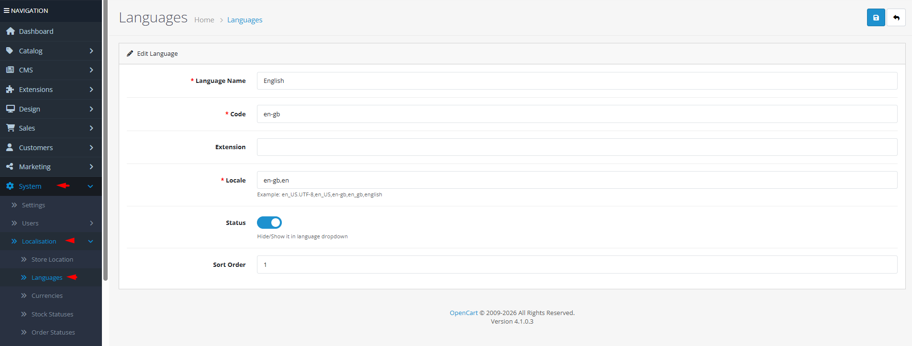

# Languages

## Introduction

The **Languages** section allows you to manage the languages available in your OpenCart store. You can add multiple languages for international customers, configure locale settings for proper date and number formatting, and enable/disable languages as needed. Each language can be assigned to specific stores in multi-store setups.

## Accessing Languages Management



#### Navigate to Languages

Log in to your admin dashboard and go to **System → Localization → Languages**.



#### Language List

You will see a list of all configured languages with their names, codes, sort order, and status.



#### Manage Languages

Use the **Add New** button to create a new language or click **Edit** on any existing language to modify its settings.



## Language Interface Overview

### Language Configuration Fields

<strong>Basic Language Information</strong>

**Core Settings**

* **Language Name**: **(Required)** The display name of the language (e.g., "English", "Español", "Français")
* **Code**: **(Required)** ISO language code (2-5 characters, e.g., "en", "es", "fr", "de")
* **Locale**: **(Required)** Locale string for date/number formatting (e.g., "en\_US.UTF-8", "es\_ES", "fr\_FR")
* **Extension**: The language pack extension name (usually matches the code)
* **Status**: Enable or disable the language in storefront dropdowns
* **Sort Order**: Display order in language selector lists

<strong>Locale Configuration</strong>

**Regional Formatting**

* **Locale Examples**: Common locale formats include:
  * English (US): `en_US.UTF-8` or `en_US`
  * English (UK): `en_GB.UTF-8` or `en_GB`
  * Spanish (Spain): `es_ES.UTF-8`
  * French (France): `fr_FR.UTF-8`
* **Multiple Locales**: You can specify multiple locales separated by commas for fallback support
* **UTF-8 Recommendation**: Always use UTF-8 locales for proper character encoding support


**Locale Importance**: The locale setting affects date formats, number formatting, currency display, and text direction (LTR/RTL). Ensure you use the correct locale for each language to provide an authentic regional experience.


## Common Tasks

### Adding a New Language for International Customers

To support customers from a different country or region:

1. Navigate to **System → Localization → Languages** and click **Add New**.
2. Enter the **Language Name** in both English and native form (e.g., "Español (Spanish)").
3. Set the **Code** to the appropriate ISO code (e.g., "es" for Spanish).
4. Configure the **Locale** based on the target region (e.g., "es\_ES.UTF-8" for Spain, "es\_MX.UTF-8" for Mexico).
5. Set **Status** to "Enabled" to make it available in the storefront.
6. Adjust **Sort Order** to control display position in language selectors.
7. Click **Save**. The new language will appear in your store's language switcher.

### Setting Up Right-to-Left (RTL) Languages

For languages that read right-to-left (Arabic, Hebrew, etc.):

1. Add the language with the correct code and locale (e.g., "ar" for Arabic).
2. Install a theme that supports RTL styling or ensure your theme has RTL CSS.
3. Configure the locale to use an RTL-aware locale string.
4. Test the storefront to ensure text alignment and layout work correctly.

### Disabling a Language Without Deleting It

If you need to temporarily remove a language from customer view:

1. Edit the language you want to hide.
2. Set **Status** to "Disabled".
3. Click **Save**. The language will no longer appear in language selectors but all translations remain intact.

## Best Practices

<strong>Language Management Strategy</strong>

**Internationalization Planning**

* **Complete Translation**: Add a language only when you have translations for all essential store elements (categories, products, information pages).
* **Locale Accuracy**: Research the correct locale format for each language/region combination.
* **Language Packs**: Consider installing complete language packs from the OpenCart extension marketplace for better translation coverage.
* **Default Language**: Always keep at least one language enabled as the default fallback.

<strong>Technical Configuration</strong>

**System Integration**

* **UTF-8 Consistency**: Ensure your database, PHP, and web server are all configured for UTF-8 encoding.
* **Locale Availability**: Verify that the specified locale is installed on your server (check with `locale -a` on Linux servers).
* **Language Files**: Manual translations require creating language files in `catalog/language/[code]/` and `admin/language/[code]/` directories.
* **Cache Management**: Clear the OpenCart cache after adding or modifying languages to ensure changes take effect.


**Deletion Warning** ⚠️ Never delete a language that is assigned as the default store language, admin language, or used in existing orders. Instead, disable it. Deleting a language in use will cause display issues and data inconsistencies.


## Troubleshooting

<strong>Language not appearing in storefront dropdown</strong>

**Visibility Issues**

* **Status Check**: Verify the language is **Enabled** in the language settings.
* **Store Assignment**: In multi-store setups, ensure the language is assigned to the specific store.
* **Theme Support**: Check if your theme includes the language switcher functionality.
* **Cache**: Clear OpenCart cache and browser cache to refresh the display.

<strong>Incorrect date/number formatting</strong>

**Locale Configuration Issues**

* **Locale Format**: Verify the locale string follows the correct format (e.g., `en_US.UTF-8`).
* **Server Support**: Check if the locale is installed on your server with `locale -a` command.
* **Multiple Locales**: Try using a simpler locale string or provide multiple fallback locales separated by commas.
* **PHP Configuration**: Ensure PHP's `setlocale()` function supports your specified locale.

<strong>Cannot delete a language</strong>

**Dependency Issues**

* **Default Language**: The language may be set as the default store language in **System → Settings → Edit Store → Local** tab.
* **Admin Language**: The language may be set as the administration language in your user preferences.
* **Store Assignment**: The language may be assigned to one or more stores in a multi-store setup.
* **Order History**: The language may be used in existing customer orders.
* **Solution**: Reassign affected stores/orders to a different language before attempting deletion.

<strong>Special characters displaying incorrectly</strong>

**Encoding Issues**

* **UTF-8 Configuration**: Ensure your database tables use UTF-8mb4 character set.
* **HTML Meta Tags**: Verify your theme includes `<meta charset="UTF-8">` in the header.
* **Language Files**: Check that language files are saved with UTF-8 encoding (without BOM).
* **PHP Settings**: Confirm PHP is configured with default charset UTF-8.

> "Languages are more than just translations—they're cultural bridges. Each language you add opens your store to new communities, while proper locale settings ensure those communities feel truly at home."
