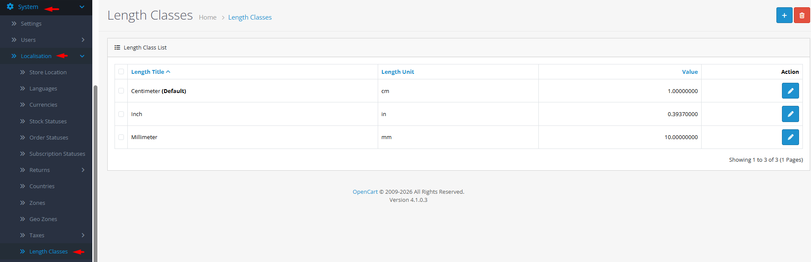

# Length Classes

## Introduction

**Length Classes** define the measurement units used for product dimensions (length, width, height) in your store. Each class includes a title (e.g., "Centimeter"), a unit abbreviation (e.g., "cm"), and a conversion value relative to your default length unit. This system allows customers to view product dimensions in their preferred measurement system while maintaining consistent data internally.

## Accessing Length Classes Management



#### Navigate to Length Classes

Log in to your admin dashboard and go to **System → Localization → Length Classes**.



#### Length Class List

You will see a list of all defined length classes with their titles, units, and conversion values.



#### Manage Length Classes

Use the **Add New** button to create a new length class or click **Edit** on any existing class to modify its settings.



## Length Class Interface Overview

### Length Class Configuration Fields

<strong>Basic Length Class Information</strong>

**Core Settings**

* **Length Title**: **(Required)** Descriptive name of the measurement unit (e.g., "Centimeter", "Inch", "Meter", "Foot")
* **Length Unit**: **(Required)** Abbreviation or symbol (1-4 characters, e.g., "cm", "in", "m", "ft")
* **Value**: **(Required)** Conversion rate relative to default length unit (set to 1.00000000 for default)

<strong>Conversion Value Logic</strong>

**Relative Measurement System**

* **Default Unit**: One length class has value = 1.00000000 (your base measurement unit).
* **Conversion Rates**: Other units have values representing how many of that unit equal one default unit.
* **Example**: If centimeter is default (value=1), inch would have value ≈ 0.393701 (since 1 cm = 0.393701 inches).
* **Reverse Calculation**: The system automatically converts between units using these ratios.


**Default Unit Strategy**: Choose a default length unit that matches your internal operations and product data. Common defaults are centimeters (metric) or inches (imperial). All product dimensions should be entered in this default unit.


## Common Tasks

### Setting Up Metric and Imperial Measurement Systems

To support both measurement systems:

1. Determine your default unit (e.g., centimeters for metric preference).
2. Ensure the default length class has value = 1.00000000.
3. Add complementary units:
   * **Inches**: Value ≈ 0.393701 (1 cm = 0.393701 in)
   * **Feet**: Value ≈ 0.0328084 (1 cm = 0.0328084 ft)
   * **Meters**: Value = 0.01 (1 cm = 0.01 m)
   * **Millimeters**: Value = 10 (1 cm = 10 mm)
4. Test product displays to ensure correct unit conversion.

### Adding a Custom Measurement Unit

For specialized products (e.g., fabric sold by the yard):

1. Create a new length class with title "Yard" and unit "yd".
2. Research conversion: 1 yard = 91.44 cm.
3. If centimeter is default (value=1), yard value = 0.0109361 (1 cm = 0.0109361 yd).
4. Alternatively, set yard as default and convert other units accordingly.
5. Assign the new unit to relevant products and verify display.

### Configuring Customer-Facing Unit Selection

To let customers choose their preferred unit:

1. Ensure you have multiple length classes defined.
2. Configure your theme to include a unit switcher (if supported).
3. Test that product dimensions convert correctly when switching units.
4. Consider setting default unit based on customer's country/language.

## Best Practices

<strong>Measurement System Strategy</strong>

**Consistent Implementation**

* **Single Default**: Maintain one consistent default unit for all product data entry.
* **Complete Sets**: Define all units customers might expect to see.
* **Accurate Conversions**: Use precise conversion factors (not rounded approximations).
* **Regional Considerations**: Offer units appropriate for your target markets.

<strong>Data Integrity</strong>

**Accurate Configuration**

* **Conversion Accuracy**: Use precise conversion factors from authoritative sources.
* **Unit Consistency**: Ensure all products use the same default unit for dimensions.
* **Regular Verification**: Periodically test conversions with sample calculations.
* **Documentation**: Record your default unit and conversion logic for team reference.


**Deletion Warning** ⚠️ Never delete a length class that is: 1) set as default store length class, or 2) assigned to products. Check error messages and reassign products/default setting before deletion.


## Troubleshooting

<strong>Product dimensions displaying incorrect values</strong>

**Conversion Issues**

* **Conversion Values**: Verify length class values are mathematically correct.
* **Default Unit**: Confirm which unit is set as default (value = 1.00000000).
* **Product Data**: Ensure product dimensions are entered in the default unit.
* **Theme Display**: Check if theme templates are applying correct conversion logic.

<strong>Cannot delete a length class</strong>

**Dependency Issues**

* **Default Assignment**: The length class may be set as default in store settings.
* **Product Assignment**: Products may be using the length class for dimensions.
* **Solution**:
  1. Change default length class in store settings.
  2. Update products to use a different length class.
  3. Attempt deletion again.

<strong>Unit switcher not working in theme</strong>

**Theme Configuration Issues**

* **Theme Support**: Verify your theme includes unit switching functionality.
* **JavaScript Errors**: Check browser console for JavaScript errors.
* **Session Handling**: Ensure unit preference is saved to customer session.
* **Cache**: Clear theme cache and browser cache.

<strong>Shipping calculations using wrong units</strong>

**Integration Issues**

* **Shipping Extensions**: Some shipping calculators require specific units.
* **Unit Consistency**: Ensure shipping configuration uses same unit system as products.
* **API Integration**: External shipping APIs may require specific unit formats.
* **Testing**: Test shipping calculations with sample products and addresses.

> "Length classes are the translators between your inventory reality and your customers' perceptual reality. Each unit conversion bridges the gap between how you measure and how your customers understand size."
