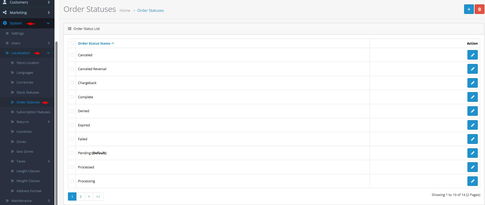

# Order Statuses

## Introduction

**Order Statuses** are the building blocks of your order management workflow. Each status represents a stage in the order lifecycle—from placement to fulfillment to completion. Well-defined order statuses help your team track progress, automate customer notifications, and provide transparency to customers about their order's journey.

## Accessing Order Statuses Management



#### Navigate to Order Statuses

Log in to your admin dashboard and go to **System → Localization → Order Statuses**.



#### Order Status List

You will see a list of all defined order statuses with their names.



#### Manage Order Statuses

Use the **Add New** button to create a new order status or click **Edit** on any existing status to modify it.



## Order Status Interface Overview

### Order Status Configuration Fields

<strong>Basic Configuration</strong>

**Single Field Setup**

* **Order Status Name**: **(Required)** The label displayed in admin and customer communications (e.g., "Pending", "Processing", "Shipped", "Completed", "Cancelled")

<strong>Special Status Assignments</strong>

**System Defaults**

* **Default Order Status**: One status can be assigned as the default for new orders (configured in store settings).
* **Complete Order Status**: Typically used to trigger affiliate commissions and reward points.
* **Cancelled Order Status**: Used to reverse inventory deductions and trigger refund workflows.


**Multi-Language Support**: Order status names can be translated for each language in your store. When editing an order status, you'll see language tabs where you can enter translations for each active language. Customer notifications will use the appropriate language version.


## Common Tasks

### Creating a Custom Order Workflow

To match your business processes:

1. Navigate to **System → Localization → Order Statuses** and click **Add New**.
2. Enter a clear **Order Status Name** that describes the workflow stage.
3. For multi-language stores, switch between language tabs to provide translations.
4. Click **Save**. The new status will be available when updating orders.

### Setting Up Status-Based Automation

To trigger actions based on status changes:

1. Identify key status transitions (e.g., "Processing" → "Shipped").
2. Consider extensions that add advanced automation (stock updates, CRM integration, task assignments).
3. Test the workflow by placing a test order and updating its status.

## Best Practices

<strong>Workflow Design Strategy</strong>

**Process Optimization**

* **Minimal Essential Statuses**: Create only the statuses you actually use to avoid confusion.
* **Clear Progression**: Design statuses that represent clear, sequential stages (e.g., Pending → Processing → Shipped → Delivered).
* **Team Alignment**: Ensure all staff understand what each status means and what actions are required.
* **Customer Communication**: Choose status names that are customer-friendly when shown in order history.

<strong>Technical Integration</strong>

**System Coordination**

* **Notification Mapping**: Link each status to appropriate email templates.
* **Extension Compatibility**: Verify that payment, shipping, and reporting extensions work with your statuses.
* **API Integration**: If using external systems (ERP, CRM), ensure status names match between systems.
* **Historical Data**: Never delete statuses used in historical orders—disable or hide them instead.


**Deletion Warning** ⚠️ Never delete an order status that is: 1) assigned as default order status, 2) assigned as default download status, or 3) used in existing orders. Check error messages carefully and reassign defaults before deletion.


## Troubleshooting

<strong>Order status not updating customer notifications</strong>

**Email Configuration Issues**

* **Mail Settings**: Verify email is properly configured in **System → Settings → Mail**.
* **Notification Triggers**: Check that the status is configured to trigger notifications in store settings.
* **Email Templates**: Ensure email templates exist for the status in your language directory.
* **Queue Processing**: If using email queues, check if emails are stuck in the queue.

<strong>Cannot delete an order status</strong>

**Dependency Issues**

* **Default Assignment**: The status may be set as default order status or default download status.
* **Order History**: The status is used in existing orders (check error message for count).
* **Solution**:
  1. Change default assignments in store settings.
  2. Create replacement status and update existing orders (may require database query).
  3. Attempt deletion again.

<strong>Digital products not accessible after purchase</strong>

**Download Status Configuration**

* **Order Status Check**: Ensure the order has reached the complete status.
* **Download Limits**: Check if download limits or expiration dates are preventing access.
* **File Permissions**: Verify digital files are correctly uploaded and accessible.

<strong>Status names inconsistent across languages</strong>

**Translation Management**

* **Missing Translations**: Ensure all active languages have translations for each status.
* **Translation Consistency**: Use the same terminology across all order-related communications.
* **Length Considerations**: Long translations might break admin interface layouts.
* **Customer-Focused Language**: Use customer-friendly terms in storefront translations.

> "Order statuses are the pulse of your business—each transition tells a story of progress, each notification builds customer confidence, and each completed status represents a promise kept."
