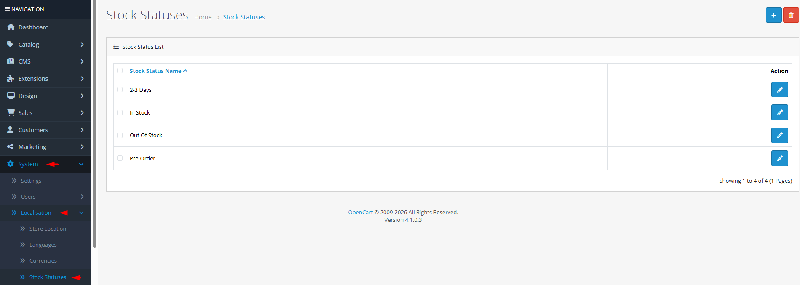

# Stock Statuses

## Introduction

**Stock Statuses** are simple text labels that inform customers about product availability. These messages appear on product pages, category listings, and search results to indicate whether an item is in stock, out of stock, available for backorder, or has other inventory conditions. Clear stock status messaging helps manage customer expectations and reduces support inquiries.

## Accessing Stock Statuses Management



#### Navigate to Stock Statuses

Log in to your admin dashboard and go to **System → Localization → Stock Statuses**.



#### Stock Status List

You will see a list of all defined stock status messages.



#### Manage Stock Statuses

Use the **Add New** button to create a new stock status or click **Edit** on any existing status to modify it.



## Stock Status Interface Overview

### Stock Status Configuration Fields

<strong>Basic Configuration</strong>

**Single Field Setup**

* **Stock Status Name**: **(Required)** The text displayed to customers (e.g., "In Stock", "Out of Stock", "Available for Backorder", "Discontinued")


**Multi-Language Support**: Stock status names can be translated for each language in your store. When editing a stock status, you'll see language tabs where you can enter translations for each active language.


## Common Tasks

### Creating Custom Stock Status Messages

To add specialized inventory statuses:

1. Navigate to **System → Localization → Stock Statuses** and click **Add New**.
2. Enter a clear **Stock Status Name** that accurately describes the inventory condition.
3. For multi-language stores, switch between language tabs to provide translations.
4. Click **Save**. The new status will be available when editing product inventory.

### Setting Up Backorder Status

For products that can be backordered:

1. Create a stock status named "Available for Backorder" or similar.
2. Assign this status to products that accept backorders in the product edit page.
3. Consider adding a note in the product description about backorder timelines.
4. Monitor inventory to ensure backordered items are eventually restocked.

### Managing Out-of-Stock Products

For items temporarily unavailable:

1. Ensure you have an "Out of Stock" status (created by default).
2. Set products to this status when inventory reaches zero.
3. Configure your store to hide out-of-stock products if desired (in store settings).
4. Use the status to trigger customer notifications when items are restocked.

## Best Practices

<strong>Status Messaging Strategy</strong>

**Customer Communication**

* **Clarity Over Creativity**: Use clear, unambiguous terms that customers immediately understand.
* **Action-Oriented Messages**: Consider statuses that tell customers what to do (e.g., "Pre-order Now", "Contact for Availability").
* **Consistent Terminology**: Use the same status terms across all products to avoid confusion.
* **Visual Indicators**: Complement text statuses with color-coded indicators in your theme (green for in stock, red for out of stock).

<strong>Inventory Management</strong>

**Operational Efficiency**

* **Minimum Status Set**: Create only the statuses you actually need to avoid clutter.
* **Regular Review**: Periodically review which statuses are being used and remove unused ones.
* **Integration with Workflows**: Align stock statuses with your warehouse management processes.
* **Automatic Updates**: Consider extensions that automatically update stock status based on inventory levels.


**Deletion Warning** ⚠️ Never delete a stock status that is assigned to products. Check the product count in the error message before deletion. Instead, create a new status and reassign products, then delete the old status.


## Troubleshooting

<strong>Stock status not appearing on product page</strong>

**Display Issues**

* **Product Assignment**: Verify the stock status is actually assigned to the product in the product edit page.
* **Theme Template**: Check if your theme template displays stock status (some minimalist themes may omit it).
* **Language Translation**: For multi-language stores, ensure the status has a translation for the current language.
* **Cache**: Clear OpenCart cache to refresh product displays.

<strong>Cannot delete a stock status</strong>

**Product Dependency Issues**

* **Product Assignment**: The status is assigned to one or more products. Check the error message for the count.
* **Solution**:
  1. Create a replacement stock status.
  2. Use product filters to find all products using the old status.
  3. Edit products to assign the new status.
  4. Attempt deletion again.

<strong>Inconsistent status display across languages</strong>

**Translation Issues**

* **Missing Translations**: Ensure the stock status has translations for all active languages.
* **Language Switching**: Test the product page while switching between languages.
* **Default Language Fallback**: OpenCart uses the default language translation if a translation is missing.
* **Translation Length**: Very long translations might break layout—keep translations concise.

> "Stock statuses are your store's honesty policy in action. Clear availability messaging builds trust, manages expectations, and turns potential frustration into informed purchasing decisions."
