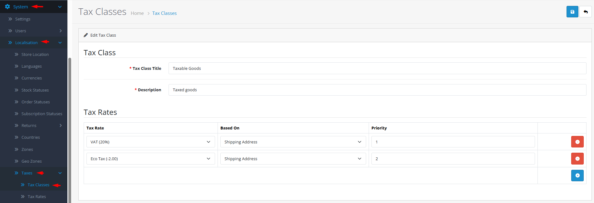

# Tax Classes

## Introduction

**Tax Classes** are containers that group multiple tax rates into logical sets that can be assigned to products. Each tax class defines which tax rates apply, in what order (priority), and whether tax is calculated based on shipping address, payment address, or store address. This flexible system allows you to create complex tax scenarios like tiered rates, product-specific taxes, and regional tax combinations.

## Accessing Tax Classes Management



#### Navigate to Tax Classes

Log in to your admin dashboard and go to **System → Localization → Tax Classes**.



#### Tax Class List

You will see a list of all defined tax classes with their titles.



#### Manage Tax Classes

Use the **Add New** button to create a new tax class or click **Edit** on any existing tax class to modify its rates and settings.



## Tax Class Interface Overview

### Tax Class Configuration Fields

<strong>Basic Tax Class Information</strong>

**Identification**

* **Tax Class Title**: **(Required)** Descriptive name for the tax category (e.g., "Standard Goods", "Digital Products", "Food Items", "Zero-Rated")
* **Description**: Optional notes about when to use this tax class

<strong>Tax Rate Assignment</strong>

**Rate Configuration**

* **Tax Rate**: Select one or more tax rates to include in this class
* **Priority**: Order of application when multiple rates apply (lower numbers apply first)
* **Geo Zone**: Geographical zone where each rate applies (linked from tax rate definition)
* **Based On**: Address used for tax calculation:
  * **Shipping Address**: Customer's delivery address
  * **Payment Address**: Customer's billing address
  * **Store Address**: Your store's physical location

<strong>Tax Calculation Logic</strong>

**Application Rules**

* **Multiple Rates**: A tax class can include multiple rates that apply cumulatively or alternatively.
* **Priority System**: Rates with priority 1 apply first, then priority 2, etc.
* **Geographical Filtering**: Each rate applies only within its designated geo zone.
* **Address Basis**: Determines which customer address triggers tax calculation.


**Tax Rate Prerequisite**: Before creating tax classes, you must first define tax rates in **System → Localization → Tax Rates**. Tax classes organize existing rates into usable groups for products.


## Common Tasks

### Creating a Standard Tax Class for Physical Goods

For typical products with standard tax rates:

1. Navigate to **System → Localization → Tax Classes** and click **Add New**.
2. Enter **Tax Class Title** like "Standard Goods".
3. Add a **Description** such as "Standard VAT for physical products".
4. Click **Add Tax Rate** and select the appropriate tax rate(s).
5. Set **Based On** to "Shipping Address" (common for physical goods).
6. Configure **Priority** if using multiple rates (usually 1 for single rate).
7. Click **Save**. The tax class can now be assigned to products.

### Setting Up a Digital Products Tax Class

For downloadable products with different tax rules:

1. Create a new tax class titled "Digital Products" or "E-services".
2. Select tax rates appropriate for digital goods (often different rates or exemptions).
3. Set **Based On** to "Payment Address" (common for digital services taxation).
4. Consider creating specific geo zones for regions with digital tax laws (e.g., EU VAT MOSS).
5. Assign this tax class to all digital products in your catalog.

### Configuring Tiered Tax Rates

For products subject to multiple taxes (e.g., VAT + environmental tax):

1. Create a tax class with a descriptive title like "Goods with Environmental Levy".
2. Add the primary tax rate (e.g., standard VAT) with priority 1.
3. Add the secondary tax rate (e.g., environmental tax) with priority 2.
4. Ensure both rates apply to the same geo zones or configure separate geo zones.
5. Test with sample orders to verify correct cumulative tax calculation.

## Best Practices

<strong>Tax Class Design Strategy</strong>

**Logical Organization**

* **Product-Category Alignment**: Create tax classes that match your product categories.
* **Clear Naming**: Use titles that clearly indicate the tax treatment.
* **Minimal Classes**: Create only as many tax classes as needed to avoid confusion.
* **Documentation**: Use descriptions to explain when each class should be used.

<strong>Compliance Management</strong>

**Regulatory Adherence**

* **Local Regulations**: Research tax requirements for each product type and region.
* **Rate Updates**: Monitor tax rate changes and update classes accordingly.
* **Audit Trail**: Keep records of tax class configurations for compliance reporting.
* **Professional Advice**: Consult tax professionals for complex multi-jurisdiction scenarios.


**Deletion Warning** ⚠️ Never delete a tax class that is assigned to products. Check the error message for product count and reassign products to a different tax class before deletion.


## Troubleshooting

<strong>Tax not calculating correctly for products</strong>

**Configuration Issues**

* **Tax Class Assignment**: Verify products are assigned the correct tax class.
* **Rate Selection**: Check that the tax class includes the appropriate rates.
* **Geo Zone Alignment**: Ensure customer address falls within the geo zone of assigned rates.
* **Based On Setting**: Verify the "Based On" address type matches your tax jurisdiction rules.

<strong>Multiple taxes applying incorrectly</strong>

**Priority and Composition Issues**

* **Priority Order**: Review priority settings—rates with same priority may combine unexpectedly.
* **Rate Overlap**: Check if multiple rates apply to the same geo zone unintentionally.
* **Cumulative vs Alternative**: Understand whether rates should add together or apply separately.
* **Testing**: Test with simple orders to isolate calculation issues.

<strong>Cannot delete a tax class</strong>

**Product Dependency Issues**

* **Product Assignment**: The tax class is assigned to one or more products.
* **Solution**:
  1. Create a replacement tax class with similar rates.
  2. Use product filters to find all products using the old tax class.
  3. Batch edit products to assign the new tax class.
  4. Attempt deletion again.

<strong>Tax calculation differs between cart and checkout</strong>

**Address Basis Issues**

* **Address Consistency**: Verify customer provides consistent shipping and billing addresses.
* **Based On Setting**: Different address types may yield different tax calculations.
* **Guest vs Registered**: Check if tax calculation differs for guest checkout vs registered users.
* **Session Data**: Clear customer session and test with fresh checkout.

> "Tax classes are the translators between legal tax codes and practical product pricing. Each class transforms complex regulations into simple product assignments, ensuring compliance without complicating the shopping experience."
