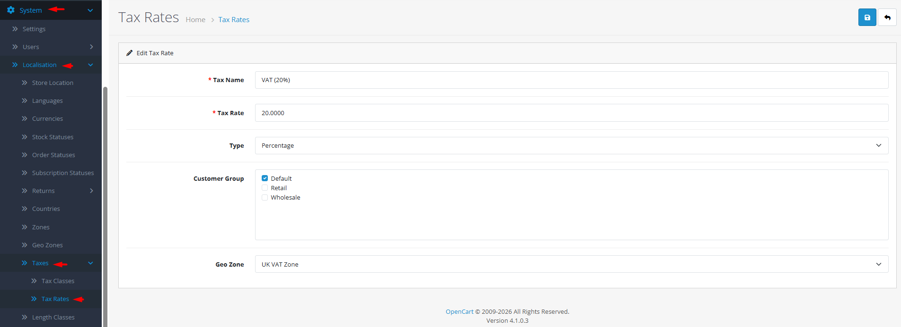

# Tax Rates

## Introduction

**Tax Rates** are the specific percentages or fixed amounts applied to products when calculating taxes. Each tax rate is defined by a name, value, type (percentage or fixed amount), applicable geographical zone, and optionally, specific customer groups. Tax rates are the building blocks that are combined within tax classes to create complete tax rules for products.

## Accessing Tax Rates Management



#### Navigate to Tax Rates

Log in to your admin dashboard and go to **System → Localization → Tax Rates**.



#### Tax Rate List

You will see a list of all defined tax rates with their names, values, types, and geographical zones.



#### Manage Tax Rates

Use the **Add New** button to create a new tax rate or click **Edit** on any existing tax rate to modify its settings.



## Tax Rate Interface Overview

### Tax Rate Configuration Fields

<strong>Basic Tax Rate Information</strong>

**Core Settings**

* **Tax Name**: **(Required)** Descriptive identifier (e.g., "California Sales Tax", "EU VAT", "GST")
* **Tax Rate**: **(Required)** Numerical value (e.g., "8.25" for 8.25%, or "5.00" for $5.00 fixed amount)
* **Type**: **(Required)** Calculation method:
  * **Percentage**: Applied as percentage of product price
  * **Fixed Amount**: Applied as fixed monetary amount per item

<strong>Application Rules</strong>

**Scope Configuration**

* **Geo Zone**: **(Required)** Geographical area where this tax rate applies
* **Customer Group**: Optional restriction to specific customer groups (e.g., "Wholesale", "Retail")

<strong>Rate Type Considerations</strong>

**Percentage vs Fixed Amount**

* **Percentage Rates**: Common for sales tax, VAT, GST (e.g., 20% VAT, 7% sales tax)
* **Fixed Amount Rates**: Used for specific duties or fees (e.g., $5 environmental fee, £2 handling charge)
* **Mixed Strategies**: Some tax systems use both (percentage tax + fixed environmental levy)


**Geo Zone Prerequisite**: Before creating tax rates, you must first define geo zones in **System → Localization → Geo Zones**. Tax rates are always linked to specific geographical areas.


## Common Tasks

### Creating a Standard Sales Tax Rate

For typical regional sales tax:

1. Navigate to **System → Localization → Tax Rates** and click **Add New**.
2. Enter a **Tax Name** like "California Sales Tax" or "Texas State Tax".
3. Set the **Tax Rate** to the percentage (e.g., "7.25" for 7.25%).
4. Select **Type** as "Percentage".
5. Choose the appropriate **Geo Zone** (e.g., "California" geo zone).
6. Leave **Customer Group** blank to apply to all customers.
7. Click **Save**. The tax rate is now available for inclusion in tax classes.

### Setting Up a Customer Group-Specific Tax Rate

For different tax treatment by customer type:

1. Create a tax rate with a name indicating the customer group (e.g., "Wholesale VAT").
2. Set the appropriate rate value and type.
3. Select the relevant geo zone.
4. Choose the specific **Customer Group** (e.g., "Wholesale").
5. Save and include this rate in tax classes assigned to wholesale-only products.
6. Test with both wholesale and retail customer accounts to verify correct application.

### Configuring Fixed Amount Tax Rates

For per-item fees or duties:

1. Create a tax rate with a descriptive name (e.g., "Recycling Fee").
2. Set **Type** to "Fixed Amount".
3. Enter the fixed amount (e.g., "5.00" for $5.00).
4. Select the appropriate geo zone where the fee applies.
5. Include this rate in tax classes for applicable products.
6. Test to ensure the fixed amount adds correctly per item quantity.

## Best Practices

<strong>Tax Rate Design Strategy</strong>

**Organized Configuration**

* **Descriptive Naming**: Use names that clearly indicate rate, region, and purpose.
* **Regional Accuracy**: Verify tax rates with official sources for each jurisdiction.
* **Rate Precision**: Include correct decimal places (typically 2 for percentages).
* **Documentation**: Maintain external records of tax rate sources and effective dates.

<strong>Compliance Management</strong>

**Regulatory Adherence**

* **Regular Updates**: Monitor and update rates when tax laws change.
* **Historical Tracking**: Consider keeping old rates (disabled) for historical order accuracy.
* **Jurisdiction Research**: Understand which taxes apply to which products in each region.
* **Professional Consultation**: Seek tax professional advice for complex multi-jurisdiction setups.


**Deletion Warning** ⚠️ Never delete a tax rate that is included in tax classes. Check the error message for tax class assignments and remove the rate from all tax classes before deletion.


## Troubleshooting

<strong>Tax rate not applying to products</strong>

**Configuration Chain Issues**

* **Tax Class Inclusion**: Verify the tax rate is included in the product's assigned tax class.
* **Geo Zone Alignment**: Ensure customer address falls within the tax rate's geo zone.
* **Customer Group Match**: Check if customer group restriction prevents application.
* **Rate Status**: Confirm the tax rate is properly saved and available.

<strong>Incorrect tax calculation amount</strong>

**Rate Value Issues**

* **Percentage vs Fixed**: Verify the type matches intended calculation method.
* **Decimal Precision**: Check rate value has correct decimal places.
* **Rate Updates**: Ensure you're using current rates (tax laws change periodically).
* **Testing**: Test with simple calculations to verify mathematical accuracy.

<strong>Cannot delete a tax rate</strong>

**Tax Class Dependency Issues**

* **Tax Class Assignment**: The rate is included in one or more tax classes.
* **Solution**:
  1. Identify which tax classes include the rate.
  2. Edit each tax class to remove the rate.
  3. Save tax class changes.
  4. Attempt tax rate deletion again.

<strong>Multiple tax rates applying unexpectedly</strong>

**Overlapping Rules**

* **Geo Zone Overlap**: Multiple rates may apply to the same geographical area.
* **Tax Class Composition**: A single tax class may include multiple rates.
* **Priority Settings**: Rates with same priority in a tax class may combine.
* **Testing Isolation**: Test with minimal configuration to identify rule conflicts.

> "Tax rates are the numerical expression of civic responsibility—each percentage point represents shared infrastructure, each fixed amount funds specific services. Proper configuration ensures your store contributes its fair share while maintaining accurate pricing for customers."
