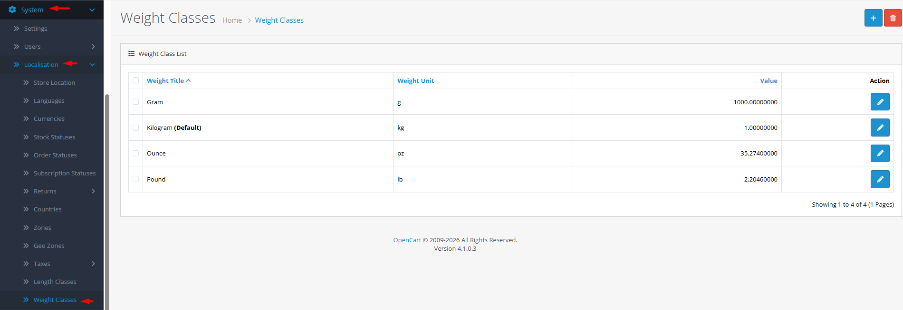

# Weight Classes

## Introduction

**Weight Classes** define the measurement units used for product weights in your store. Each class includes a title (e.g., "Kilogram"), a unit abbreviation (e.g., "kg"), and a conversion value relative to your default weight unit. This system ensures accurate shipping calculations while allowing customers to view product weights in their preferred measurement system.

## Accessing Weight Classes Management



#### Navigate to Weight Classes

Log in to your admin dashboard and go to **System → Localization → Weight Classes**.



#### Weight Class List

You will see a list of all defined weight classes with their titles, units, and conversion values.



#### Manage Weight Classes

Use the **Add New** button to create a new weight class or click **Edit** on any existing class to modify its settings.



## Weight Class Interface Overview

### Weight Class Configuration Fields

<strong>Basic Weight Class Information</strong>

**Core Settings**

* **Weight Title**: **(Required)** Descriptive name of the weight unit (e.g., "Kilogram", "Pound", "Ounce", "Gram")
* **Weight Unit**: **(Required)** Abbreviation or symbol (1-4 characters, e.g., "kg", "lb", "oz", "g")
* **Value**: **(Required)** Conversion rate relative to default weight unit (set to 1.00000000 for default)

<strong>Conversion Value Logic</strong>

**Relative Measurement System**

* **Default Unit**: One weight class has value = 1.00000000 (your base weight unit).
* **Conversion Rates**: Other units have values representing how many of that unit equal one default unit.
* **Example**: If kilogram is default (value=1), pound would have value ≈ 2.20462 (since 1 kg = 2.20462 lb).
* **Reverse Calculation**: The system automatically converts between units using these ratios.


**Shipping Integration**: Weight classes directly impact shipping cost calculations. Ensure your shipping extensions are configured to use the same weight unit system as your products to avoid miscalculations.


## Common Tasks

### Setting Up Metric and Imperial Weight Systems

To support both measurement systems for international sales:

1. Determine your default unit (e.g., kilograms for metric preference).
2. Ensure the default weight class has value = 1.00000000.
3. Add complementary units:
   * **Pounds**: Value ≈ 2.20462 (1 kg = 2.20462 lb)
   * **Ounces**: Value ≈ 35.274 (1 kg = 35.274 oz)
   * **Grams**: Value = 1000 (1 kg = 1000 g)
   * **Metric Tons**: Value = 0.001 (1 kg = 0.001 t)
4. Test product displays and shipping calculations to ensure correct conversions.

### Adding Specialized Weight Units

For niche products (e.g., precious metals sold by the troy ounce):

1. Create a new weight class with title "Troy Ounce" and unit "oz t".
2. Research conversion: 1 troy ounce = 0.0311035 kg.
3. If kilogram is default (value=1), troy ounce value = 32.1507 (1 kg = 32.1507 oz t).
4. Assign the new unit to relevant products and verify display and shipping calculations.

### Configuring Shipping Rate Accuracy

To ensure shipping costs calculate correctly:

1. Verify all products have weights entered in the default unit.
2. Confirm shipping extensions are configured to use the correct weight unit.
3. Test shipping quotes with sample products of known weight.
4. Consider implementing weight-based shipping rules that match your carrier's unit system.

## Best Practices

<strong>Weight System Strategy</strong>

**Consistent Implementation**

* **Shipping Alignment**: Choose default unit that matches your shipping carrier's requirements.
* **Product Data Consistency**: Enter all product weights in the same default unit.
* **Customer Expectations**: Offer units appropriate for your target markets (metric for EU, imperial for US).
* **Precision Balance**: Use sufficient decimal precision for accuracy without unnecessary complexity.

<strong>Data Integrity</strong>

**Accurate Configuration**

* **Exact Conversions**: Use precise conversion factors from authoritative sources.
* **Unit Testing**: Regularly test weight conversions with known values.
* **Shipping Validation**: Verify shipping calculations match carrier rate charts.
* **Documentation**: Record your weight system configuration for team reference.


**Deletion Warning** ⚠️ Never delete a weight class that is: 1) set as default store weight class, or 2) assigned to products. Check error messages and reassign products/default setting before deletion.


## Troubleshooting

<strong>Shipping costs calculating incorrectly</strong>

**Weight Conversion Issues**

* **Unit Mismatch**: Verify shipping extension uses same unit as product weights.
* **Conversion Values**: Check weight class values for mathematical accuracy.
* **Default Unit**: Confirm which unit is set as default.
* **Product Weights**: Ensure product weights are entered in the default unit.

<strong>Cannot delete a weight class</strong>

**Dependency Issues**

* **Default Assignment**: The weight class may be set as default in store settings.
* **Product Assignment**: Products may be using the weight class.
* **Solution**:
  1. Change default weight class in store settings.
  2. Update products to use a different weight class.
  3. Attempt deletion again.

<strong>Product weight displaying wrong values</strong>

**Conversion or Display Issues**

* **Conversion Logic**: Verify the conversion mathematics in theme templates.
* **Caching**: Clear OpenCart cache to refresh weight displays.
* **Theme Overrides**: Check if theme modifies weight display logic.
* **Browser Testing**: Test with different customer sessions and unit preferences.

<strong>Shipping carrier API rejecting weight values</strong>

**API Integration Issues**

* **Unit Requirements**: Verify carrier API requires specific weight units.
* **Conversion Accuracy**: Ensure conversions don't introduce rounding errors.
* **Value Ranges**: Check if weights fall within carrier acceptable ranges.
* **Debug Logging**: Enable logging to see exact weight values sent to carrier API.

> "Weight classes are the gravitational constant of your e-commerce universe—they determine the cost of movement, the physics of packaging, and the customer's perception of value. Each conversion factor bridges the gap between your scale and your customer's expectations."
