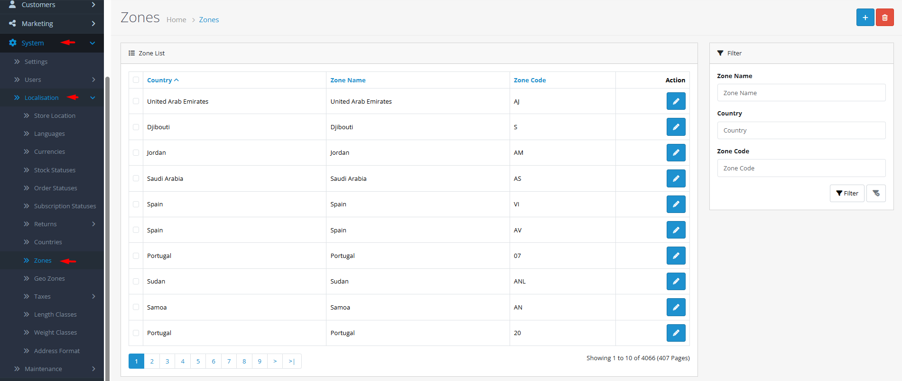

# Zones

## Introduction

**Zones** (also known as states, provinces, regions, or territories) are subdivisions within countries. They are essential for accurate address collection, regional tax calculations, and location-specific shipping rules. Each zone belongs to a specific country and can have its own code (like state abbreviations) and status. Proper zone configuration ensures customers can select their correct region during checkout.

## Accessing Zones Management



#### Navigate to Zones

Log in to your admin dashboard and go to **System → Localization → Zones**.



#### Zone List

You will see a list of all defined zones with their names, codes, associated countries, and status.



#### Manage Zones

Use the **Add New** button to create a new zone or click **Edit** on any existing zone to modify its settings.



## Zone Interface Overview

### Zone Configuration Fields

<strong>Basic Zone Information</strong>

**Identification**

* **Zone Name**: **(Required)** The full name of the region (e.g., "California", "Ontario", "Bavaria", "Tokyo")
* **Zone Code**: **(Required)** Abbreviation or code (e.g., "CA", "ON", "BY", "13")
* **Country**: **(Required)** The country to which this zone belongs
* **Status**: Enable or disable the zone for customer selection

<strong>Zone Code Standards</strong>

**Coding Conventions**

* **ISO 3166-2 Codes**: Many countries have official subdivision codes (e.g., US-CA, CA-ON, DE-BY).
* **Local Abbreviations**: Common local abbreviations (e.g., "CA" for California, "NSW" for New South Wales).
* **Numeric Codes**: Some countries use numeric codes for regions.
* **Consistency**: Use consistent coding within each country for easier data processing.


**Zone Completeness**: For countries with regional tax or shipping rules, ensure all relevant zones are defined. Missing zones can prevent customers from completing checkout if their region is required for tax calculations.


## Common Tasks

### Adding Zones for a New Country

When expanding to a new country that requires regional selection:

1. Navigate to **System → Localization → Zones** and click **Add New**.
2. Select the **Country** from the dropdown (the country must already exist and be enabled).
3. Enter the **Zone Name** using the official regional name.
4. Set the **Zone Code** using official abbreviations or local standards.
5. Set **Status** to "Enabled" to make it available to customers.
6. Click **Save**. Repeat for all regions in the country.

### Configuring Regional Tax Rules

To set up different tax rates by region:

1. Ensure all zones for the country are defined.
2. Navigate to **System → Localization → Tax Rates**.
3. Create tax rates specific to each zone or group of zones.
4. Assign tax rates to appropriate tax classes.
5. Test checkout with addresses in different zones to verify correct tax calculation.

### Managing Zone Availability

To control regional operations:

1. **Disable zones** you don't ship to by setting Status to "Disabled".
2. **Enable zones** as you expand your shipping coverage.
3. **Set default zone** in store settings for new customer sessions.
4. **Coordinate with geo zones** for complex regional shipping/tax rules.

## Best Practices

<strong>Regional Management Strategy</strong>

**Comprehensive Coverage**

* **Complete Sets**: Define all zones for countries where you collect regional data.
* **Official Sources**: Use government sources for accurate zone names and codes.
* **Customer Expectations**: Include zones customers expect to see (even if you don't ship there yet).
* **Future Planning**: Define zones before launching in a new country to avoid data inconsistencies.

<strong>Data Integrity</strong>

**Accurate Configuration**

* **Code Consistency**: Use consistent coding patterns within each country.
* **Name Standardization**: Use official names rather than colloquial terms.
* **Country Alignment**: Verify each zone is assigned to the correct country.
* **Regular Updates**: Update zones when political changes occur (new states, renamed regions).


**Deletion Warning** ⚠️ Never delete a zone that is: 1) set as default store zone, 2) assigned to stores, 3) used in customer addresses, or 4) used in geo zones. Check all error messages and reassign dependencies before deletion.


## Troubleshooting

<strong>Zone not appearing in address dropdown for a country</strong>

**Visibility Issues**

* **Status Check**: Verify the zone is **Enabled**.
* **Country Status**: Ensure the parent country is also enabled.
* **Country Assignment**: Confirm the zone is assigned to the correct country.
* **Cache**: Clear OpenCart cache to refresh zone lists.

<strong>Tax not calculating correctly for specific zone</strong>

**Tax Configuration Issues**

* **Zone Definition**: Verify the zone exists and is spelled exactly as used in tax rate configuration.
* **Tax Rate Assignment**: Check that tax rates are correctly assigned to the zone.
* **Geo Zone Membership**: Ensure the zone is included in relevant geo zones for tax rules.
* **Testing**: Test with exact address matching to identify configuration gaps.

<strong>Cannot delete a zone</strong>

**Dependency Issues**

* **Default Zone**: The zone may be set as default in store settings.
* **Customer Addresses**: The zone may be used in customer address books.
* **Geo Zones**: The zone may be included in geo zones for shipping/tax.
* **Solution**: Reassign all dependencies to another zone before deletion.

<strong>Zone codes not validating in checkout</strong>

**Validation Issues**

* **Code Format**: Some payment or shipping gateways may validate zone codes.
* **Case Sensitivity**: Ensure codes match expected case (usually uppercase).
* **Special Characters**: Avoid special characters in zone codes unless required.
* **Gateway Documentation**: Check payment gateway requirements for zone code formats.

> "Zones are the fine-grained geography of commerce—where national policies meet local realities. Each zone you define makes addresses more precise, taxes more accurate, and shipping more reliable."
