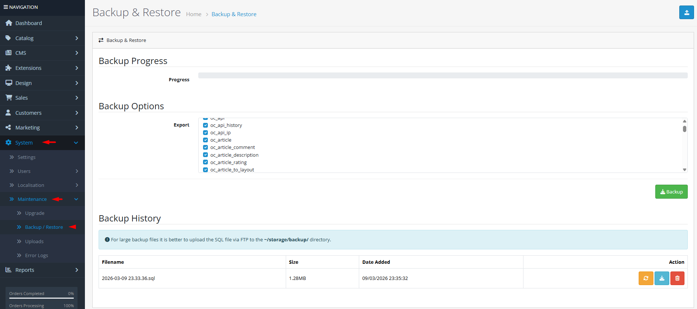

# Maintenance

## Introduction

The **Backup & Restore** tool allows you to create complete or partial database backups, restore data from previous backups, and manage your backup history. Regular backups are essential for disaster recovery, data migration, and protecting against data loss from human error or technical failures. This tool provides granular control over which tables to backup, supports large databases through progressive backup/restore operations, and maintains a secure backup history in your storage directory.

## Accessing Backup & Restore



#### Navigate to Backup & Restore

Log in to your admin dashboard and go to **System → Maintenance → Backup & Restore**.



#### Backup Interface

You will see the backup interface with progress indicator, table selection options, and backup history.



#### Manage Backups

Use the **Backup** button to create new backups, **Upload** to import SQL files, and action buttons in the history list to download, restore, or delete existing backups.



## Backup Interface Overview

### Backup Configuration Fields

<strong>Progress Monitoring</strong>

**Real-time Status**

* **Progress Bar**: Visual indicator showing current backup/restore completion percentage
* **Progress Text**: Detailed status messages showing which table is being processed and record counts
* **Automatic Updates**: Progress updates automatically during long-running operations

<strong>Table Selection</strong>

**Granular Backup Options**

* **Select All Tables**: Checkbox to quickly select/deselect all available tables
* **Individual Table Selection**: Checkboxes for each database table (excluding security-sensitive tables)
* **Security Exclusion**: User and user\_group tables are automatically excluded from backup/restore to prevent permission issues
* **Table List**: All non-system tables from your database are displayed for selection

<strong>Backup History Management</strong>

**Historical Backups**

* **Filename**: Name of the backup file (format: YYYY-MM-DD HH.mm.ss.sql)
* **File Size**: Human-readable size display (B, KB, MB, GB)
* **Date Added**: Creation timestamp of the backup
* **Actions**: Download, Restore, and Delete buttons for each backup file
* **Storage Location**: All backups are stored in `/storage/backup/` directory


**Large Backup Strategy**: For databases larger than your server's upload limit, upload SQL files directly via FTP to `/storage/backup/` directory. The system will automatically detect and list them in the backup history.



**Security Considerations**: The backup system automatically excludes user and user\_group tables to prevent accidental permission conflicts. Always verify your backups contain the expected tables before relying on them for disaster recovery.


## Common Tasks

### Creating a Complete Database Backup

To backup your entire store database:

1. Navigate to **System → Maintenance → Backup & Restore**.
2. In the **Export** section, click the **Select All Tables** checkbox.
3. Click the **Backup** button to start the backup process.
4. Monitor the progress bar and status messages.
5. Once complete, the backup will appear in the **Backup History** section with download, restore, and delete options.

### Restoring from a Previous Backup

To restore your database from a backup:

1. Navigate to **System → Maintenance → Backup & Restore**.
2. In the **Backup History** section, find the backup you want to restore.
3. Click the **Restore** button (orange icon) for that backup.
4. Confirm the restore operation when prompted.
5. Monitor the progress bar and status messages.
6. Once complete, the system will clear all caches and your database will be restored.

### Uploading an External Backup File

To import a backup file from another source:

1. Navigate to **System → Maintenance → Backup & Restore**.
2. Click the **Upload** button (blue upload icon).
3. Select the SQL file from your computer (must have .sql extension).
4. The file will upload to `/storage/backup/` and appear in the backup history.
5. You can now restore, download, or delete the uploaded backup.

### Downloading Backup Files for External Storage

To save backup files locally or to cloud storage:

1. Navigate to **System → Maintenance → Backup & Restore**.
2. In the **Backup History** section, find the backup you want to download.
3. Click the **Download** button (blue download icon).
4. The SQL file will download to your computer with its original filename.
5. Store the backup securely in multiple locations for disaster recovery.

## Best Practices

<strong>Backup Strategy &#x26; Scheduling</strong>

**Proactive Data Protection**

* **Regular Backups**: Schedule daily or weekly backups depending on your store's activity level
* **Off-site Storage**: Download and store backups in multiple locations (cloud storage, local servers, external drives)
* **Retention Policy**: Keep multiple generations of backups (daily for 7 days, weekly for 4 weeks, monthly for 12 months)
* **Test Restores**: Periodically test backup restoration to ensure your backup files are valid and complete
* **Pre-update Backups**: Always create a full backup before updating OpenCart, installing extensions, or making major configuration changes

<strong>Performance Optimization</strong>

**Efficient Backup Operations**

* **Selective Backups**: Backup only essential tables to reduce file size and processing time
* **Off-peak Scheduling**: Perform backups during low-traffic periods to minimize impact on store performance
* **Monitor File Size**: Large backup files may exceed server memory limits; consider splitting backups
* **Storage Management**: Regularly clean up old backup files to conserve disk space
* **Compression**: Consider compressing backup files for storage (requires manual compression/decompression)

<strong>Security Considerations</strong>

**Data Protection**

* **Secure Storage**: Store backup files in encrypted locations with restricted access
* **File Permissions**: Ensure backup files have proper permissions (not publicly accessible)
* **Sensitive Data**: Be aware that backups contain customer information; handle them according to data protection regulations
* **Excluded Tables**: User and user\_group tables are excluded for security; document any custom user data that needs separate backup
* **Transfer Security**: Use secure protocols (SFTP, HTTPS) when transferring backup files


**Irreversible Operations**: Restoring a backup will completely overwrite your current database. Always create a fresh backup before restoring, and verify you're restoring the correct backup file. Test restores on a staging environment before production use.


## Troubleshooting

<strong>Backup process stops or hangs</strong>

**Common Issues & Solutions**

* **Server Timeout**: Increase PHP execution time and memory limit in server configuration
* **Large Tables**: Backup very large tables individually rather than all at once
* **Database Locks**: Ensure no other processes are locking tables during backup
* **Storage Space**: Verify sufficient disk space in `/storage/backup/` directory
* **Permission Issues**: Check write permissions for `/storage/backup/` directory

<strong>Cannot restore from backup</strong>

**Restoration Problems**

* **File Corruption**: Verify the backup file is complete and not corrupted
* **Version Compatibility**: Ensure backup was created from the same OpenCart version
* **Database Differences**: Table structure may have changed; restore to identical OpenCart installation
* **Memory Limits**: Increase PHP memory limit for large restore operations
* **Incomplete Restore**: If restore stops mid-process, check server error logs for specific issues

<strong>Uploaded backup not appearing in history</strong>

**Upload Issues**

* **File Extension**: Ensure file has `.sql` extension (case-sensitive)
* **File Size**: Check file doesn't exceed server upload limit (`upload_max_filesize` in php.ini)
* **Directory Permissions**: Verify `/storage/backup/` directory is writable
* **Filename Restrictions**: Filename must be 3-128 characters with valid characters
* **Manual Upload**: For very large files, upload via FTP directly to `/storage/backup/`

<strong>Backup file missing or cannot be deleted</strong>

**File Management Issues**

* **File Not Found**: Backup may have been manually deleted from file system
* **Permission Denied**: Check file permissions in `/storage/backup/` directory
* **In Use**: Ensure no processes are currently accessing the backup file
* **Path Issues**: Verify backup directory path matches `DIR_STORAGE . 'backup/'` configuration
* **Cache Issues**: Clear browser cache if file appears missing but exists on server

<strong>User permissions lost after restore</strong>

**Permission Recovery**

* **Automatic Protection**: User and user\_group tables are excluded from backup/restore
* **Admin Access**: If locked out, check default admin credentials in installation
* **Permission Reset**: May need to reconfigure user permissions after major changes
* **Emergency Access**: Keep a separate record of admin credentials outside the backup system
* **Gradual Restoration**: Restore user-related tables manually if needed

> "Data is the lifeblood of your e-commerce business. Regular backups are not just a technical task—they're a commitment to your customers' trust and your business's continuity."
