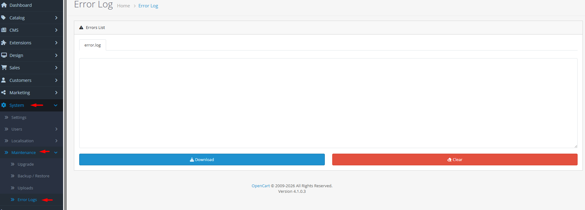

# Error Logs

## Introduction

The **Error Logs** tool provides centralized access to system error files, allowing you to monitor, analyze, and troubleshoot issues affecting your OpenCart store. Error logs capture PHP errors, warnings, notices, and custom application errors, helping you identify configuration problems, extension conflicts, and system vulnerabilities. Regular log review is essential for maintaining store stability, improving security, and providing better customer experiences through proactive issue resolution.

## Accessing Error Logs



#### Navigate to Error Logs

Log in to your admin dashboard and go to **System → Maintenance → Error Logs**.



#### Log Interface

You will see a tabbed interface listing all available log files with their names and sizes.



#### Manage Logs

Select any log tab to view its contents, use **Download** to save log files, or **Clear** to empty log contents.



## Error Logs Interface Overview

### Log File Management

<strong>Log File Display</strong>

**Multi-log Support**

* **Tabbed Interface**: Each log file appears in a separate tab for easy navigation
* **File Names**: Log filenames displayed as tab labels (e.g., `error.log`, `ocmod.log`)
* **Size Warnings**: Files larger than 3MB trigger warning messages with actual size display
* **Read-only View**: Log content displayed in read-only text areas for safety
* **Automatic Creation**: Missing log files are automatically created when accessing the tool

<strong>Log Operations</strong>

**File Management Actions**

* **View Contents**: Read log entries directly in the admin interface
* **Download Logs**: Save complete log files to your local system for analysis or archiving
* **Clear Logs**: Remove all contents from a log file while keeping the file structure
* **Automatic Refresh**: Manual refresh required to see new log entries
* **File Size Monitoring**: System warns when log files become excessively large

<strong>Log Types &#x26; Locations</strong>

**Standard Log Files**

* **Error Log**: Primary system error file (`error.log`) - captures PHP errors and application exceptions
* **OCMod Log**: Modification system log (`ocmod.log`) - tracks OCmod installation and application issues
* **Custom Logs**: Additional log files may be created by extensions or custom code
* **Storage Location**: All logs stored in `/storage/logs/` directory with `.log` extension
* **Configuration**: Error log filename configurable in **System → Settings → Server** tab


**Log Rotation Strategy**: For high-traffic stores, implement log rotation to prevent files from growing too large. Monitor log file sizes and clear them regularly, or use server-level log rotation tools.



**Security Awareness**: Error logs may contain sensitive information (file paths, configuration details, partial data). Restrict access to log files and never expose them publicly. Always download and clear logs from secure locations.


## Common Tasks

### Reviewing Recent Error Logs

To monitor current system issues:

1. Navigate to **System → Maintenance → Error Logs**.
2. Click the **error.log** tab (or other relevant log tab).
3. Scroll through the log content to identify recent errors.
4. Look for patterns: repeated errors indicate persistent issues.
5. Note error timestamps, types, and messages for troubleshooting.

### Downloading Logs for Analysis

To save log files for detailed analysis or developer review:

1. Navigate to **System → Maintenance → Error Logs**.
2. Select the log tab you want to download.
3. Click the **Download** button below the log content.
4. The file will download with a timestamped filename (e.g., `error.log_2026-03-09_12-30-45_error.log`).
5. Share the downloaded file with developers or analyze with log analysis tools.

### Clearing Log Files

To free up disk space and maintain performance:

1. Navigate to **System → Maintenance → Error Logs**.
2. Select the log tab you want to clear.
3. Click the **Clear** button below the log content.
4. Confirm the clear operation when prompted.
5. The log content will be emptied but the file structure remains for future errors.

### Monitoring Log File Sizes

To prevent log files from consuming excessive disk space:

1. Navigate to **System → Maintenance → Error Logs**.
2. Check for size warning messages (appear for files > 3MB).
3. Review the actual file size displayed in warnings.
4. Clear large logs or implement log rotation if files grow too quickly.
5. Consider adjusting error logging levels if logs contain excessive non-critical entries.

## Best Practices

<strong>Log Analysis &#x26; Monitoring</strong>

**Proactive Issue Detection**

* **Regular Reviews**: Check error logs daily for critical issues, weekly for patterns
* **Error Classification**: Categorize errors by severity (critical, warning, notice) and frequency
* **Root Cause Analysis**: Trace errors back to specific extensions, custom code, or configuration changes
* **Trend Monitoring**: Watch for increasing error frequencies that may indicate growing problems
* **Documentation**: Keep records of resolved issues and their solutions for future reference

<strong>Performance &#x26; Maintenance</strong>

**Log Management Strategy**

* **Size Control**: Set up automated alerts for log files exceeding size thresholds
* **Retention Policy**: Determine how long to keep logs based on business needs and regulations
* **Archival Strategy**: Archive important logs before clearing for historical analysis
* **Cleanup Schedule**: Establish regular log cleanup routines (weekly, monthly)
* **Storage Planning**: Ensure sufficient disk space for log growth, especially during peak seasons

<strong>Security &#x26; Compliance</strong>

**Data Protection**

* **Access Control**: Restrict log access to authorized personnel only
* **Sensitive Data**: Be aware that logs may contain personal data; handle according to GDPR/CCPA
* **Secure Storage**: Store archived logs in encrypted locations
* **Transmission Security**: Use secure channels when transferring logs for analysis
* **Audit Trail**: Maintain logs of who accessed and cleared error logs for accountability

<strong>Debugging &#x26; Development</strong>

**Effective Troubleshooting**

* **Error Context**: Note what actions were being performed when errors occurred
* **Reproduction Steps**: Document steps to reproduce intermittent errors
* **Extension Isolation**: Disable extensions systematically to identify conflict sources
* **Version Tracking**: Record OpenCart and extension versions when errors appear
* **Developer Communication**: Provide complete error details when seeking external help


**Data Exposure Risk**: Error logs can reveal system paths, database information, and other sensitive details. Never share raw log files publicly. Always sanitize logs before sharing with third parties, and ensure log directories have proper permissions (not publicly accessible via web).


## Troubleshooting

<strong>Error logs not updating or empty</strong>

**Logging Issues**

* **File Permissions**: Check write permissions for `/storage/logs/` directory
* **PHP Configuration**: Verify `log_errors` and `error_log` settings in php.ini
* **OpenCart Settings**: Check error logging configuration in **System → Settings → Server**
* **Disk Space**: Ensure sufficient disk space for log writing
* **File Lock**: Another process may be holding the log file open

<strong>Cannot download or clear logs</strong>

**Permission Problems**

* **Admin Permissions**: Verify user has modify permission for `tool/log` in user groups
* **File Permissions**: Check read/write permissions for log files
* **Server Configuration**: Some server configurations restrict file operations
* **Browser Issues**: Try different browser or clear browser cache
* **JavaScript**: Ensure JavaScript is enabled for AJAX operations

<strong>Log files growing too quickly</strong>

**Size Management**

* **Error Volume**: High error frequency indicates underlying problems needing resolution
* **Logging Level**: Adjust PHP error reporting level to reduce non-critical entries
* **Extension Issues**: Identify and fix extensions generating excessive errors
* **Custom Code**: Review custom code for unhandled exceptions or debug statements
* **Scheduled Clearance**: Implement automated log rotation or clearance schedules

<strong>Missing expected log files</strong>

**File Availability**

* **File Creation**: Missing files are automatically created when accessing Error Logs tool
* **Directory Structure**: Verify `/storage/logs/` directory exists and is writable
* **Filename Configuration**: Check error log filename in **System → Settings → Server**
* **Extension Logs**: Some extensions create their own log files; check extension documentation
* **Manual Creation**: Create missing log files manually if automatic creation fails

<strong>Cannot identify source of errors</strong>

**Error Investigation**

* **Error Details**: Expand error messages for stack traces and line numbers
* **Timing Analysis**: Correlate errors with specific times and user actions
* **Extension Testing**: Disable extensions one by one to identify culprits
* **Database Review**: Check for corrupted data or missing database entries
* **Developer Tools**: Use Xdebug or other debugging tools for complex issues

> "Errors are not failures—they're messengers. Each error log entry is an opportunity to strengthen your store, fix vulnerabilities, and create a more reliable experience for your customers."
