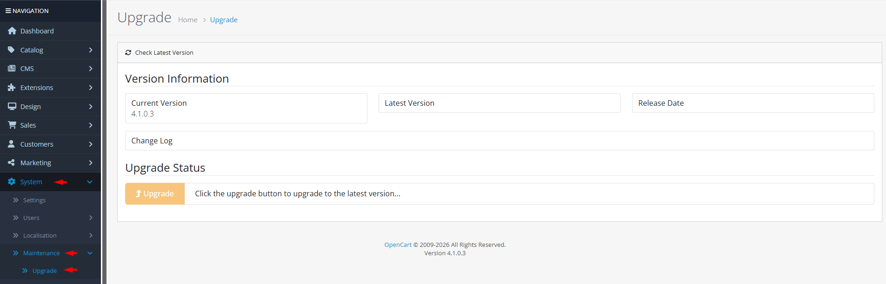

# Upgrade

## Introduction

The **Upgrade** tool allows you to check for new OpenCart versions, download updates, and install them directly from your admin panel. Keeping your OpenCart installation up-to-date is essential for security patches, bug fixes, performance improvements, and new features. This tool connects to the official OpenCart server, compares your current version with the latest release, and provides a streamlined upgrade process with automatic file replacement and database migration.

## Accessing Upgrade



#### Navigate to Upgrade

Log in to your admin dashboard and go to **System → Maintenance → Upgrade**.



#### Upgrade Interface

You will see the upgrade interface showing your current version, latest available version, release date, and change log.



#### Check for Updates

Click **Check Latest Version** to refresh version information from the OpenCart server, then use the **Upgrade** button if a newer version is available.



## Upgrade Interface Overview

### Version Information

<strong>Current Installation Details</strong>

**System Information**

* **Current Version**: Your currently installed OpenCart version (e.g., 4.0.2.3)
* **Version Detection**: Automatically reads from your installation's `VERSION` constant
* **Installation Date**: Not displayed but can be inferred from file timestamps
* **Update Status**: Indicates whether you're running the latest version or an update is available

<strong>Available Update Information</strong>

**Remote Version Data**

* **Latest Version**: Most recent stable release available from OpenCart
* **Release Date**: Publication date of the latest version
* **Change Log**: Detailed list of changes, fixes, and new features in the update
* **Server Connection**: Connects to `OPENCART_SERVER` API to fetch version data
* **Update Availability**: Visual indicator showing whether an upgrade is recommended

<strong>Upgrade Process Status</strong>

**Progress Tracking**

* **Ready Status**: Initial state indicating system is ready for upgrade
* **Download Progress**: Real-time feedback during file download
* **Installation Progress**: Status updates during file copying and replacement
* **Patch Application**: Final stage where database migrations and patches are applied
* **Completion**: Automatic redirect to upgrade script after file operations


**Pre-Upgrade Preparation**: Always create a complete backup of your database and files before upgrading. Test upgrades on a staging environment first, especially for major version updates.



**Connection Requirements**: The upgrade tool requires outgoing HTTP/HTTPS connections to `api.opencart.com` and `github.com`. Ensure your server allows these connections and has sufficient disk space for the download (typically 20-50MB).


## Common Tasks

### Checking for Available Updates

To see if updates are available for your OpenCart installation:

1. Navigate to **System → Maintenance → Upgrade**.
2. The system automatically connects to the OpenCart server and displays the latest version.
3. Compare the **Current Version** with the **Latest Version**.
4. Read the **Change Log** to understand what's included in the update.
5. If your version is older, an **Upgrade** button will appear.

### Performing an Upgrade

To upgrade to the latest OpenCart version:

1. Navigate to **System → Maintenance → Upgrade** and verify an update is available.
2. Click the **Upgrade** button to begin the process.
3. The system will download the update package from GitHub (this may take several minutes).
4. Files will be automatically extracted and copied, preserving your configuration and customizations.
5. You'll be redirected to the upgrade script to complete database migrations.
6. Follow the on-screen instructions to finalize the upgrade.

### Troubleshooting Failed Upgrades

If an upgrade fails or is interrupted:

1. **Check Server Logs**: Review error logs for specific issues.
2. **Verify Permissions**: Ensure all directories have proper write permissions.
3. **Check Disk Space**: Confirm sufficient space for download and extraction.
4. **Manual Upgrade**: If automatic upgrade fails, download the update manually and follow manual upgrade instructions.
5. **Restore Backup**: Use your pre-upgrade backup to restore functionality while you troubleshoot.

### Reviewing Change Logs

To understand what changes an update includes:

1. Navigate to **System → Maintenance → Upgrade**.
2. The **Change Log** section displays detailed notes about the update.
3. Review security fixes, bug corrections, and new features.
4. Note any breaking changes that might affect your extensions or custom code.
5. Plan your update window based on the significance of changes.

## Best Practices

<strong>Upgrade Strategy &#x26; Planning</strong>

**Safe Update Procedures**

* **Staging First**: Always test upgrades on a staging environment before production.
* **Backup Religiously**: Create complete backups (database and files) before every upgrade.
* **Schedule Wisely**: Perform upgrades during low-traffic periods to minimize customer impact.
* **Extension Compatibility**: Verify all extensions and themes are compatible with the target version.
* **Documentation Review**: Read official upgrade notes for any special instructions or requirements.

<strong>Technical Preparation</strong>

**System Readiness**

* **Server Requirements**: Ensure your server meets the minimum requirements for the new version.
* **PHP Version**: Verify PHP version compatibility (OpenCart 4 typically requires PHP 7.4+).
* **Extension Review**: Disable incompatible extensions before upgrading, then re-enable after testing.
* **Custom Code**: Review and update any custom code that might be affected by core changes.
* **Database Health**: Optimize and repair databases before upgrading to prevent migration issues.

<strong>Post-Upgrade Verification</strong>

**Quality Assurance**

* **Functionality Testing**: Test all critical store functions (cart, checkout, payments, shipping).
* **Extension Testing**: Verify all extensions work correctly with the new version.
* **Performance Monitoring**: Monitor store performance for any degradation after upgrade.
* **Security Verification**: Ensure security features are functioning correctly.
* **Rollback Plan**: Have a tested rollback procedure in case of critical issues.

<strong>Security Considerations</strong>

**Protected Upgrades**

* **Secure Connections**: Upgrade tool uses HTTPS for all remote connections.
* **File Integrity**: Downloaded packages are verified during extraction.
* **Permission Preservation**: Upgrade maintains proper file permissions and ownership.
* **Sensitive Data**: No customer data is transmitted during the upgrade process.
* **Authentication**: Requires admin authentication with appropriate permissions.


**Irreversible Changes**: Upgrades modify core files and database structure. Once started, the process cannot be easily reversed without a backup. Always test thoroughly on staging and have verified backups before proceeding with production upgrades.


## Troubleshooting

<strong>Cannot connect to upgrade server</strong>

**Connection Issues**

* **Firewall Restrictions**: Ensure outgoing connections to `api.opencart.com` and `github.com` are allowed.
* **cURL Availability**: Verify cURL is installed and enabled on your server.
* **DNS Resolution**: Check that your server can resolve the OpenCart and GitHub domains.
* **SSL Certificates**: Ensure SSL certificates are up-to-date for secure connections.
* **Proxy Configuration**: If behind a proxy, configure PHP to use it for external requests.

<strong>Upgrade download fails or times out</strong>

**Download Problems**

* **Network Issues**: Check network connectivity and stability.
* **Server Timeouts**: Increase PHP `max_execution_time` and `set_time_limit` for large downloads.
* **Disk Space**: Verify sufficient disk space in the download directory.
* **GitHub Rate Limiting**: GitHub may throttle downloads; wait and retry.
* **Manual Download**: Download the update manually and place it in the download directory.

<strong>File extraction or copying errors</strong>

**File System Issues**

* **Permission Problems**: Ensure web server has write access to all OpenCart directories.
* **File Locks**: Check for locked files that cannot be replaced.
* **Insufficient Permissions**: Verify directory permissions (typically 755 for directories, 644 for files).
* **Disk Quotas**: Check user disk quotas that might prevent file writing.
* **Corrupted Download**: Delete and re-download the update package.

<strong>Upgrade completes but store has issues</strong>

**Post-Upgrade Problems**

* **Extension Conflicts**: Disable extensions to identify conflicts.
* **Cache Issues**: Clear all OpenCart and server caches.
* **Database Migration**: Check if database migration completed successfully.
* **Custom Code**: Review custom code for compatibility with new version.
* **Theme Compatibility**: Ensure your theme is compatible with the updated version.

<strong>Version shows as up-to-date when it isn't</strong>

**Version Detection Issues**

* **Cached Version Data**: The tool may cache version data; refresh the page.
* **Server API Changes**: OpenCart API may be temporarily unavailable.
* **Custom Version Strings**: Modified `VERSION` constants can cause detection issues.
* **Network Configuration**: Some network configurations block API access.
* **Manual Check**: Verify current version against official OpenCart releases.

> "Staying current isn't just about new features—it's about security, stability, and providing the best possible experience for your customers. Regular updates are an investment in your store's future."
