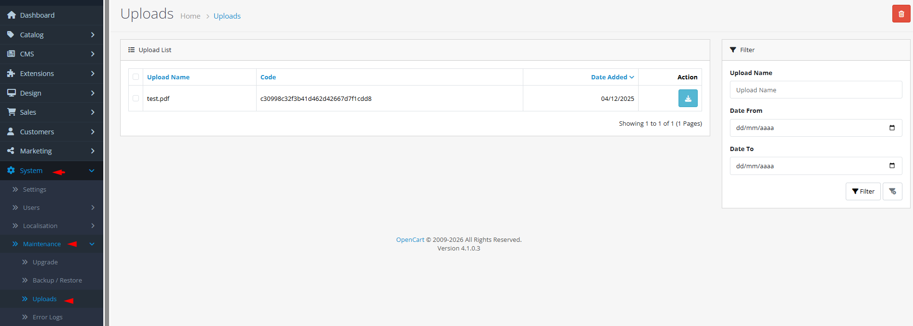

# Uploads

## Introduction

The **Uploads** tool provides centralized management for customer file submissions, allowing you to track, download, and manage files uploaded during order placement or product customization. This system handles file uploads for custom product options, document submissions, and other file-based customer interactions. Each upload is secured with a unique code, stored in an isolated directory, and linked to customer orders for traceability. Proper upload management ensures efficient handling of customer-submitted files while maintaining security and organization.

## Accessing Uploads



#### Navigate to Uploads

Log in to your admin dashboard and go to **System → Maintenance → Uploads**.



#### Uploads Interface

You will see a list of all customer file uploads with filtering options, file details, and management actions.



#### Manage Uploads

Use filters to find specific uploads, download files for review, or delete files that are no longer needed.



## Uploads Interface Overview

### Upload List Management

<strong>File List Display</strong>

**Upload Inventory**

* **Upload Name**: Original filename provided by the customer
* **Unique Code**: System-generated secure code used to identify and retrieve the file
* **Date Added**: Timestamp when the file was uploaded by the customer
* **File Size**: Not displayed but available through file system
* **Order Association**: Implicitly linked to customer orders (visible in order details)

<strong>Filtering &#x26; Search</strong>

**Advanced Filtering**

* **Upload Name Filter**: Search by original filename or partial filename matches
* **Date Range Filter**: Filter uploads by submission date (from/to dates)
* **Code Search**: Filter by unique upload code for precise identification
* **Sort Options**: Sort by name, code, or date added in ascending/descending order
* **Pagination**: Navigate through large upload lists with page controls

<strong>File Operations</strong>

**Management Actions**

* **Download**: Retrieve the original file using the secure download link
* **Delete**: Remove upload records and associated files from the system
* **Bulk Operations**: Select multiple uploads for batch deletion
* **Secure Access**: Files are stored with obscured names and require admin authentication
* **Storage Management**: Files stored in `/storage/upload/` directory with unique naming


**Upload Security**: Customer uploads are stored with randomized filenames in a protected directory. The original filename is stored in the database and restored during download to maintain user familiarity while preventing direct file access.



**Storage Considerations**: Uploaded files accumulate over time and can consume significant disk space. Implement a retention policy and regularly clean up old uploads, especially for high-volume stores with large file submissions.


## Common Tasks

### Reviewing Customer File Uploads

To examine files submitted by customers:

1. Navigate to **System → Maintenance → Uploads**.
2. Use the **Filter** options to narrow down the list (by date, name, or code).
3. Review the upload list showing original filenames, codes, and submission dates.
4. Click the **Download** button (eye icon) to retrieve and examine any file.
5. Files can be cross-referenced with customer orders using the upload code.

### Deleting Old or Unnecessary Uploads

To manage storage and maintain organization:

1. Navigate to **System → Maintenance → Uploads**.
2. Filter the list to identify old uploads (e.g., by date range).
3. Select individual uploads using checkboxes or use **Select All**.
4. Click the **Delete** button (trash icon) to remove selected uploads.
5. Confirm deletion when prompted; files are permanently removed from server.

### Finding Specific Customer Submissions

To locate files from a particular customer or order:

1. Navigate to **System → Maintenance → Uploads**.
2. If you know the upload code (available in order details), enter it in the **Filter by Name** field (supports partial matching).
3. Alternatively, filter by date range around the order date.
4. For known filenames, search by original filename in the filter field.
5. Download located files for verification or processing.

### Managing Upload Storage

To prevent disk space issues from accumulated uploads:

1. Navigate to **System → Maintenance → Uploads**.
2. Filter by date to identify uploads older than your retention period.
3. Consider downloading important files for archival before deletion.
4. Use bulk selection to remove large numbers of old uploads efficiently.
5. Monitor `/storage/upload/` directory size regularly.

## Best Practices

<strong>Upload Management Strategy</strong>

**Organized Workflow**

* **Regular Reviews**: Schedule weekly or monthly upload reviews to prevent accumulation.
* **Retention Policy**: Define how long to keep uploads based on business needs (30, 60, 90 days).
* **Order Association**: Always reference uploads against customer orders for context.
* **Customer Communication**: Inform customers about file submission expectations and retention periods.
* **Backup Strategy**: Include upload directory in your regular backup routine if files are critical.

<strong>Security &#x26; Privacy</strong>

**Data Protection**

* **Access Control**: Restrict upload access to authorized personnel only.
* **File Scanning**: Consider virus scanning for customer uploads, especially executable files.
* **Privacy Compliance**: Handle uploaded files in accordance with data protection regulations.
* **Secure Storage**: Ensure upload directory has proper permissions (not web-accessible).
* **Secure Deletion**: When deleting sensitive files, ensure complete removal from server.

<strong>Performance Optimization</strong>

**System Efficiency**

* **Storage Monitoring**: Set up alerts for upload directory size thresholds.
* **File Size Limits**: Configure maximum upload sizes in OpenCart settings and server configuration.
* **Cleanup Automation**: Consider automated cleanup scripts for old uploads.
* **Database Maintenance**: Regularly optimize the upload database table for performance.
* **Extension Awareness**: Some extensions may create uploads; understand their storage patterns.

<strong>Customer Experience</strong>

**Submission Process**

* **Clear Instructions**: Provide customers with clear file requirements and limitations.
* **Confirmation**: Consider implementing upload confirmation for customers.
* **File Type Guidance**: Specify allowed file types and sizes in product descriptions.
* **Processing Time**: Set expectations for how uploaded files will be processed.
* **Support Channels**: Provide clear support for upload-related issues.


**Sensitive Content**: Customer uploads may contain personal information, copyrighted material, or malicious content. Implement appropriate security measures, scanning procedures, and legal compliance for handling user-submitted files.


## Troubleshooting

<strong>Uploads not appearing in the list</strong>

**Visibility Issues**

* **Filter Settings**: Check if active filters are hiding expected uploads.
* **Order Status**: Uploads are typically created when orders are placed; check order completion.
* **File Size Limits**: Very large files may fail upload and not appear in the list.
* **Extension Issues**: Some extensions may handle uploads differently; check extension documentation.
* **Database Issues**: Verify upload records exist in the database `upload` table.

<strong>Cannot download uploads</strong>

**Download Problems**

* **File Permissions**: Check read permissions for files in `/storage/upload/`.
* **Missing Files**: Files may have been manually deleted from the file system.
* **Code Mismatch**: Upload codes must match exactly; verify code from order details.
* **Browser Issues**: Try different browser or clear browser cache.
* **Server Configuration**: Some server configurations block file downloads.

<strong>Uploads consuming excessive disk space</strong>

**Storage Management**

* **Large Files**: Identify and address unusually large individual uploads.
* **Accumulation**: Implement regular cleanup schedule for old uploads.
* **File Type Review**: Some file types (images, PDFs) may be larger than necessary.
* **Compression**: Consider requiring compressed files for certain submissions.
* **External Storage**: For high-volume stores, consider external storage solutions.

<strong>Duplicate or incorrect upload records</strong>

**Data Integrity**

* **Order Issues**: Check if duplicate orders created duplicate upload records.
* **Extension Conflicts**: Some extensions may create multiple upload records.
* **Manual Intervention**: Avoid manually manipulating upload records in database.
* **System Errors**: Check error logs for upload processing issues.
* **Cleanup**: Safely remove duplicate records after verifying they're not needed.

<strong>Customers cannot upload files during checkout</strong>

**Frontend Issues**

* **File Type Restrictions**: Verify allowed file types in **System → Settings → Options**.
* **Size Limits**: Check `upload_max_filesize` and `post_max_size` in PHP configuration.
* **JavaScript Errors**: Browser console may reveal frontend upload script errors.
* **Theme Compatibility**: Some themes may modify the upload interface.
* **Extension Requirements**: Certain product options require specific upload configurations.

> "Every uploaded file represents a customer's trust—trust that you'll handle their submission carefully, process it accurately, and protect their information. Good upload management turns file submissions into satisfied customers."
