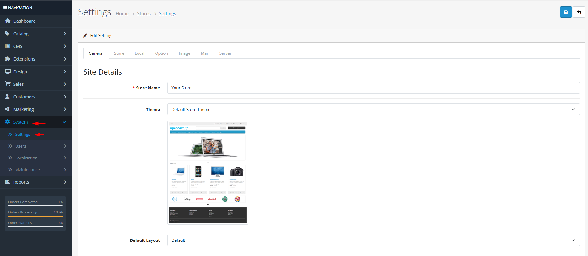

# Settings

## Introduction

The **General** tab is the starting point for configuring your store's visual identity and SEO foundation. Here, you define the store name, select the theme and default layout, upload your logo and favicon, and set the meta tags that appear in search engine results.

## Accessing General Settings



#### Navigate to Settings

Log in to your admin dashboard and go to **System → Settings**.



#### Edit Store

Find your store in the list (usually "Your Store" by default) and click the **Edit** (blue pencil) button on the right.



#### Select General Tab

By default, the **General** tab will be the first one visible.



## Configuration Fields

Below are the key fields found in the General tab:

### Store Identity

* **Store Name**: **(Required)** The official name of your store as it appears throughout your website.
* **Theme**: Select the default theme for your storefront. Third-party themes will appear here if installed.
* **Default Layout**: The fallback layout used when no specific layout is assigned to a page.
* **Logo**: The main logo that appears in the header of your storefront and on invoices.
* **Icon**: Also known as a "Favicon". This is the small image that appears in the browser tab next to your store's title.

### Meta Tags (SEO)

* **Meta Title**: **(Required)** The title of your store as it will appear in browser tabs and search engine results. This is critical for SEO.
* **Meta Tag Description**: A brief summary of your store (160 characters recommended) for search engines.
* **Meta Tag Keywords**: Keywords related to your store (less important for modern SEO, but still available).


**Note**: If you are running a multi-store setup, each store can have its own unique General settings, allowing you to have different store names, themes, logos, and meta tags for different brands.


## Common Tasks

### Uploading a New Logo

To change the main logo of your store:

1. Click on the existing **Logo** image or the placeholder.
2. The **Image Manager** will open. Upload your new logo file.
3. Double-click the uploaded image to select it.
4. Click **Save** at the top right.

### Optimizing Meta Tags for SEO

To improve your store's search engine visibility:

1. Write a compelling **Meta Title** (50-60 characters) that includes your primary brand name.
2. Craft a concise **Meta Tag Description** (around 160 characters) that summarizes your store and encourages clicks.
3. If using **Meta Tag Keywords**, focus on 3-5 high-relevance terms.

## Best Practices

<strong>SEO Optimization</strong>

**Meta Data Tips**

* **Meta Title**: Keep it between 50-60 characters. Include your primary brand name.
* **Meta Description**: Write a compelling call-to-action to increase your click-through rate (CTR) from search results.
* **Keywords**: Focus on 3-5 high-relevance terms if you choose to use this field.

<strong>Visual Branding</strong>

**Logo & Icon Guidelines**

* **Logo Format**: Use transparent PNG or SVG formats for the best look on different background colors.
* **File Size**: Keep your logo file size small (under 100KB) to ensure fast page loading.
* **Favicon**: Use a simple, high-contrast icon that is recognizable even at very small sizes (16x16 or 32x32 pixels).


**Logo Visibility** ⚠️ If your logo doesn't appear on the storefront, clear the theme cache and verify the image file was uploaded correctly in the Image Manager.


## Troubleshooting

<strong>Changes are not appearing on the storefront</strong>

**Cache and Theme Issues**

* **Cache Issue**: Your browser or a server-side cache (like Cloudflare or an OpenCart cache extension) might be showing an old version. Clear your browser cache or the OpenCart theme cache.
* **Theme Specifics**: Some custom themes might use their own settings instead of the default OpenCart General settings. Check your theme's documentation if changes don't reflect.

<strong>Meta tags are not showing in search results</strong>

**SEO and Cache Issues**

* **Search Engine Crawling**: It may take days or weeks for search engines to re-crawl your site and index updated meta tags.
* **Cache**: Clear your store's cache and any server-side caching (like Cloudflare) to ensure the new meta tags are served to visitors.
* **Theme Override**: Some custom themes may override OpenCart's default meta tag handling. Check your theme's documentation.

> "Your General settings are the digital handshake of your business. Accuracy here builds immediate credibility with both search engines and shoppers."
