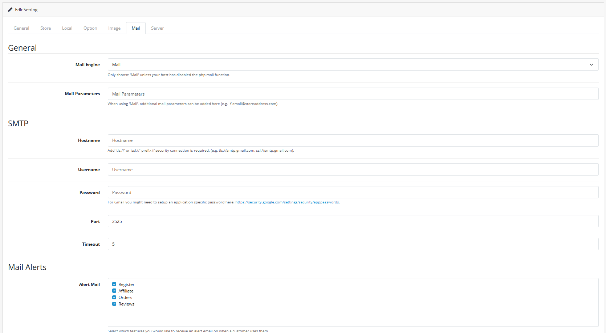

# Mail

## Introduction

The **Mail** tab is crucial for communication between your store and your customers. Correct configuration ensures that order confirmations, account registrations, and contact form inquiries reach their destination without being marked as spam.

## Accessing Mail Settings

### Navigate to Settings

Log in to your admin dashboard and go to **System → Settings**.

#### Edit Store

Find your store in the list (usually "Your Store" by default) and click the **Edit** (blue pencil) button on the right.

#### Select Mail Tab

In the store configuration interface, click the **Mail** tab.

## Configuration Fields

### Mail Protocol

* **Mail Engine**: Choose between **Mail** (uses the built-in PHP mail function) or **SMTP** (connects to an external email server like Gmail, Outlook, or your hosting's mail server).
* **Mail Parameters**: Only used with the 'Mail' engine to add extra flags (e.g., `-f email@yourstore.com`).

### SMTP Configuration

If you select **SMTP**, you must fill in the following:

* **SMTP Hostname**: The address of your mail server (e.g., `smtp.yourdomain.com` or `ssl://smtp.gmail.com`).
* **SMTP Username**: Your full email address.
* **SMTP Password**: The password for the email account.
* **SMTP Port**: Usually `465` (SSL), `587` (TLS), or `25`.
* **SMTP Timeout**: The amount of time (in seconds) the store will wait for a response from the mail server.

### Alerts & Notifications

* **Additional Alert E-Mails**: A comma-separated list of extra email addresses that should receive notifications.
* **Alert Mail**: Check the boxes for events that should trigger an alert to the administrator:
  * **Orders**: New orders placed.
  * **Reviews**: New product reviews submitted.
  * **Affiliates**: New affiliate registrations.
  * **Customers**: New account registrations.


**Recommended**: Use **SMTP** instead of 'Mail'. SMTP is more reliable, has better deliverability, and is less likely to be flagged as spam by providers like Gmail or Yahoo.


## Common Tasks

### Adding Multiple Recipients for Alerts

To notify several team members about new orders:

1. Locate the **Additional Alert E-Mails** field.
2. Enter the email addresses separated by a comma (e.g., `sales@yourstore.com,warehouse@yourstore.com`).
3. Ensure the **Orders** checkbox is checked under **Alert Mail**.

## Best Practices

<strong>SMTP Deliverability</strong>

**Email Authentication**

* **App Passwords**: If using Gmail or Outlook with Two-Factor Authentication (2FA), you must generate and use an "App Password" instead of your regular account password.
* **Encryption**: Always prefer `ssl://` or `tls://` prefixes for your hostname to ensure secure transmission.

<strong>Managing Notifications</strong>

**Avoiding Inbox Clutter**

* **Additional Emails**: Use this for secondary staff members who only need to see certain types of alerts.
* **Test Emails**: After saving your settings, perform a test by using the "Forgot Password" feature or the "Contact Us" form to verify emails are sending correctly.


**Spam Filters** ⚠️ If your emails are still landing in spam, check if your domain has correct **SPF** and **DKIM** records set up in your DNS settings. This is outside of OpenCart but essential for email health.


## Troubleshooting

<strong>Emails are not being sent or received</strong>

**Credential and Server Checks**

* **Check Mail Engine**: If set to 'Mail', your server might be blocking PHP mail. Switch to 'SMTP'.
* **Verify Credentials**: Ensure your SMTP username and password are correct.
* **Check Ports**: Ensure your server's firewall allows outbound connections on your SMTP port (465/587).
* **Spam Folder**: Check your spam/junk folders. If found there, configure SPF/DKIM records.

<strong>SMTP Connection Timeout</strong>

**Network and Configuration**

* **Hostname Prefix**: If using port 465, ensure you use `ssl://` before the hostname.
* **Timeout Setting**: Increase the **SMTP Timeout** value (e.g., from 5 to 10 or 15 seconds).
* **Firewall**: Contact your host to confirm they haven't blocked outgoing SMTP connections.

> "Reliable communication is the backbone of customer service. A properly configured mail system ensures your customers are never left in the dark about their orders."
