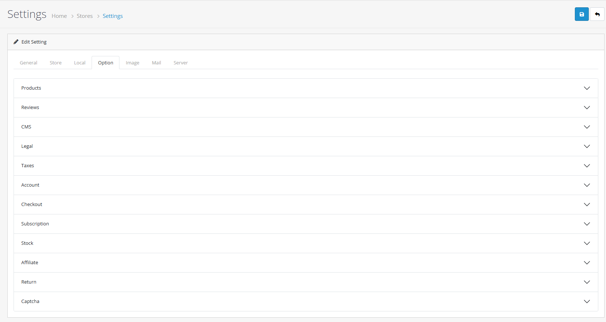

# Option

## Introduction

The **Option** tab is the most detailed part of the store configuration. It controls the fundamental behavior of your storefront, from how products are listed and taxes are displayed to how customers register accounts and complete the checkout process.

## Accessing Option Settings



#### Navigate to Settings

Log in to your admin dashboard and go to **System → Settings**.



#### Edit Store

Find your store in the list (usually "Your Store" by default) and click the **Edit** (blue pencil) button on the right.



#### Select Option Tab

In the store configuration interface, click the **Option** tab.



## Configuration Fields

Because this tab contains many settings, they are grouped into logical sub-sections. Use the dropdowns below to explore each category.

### Storefront Display & Catalog

<strong>Products &#x26; Reviews</strong>

**Catalog Display Settings**

* **Category Product Count**: Shows the number of products within subcategories in the top menu. (Warning: Can impact performance on large catalogs).
* **Default Items Per Page (Catalog)**: How many products are shown per page (e.g., 15).
* **Allow Reviews**: Enables or disables the review system on product pages.
* **Allow Guest Reviews**: If enabled, customers can write reviews without creating an account.

<strong>CMS &#x26; Blog</strong>

**Blog & Content Management Settings**

* **List Description Limit (Articles)**: Character limit for short article descriptions in list views (e.g., blog homepage, category pages).
* **Allow Comments**: Enable or disable the comment system for articles.
* **Auto Approve Comments**: Automatically approve comments; otherwise, first comment from each user requires manual approval.

<strong>Taxes</strong>

**Financial Settings**

* **Display Prices With Tax**: Set to **Yes** to show prices including VAT/Taxes on the storefront.
* **Use Store Tax Address**: Which address to use for tax calculation (Shipping or Payment address).

### Customer Management & Compliance

<strong>Account &#x26; Checkout</strong>

**Registration & Purchasing Flow**

* **Customer Group**: The default group assigned to new registrations.
* **Login Display Prices**: If enabled, customers must log in to see prices.
* **Max Login Attempts**: Security measure to block accounts after multiple failed login tries.
* **Account Terms**: Select the information page customers must agree to before creating an account.
* **Guest Checkout**: Set to **Yes** to allow customers to buy without creating an account.
* **Checkout Terms**: Select the information page (e.g., Terms & Conditions) customers must agree to before paying.

<strong>Stock &#x26; Inventory</strong>

**Inventory Behavior**

* **Display Stock**: Show the available quantity on the product page.
* **Show Out Of Stock Warning**: Displays a warning in the shopping cart if a product is out of stock but checkout is still allowed.
* **Stock Checkout**: Set to **Yes** to allow customers to purchase items even if they are not in stock.

<strong>Legal &#x26; GDPR</strong>

**Returns & Privacy**

* **Return Terms**: Select the information page for return policies.
* **GDPR Policy**: Select the privacy policy page that customers must accept during registration to comply with data protection laws.
* **GDPR Limit**: The number of days after which a customer's personal data request is processed.


**Performance Tip**: Disabling **Category Product Count** can significantly speed up your site's loading time if you have thousands of products and categories.


## Common Tasks

### Enabling Guest Checkout

To allow customers to purchase without creating an account:

1. Navigate to the **Account & Checkout** section.
2. Set **Guest Checkout** to **Yes**.
3. Ensure **Stock Checkout** (under Stock & Inventory) is also set to **Yes** if you want to allow guest purchases of out-of-stock items.

### Forcing Login to View Prices

If you run a B2B store and want to hide prices from the general public:

1. Navigate to the **Account & Checkout** section.
2. Set **Login Display Prices** to **Yes**.
3. Prices will now only be visible to customers who are logged into their accounts.

## Best Practices

<strong>Optimizing Conversion</strong>

**Frictionless Checkout**

* **Guest Checkout**: Enabling guest checkout is one of the most effective ways to reduce cart abandonment.
* **Checkout Terms**: Keep your terms clear and link to a page that opens in a popup so customers don't leave the checkout flow.

<strong>Security &#x26; Trust</strong>

**Building Credibility**

* **Reviews**: Only enable guest reviews if you have a strong anti-spam filter or manual approval process.
* **Stock Checkout**: Only allow stock checkout if you are confident your suppliers can fulfill backorders quickly.


**Tax Configuration** ⚠️ If your legal region requires you to show prices with tax by law, ensure "Display Prices With Tax" is set to \*\*Yes\*\*. Failure to do so may lead to legal issues.


## Troubleshooting

<strong>Prices are not showing on the storefront</strong>

**Display and Tax Settings**

* **Check Login Settings**: Verify if **Login Display Prices** is set to **Yes**. If it is, only logged-in users can see prices.
* **Tax Settings**: If taxes are not appearing, ensure **Display Prices With Tax** is enabled and your Tax Classes are correctly assigned to products.

<strong>Guest Checkout is not appearing</strong>

**Requirements and Configuration**

* **Verify Setting**: Ensure **Guest Checkout** is set to **Yes**.
* **Check Cart Contents**: Guest checkout is automatically disabled if the shopping cart contains a **Downloadable Product** (as these require an account for future access).
* **Terms Agreement**: Ensure you have selected a valid **Checkout Terms** page; if the page is missing or disabled, the checkout flow may fail.

> "The Options tab is the engine room of your store's workflow. Tuning these settings correctly is the difference between a clunky experience and a seamless shopping journey."
