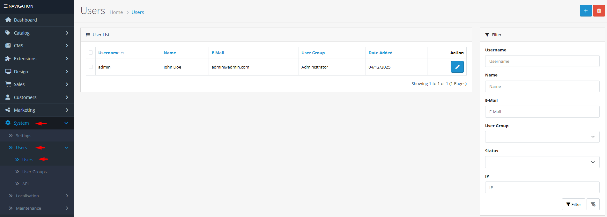

# Users

## Introduction

The **Users** section allows you to manage administrative accounts that have access to your store's backend. Here you can create new users, assign them to specific user groups with defined permissions, monitor login activity, and enhance security by reviewing authorization history.

## Accessing User Management



#### Navigate to Users

Log in to your admin dashboard and go to **System → Users → Users**.



#### User List

You will see a list of all existing administrative users with their usernames, names, email addresses, user groups, and status.



#### Manage Users

Use the **Add New** button to create a new user or click **Edit** on any existing user to modify their details.



## User Interface Overview

### User List Filters

The user list includes several filters to help you find specific users:

* **Username**: Filter by the user's login username
* **Name**: Search by first or last name
* **Email**: Filter by email address
* **User Group**: Filter by assigned permission group
* **Status**: Show only active or disabled users
* **IP**: Filter by IP address used for login

### User Details Tabs

When editing or adding a user, you'll find three main tabs:

<strong>User Details</strong>

**Account Information**

* **Username**: **(Required)** Unique login name (3-20 characters)
* **User Group**: **(Required)** Permission group that determines access rights
* **Password**: **(Required for new users)** Must contain uppercase, lowercase, number, and symbol
* **Confirm Password**: Re-enter the password for verification
* **First Name**: **(Required)** User's first name (1-32 characters)
* **Last Name**: **(Required)** User's last name (1-32 characters)
* **E-Mail**: **(Required)** Valid email address for notifications
* **Image**: Profile picture (optional)
* **Status**: Enable or disable the user account

<strong>Login History</strong>

**Security Monitoring**

* **IP Address**: The IP used for each login attempt
* **User Agent**: Browser and device information
* **Date Added**: Timestamp of each login
* **Date Expire**: When the session will expire (if applicable)

This tab helps you monitor account activity and detect unauthorized access attempts.

<strong>Authorize History</strong>

**Two-Factor Authentication Logs**

* **Call**: The API or action that was authorized
* **IP Address**: Source IP of the authorization request
* **Date Added**: When the authorization occurred
* **Date Modified**: Last modification timestamp

This tab tracks Two-Factor Authentication events and other authorization processes.


**Password Security**: OpenCart enforces strong passwords by default. New passwords must contain at least one uppercase letter, one lowercase letter, one number, and one symbol, and be between 4 and 20 characters long.


## Common Tasks

### Creating a New Administrative User

To add a new staff member with backend access:

1. Navigate to **System → Users → Users** and click **Add New**.
2. Fill in the **Username**, **First Name**, **Last Name**, and **E-Mail** fields.
3. Select an appropriate **User Group** for their role (e.g., "Administrator" for full access).
4. Enter a strong **Password** and confirm it.
5. Optionally upload a profile **Image**.
6. Set **Status** to "Enabled".
7. Click **Save**. The new user can now log in with their credentials.

### Resetting a User's Password

If a user forgets their password or needs it reset:

1. Find the user in the list and click **Edit**.
2. Go to the **User Details** tab.
3. Enter a new **Password** and **Confirm Password**.
4. Click **Save**. The user's password is immediately updated.

### Disabling a User Account Temporarily

To temporarily prevent a user from accessing the admin without deleting their account:

1. Edit the user's details.
2. Set **Status** to "Disabled".
3. Click **Save**. The user will no longer be able to log in until you re-enable the account.

## Best Practices

<strong>Security &#x26; Access Control</strong>

**Principle of Least Privilege**

* **User Groups**: Assign users to the most restrictive user group that still allows them to perform their job duties.
* **Regular Audits**: Periodically review the user list to ensure all accounts are still needed and properly configured.
* **Strong Passwords**: Enforce password policies and consider regular password rotations for administrative accounts.
* **Two-Factor Authentication**: Consider implementing 2FA for additional security on high-privilege accounts.

<strong>Account Management</strong>

**Organizational Efficiency**

* **Naming Conventions**: Use consistent username formats (e.g., firstname.lastname) for easier management.
* **Profile Images**: Adding profile pictures helps visually identify users in multi-admin environments.
* **Email Accuracy**: Ensure email addresses are correct so users can receive password reset links and notifications.
* **Regular Cleanup**: Remove or disable accounts for employees who no longer need access.


**Security Warning** ⚠️ Never share administrative credentials. Each staff member should have their own unique account with appropriate permissions. This ensures accountability and allows you to disable access individually if needed.


## Troubleshooting

<strong>User cannot log in despite correct credentials</strong>

**Common Causes and Solutions**

* **Account Status**: Verify the user's account is **Enabled** in their user details.
* **User Group Permissions**: Ensure the user group assigned to the account has permission to access the admin area.
* **Password Requirements**: If resetting a password, ensure it meets all complexity requirements (uppercase, lowercase, number, symbol).
* **Browser Cache**: Clear the browser cache and cookies, or try a different browser.

<strong>"You do not have permission to access this page" error</strong>

**Permission Issues**

* **User Group Configuration**: Check the user's assigned **User Group** and verify it has the necessary permissions for the requested page.
* **Extension Permissions**: Some extensions may require specific permissions that aren't included in standard user groups.
* **Session Issues**: Try logging out and back in to refresh permissions.
* **Cache**: Clear the OpenCart cache from **System → Maintenance → Cache**.

<strong>Email address already in use error</strong>

**Duplicate Account Prevention**

* **Check Existing Users**: Use the filter to search for the email address in the user list.
* **Customer Accounts**: Remember that customer emails are stored separately from admin users.
* **Case Sensitivity**: Email addresses in OpenCart are case-insensitive. "User@Example.com" and "user@example.com" are considered the same.
* **Solution**: Either use a different email address or edit the existing user account instead of creating a new one.

> "Proper user management is the first line of defense for your store's security. Each administrative account should have precisely the permissions needed—no more, no less—to maintain both security and operational efficiency."
