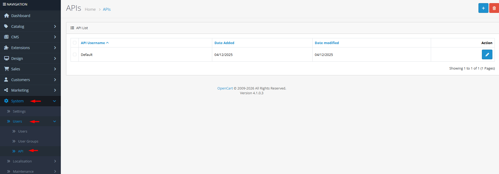

# API

## Introduction

The **APIs** section allows you to create and manage secure credentials for external applications to communicate with your OpenCart store. This enables integrations with inventory systems, ERP software, mobile apps, custom frontends, and other third-party services. Each API key has configurable access restrictions and detailed usage history for security monitoring.

## Accessing API Management



#### Navigate to APIs

Log in to your admin dashboard and go to **System → Users → APIs**.



#### API List

You will see a list of existing API credentials with their usernames, status, and associated IP restrictions.



#### Manage APIs

Use the **Add New** button to create a new API key or click **Edit** to modify an existing API's settings and permissions.



## API Interface Overview

### API Configuration Fields

<strong>Basic API Information</strong>

**Core Credentials**

* **API Username**: **(Required)** A unique identifier for the API key (3-20 characters)
* **API Key**: **(Required)** A secure token generated by OpenCart (64-256 characters)
* **Status**: Enable or disable the API key without deleting it

<strong>IP Access Restrictions</strong>

**Security Controls**

* **Allowed IPs**: A list of IP addresses permitted to use this API key
* **Current IP Display**: The system shows your current IP address for reference
* **IP Management**: Add, edit, or remove IP addresses from the allowed list

IP restrictions are a critical security feature that ensures only authorized servers can connect to your store's API.

<strong>API History Tracking</strong>

**Usage Monitoring**

* **Call**: The specific API endpoint or action that was accessed
* **IP Address**: The source IP of the API request
* **Date Added**: When the API call was made
* **Date Modified**: Last modification timestamp

The history tab provides an audit trail of all API activity for security review and troubleshooting.


**Security First**: Always restrict API keys to specific IP addresses. OpenCart displays your current IP address on the API form to help you add it easily. For production integrations, use the static IP addresses of your external servers.


## Creating a New API Key

To set up an integration with an external service (e.g., an inventory management system):

1. Navigate to **System → Users → APIs** and click **Add New**.
2. Enter a descriptive **API Username** that identifies the purpose (e.g., "inventory-sync").
3. OpenCart will automatically generate a secure **API Key**. Copy this key immediately—you won't be able to see it again after saving.
4. Set **Status** to "Enabled".
5. In the **IP** section, add the IP addresses that will be allowed to use this key:
   * For testing, you can add your current IP (displayed on the form).
   * For production, add the static IPs of your external servers.
6. Click **Save**. The API key is now ready for use.

## Common Tasks

### Setting Up a Mobile App Integration

To connect a custom mobile app to your OpenCart store:

1. Create a new API with username "mobile-app".
2. Generate and securely store the API key.
3. Add the IP addresses of your mobile app servers (or use wildcards if your app connects from variable IPs—use with caution).
4. In your mobile app code, use the API username and key to authenticate requests.
5. Monitor the **History** tab to ensure the API is being used correctly.

### Rotating Compromised API Keys

If an API key is suspected to be compromised:

1. Find the API in the list and click **Edit**.
2. Change the **Status** to "Disabled" to immediately block all access.
3. Create a new API key with a different username.
4. Update your external systems with the new credentials.
5. Delete the old API key once all systems are migrated.

### Restricting API Access to Specific Servers

For maximum security when integrating with known servers:

1. Obtain the static IP addresses of all servers that need API access.
2. When creating or editing an API, add each IP address to the **IP** list.
3. Test the connection from each server to ensure the IP is correctly configured.
4. Regularly review the API history to ensure only authorized IPs are making calls.

## Best Practices

<strong>Security &#x26; Access Control</strong>

**Protecting Your Store**

* **IP Whitelisting**: Always restrict API keys to specific IP addresses. Never leave the IP list empty unless absolutely necessary.
* **Key Rotation**: Periodically regenerate API keys, especially for high-traffic integrations.
* **Minimum Permissions**: Create separate API keys for different integrations with only the permissions they need.
* **Monitoring**: Regularly check the API history for unusual activity or unauthorized access attempts.
* **Secure Storage**: Store API keys in secure environment variables or configuration files, never in code repositories.

<strong>Integration Management</strong>

**Reliable Connections**

* **Descriptive Names**: Use clear API usernames that indicate the integration purpose (e.g., "erp-sync", "analytics-export", "mobile-backend").
* **Documentation**: Maintain a record of which API keys are used by which systems for easier troubleshooting.
* **Testing Environment**: Use separate API keys for development, staging, and production environments.
* **Error Handling**: Ensure your integrations properly handle API errors, especially authentication failures and rate limits.
* **Version Awareness**: Be aware of API version changes when upgrading OpenCart, as endpoints may change.


**Critical Security Warning** ⚠️ API keys grant access to your store's data and functions. Treat them with the same security as admin passwords. Never expose API keys in client-side code (JavaScript, mobile apps distributed to users). Always use server-to-server communication or implement a secure proxy.


## Troubleshooting

<strong>API calls return "Unauthorized" error</strong>

**Authentication Issues**

* **Check Credentials**: Verify the API username and key are correct. Remember that the API key is case-sensitive.
* **API Status**: Ensure the API is **Enabled** in the admin panel.
* **IP Restrictions**: Confirm the calling server's IP address is in the allowed IP list.
* **Key Visibility**: If you've lost an API key, you cannot retrieve it—you must generate a new one.
* **Solution**: Create a new API key with the correct IP restrictions and update your integration.

<strong>API works in testing but fails in production</strong>

**Environment Differences**

* **IP Address Changes**: Production servers often have different IP addresses than development servers. Update the allowed IP list.
* **Network Configuration**: Firewalls, proxies, or load balancers may change the apparent source IP. Check your network configuration.
* **SSL/TLS Issues**: Ensure production servers have valid SSL certificates if using HTTPS.
* **Rate Limiting**: Production traffic might be hitting rate limits. Check if your hosting provider imposes API call limits.

<strong>Cannot delete an API key</strong>

**Dependency Issues**

* **Active Connections**: Ensure no systems are currently using the API key. Disable it first and monitor for errors.
* **System Integrity**: Some extensions or custom code might depend on specific API keys. Check your integration code.
* **Administrative Permissions**: Verify your user account has permission to delete APIs.
* **Solution**: First disable the API key, wait to ensure no systems break, then delete it.

<strong>API history shows unexpected calls</strong>

**Security Investigation**

* **Review IP Addresses**: Check if the calls are coming from authorized IPs.
* **Identify the Source**: Use the "Call" column to see which endpoints are being accessed.
* **Check Integration Logs**: Review logs from your integrated systems.
* **Immediate Action**: If you suspect unauthorized access, immediately disable the API key and investigate further.
* **Prevention**: Implement more restrictive IP whitelisting and consider implementing additional authentication layers.

> "APIs are the bridges that connect your store to the wider digital ecosystem. Each bridge needs strong gates (IP restrictions), vigilant guards (monitoring), and regular inspections (key rotation) to keep your data secure while enabling powerful integrations."
