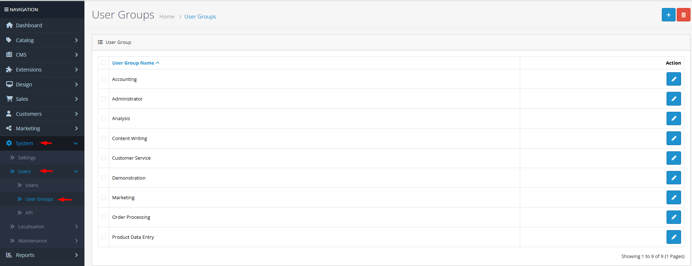

# User Groups

## Introduction

**User Groups** are the foundation of OpenCart's permission system. They allow you to create customized permission sets that control exactly what each administrative user can see and do in your store's backend. Instead of giving every staff member full access, you can define roles like "Sales Manager", "Content Editor", or "Order Processor" with specific, limited permissions.

## Accessing User Groups



#### Navigate to User Groups

Log in to your admin dashboard and go to **System → Users → User Groups**.



#### User Group List

You will see a list of existing user groups. The default installation includes "Administrator" (full access) and "Demo" (limited access).



#### Manage Groups

Use the **Add New** button to create a custom user group or click **Edit** to modify an existing group's permissions.



## User Group Interface Overview

### Permission Structure

User group permissions are organized into two main categories:

<strong>Access Permissions</strong>

**View-Only Access**

* **Dashboard**: Access to the main admin dashboard
* **Catalog**: View products, categories, attributes, etc.
* **Extensions**: See installed extensions and their settings
* **Sales**: View orders, returns, customers, etc.
* **System**: Access settings, users, localization, and maintenance

Access permissions control which menu items and pages a user can **see**. Without access permission, the menu item won't even appear for that user.

<strong>Modify Permissions</strong>

**Edit and Change Rights**

* **Catalog**: Add/edit/delete products, categories, etc.
* **Extensions**: Install/uninstall/configure extensions
* **Sales**: Process orders, edit customer details, etc.
* **System**: Change settings, create users, modify localization

Modify permissions control what a user can **change**. A user might have access to view orders but not modify them unless granted modify permission.

### Extension-Specific Permissions

Many extensions add their own permission categories. For example:

* **Payment Extensions**: Configure payment methods
* **Shipping Extensions**: Set up shipping options
* **Marketing Extensions**: Manage coupons, affiliates, etc.
* **Analytics Extensions**: View reports and statistics


**Permission Inheritance**: Modify permissions automatically include access permissions. If you grant "modify" permission for catalog, the user automatically gets "access" permission as well. You don't need to check both boxes.


## Creating a Custom User Group

To create a role-based permission set (e.g., "Content Manager"):

1. Navigate to **System → Users → User Groups** and click **Add New**.
2. Enter a descriptive **User Group Name** (e.g., "Content Manager").
3. In the **Permissions** section, expand the categories to select specific permissions:
   * Under **Access**, check **Catalog** to allow viewing products and categories.
   * Under **Modify**, check **Catalog** to allow editing products and categories.
   * Consider adding **Extensions → Modifications** access to view OCMod changes.
4. Review extension-specific permissions if needed.
5. Click **Save**. You can now assign users to this new group.

## Common Tasks

### Setting Up a Sales Representative Role

To create a user group that can process orders but not change store settings:

1. Create a new user group named "Sales Representative".
2. Grant **Access** permissions for:
   * **Dashboard** (to see the main screen)
   * **Sales** (to view orders, customers, etc.)
   * **Extensions** (to see installed extensions)
3. Grant **Modify** permissions for:
   * **Sales** (to process orders, update statuses, etc.)
4. Do NOT grant any **System** permissions (to prevent changes to settings).
5. Save and assign sales staff to this group.

### Creating a Read-Only Auditor Role

For users who need to view data but not make changes (e.g., accountants, managers):

1. Create a user group named "Auditor" or "View Only".
2. Grant **Access** permissions for all areas they need to monitor:
   * **Dashboard**, **Catalog**, **Sales**, **System**
3. Do NOT grant any **Modify** permissions.
4. Save and assign users to this group.

### Cloning an Existing User Group

To create a new group similar to an existing one:

1. Edit the existing user group you want to clone.
2. Note down all the checked permissions.
3. Create a new user group with a different name.
4. Check the same permissions as the original group.
5. Make any necessary adjustments.
6. Save the new group.

## Best Practices

<strong>Permission Strategy</strong>

**Security by Design**

* **Principle of Least Privilege**: Start with no permissions and add only what's absolutely necessary for the role.
* **Role-Based Groups**: Create groups based on job functions, not individual people. This makes management scalable.
* **Regular Reviews**: Periodically audit user group permissions, especially after installing new extensions that add their own permission categories.
* **Test Groups**: Create a test user assigned to new groups to verify permissions work as expected before deploying to staff.

<strong>Group Management</strong>

**Organizational Efficiency**

* **Naming Conventions**: Use clear, descriptive names that indicate the role's purpose (e.g., "Order Processor", "Product Editor", "System Admin").
* **Documentation**: Keep a simple document or spreadsheet mapping user groups to their permissions for quick reference.
* **Default Groups**: Consider keeping the default "Administrator" and "Demo" groups unchanged as reference points.
* **Extension Awareness**: When installing new extensions, check if they add permission categories that need to be assigned to relevant user groups.


**Critical System Permissions** ⚠️ Be extremely cautious when granting **System** modify permissions. These allow users to change store settings, create new administrative accounts, and modify core functionality. Typically only trusted system administrators should have these permissions.


## Troubleshooting

<strong>User cannot see certain menu items</strong>

**Access Permission Issues**

* **Check User Group**: Verify the user is assigned to a user group that has **Access** permission for the missing menu section.
* **Menu Caching**: OpenCart caches menu structures. Clear the cache from **System → Maintenance → Cache**.
* **Extension Permissions**: Some menu items are added by extensions. Check if the extension adds its own permission category.
* **User Session**: Have the user log out and back in to refresh permission assignments.

<strong>"You do not have permission to modify" error</strong>

**Modify Permission Issues**

* **User Group Permissions**: Check that the user's group has **Modify** permission for the section they're trying to edit.
* **Specific Actions**: Some actions within a section may require additional permissions. For example, deleting a product might require different permissions than editing one.
* **Extension-Specific Permissions**: If the error occurs in an extension, check if that extension has separate modify permissions.
* **Permission Inheritance**: Remember that modify permissions include access permissions automatically.

<strong>Cannot delete a user group</strong>

**Group Dependency Issues**

* **Assigned Users**: A user group cannot be deleted if it's still assigned to one or more users. Reassign those users to different groups first.
* **Default Groups**: The built-in "Administrator" group may be protected from deletion in some configurations.
* **System Integrity**: Some groups may be required by the system or extensions. Check if any extensions depend on the group.
* **Solution**: To delete a group, first reassign all users to other groups, then attempt deletion again.

> "Well-designed user groups transform your admin panel from a potential security risk into a finely tuned control panel, where each team member has exactly the tools they need—and nothing more."
