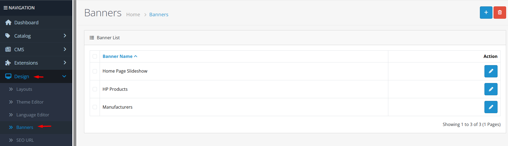
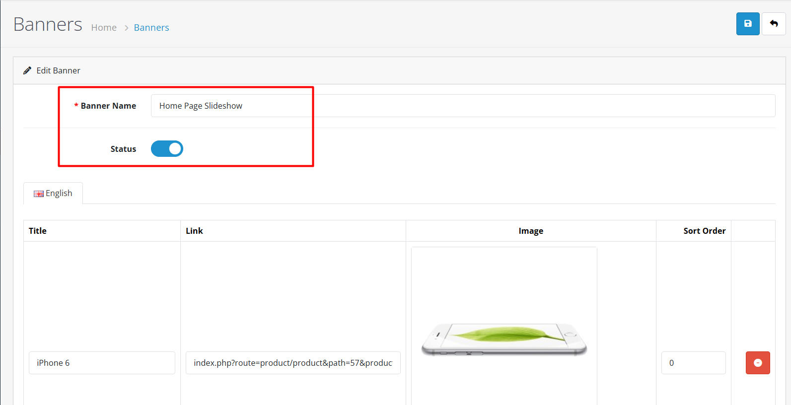
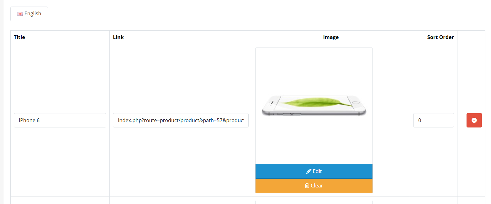

# Banners

## Video Tutorial



_Video: Banner Management in OpenCart_

## Introduction

Banners are flexible promotional tools that allow you to display images with links anywhere in your store. You can create banner groups with multiple images, configure transition effects, and display them using the Banner module in various layout positions.

## Banner List

The banner list displays all banner groups in your store. From here you can:

* **Add New Banner**: Create a new banner group
* **Edit**: Modify existing banner groups
* **Delete**: Remove banner groups
* **Filter**: Search for specific banners


**Pro Tip**: Use descriptive banner names that clearly indicate their purpose and location (e.g., "Homepage Hero Banners", "Sidebar Promotions").


## Creating/Editing Banners

When creating or editing a banner group, you'll work with two main tabs:




**Banner Name**

* Internal reference name for administrators
* Required field, 3-64 characters
* Use clear, descriptive names

**Status**

* Enable or disable the entire banner group
* Disabled banners won't appear on the storefront
* Useful for seasonal or temporary promotions


**Naming Strategy**: Choose banner names that help you quickly identify their purpose and location when managing multiple banner groups.





**Multi-language Support**

Banner images support multiple languages. Each language has its own set of images, allowing you to display different banners based on the store's active language.

**Image Configuration**

For each language, you can add multiple images with the following settings:

**Image**

* Upload or select from existing images
* Supported formats: JPG, PNG, GIF
* Recommended size matches display area

**Title**

* Text displayed as alt text and title attribute
* Required field, 2-64 characters
* Should be descriptive for accessibility and SEO

**Link**

* Optional URL when banner is clicked
* Can be absolute (https://example.com) or relative (/index.php?route=...)
* Use for directing customers to promotions or products

**Sort Order**

* Controls display order within the banner group
* Lower numbers appear first
* Images with same sort order may display in any order


**Image Management**: You can add multiple images to create rotating banners. Use consistent image dimensions within a group for optimal display.



**Link Validation**: Always test banner links after saving to ensure they work correctly and direct customers to the intended destinations.




## Displaying Banners with the Banner Module

Banners are displayed using the Banner module. To configure banner display:



#### Step 1: Install Banner Module

1. Navigate to **Extensions → Modules**
2. Find **Banner** in the module list
3. Click **Install** if not already installed



#### Step 2: Configure Banner Module

Click **Edit** on the Banner module and configure:

**Module Settings**

* **Module Name**: Internal name for this module instance (3-64 characters)
* **Banner**: Select which banner group to display
* **Effect**: Choose transition effect (Slide or Fade)
* **Items per Slide**: Number of items to show simultaneously (1-10)
* **Controls**: Show next/previous navigation arrows (Yes/No)
* **Indicators**: Show slide position indicators (dots) (Yes/No)
* **Interval**: Time between automatic transitions in milliseconds (1000-10000)
* **Width**: Banner display width in pixels (100-2000)
* **Height**: Banner display height in pixels (100-2000)
* **Status**: Enable or disable this module instance


**Display Optimization**: Match the width and height settings to your banner image dimensions to prevent distortion and ensure optimal display quality.




#### Step 3: Add Module to Layout

1. Navigate to **Design → Layouts**
2. Edit the layout where you want banners to appear
3. Add the Banner module to a position (Content Top, Content Bottom, Column Left, Column Right, etc.)
4. Set the sort order within that position
5. **Save** the layout



## Best Practices

<strong>Banner Design &#x26; Optimization</strong>

**Visual Design Guidelines**

**Image Quality:**

* Use high-resolution images that look good on all devices
* Optimize file size for faster loading (compress without sacrificing quality)
* Maintain consistent aspect ratio within a banner group

**Content Strategy:**

* Keep text minimal and readable
* Use strong calls-to-action
* Align banners with current marketing campaigns
* Update banners seasonally and for holidays

**Technical Optimization:**

* Limit rotating images to 3-5 for better performance
* Use appropriate intervals (5+ seconds) for better user experience
* Consider implementing lazy loading for banners below the fold


**Design Strategy**: Create visually appealing banners that enhance user experience while maintaining fast loading times and mobile responsiveness.


<strong>Multi-store &#x26; Multi-language Implementation</strong>

**Advanced Configuration**

**Multi-store Support:**

* Create different banner groups for different stores
* Configure separate Banner module instances per store
* Assign banners to store-specific layouts
* Each store can have completely different promotions

**Multi-language Support:**

* Enable multiple languages in **System → Localization → Languages**
* Add translated titles for each banner image
* Use language-specific images if needed (upload different images per language)
* The appropriate language version displays automatically


**Global Strategy**: Leverage multi-store and multi-language features to create targeted promotional campaigns for different markets and customer segments.


<strong>Performance &#x26; SEO Considerations</strong>

**Optimization Guidelines**

**Performance:**

* Larger intervals reduce server load
* Smaller images load faster
* Disable controls/indicators for cleaner design when not needed
* Monitor banner loading times and optimize as needed

**SEO & Accessibility:**

* Use descriptive alt text in banner titles
* Ensure banner links are crawlable and follow SEO best practices
* Maintain proper heading structure around banner areas
* Test banner functionality with screen readers


**Performance Impact**: Excessive use of banners with large images and short intervals can negatively impact page load times and user experience.


## Common Tasks



#### Creating a New Banner Group

1. Navigate to **Design → Banners**
2. Click **Add New**
3. Fill in General tab information (Name, Status)
4. Add images in the Images tab for each language
5. Configure image titles, links, and sort orders
6. Click **Save**


**Quick Tip**: Save your work frequently to avoid losing changes, especially when adding multiple images.




#### Adding Banners to Your Storefront

1. Ensure Banner module is installed and enabled
2. Create or select an existing banner group
3. Configure Banner module settings (effect, dimensions, etc.)
4. Add Banner module to appropriate layouts
5. Test banner display on the storefront


**Pro Tip**: Use layout overrides to display different banners on specific pages (homepage, category pages, product pages).




#### Managing Multiple Banner Groups

* **Organization**: Use descriptive names to identify banner purpose and location
* **Bulk Operations**: Select multiple banners for deletion (use with caution)
* **Status Management**: Enable/disable banners seasonally or for A/B testing
* **Performance Monitoring**: Track banner click-through rates and adjust accordingly


**Caution**: Deleting banner groups permanently removes all associated images and settings. Consider disabling instead of deleting for future reuse.




## Warnings and Limitations


**Critical Warnings**

* **Image Dimensions**: Mismatched width/height settings can distort banner images
* **Link Validation**: Always test banner links after configuration changes
* **Performance Impact**: Too many banners or large images can slow down page loading
* **Browser Compatibility**: Some transition effects may not work consistently across all browsers
* **Mobile Responsiveness**: Ensure banners display properly on mobile devices


## Troubleshooting

<strong>Banners Not Displaying</strong>

**Problem: Banners don't appear on the storefront**

**Diagnostic Steps:**

1. **Banner Group Status**
   * Verify banner group status is set to "Enabled"
   * Check if banner group has been accidentally deleted
   * Confirm banner group exists in the banner list
2. **Module Configuration Issues**
   * Verify Banner module is installed and enabled
   * Check module status is set to "Enabled"
   * Confirm module is configured with the correct banner group
3. **Layout Assignment Problems**
   * Verify Banner module is added to a layout
   * Check layout routes match current page
   * Confirm module position and sort order settings

**Quick Solutions:**

* Re-save banner group with correct status
* Reconfigure Banner module settings
* Reassign Banner module to layouts
* Clear system and browser cache


**Quick Check**: Go to Design → Banners and verify the banner group exists, is enabled, and has images configured.


<strong>Image Display Problems</strong>

**Problem: Banner images don't load or appear distorted**

**Diagnostic Steps:**

1. **Image File Issues**
   * Verify image files are uploaded correctly
   * Check image formats are supported (JPG, PNG, GIF)
   * Confirm image files aren't corrupted
2. **Dimension Configuration**
   * Check width/height settings match image aspect ratio
   * Verify display dimensions are appropriate for the layout position
   * Test different dimension settings
3. **Server Permission Problems**
   * Check file permissions for image directory
   * Verify image paths are correct
   * Test image accessibility via direct URL

**Quick Solutions:**

* Re-upload banner images
* Adjust width/height to match image aspect ratio
* Check server file permissions
* Test with different image files


**Display Testing**: Always test banner display on multiple devices and browsers to ensure consistent appearance.


<strong>Transition Effects Not Working</strong>

**Problem: Banner transition effects don't function properly**

**Diagnostic Steps:**

1. **Configuration Issues**
   * Verify effect is configured in Banner module settings
   * Check interval settings are appropriate
   * Confirm controls/indicators are enabled if needed
2. **JavaScript Conflicts**
   * Test in different browsers
   * Disable other extensions to check for conflicts
   * Check browser console for JavaScript errors
3. **Browser Compatibility**
   * Verify browser supports the selected transition effect
   * Test with different browsers and versions
   * Check for browser-specific issues

**Quick Solutions:**

* Reconfigure effect settings in Banner module
* Test in different browsers
* Disable conflicting extensions
* Update browser to latest version


**Compatibility Note**: Some older browsers may not support all transition effects. Consider using simpler effects for maximum compatibility.


<strong>Links Not Functioning</strong>

**Problem: Banner clicks don't navigate to intended URLs**

**Diagnostic Steps:**

1. **URL Format Issues**
   * Verify link URLs are correctly formatted
   * Check for missing http:// or https:// for external links
   * Test URL accessibility
2. **JavaScript Conflicts**
   * Check for JavaScript errors in browser console
   * Test with different browsers
   * Disable conflicting scripts
3. **Configuration Problems**
   * Verify links are saved correctly in banner configuration
   * Check for URL validation issues
   * Test link functionality in admin preview

**Quick Solutions:**

* Re-enter link URLs with correct formatting
* Test links in different browsers
* Check for JavaScript conflicts
* Use relative paths for internal links


**Link Testing**: Always test banner links after making changes to ensure they work correctly and direct customers to the intended destinations.


> "Effective banners combine compelling visuals with clear calls-to-action. Take the time to design banners that not only look great but also drive customer engagement and conversions."
