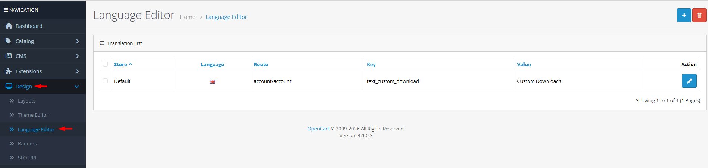
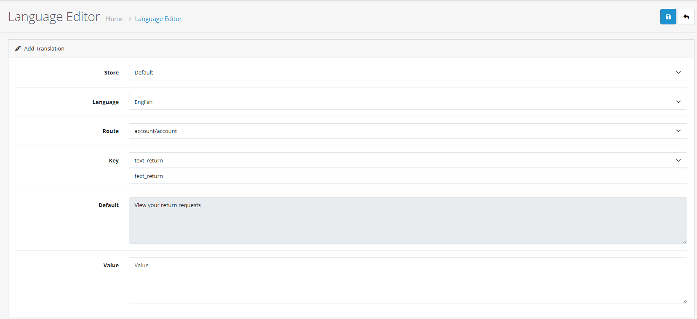

# Language Editor

## Video Tutorial



_Video: Using the Language Editor in OpenCart 4_

## Introduction

The Language Editor in OpenCart 4 is a powerful tool that allows you to override any text string in your store without modifying the physical language files. This ensures your customizations are "update-safe," meaning they won't be lost when you upgrade OpenCart or your extensions. It's the ideal way to customize branding, improve messaging, or fix translation errors.

## Language Editor List

The Language Editor list shows all the active translation overrides in your store. From this interface, you can:

* **Add New**: Create a new translation override.
* **Edit**: Modify an existing override.
* **Delete**: Remove an override and revert to the default text.
* **Filter**: Search for specific overrides by store, language, or route.


**Pro Tip**: Overrides are stored in the database. If you want to revert to the original text provided by OpenCart or an extension, simply delete the entry in the Language Editor.


## Creating a Translation Override

To change a specific piece of text on your storefront or admin panel, follow these steps:



#### Access the Editor

1. Log in to your OpenCart admin panel.
2. Navigate to **Design → Language Editor**.
3. Click the **Add New** (+) button.



#### Select Route and Key

1. **Store**: Choose the store where the change should apply.
2. **Language**: Select the target language.
3. **Route**: Select the page or module where the text is located (e.g., `common/header` for the header).
4. **Key**: Select the specific text variable from the dropdown. OpenCart 4 automatically populates this list based on the Route you selected.



#### Set New Value

1. **Default**: This field shows the current text for reference.
2. **Value**: Enter your new custom text.
3. Click **Save**.



## Language Editor Form

### Configuration Fields

* **Store**: Allows you to have different text for the same item on different sub-stores.
* **Language**: Essential for multi-language stores to ensure the right translation is updated.
* **Route**: The internal path to the language file. For example, `checkout/checkout` contains strings for the checkout page.
* **Key**: The specific identifier for the text string. In OpenCart 4, this is a searchable dropdown, making it easy to find the exact string you need.
* **Default**: Displays the original text from the language file so you know what you are changing.
* **Value**: Your custom text. This is what will be displayed on the storefront.


**Finding the Route**: If you're unsure which route contains the text you want to change, look at the URL of the page. For a product page, the route is usually `product/product`. For the contact page, it's `information/contact`.


## Best Practices

<strong>Customization Strategy</strong>

**Branding & Consistency**

**Consistent Tone:**

* **Brand Voice**: Use the Language Editor to ensure all buttons and messages match your brand's personality (e.g., changing "Add to Cart" to "Add to Bag").
* **Terminology**: Use consistent terms throughout the store to avoid confusing customers.
* **Clarity**: Rewrite technical or vague error messages into helpful, user-friendly instructions.

**Maintenance:**

* **Keep it Minimal**: Only override strings you actually need to change to keep the list manageable.
* **Document Changes**: Keep a note of why certain strings were changed, especially for legal or compliance reasons.


**UX Tip**: Small changes like changing "Register Account" to "Join the Club" can significantly impact user engagement and conversion rates.


<strong>Multi-Language &#x26; Multi-Store</strong>

**Global Management**

**Localization:**

* **Regional Idioms**: Use the editor to adapt a general language pack to a specific region (e.g., UK English vs. US English).
* **Store Variation**: If you run multiple stores (e.g., B2B and B2C), you can use different labels for the same keys to suit the different audiences.

**Accuracy:**

* **Check Length**: Ensure your translated text isn't significantly longer than the original, as it might break your theme's layout.
* **Variable Preservation**: Be careful not to delete placeholders like `%s` in strings (e.g., `Showing %s to %s of %s`), as these are replaced by numbers dynamically.


**Hreflang & SEO**: Changing text via the Language Editor is SEO-friendly as it changes the actual HTML output that search engines crawl.


## Common Tasks



#### Changing "Add to Cart" to "Buy Now"

1. Navigate to **Design → Language Editor** and click **Add New**.
2. Select your **Store** and **Language**.
3. Set **Route** to `common/language` or the specific product route `product/product`.
4. Find the **Key** `button_cart`.
5. Enter "Buy Now" in the **Value** field and **Save**.



#### Customizing the Welcome Message

1. In the Language Editor, add a new entry.
2. Select **Route** `common/header`.
3. Find a key like `text_welcome` (if applicable to your theme) or similar.
4. Enter your custom greeting and **Save**.



## Warnings and Limitations


**Critical Warnings**

* **Placeholders**: Never remove or change the order of placeholders like `%s`, `%d`, or `{variable}`. These are required for the system to insert dynamic data.
* **HTML Tags**: Some strings allow HTML, others don't. Adding HTML to a string that doesn't expect it can break the page layout or cause security issues.
* **Cache**: After saving a translation, you may need to clear your theme and SASS cache in the admin dashboard (Developer Settings) to see the changes.
* **Update Persistence**: While Language Editor changes are update-safe, if an extension changes its internal "Key" names in a new version, your old override may stop working.


## Troubleshooting

<strong>Changes Not Appearing</strong>

**Problem: You saved a translation but the old text still shows.**

**Diagnostic Steps:**

1. **Cache Check**: Click the blue gear icon on the main Dashboard and clear both Theme and SASS cache.
2. **Route Check**: Ensure you selected the correct Route. Some text appears in multiple places (e.g., "Add to Cart" appears in `product/product`, `product/category`, and modules).
3. **Store Check**: Verify you are viewing the same store that you applied the override to.

**Quick Solutions:**

* Clear your browser cache.
* If using a 3rd-party theme, check if they have their own translation system or cache.

<strong>Finding the Correct Key</strong>

**Problem: There are too many keys in the dropdown and you can't find the right one.**

**Diagnostic Steps:**

1. **Search**: Use the browser's search function (Ctrl+F) within the Key dropdown to find the default text.
2. **File Inspection**: If you still can't find it, you may need to check the actual language file via FTP (e.g., `catalog/language/en-gb/checkout/checkout.php`) to see the key name.

**Quick Solutions:**

* Look for common prefixes: `text_` for labels, `button_` for buttons, `error_` for errors.

> "The Language Editor is the bridge between a generic store and a personalized brand experience. It gives you total control over your store's voice without touching a single line of code."
